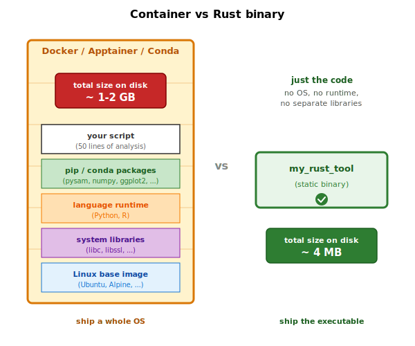

## About this lecture

- **Why** Rust matters in modern bioinformatics
- **Where** it lives in the toolbox already
- **What** it costs
- **What** this course will and will not teach

::: notes
Welcome to day 1 of the course. This is the first of two short lectures today. Twelve lectures across the week, but most of the time you spend on the keyboard, not on me. Today I want to motivate the choice of language. If you finish the lecture not convinced Rust is interesting, the exercises will be harder.
:::

## What Rust looks like — same code, three languages {.smaller}

Count the G + C bases in a short DNA string.

:::: {.columns}
::: {.column width="33%"}
**Python**

```python
count = 0
for base in "ACGTACGT":
    if base == 'G' or base == 'C':
        count += 1
print(count)
```
:::
::: {.column width="33%"}
**R**

```r
count <- 0
for (b in strsplit("ACGTACGT", "")[[1]]) {
  if (b == "G" || b == "C") {
    count <- count + 1
  }
}
print(count)
```
:::
::: {.column width="33%"}
**Rust**

```rust
let mut count = 0;
for base in "ACGTACGT".chars() {
    if base == 'G' || base == 'C' {
        count += 1;
    }
}
println!("{}", count);
```
:::
::::

Same shape in all three. Rust adds `let mut` (variables are read-only by default) and `!` after `println` (it's a macro, not a function). Everything else reads the same.

::: notes
If you can read the Python and R versions, you can read the Rust version. The three languages have nearly the same syntax for an imperative for-loop. The only conceptual additions in Rust are `mut` to opt into mutability and the bang on `println!` to mark a macro. The next slide jumps to a denser k-mer example using collections — same story in all three languages, just with `dict`, `list`, or `HashMap` doing the bookkeeping.
:::

## Counting k-mers in three languages {.smaller}

:::: {.columns}
::: {.column width="33%"}
**Python**

```python
from collections import Counter

def count_kmers(seq, k):
    return Counter(
        seq[i:i+k]
        for i in range(len(seq)-k+1)
    )
```
:::
::: {.column width="33%"}
**R**

```r
count_kmers <- function(seq, k) {
  n <- nchar(seq) - k + 1
  table(substring(seq, 1:n, k:nchar(seq)))
}
```
:::
::: {.column width="33%"}
**Rust**

```rust
use std::collections::HashMap;

fn count_kmers(seq: &[u8], k: usize)
    -> HashMap<Vec<u8>, usize>
{
    let mut counts = HashMap::new();
    for w in seq.windows(k) {
        *counts.entry(w.to_vec())
               .or_insert(0) += 1;
    }
    counts
}
```
:::
::::

Same algorithm. Rust adds type signatures (`&[u8]`, `usize`, `HashMap<...>`) — that information is *also* present in Python and R, just inferred at runtime instead of checked at compile time.

::: notes
The Rust version is slightly longer because the types are written out. They're not extra work — Python and R are doing the same type inference at run time. The win is that Rust catches the mistake of calling `count_kmers("ACGT", "21")` (string instead of int) at compile time; Python and R only catch it once that branch executes, sometimes hours into a pipeline.
:::

## Rust is faster, with almost the same code

{#fig-perf-bars fig-alt="Horizontal bar chart with a log-scale wall-clock axis from 0.1 s to 100 s. Four bars from top to bottom: CPython 3.12 at 44 seconds (grey), PyPy 3.10 at 7 seconds (grey), Rust release at 0.8 seconds (highlighted yellow with orange border), Rust plus rayon on 8 cores at 0.1 seconds (green)."}

## Why this matters in bioinformatics

- Reads per sample: $10^8$
- Samples per project: $10^2$ to $10^5$
- Genome / transcriptome / pangenome sizes are growing **faster than CPU clock speeds**
- Cloud bill scales linearly with wall-clock
- Iteration speed scales **inversely** with wall-clock

::: notes
A 10× speedup is more important here than in business software because our workloads scale with biology, not with users. A 10x speedup turns an overnight job into a coffee break. That changes how you iterate. It changes which experiments you bother to run.

And the clock speed gap matters: CPU cores stopped getting faster around 2005. Per-core performance has crept up by less than 2× since then. Sequencing throughput has gone up by something like 10^4 in the same period.
:::

## The deployment story — Python

```bash
$ ./run_analysis.sh
ModuleNotFoundError: No module named 'pysam'

$ pip install pysam
ERROR: Building wheel for pysam failed (htslib not found)

$ apt install libhts-dev
E: Unable to locate package libhts-dev

$ # ...one hour later...
```

::: notes
Different angle. Suppose you give your colleague a Python tool. It depends on pysam, which depends on htslib, which depends on the right libc, which depends on the kernel version. Anybody who has done bioinformatics on an HPC cluster knows this conversation well.

Containers help. Conda environments help. They are also one more thing the user has to set up correctly, every time, before your tool runs at all.
:::

## `crates.io` replaces a whole stack of tools

:::: {.columns}
::: {.column width="55%"}
Python and R patch the dependency mess by layering **container and environment managers** on top:

- **Docker**, **Podman** — container runtimes
- **Apptainer** (formerly Singularity) — HPC-friendly containers
- **Conda**, **mamba** — package + environment managers

A container ships **your script + every library + a whole Linux** — often 1-2 GB to run a 50-line analysis.

Rust binaries pull in **nothing** at run time. `cargo build --release` produces a single static executable; `cargo install some-tool` fetches the source and builds it. [`crates.io`](https://crates.io) is the index — one tool, one ecosystem.

**The tool *is* the artifact.** No container needed.
:::
::: {.column width="45%"}
{fig-alt="Left: a stylised shipping container, labelled 'Docker / Apptainer / Conda', stacked from bottom to top with: 'Linux base image (Ubuntu, Alpine, ...)', 'system libraries (libc, libssl, ...)', 'language runtime (Python, R)', 'pip / conda packages', 'your script'. Total size labelled '~1-2 GB'. Right: a single small box labelled 'my_rust_tool (4 MB static binary)' with a tick mark, no container around it." width="100%"}
:::
::::

::: notes
Containers and Conda environments exist to paper over an ecosystem problem: Python and R packages have deep, fragile native dependencies that the Python runtime alone cannot satisfy. The standard workaround is a container — but a container is a whole operating system image plus all the libraries plus the runtime plus your code. Rust skips the problem by linking everything statically into the binary by default. The same `cargo install` command works on a laptop, an HPC node, and a Docker image — without Docker.
:::

## Type safety — what Python and R skip

:::: {.columns}
::: {.column width="50%"}
**R — defend the function by hand**

```r
add <- function(a, b) {
  stopifnot(is.numeric(a),   # ← Rust
            is.numeric(b))   # ← doesn't
  a + b                      #   need
}                            #   these
add(3, "seven")
# Error: is.numeric(b) is not TRUE
#   (at runtime, not at write time)
```
:::

::: {.column width="50%"}
**Rust — the type signature is the check**

```rust
fn add(a: i32, b: i32) -> i32 {
    a + b
}

add(3, "seven");
// error[E0308]: mismatched types
//   expected `i32`, found `&str`
//   (caught at compile, never ships)
```
:::
::::

The `stopifnot(...)` block on the left is the **same check** the Rust signature does on the right — except R does it at every call, at runtime, after the type information has already been written.

::: notes
This is a subtle but huge productivity win. In R, defensive argument checking is so common that there are whole packages for it (assertthat, checkmate). Every function starts with a wall of stopifnot calls, and even then the errors only fire at runtime — usually deep inside a long-running pipeline. In Rust the type signature does the work. If a function takes an i32, the compiler refuses to even build a program that tries to pass a string. The "bug" never reaches a test, never reaches production, never wakes up the on-call data scientist at 2am.
:::

## Safety — and why it matters

A **segfault** (segmentation fault — what happens when a program touches memory it doesn't own) is the classic crash mode of C and C++: the operating system spots a bad memory access and kills the process. Python and Rust are designed so you almost never see one — Python checks at runtime, Rust at compile time.

```rust
let mut seq = vec![0u8; 100];
let r = &seq[0];           // borrow a reference into seq
seq.push(b'A');            // try to change seq while r still points in
println!("{}", r);
```

```
error[E0502]: cannot borrow `seq` as mutable because it is also
              borrowed as immutable
  --> src/main.rs:3:5
   |
 2 | let r = &seq[0];
   |          ------ immutable borrow occurs here
 3 | seq.push(b'A');
   | ^^^^^^^^^^^^^^^ mutable borrow occurs here
 4 | println!("{}", r);
   |                - immutable borrow later used here
```

::: notes
When I say Rust is safe, I mean the compiler catches at compile time the class of bug that crashes C and C++ programs at runtime: dangling pointers, use-after-free, data races, buffer overruns. This is not a runtime check — there is no garbage collector (the background process Python and Java run to free unused memory automatically). It is the compiler refusing to compile broken code. The error message above is the actual output for the snippet — notice it tells you what is wrong, where, and why. We will have more to say about borrow checker errors on day 2.
:::

## Parallelism is easy — and unavoidable

CPU clock speeds stopped climbing around 2005. The cores kept multiplying — every modern laptop, desktop, and HPC node has **at least 8** of them; a server typically has 64 to 256. To use any of that you have to write code that spreads work across cores.

In Rust this is usually a **one-line change**:

```rust
use rayon::prelude::*;

let total: HashMap<Vec<u8>, usize> = sequences
    .par_iter()                       // .iter() → .par_iter()
    .map(|seq| count_kmers(seq, 21))
    .reduce(HashMap::new, merge);
```

The compiler refuses to build any version that would race two threads against the same memory. No mutexes to acquire, no deadlocks to debug, no silently corrupted output. There is **no equivalent in Python or R** — Python's GIL serialises threads, and R has no built-in story at all.

::: notes
Modern CPUs gave up on making cores faster around 2005 and started making more of them. Code that uses one core leaves an order of magnitude of performance on the table. Day 5 has a full exercise on rayon: you turn .iter() into .par_iter() and the compiler guarantees the result is the same as the serial version. This is the practical payoff of the borrow checker — parallelism that can't accidentally corrupt your data.
:::

## Rust in bioinformatics today

::: {.columns}
::: {.column width="50%"}
**I/O and formats**

- `noodles` — pure-Rust HTSlib
- `rust-htslib` — htslib FFI
- `needletail` — FASTA/FASTQ

**Variant calling**

- `varlociraptor`
- `longshot`
:::

::: {.column width="50%"}
**Single-cell**

- `alevin-fry`

**Long-read QC**

- `chopper`
- `nanoq`

**General**

- `rust-bio`
- parts of `mash`, `kraken2`
:::
:::

::: notes
These are tools you have likely used or read papers about. The ecosystem is moving fast. Most of these projects either did not exist or were tiny three years ago. Noodles in particular is becoming the default I/O library in a lot of new Rust bioinformatics code.

I should also say: a lot of well-known bioinformatics tools are still written in C++ — minimap2, samtools, bcftools — and those are not going anywhere. Rust is a complement, not a replacement.
:::

## Can easily integrate Rust code in Python if not ready to switch completely

```rust
use pyo3::prelude::*;

#[pyfunction]
fn count_kmers(seq: &[u8], k: usize)
    -> HashMap<Vec<u8>, usize>
{
    // ...same body as the Rust version above...
}
```

```python
# In your Jupyter notebook:
import my_fast_lib
counts = my_fast_lib.count_kmers(seq, 21)
```

::: notes
A common worry: "I have a Python pipeline that works. I cannot rewrite it all."

You don't have to. PyO3 lets you write a fast inner loop in Rust and expose it to Python as if it were a regular module. The Python user does not know — and does not need to know — that the function they are calling is implemented in Rust.

This is how polars works. It is how pydantic-core works. It is how tokenizers works. PyO3 is out of scope for this course, but worth knowing it exists.
:::

## What this course teaches

| Day | Theme |
|---|---|
| 1 | Toolchain, scalars, control flow, functions |
| 2 | Ownership, borrowing, strings, slices |
| 3 | Structs, enums, iterators, recursion, error handling |
| 4 | I/O, crates, modules, plotting, zip |
| 5 | Tests, `--release`, parallelism, ecosystem |
| 6 | Yew & WebAssembly — pure-Rust web apps |

::: notes
Six days. Each day has two short lectures and a stack of hands-on exercises. By Friday you will have written, tested, and benchmarked a small toolkit of real bioinformatics code: GC content, reverse complement, k-mer counting, phylogenetic-tree traversal, sequence alignment, FASTA and FASTQ parsing with noodles, a histogram plot, a parallel computation, and a web frontend.
:::

## Today specifically

By end of day 1 you will be able to:

- Install Rust, scaffold and run a `cargo` project
- Read and write Rust syntax for variables, control flow, functions
- Use `match` expressions and `panic!`
- Compute GC content, base counts, complement, Phred score, Hamming distance — five small programs, with tests

::: notes
Five exercises today, each fifteen to thirty minutes. Tests are provided; your job is to make them pass. By the end of today you have working Rust on disk and a feel for the toolchain. Tomorrow we go deeper into ownership.
:::

