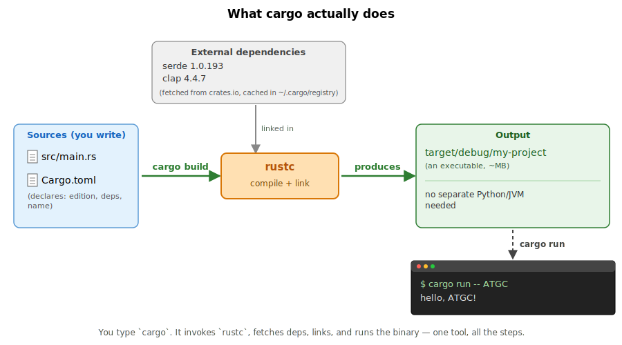
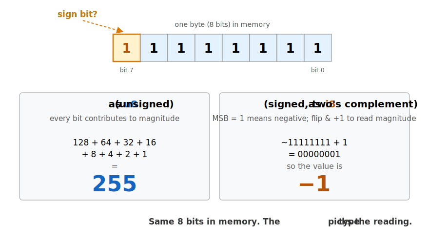
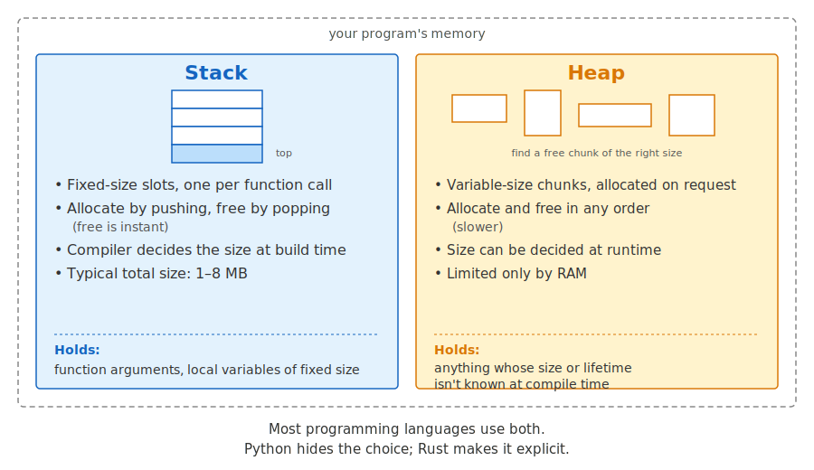
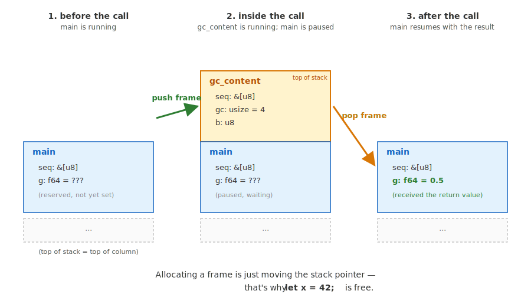
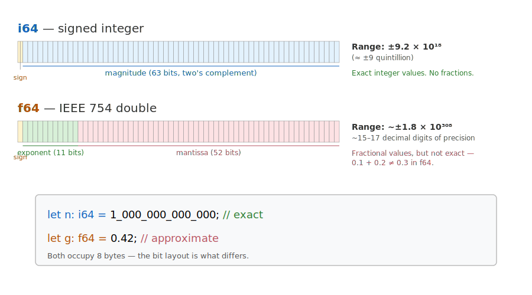
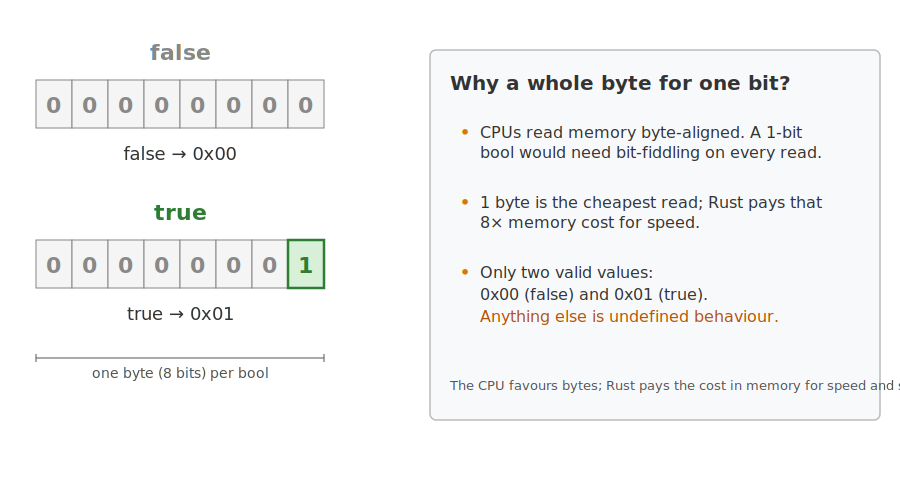
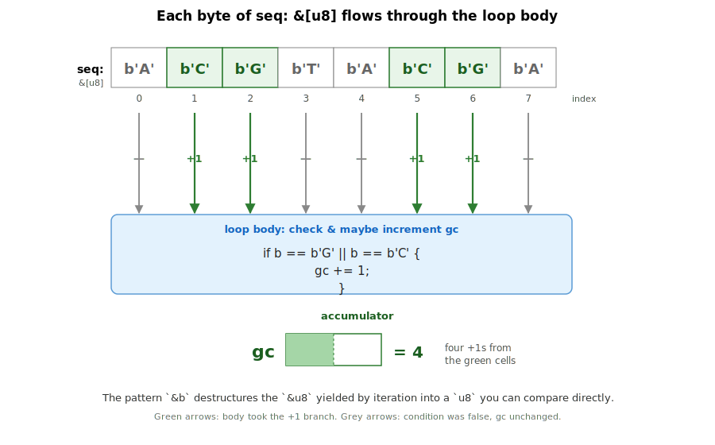

## What this lecture is

::: {.incremental}
- A guided tour of the Rust syntax used in today's hands-on exercises
- Each slide: one concept — *what it is*, *why it works this way*, a DNA example
- Written companion: [day 1 — Concepts](00-concepts.qmd) (keep open in a tab)
- ~30 minutes; then you start writing code
:::

::: notes
This lecture introduces the Rust syntax you need to do today's hands-on work. I will go through one concept per slide. For each: a definition, a brief reason why Rust does it that way, and a small DNA-themed example.

The concepts page is a written reference that covers the same material at your own pace, with links to the Rust Book for anyone who wants to go deeper. Keep it open while you watch.

By the end of the lecture you should be able to read the code in the starter projects. After that, you write some.
:::

## rustup, rustc, cargo

When you install Rust, you get **three** separate command-line tools:

- **`rustup`** — the installer. Installs Rust, manages versions, updates.
- **`rustc`** — the Rust compiler. Reads `.rs` source files, writes machine code.
- **`cargo`** — the build tool. Runs the compiler for you, fetches libraries, runs tests.

Day to day you use `cargo`. The other two run in the background.

::: notes
Three tools live in your `~/.cargo/bin/` directory after installation.

rustup is the installer and version manager. You typically run it once to install Rust, then forget about it. Occasionally you'll run `rustup update` to get the latest stable release.

rustc is the actual compiler. It takes Rust source files — files ending in .rs — and turns them into executable machine code. You will almost never invoke rustc directly. cargo invokes it for you, with the right flags, in the right order, for the right files.

cargo is the tool you'll actually type. It runs the compiler, fetches external libraries, runs your tests. It is the only one of the three you'll think about during the course.
:::

## What cargo is

Cargo does two jobs:

1. **Build system** — turns your source files into an executable
2. **Package manager** — fetches and tracks libraries your code depends on

Both jobs in one tool, so the compiler and the dependency list always agree.

::: notes
Cargo's two jobs are usually separate tools in other ecosystems. Python has `pip` for packages and a build system like setuptools. C++ has CMake plus something like Conan. Rust folds both into cargo so they cannot disagree about what is a dependency, which version, or how to build it.

A practical side effect: every Rust project on disk has the same shape. Cargo created it, so cargo knows where everything is. That's the shape we look at next.
:::

## What cargo actually does

{fig-alt="A horizontal flow diagram. On the left, a light-blue Sources box contains src/main.rs and Cargo.toml with a subtext that Cargo.toml declares edition, deps and name. A green arrow labeled 'cargo build' points right to a light-orange rustc box labeled 'compile + link'. Above the rustc box, a grey External dependencies box lists serde 1.0.193 and clap 4.4.7 with a subtext that they are fetched from crates.io and cached in ~/.cargo/registry; a grey arrow drops down from the deps box into rustc, labeled 'linked in'. From rustc, a green arrow labeled 'produces' points right to a green Output box containing target/debug/my-project, labelled 'an executable, ~MB', plus a note 'no separate Python/JVM needed'. A dashed arrow labeled 'cargo run' drops from the Output box to a small terminal-style box showing '$ cargo run -- ATGC' and 'hello, ATGC!'. A footer reads: 'You type cargo. It invokes rustc, fetches deps, links, and runs the binary — one tool, all the steps.'"}

::: notes
This is the pipeline `cargo build` and `cargo run` execute behind the scenes.

You write the two source artefacts on the left: `src/main.rs` is the code; `Cargo.toml` declares which edition, dependencies, and project name to use.

When you invoke `cargo build`, cargo reads `Cargo.toml`, fetches any external dependencies it doesn't already have from crates.io, caches them under `~/.cargo/registry`, and then invokes `rustc` with the right flags to compile your sources and link them against those dependencies.

The output is a single standalone executable in `target/debug/`. Note what this means: no separate Python interpreter, no JVM, no shared-library hunt — the binary contains everything it needs. You can hand it to a colleague and they can run it without installing Rust.

`cargo run` is the same pipeline, but cargo also invokes the resulting binary at the end, passing on any arguments after the `--`.
:::

## A cargo project on disk

```text
my-project/
├── Cargo.toml      manifest: project name, version, dependencies
├── Cargo.lock      exact resolved versions (cargo writes this)
├── src/
│   └── main.rs     the entry point — has fn main()
└── target/         build outputs (you never look in here)
```

::: notes
After you run `cargo new my-project`, this is what's on disk.

Cargo.toml is the manifest. It says what the project is called, what version, and which external libraries it depends on. You write Cargo.toml by hand.

Cargo.lock is generated by cargo automatically. It records the exact versions of every dependency that was resolved during the last build, so two people building the same project at different times get bit-for-bit identical results. You commit Cargo.lock for applications, leave it out for libraries.

src/main.rs is the source code. By convention, a Rust application has a function called `main`. That's where execution starts. The file extension is `.rs`.

target/ is the directory cargo writes build outputs to. You never edit anything there. The default `.gitignore` excludes it.
:::

## The cargo commands you'll use

```bash
cargo new my-project        # scaffold a new project directory
cargo build                 # compile src/ → target/debug/my-project
cargo run                   # compile and execute
cargo run -- ATGC           # compile and execute with arguments
cargo test                  # compile and run all #[test] functions
```

The `--` separates arguments to `cargo` from arguments to your program.

::: notes
Five commands cover today.

`cargo new` makes a fresh project directory. `cargo build` compiles the source into an executable. `cargo run` is `cargo build` plus invoking the resulting binary. `cargo test` compiles the project plus all its tests and runs them.

The form with the double dash is important. The arguments before the `--` go to cargo itself; everything after goes to your program. So `cargo run -- ATGC` runs your program with "ATGC" as the first command-line argument.

You'll type these commands a lot. They become reflexive by Wednesday.
:::

## Variables — `let`

```rust
let length = 1000;
let base = b'A';
let gc = 0.42;
```

`let name = value;` binds a name to a value.

The compiler infers the type from the right-hand side.

::: notes
A variable in Rust is introduced with the keyword `let`. The name on the left is bound to the value on the right.

The compiler figures out the type from context — `1000` is a 32-bit signed integer by default, `b'A'` is a byte, `0.42` is a 64-bit float. You can write the type explicitly if you want — `let length: u64 = 1000` — but you don't have to.

Once bound, the value is fixed. Reading `length` works. Assigning to it — `length = 2000;` — does not. That's a compile error.

This is the default. We'll see how to opt out in a moment, and then why the language picks this as the default.
:::

## Why immutable by default?

Two reasons.

**1. Local reasoning** — when you read code, you want to know what can change.

```rust
let length = seq.len();
//   ... many lines of code ...
//   What is `length` here?  Still seq.len(). Always.
```

**2. Threads can't race on what doesn't change** — only mutable shared data can race.

::: notes
Why does Rust default to immutable when no other mainstream language does?

The first reason is local reasoning. When you read a function, you want to know what can change. If most variables are immutable, you only have to track the few that are mutable. That's less mental load for the reader, and it makes refactoring safer — moving uses of an immutable variable around is always fine, because the value can't have changed between the original use and the new one.

The second reason matters later in the week. Two threads racing on the same memory is only a problem if at least one of them is writing. Data that no one writes can be read by as many threads as you like, with no synchronization. Rust's parallelism story — which we get to on day 5 — leans heavily on this. Making mutation explicit is half the foundation.

There's also a third, more empirical reason: most variables in real code don't need to change. Making mutation opt-in matches the typical case.
:::

## `let mut` — opt in to reassignment

```rust
let mut gc_count = 0;
for &b in seq {
    if b == b'G' || b == b'C' {
        gc_count += 1;
    }
}
println!("{}", gc_count);
```

`mut` is one keyword that says *I will reassign this*.

::: notes
When you actually do need a variable you can update — a loop counter, an accumulator, a buffer you fill in — write `let mut` instead of `let`. Now `gc_count = ...` and `gc_count += ...` are allowed.

The compiler reads the same `mut` keyword you do and knows this variable can change. So do other people reading your code. The keyword is information for both audiences.

By the end of today you'll have a feel for when you actually need `mut`. The first guess is "almost never": iterator chains and recursive helpers usually beat mutable loops in Rust.
:::

## How computers store integers

An integer in memory is a **fixed-width binary number**.

The **width** is how many bits it occupies. Common widths: 8, 16, 32, 64.

A bit pattern can be read two ways:

- **Unsigned** — all bits encode the magnitude. An 8-bit unsigned holds **0..=255**.
- **Signed** — one bit encodes the sign. An 8-bit signed holds **-128..=127**.

::: notes
Before we look at Rust's integer types, a reminder of what an integer actually is in a computer.

Inside the machine, an integer is a fixed-width binary number. The width is the type — how many bits it occupies. Common widths are 8, 16, 32, and 64. An 8-bit number is one byte; a 64-bit number is eight bytes.

The same bit pattern can mean two different things depending on how you read it. If you read it as "unsigned", every bit contributes to magnitude. An 8-bit unsigned number can hold the values 0 through 255 — that's 2 to the 8, which is 256, distinct values.

If you read it as "signed", one bit — by convention the leftmost — encodes whether the number is positive or negative, using a scheme called two's complement. An 8-bit signed number holds the values -128 through +127.

Same number of bits. Same memory. Different interpretation. Which interpretation you get is decided by the type.
:::

## The same byte, two ways to read it

{fig-alt="A single 8-bit byte with all eight bits set to 1. The most-significant bit is highlighted with a 'sign bit?' annotation and dashed arrow. Below the byte, two panels show the two interpretations: as u8 (unsigned) the bits sum to 128+64+32+16+8+4+2+1 = 255; as i8 (signed, two's complement) flipping and adding 1 gives 00000001, so the value is minus one. Footer: same 8 bits in memory, the type picks the reading."}

## Rust's integer types

| Type | Width | Signed | Range |
|---|---:|:---:|---|
| `u8`   | 8 bits  | no  | 0 ..= 255 |
| `i8`   | 8 bits  | yes | -128 ..= 127 |
| `u16`  | 16 bits | no  | 0 ..= 65 535 |
| `i16`  | 16 bits | yes | ±32 767 |
| `u32`  | 32 bits | no  | 0 ..= 4.29 × 10⁹ |
| `i32`  | 32 bits | yes | ±2.15 × 10⁹ |
| `u64`  | 64 bits | no  | 0 ..= 1.84 × 10¹⁹ |
| `i64`  | 64 bits | yes | ±9.22 × 10¹⁸ |

Also `u128` / `i128`, rarely needed.

::: notes
Rust gives you every standard signed and unsigned width from 8 to 128 bits. The naming convention is consistent: the letter is signedness — u for unsigned, i for signed integer — and the number is the bit width.

You don't have to memorize the ranges. Most of the time the right type is obvious. A few practical ones for our work:

- u8 holds a single byte. ASCII characters, DNA bases, FASTQ quality bytes.
- u16 holds about 65 thousand. A typical short read length fits easily.
- u32 holds about 4 billion. Most chromosome coordinates fit; counts of reads fit.
- i32 and i64 are the natural choices when negative values are possible — alignment scores, log ratios.
- u64 holds positive numbers up to about 10 to the 19. For all practical purposes, infinite.

Pick a type wide enough that overflow is impossible. We'll see overflow in a couple of slides.
:::

## `usize` and `isize`

Two special integer types: **as wide as a memory pointer** on the target machine.

- On a 64-bit machine — and every machine you'll use this week is 64-bit — `usize` is 64 bits.
- On a (rare today) 32-bit machine, `usize` would be 32 bits.

The convention: **use `usize` for lengths and indices.**

```rust
let n: usize = seq.len();         // .len() returns usize
let first: u8 = seq[0];           // indexing takes usize
```

::: notes
There are two integer types whose width is "the size of a pointer on this machine". They are usize for unsigned, and isize for signed.

The reason this type exists separately from u64: in principle, Rust runs on machines other than 64-bit ones — embedded chips, WebAssembly in some configurations, 32-bit ARM. On those, a memory pointer is 32 bits, and usize is 32 bits too. Using usize for lengths and indices lets your code be correct on any of these targets without changing.

In practice, on the machine in front of you, usize is just u64 with a different name. But the convention matters: the standard library's `.len()` returns usize, indexing with `[i]` expects usize. So you'll see usize everywhere in your code.

The rule: lengths and indices are usize. Always.
:::

## Stack and heap — two regions of program memory

Every running program gets two pots of memory with very different rules.

{fig-alt="An outer dashed rectangle labelled 'your program's memory' contains two panels. Left panel, tinted light blue, is titled Stack. It shows an icon of four small boxes stacked vertically with 'top' marked at the bottom, then a bulleted list: fixed-size slots one per function call; allocate by pushing, free by popping (free is instant); compiler decides the size at build time; typical total size 1 to 8 MB. A 'Holds:' line reads: function arguments, local variables of fixed size. Right panel, tinted light orange, is titled Heap. It shows an icon of four scattered varied-size boxes with caption 'find a free chunk of the right size', then a bulleted list: variable-size chunks, allocated on request; allocate and free in any order (slower); size can be decided at runtime; limited only by RAM. A 'Holds:' line reads: anything whose size or lifetime isn't known at compile time. Footer below both panels: Most programming languages use both. Python hides the choice; Rust makes it explicit."}

::: notes
This distinction is universal — every program in every language uses both regions. The key trade-off is fast and disciplined (stack) versus flexible and slower (heap). What differs between languages is how visible the choice is to you: Python hides it almost entirely, Rust makes it explicit in the type you choose.
:::

## The call stack — one frame per function call

Calling a function pushes a frame; returning pops it. That's the whole mechanism.

{fig-alt="Three vertical panels show the stack at three moments. Panel 1, labelled '1. before the call — main is running': the stack column shows a single blue main frame containing seq (a slice) and g (an f64 reserved but not yet set), with older frames as a dashed placeholder marked with three dots below. Panel 2, labelled '2. inside the call — gc_content is running; main is paused': an orange gc_content frame sits on top of the blue main frame; gc_content contains seq, gc=4, and a loop variable b, and is marked 'top of stack'; main is unchanged below, marked 'paused, waiting'. A green arrow labelled 'push frame' connects panel 1 to panel 2. Panel 3, labelled '3. after the call — main resumes with the result': only the main frame remains, with g now set to 0.5 in green ('received the return value'). An orange arrow labelled 'pop frame' connects panel 2 to panel 3. Footer: Allocating a frame is just moving the stack pointer — that's why let x = 42; is free."}

::: notes
This mechanism is the same in every compiled language — C, C++, Rust, Go, Java internals. The frame size is decided at compile time from the function's locals, which is why fixed-size types are cheap. Too many nested calls overflows the stack — that's literally what 'stack overflow' means.
:::

## Python: stack holds references, heap holds the values

Python's simplicity comes from putting almost everything on the heap, including a `42`.

{fig-alt="A small code panel at the top reads: x = 42; y = 'hello'; z = [1, 2, 3]. Below, a two-column diagram. Left column, tinted light blue, is titled Stack (current function's frame) and contains three small named-pointer boxes: x with an arrow leaving it, y with an arrow leaving it, and z with an arrow leaving it. Right column, tinted light orange, is titled Heap (Python objects) and contains three boxes. The first box is labelled PyLongObject with refcount: 1, type: int, value: 42, noted as about 28 bytes. The second is PyUnicodeObject with refcount: 1, type: str, value: 'hello', noted as about 54 bytes. The third is PyListObject with refcount: 1, type: list, items pointer leading to three small separate PyLongObject boxes containing 1, 2, 3, noted as '+ 3 separate int objects on heap'. Blue arrows run from each stack pointer box to its corresponding heap object. Bottom captions: every value in Python lives on the heap — even a small integer; variables on the stack hold references (pointers + refcount) to those heap objects; convenient, but costs about 10 to 30 times the memory of holding the value directly. A green contrast note at the very bottom reads: In Rust, let x: i32 = 42; stores the value 42 directly on the stack (4 bytes); heap is opt-in (Vec, String, Box)."}

::: notes
This is why pure-Python loops are slow: each integer access dereferences through a heap pointer, checks a type tag, and touches a refcount. It is also why NumPy and PyTorch exist — they store raw value arrays directly on the heap, without one Python object per element. When we get to Rust's i32 on the stack, students should recognise it as the opposite end of the spectrum from what they're used to.
:::

## A Vec lives on the stack; its data lives on the heap

{fig-alt="Two regions side by side. On the left, the stack contains a 3-field Vec<u8> struct with rows labelled ptr (8 bytes), len: 5, and cap: 8 - a 24-byte header. On the right, the heap contains an 8-cell allocation; the first five cells hold the DNA bytes b'A', b'C', b'G', b'T', b'A' and the last three cells are dim/empty. A bracket above the first 5 cells reads 'len = 5'; a bracket above all 8 cells reads 'cap = 8'. An arrow runs from the ptr row on the stack to the first cell on the heap. Footer: stack is 24 bytes (3 times 8), heap is 8 bytes; cheap to move because only the 24-byte header is copied and the data never moves with it."}

## Overflow

What happens when you add 1 to a `u8` that's already 255?

```rust
let mut x: u8 = 255;
x += 1;
```

- **Debug build**: program **panics** with a clear message.
- **Release build**: silently **wraps** to 0 (two's complement arithmetic).

The pragmatic rule: pick a type wide enough that overflow is unreachable.

::: notes
Every fixed-width integer type has a maximum value. What happens when you try to go past it?

By default in Rust: a debug build — what `cargo run` and `cargo test` produce — panics. The program stops with a message telling you which line overflowed. Loud failure. You notice immediately.

A release build — `cargo run --release`, which you'll see on day 5 — wraps around silently using two's complement arithmetic. Adding 1 to 255 gives 0. Subtracting 1 from 0 gives 255. This is for performance: bounds checks have a cost, and release builds skip them.

The takeaway: pick a type wide enough that overflow is impossible. usize on a 64-bit machine takes you to 1.8 × 10^19, which is more than the number of base pairs in every organism on earth combined. You're fine.

If you really do need explicit control — wrapping arithmetic on purpose, saturating arithmetic, fallible arithmetic with checks — Rust has dedicated methods for that: `wrapping_add`, `saturating_add`, `checked_add`. Out of scope today.
:::

## Picking a type — rules of thumb

| Use case | Type |
|---|---|
| One DNA base | `u8` |
| One FASTQ quality byte | `u8` |
| Sequence length, vector length, array index | `usize` |
| Alignment score (can be negative) | `i32` |
| Read count, contig count | `u32` or `usize` |
| GC content, probability, fraction | `f64` |
| Yes / no | `bool` |

::: notes
For today's exercises you'll mostly type u8 (for bases) and usize (for lengths and indices), with the occasional i32 (where negative values are possible) and f64 (for fractions).

Don't agonize over the choice. If you pick wrong, the compiler will tell you when something doesn't fit, and you change the type. There is no runtime "I picked the wrong type" cost; you'll know at build time.
:::

## i64 vs f64 — same 8 bytes, two encodings

{fig-alt="Two horizontal 64-cell memory ribbons. Top ribbon (i64): one yellow sign-bit cell followed by 63 light-blue magnitude cells; range plus or minus 9.2e18; exact integer values. Bottom ribbon (f64, IEEE 754): one yellow sign-bit cell, 11 light-green exponent cells, 52 light-pink mantissa cells; range about plus or minus 1.8e308 with 15 to 17 decimal digits of precision; fractional values but not exact (0.1 + 0.2 not equal to 0.3). Below: a small code box showing let n: i64 = 1_000_000_000_000 (exact) and let g: f64 = 0.42 (approximate)."}

## Casting with `as`

Rust **never converts numeric types implicitly**.

```rust
let count: usize = 42;
let total: usize = 100;

// let frac: f64 = count / total;          // compile error
// let frac        = count / total;        //  = 0  (integer division!)

let frac: f64 = count as f64 / total as f64;     // = 0.42
```

`as` does the cast. One CPU instruction, usually free.

::: notes
Try to mix two different numeric types in one expression and the compiler refuses. This sounds annoying. It catches real bugs.

The reason: every conversion between numeric types involves a choice. usize to f64 can lose precision for very large numbers. i32 to u32 changes the meaning of negative values. i64 to i32 might truncate. The compiler makes you say which conversion you want, using the keyword `as`.

A different bug the same rule catches: integer division. If both sides of `count / total` are integers, the result is an integer. 42 over 100 is zero, not 0.42. If you wanted a float, you have to cast at least one side to f64 first.

When you forget, the compiler tells you exactly which line. The fix is one `as` keyword.
:::

## Other scalar types — `f64`, `bool`, `char`

```rust
let gc: f64    = 0.42;        // 64-bit IEEE 754 float (~15 decimal digits)
let ok: bool   = true;        // true or false
let c: char    = 'A';         // ONE UNICODE CODEPOINT — 4 bytes, not 1
```

For DNA: prefer **`u8`** (one byte) over `char` (four bytes, Unicode semantics).

::: notes
Three more scalar types worth knowing.

f64 is double-precision floating point — about 15 significant decimal digits of precision, range from very tiny to very large. There's also f32 if you need to save memory. For probabilities, ratios, GC content, alignment scores — f64 is the right default.

bool is a single byte that holds true or false. It's one byte not one bit because the CPU is faster on byte-aligned reads.

char in Rust is the surprising one. A `char` is a Unicode scalar value — four bytes, capable of representing any character including emoji. For DNA, this is overkill and the wrong abstraction. We use u8 instead — exactly one byte, matches ASCII directly, indexes into byte slices without any conversion.

You'll see u8 everywhere this week for DNA. char appears almost never.
:::

## bool — one byte, two valid values

{fig-alt="Two 8-cell bytes shown stacked. The first byte (false) has all eight bits set to 0 and is labelled 'false to 0x00'. The second byte (true) has seven zeros and a single 1 in the rightmost bit, labelled 'true to 0x01'. A callout panel on the right explains why a whole byte is used for one bit: CPUs read memory byte-aligned, a 1-bit bool would need bit-fiddling on every read; 1 byte is the cheapest read so Rust pays the 8x memory cost for speed; only 0x00 and 0x01 are valid values, anything else is undefined behaviour."}

## Functions

```rust
fn gc_content(seq: &[u8]) -> f64 {
    let mut gc: usize = 0;
    for &b in seq {
        if b == b'G' || b == b'C' {
            gc += 1;
        }
    }
    gc as f64 / seq.len() as f64
}
```

Signature: parameter types after `:`, return type after `->`. Body in `{ }`.

::: notes
A function starts with the keyword `fn`, then the name, then the parameter list in parentheses, then `->` and the return type, then the body in braces.

Each parameter is written `name: Type`, separated by commas. The return type comes after `->`. If your function returns nothing, you can leave off the arrow — `fn print_seq(seq: &[u8]) { ... }` returns the empty tuple, written `()`.

The body is a block. The last expression in the block — note: no trailing semicolon — is the function's return value. So in this gc_content example, the last line `gc as f64 / seq.len() as f64` is what gets returned.

You can also write `return value;` explicitly, but it's idiomatic to leave it off when the return is the natural end of the function.
:::

## Expressions and statements

A **statement** does something but produces no value (ends in `;`).
An **expression** produces a value.

```rust
let x = 5;            // statement (with a let)
let y = {             // a block IS an expression
    let temp = 10;
    temp + 1          //  no `;`  — this value is the block's value
};                    // y == 11
```

The **last expression of a block, without a semicolon, is the block's value.**

::: notes
This is one of the few Rust syntactic ideas that surprises everyone the first time.

Rust distinguishes statements from expressions. A statement is something like a let binding — it does something but doesn't itself have a value. An expression — `5`, `x + 1`, `gc_content(seq)` — produces a value.

A semicolon at the end of an expression turns it into a statement. Without the semicolon, the expression is still an expression, and its value is the value of whichever surrounding block it ends.

A block — anything in `{ }` — is itself an expression. Its value is whatever the last line evaluates to, as long as that line has no trailing semicolon.

This is why function bodies don't need `return` — the function body is a block, the last expression is the block's value, the block is the function's value. It's also how if-else chains can produce values, which we'll see in two slides.
:::

## `if`/`else`

```rust
if gc > 0.6 {
    println!("GC-rich");
} else if gc > 0.4 {
    println!("balanced");
} else {
    println!("AT-rich");
}
```

The condition must be a `bool`. No "truthy" values — write `if x != 0`, not `if x`.

::: notes
Standard if/else chain. Conditions do not need parentheses around them. Bodies do need braces, even for a single line — there is no curly-brace-less form.

One important rule: the condition must be a real boolean. Rust does not have "truthy" or "falsy" values. You cannot write `if x` when x is a number. You write `if x != 0`. You cannot write `if s` when s is a string. You write `if !s.is_empty()`.

This sounds pedantic. In return, you can't ever accidentally branch on the empty string when you meant to branch on null, or on zero when you meant to branch on absence. Those classes of bug do not exist in Rust.
:::

## if/else — visualised

{fig-alt="Flowchart of the GC-content if/else chain: starting from gc: f64, a diamond tests gc > 0.6; on true it assigns label = \"GC-rich\", on false it falls through to a second diamond testing gc > 0.4; on true that assigns label = \"balanced\", on false it assigns label = \"AT-rich\". All three branches converge to a single end terminator stating that label is now bound. The matching Rust code is shown to the right."}

::: notes
This is the same if/else chain from the previous slide, drawn as a flowchart so the control flow is obvious. Each diamond is a condition; the green arrow is the "true" branch, the red arrow is "false". All three branches converge into a single point because the whole if/else is one expression that produces one value — that value gets bound to `label`.
:::

## `if` is also an expression

```rust
let label = if gc > 0.6 {
    "GC-rich"
} else if gc > 0.4 {
    "balanced"
} else {
    "AT-rich"
};
```

All branches must produce the **same type**. The whole `if` produces that value.

::: notes
The same if-else chain, but each branch produces a value instead of running println. All three arms produce a `&str`. The whole if-else evaluates to a single `&str`, which gets bound to `label`.

This replaces the ternary operator in C and Python. There is no separate ternary syntax — if does the job.

If different branches returned different types — say, one returned a number and another a string — that would be a compile error. All branches must agree.

A practical use you'll see today: the branch of `match` and `if` that picks the right Phred score threshold based on the read's encoding, or the branch that decides whether a base counts as GC.
:::

## `for` over a range

```rust
for i in 0..seq.len() {            // 0, 1, ..., seq.len() - 1
    process(seq[i]);
}

for i in (0..seq.len()).rev() {    // reverse: seq.len() - 1, ..., 0
    // ...
}

for i in 0..=10 { /* 0 through 10, inclusive */ }
```

::: notes
A for loop iterates anything that produces a sequence of values. The most common is a range.

`0..n` is a half-open range — includes 0, excludes n. So `0..seq.len()` is exactly the valid indices into seq.

`.rev()` reverses any range or any iterator. You'll use this on day 2 for reverse complement.

`..=` is the inclusive form. `0..=10` produces 0 through 10 inclusive. Inclusive ranges are less common.

The variable `i` is a fresh binding for each iteration — you don't have to declare it outside the loop.
:::

## `for` over a slice

```rust
for &b in seq {                     // iterate &[u8]; b is u8
    if b == b'G' || b == b'C' {
        // ...
    }
}
```

The pattern `&b` destructures the `&u8` yielded by iteration down to `u8`.

::: notes
Iterating over a slice — like `&[u8]` — yields references to the elements, not the elements themselves. So if `seq` is a `&[u8]`, iteration gives you `&u8` values.

To work with the byte directly, you destructure the reference in the pattern. `for &b in seq` means: bind `b` to the byte each `&u8` points at, not to the reference itself.

If you wrote `for b in seq`, then b would be a `&u8`, and you'd have to dereference it inside the body — comparing against `&b'G'` instead of `b'G'`. Cleaner to destructure in the pattern.
:::

## `for &b in seq` — each byte through the body

{fig-alt="At the top, a horizontal row of eight cells labelled seq: &[u8] holds the bytes b'A', b'C', b'G', b'T', b'A', b'C', b'G', b'A' with indices 0 through 7 below. Cells at indices 1, 2, 5, 6 (the C and G bases) are tinted light green; the A and T cells are white. From each cell a separate arrow descends into a light-blue function box labelled 'loop body: check & maybe increment gc' containing the two-line snippet 'if b == b'G' || b == b'C' { gc += 1; }'. Arrows from the green cells are green, accompanied by a green '+1' label; arrows from the white cells are grey, accompanied by a grey dash. To the right of the function box sits an accumulator box labelled gc, half filled green, with the final value 'gc = 4' below it, plus a caption 'four +1s from the green cells'. A footer says: 'The pattern &b destructures the &u8 yielded by iteration into a u8 you can compare directly.'"}

::: notes
This diagram walks through what happens when `for &b in seq` runs on an 8-byte slice.

Iteration visits each byte exactly once. On each visit, the loop body — the boxed `if` — looks at the byte and either bumps `gc` by 1 (green path) or does nothing (grey path).

Out of the 8 bytes here, 4 are G or C, so the body takes the `+1` branch 4 times. The accumulator on the right ends at `gc = 4`.

Two things worth noticing. First, mutation is confined to one named variable, `gc`. The slice itself is never modified — the loop reads through it. Second, the pattern `&b` in the loop header is what lets you write `b == b'G'` instead of `*b == b'G'`. Iteration over `&[u8]` yields `&u8`, but the pattern destructures the reference for you so the body sees a plain `u8`.
:::

## `while`

```rust
let mut start = 0;
while start < qual.len() && qual[start] < threshold {
    start += 1;
}
```

Use `while` when the end depends on state, not on a fixed range.

The `&&` short-circuits — `qual[start]` is only evaluated when `start` is in bounds.

::: notes
A while loop runs as long as its condition is true. Reach for it when the end of the loop depends on state being mutated inside, rather than on a precomputed range.

The example here is the start of a quality-trimming routine: walk an index forward until the quality at that position passes a threshold. You'll write something like this on day 2.

Two subtleties:

The `&&` is short-circuit — the right side is only evaluated when the left side is true. So `qual[start]` is only indexed when `start` is still in bounds. Without that guard, the indexing would panic on the empty-slice edge case. Short-circuit evaluation lets you write the safety check naturally.

There's also `loop { ... break; }` for "loop forever until something breaks". You'll see it less often than `for` and `while`.
:::

## while — visualised

{fig-alt="Flowchart of a while loop: from start = 0, a diamond tests start < qual.len() AND qual[start] < threshold. The true branch (green) goes down to a process box start += 1, then a curved arrow loops back up to the diamond. The false branch (red) exits to the right to an end terminator: start now points at the first kept base. The matching Rust code is shown above the end terminator."}

::: notes
The same quality-trim while loop from the previous slide, drawn as a flowchart. Note the curved arrow on the left — that's what makes it a loop: after `start += 1`, control returns to the top of the loop and the condition is rechecked. The false (red) branch exits the loop. Compare to the if/else flowchart, where each branch ran exactly once.
:::

## `match`

```rust
match base {
    b'A' => 1,
    b'C' => 2,
    b'G' => 3,
    b'T' => 4,
    _    => 0,
}
```

Each arm: a pattern, the `=>` arrow, a value (or a block).

`match` is an expression — the whole thing evaluates to one value.

::: notes
match looks like the switch statement in C, but it's more powerful, more strict, and is also an expression.

You match on a value. The arms are tried top to bottom. The first pattern that matches wins, and its right-hand side becomes the value of the whole match expression.

The underscore at the end is the wildcard pattern — it matches anything you haven't explicitly listed. Use it for "any other".

A pattern can also be more elaborate than a single value, which is what makes match useful. We'll see two patterns in the next slides.
:::

## match — first matching arm wins

{fig-alt="Diagram of a match expression with base = b'G'. The input value b'G' enters at the top. Five arms are arranged vertically: b'A' => 1, b'C' => 2, b'G' => 3, b'T' => 4, _ => 0. The first two arms (b'A' and b'C') are faded with a red X over the pattern and labelled no match. The third arm (b'G') is highlighted in green with the input arrow landing on it, an arrow leading to the result 3, and a label match — return this value. The last two arms (b'T' and _) are dimmed and labelled not reached. A vertical arrow on the left says try arms top to bottom; first match wins. A box at the bottom right reads: value of the match expression = 3."}

::: notes
This shows what `match` actually does. The input value is `b'G'`. The arms are tried top to bottom. `b'A'` and `b'C'` don't match — control moves on. `b'G'` matches — its right-hand side, `3`, becomes the value of the whole match expression, and the remaining arms (`b'T'` and `_`) never run. "First match wins" — once an arm matches, nothing below it is tried.
:::

## Byte literals — `b'X'`

```rust
b'A' == 65u8                                    // u8 with the ASCII value
b"ACGT" == [b'A', b'C', b'G', b'T']             // an array of u8
b"ACGT".as_slice()                              // a &[u8]
```

The `b` prefix means: take the character's raw byte value as a `u8`.

::: notes
Two related shorthands you'll write a lot today.

`b'A'` — single quotes with a leading b — is a byte literal. Its type is u8. Its value is the ASCII numeric value of A, which happens to be 65. The compiler resolves this at compile time, so there's no runtime work.

`b"ACGT"` — double quotes with a leading b — is a byte string literal. Its type is a reference to a fixed-size array of bytes, written `&[u8; 4]`. You can call `.as_slice()` on it to get a `&[u8]` if a function needs a slice rather than a fixed-size array.

Both forms drop straight into match patterns, which is what makes them useful.
:::

## Patterns — alternatives and named catch-all

```rust
match base {
    b'A' | b'a' => /* adenine */,
    b'C' | b'c' => /* cytosine */,
    b'G' | b'g' => /* guanine */,
    b'T' | b't' => /* thymine */,
    other       => panic!("unknown base: {}", other as char),
}
```

`|` combines alternatives. A name (`other`) as the last arm captures the unmatched value.

::: notes
Two more pattern features that make match really useful.

The pipe `|` combines alternative patterns into one arm. Useful for case-insensitive matching: b'A' or b'a' both go to the adenine arm.

The last arm uses `other` as the catch-all. That's a name binding — it matches anything not already listed, and it makes the matched value available inside the arm body as the variable `other`. Handy for error messages that include the offending input. If you don't care about the value, use `_` instead.

A pattern can also be a range — `b'a'..=b'z'` matches any lowercase ASCII letter — but ranges are less common in our work.
:::

## Exhaustiveness — the safety net

```rust
enum Strand { Plus, Minus }

match strand {
    Strand::Plus  =>  1,
    Strand::Minus => -1,
    // Add `Strand::Unknown` to the enum later? This match becomes a compile
    // error until we handle the new case.
}
```

The compiler refuses to compile a `match` that does not cover every possible value.

::: notes
Match exhaustiveness is one of the practically most valuable things in Rust.

When you match on a value, the compiler checks that every possible value of its type has an arm to match it. If you missed a variant of an enum, or every value of a small type like bool, you get a compile error pointing at the missing case.

Why does this matter? When you add a new variant to an enum next year — a new strand type, a new file format, a new error case — the compiler will tell you every single match expression in your codebase that needs to be updated to handle the new case. You cannot forget. You cannot ship "I updated the type but missed updating that one function" bugs.

The wildcard `_` defeats this check. Use it when you really mean "any other"; don't reach for it just to silence the compiler. The compile error is the feature.
:::

## DNA is `&[u8]`, not `&str`

```rust
let dna: &[u8] = b"ACGTACGT";          // a byte slice
let len        = dna.len();             // O(1)
let third      = dna[2];                // O(1), returns u8 = b'G'
```

`&str` is **UTF-8** — indexing is O(*n*), and not every byte sequence is valid.

`&[u8]` is **just bytes** — fast to index, fits ASCII DNA exactly.

::: notes
Two of the most common types in Rust for working with text are `&str` and `String`. Both are UTF-8 — they're guaranteed to contain valid Unicode encoded in UTF-8 format. UTF-8 is a variable-width encoding: a single character can take from 1 to 4 bytes.

For DNA, that guarantee is wasted and the cost is real. DNA is plain ASCII — every character takes exactly one byte. And the UTF-8 invariant means indexing into a `&str` is O(n), because the compiler has to walk the bytes from the start to find character boundaries.

Better: use bytes directly. `&[u8]` is a slice of bytes — no UTF-8 invariant, indexing is O(1), and byte literals like `b'A'` drop into match patterns naturally.

So in this course, DNA function signatures look like `fn f(seq: &[u8]) -> T`. Tomorrow we cover slices and ownership in much more depth.
:::

## Printing — `println!`

```rust
println!("hello {}", name);          // {}   default (Display) formatter
println!("{:?}", record);            // {:?} debug formatter
println!("{:.2}%", gc * 100.0);      // float with 2 decimal places
eprintln!("error: {}", msg);         // writes to STDERR
```

The `!` says: this is a macro. The format string is **checked at compile time**.

::: notes
println is one of the things you'll write the most.

The exclamation mark at the end is Rust's syntax for "this is a macro, not a function". Macros run at compile time and can do things a function can't — like checking the format string against the arguments. If you write `println!("{} and {}", x)` with only one argument when the format string expects two, you get a compile error, not a runtime crash.

`{}` is the default formatter — what the type's `Display` trait says human output should look like.
`{:?}` is the debug formatter — what the type's `Debug` trait says, intended for diagnostic output.
`{:.2}` formats a float with two decimal places. There's a whole formatting mini-language for alignment, padding, hex, scientific notation, etc. You'll rarely need more than the basics.

`eprintln!` is the same macro but writes to standard error rather than standard out. Use it for diagnostics so they don't contaminate your real output stream.
:::

## `panic!` — the program reached an impossible state

```rust
fn complement(base: u8) -> u8 {
    match base {
        b'A' => b'T',
        b'T' => b'A',
        b'C' => b'G',
        b'G' => b'C',
        other => panic!("unsupported base: {}", other as char),
    }
}
```

Use `panic!` for **programmer errors** — broken preconditions, "can't happen" cases.

::: notes
When the caller violates your function's contract — here, passes something that isn't A, T, C, or G — `panic!` aborts the program with a message. Same format syntax as println.

When is panic the right tool? When the program has reached a state it shouldn't be in. The complement function above only accepts A, T, C, G. Anything else means the caller has a bug, and panicking is the honest response — better to crash early with a clear message than to silently return garbage.

When is panic not the right tool? For recoverable errors: malformed user input, missing files, network failures. Those have to be handled gracefully — the right tool is the `Result` type, which we get to on day 3.

For today, panic is enough. The exercises use it.
:::

## Tests

```rust
#[cfg(test)]
mod tests {
    use super::*;

    #[test]
    fn gc_of_acgt() {
        assert_eq!(gc_content(b"ACGT"), 0.5);
    }

    #[test]
    fn gc_of_empty() {
        assert_eq!(gc_content(b""), 0.0);
    }
}
```

Run with `cargo test`. Today: starter code ships with tests; **make them pass**.

::: notes
Tests in Rust live alongside the code they test.

The `#[cfg(test)]` attribute means "only compile this module when running tests, not when building the production binary". So your tests don't end up in the binary you ship.

Inside the test module, each function tagged with `#[test]` is a test case. `assert_eq!` compares its two arguments and fails the test if they differ, printing both values. There's also plain `assert!(bool)` for boolean checks.

`cargo test` builds the project plus all the tests and runs them, reporting how many passed and which ones failed.

Today every exercise ships with the tests already written. Your job is to fill in the function bodies until the tests pass. You start writing your own tests on day 5.
:::

## To the exercises

- Reference companion: [day 1 — Concepts](00-concepts.qmd)
- Start here: [Exercise 1 — GC content](01-gc-content.qmd)

In a terminal:

```bash
cd day1/ex-gc-content
cargo test
```

::: {.fragment .fade-in style="margin-top: 1em;"}
Three tests fail. Edit `src/main.rs` until they all pass. Then exercise 2.
:::

::: notes
Three things to open. The concepts page in one tab as a reference. Exercise 1 in another tab. A terminal in the exercise directory, with cargo test ready to run.

Three tests will fail at first. Edit the function body — the one with the TODO comment — until all four tests pass. Then move on to exercise 2.

I'll see you tomorrow.
:::
