## What this lecture is

- We model biology as **matrices** [rectangular arrays of numbers that support their own algebra: addition, multiplication, transpose, inversion]
- We store them efficiently — **dense** when they are full, **sparse** when most entries are zero
- We solve them iteratively when they are too large for direct methods

::: notes
Day 10 is the matrix day. Most numerical bioinformatics — single-cell analysis, network analysis, sequence modelling — reduces to a small set of matrix operations done many times over. Today we get the vocabulary and the Rust tooling: ndarray for dense, sprs for sparse, and Gauss-Seidel as the simplest iterative solver. We finish with Markov chains, the most common matrix-based model in biology.
:::

## Where bioinformatics meets matrices

- **Single-cell expression** — rows = genes, columns = cells, entries = read counts
- **k-mer count tables** — rows = samples, columns = k-mers
- **Distance matrices** — pairwise distances between sequences or species
- **Adjacency matrices** — graphs: `A[i][j] = 1` if there is an edge from `i` to `j`
- **Phylogenetic trees** — adjacency or covariance matrices over species
- **Alignment scoring** — BLOSUM62 is a `20 × 20` substitution-score matrix
- **Network analysis** — protein-interaction graphs, co-expression networks

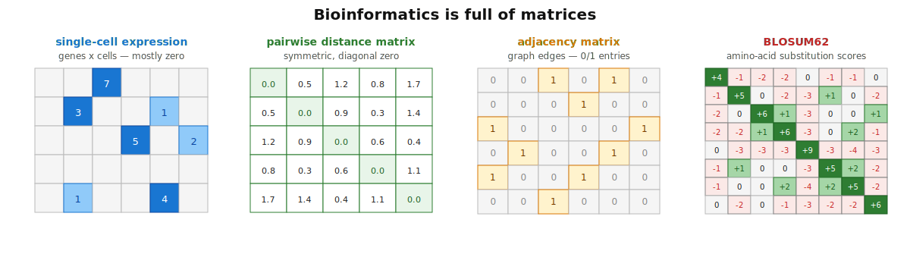{fig-alt="Three side-by-side schematic matrices. Left: a tall genes-by-cells matrix mostly filled with zeros, a few colored entries scattered through. Middle: a samples-by-kmers count table with small integer entries. Right: a 4x4 0/1 adjacency matrix next to the small graph it represents." width="80%"}

::: notes
Whenever you put a biological table into a program, you are reaching for a matrix. The shape and density of the matrix dictates the storage format and the algorithm. Notice how different these are: scRNA-seq matrices are huge and sparse, alignment scoring matrices are tiny and dense, distance matrices are medium and dense.
:::

## A matrix is just a 2-D array of numbers

```rust
use ndarray::array;

let a = array![[1.0, 2.0, 3.0],
               [4.0, 5.0, 6.0]];           // 2 rows, 3 columns
let x = array![1.0, 0.0, -1.0];            // length-3 vector

let y = a.dot(&x);                         // matrix-vector product
// y = [1*1 + 2*0 + 3*(-1), 4*1 + 5*0 + 6*(-1)] = [-2.0, -2.0]
```

The central operation is **multiplication** — matrix-times-vector (`A·x`, the workhorse) or matrix-times-matrix (`A·B`, less common in inner loops).

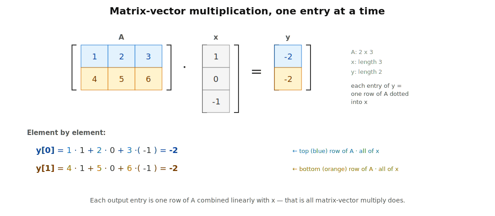{fig-alt="Two-row, three-column matrix A multiplied by a length-three column vector x equals a length-two column vector y; the two entries of y are shown computed as dot products of A's rows with x." width="85%"}

::: notes
Strip away the bioinformatics for a moment. A matrix is a rectangular block of numbers. You index it with two numbers — row and column. The one operation you do over and over is multiplication, usually matrix-times-vector. Almost every iterative algorithm we look at today is just `A·x` in a loop.
:::

## A dense matrix is really a 1-D array

Computer memory is a long flat run of bytes — there is no two-dimensional shelf. So an `Array2<f64>` of shape `(rows, cols)` is stored as **one contiguous buffer of `rows * cols` floats**, plus the two integers `rows` and `cols`.

There are two conventions for how to lay the entries out:

- **Row-major** [rows laid out one after another] — C, NumPy default, `ndarray` — `offset(i, j) = i · cols + j`
- **Column-major** [columns laid out one after another] — Fortran, R, MATLAB, `nalgebra` — `offset(i, j) = j · rows + i`

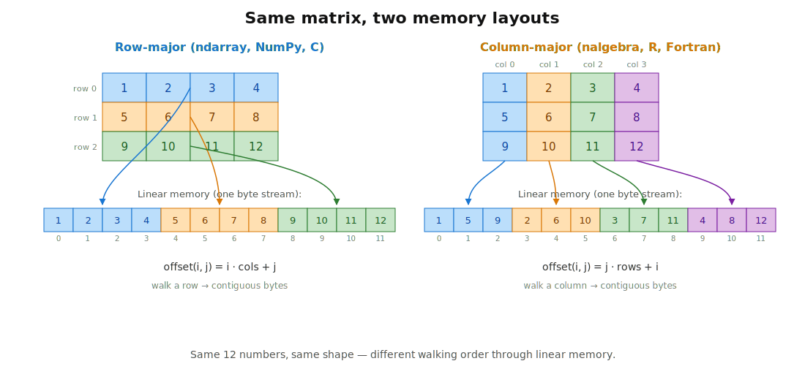{fig-alt="Two-panel figure. Left: a 3x4 matrix with rows colored blue/orange/green, with the same colors carried into a 12-cell horizontal memory strip below grouped by row. Right: the same matrix with columns colored, and a memory strip below grouped by column." width="90%"}

::: notes
This is the single most useful mental model for thinking about dense matrices. The 2-D notation is for the human; the machine sees one long run of floats. Every time you call `a[[i, j]]` the library is silently doing one multiplication and one addition to compute the right offset. There are exactly two reasonable conventions for that multiplier — row-major and column-major — and most numerical libraries pick one and stick with it.
:::

## Why the layout matters — cache locality

```rust
// Row-major matrix: iterating row-by-row touches consecutive memory.
for i in 0..rows {
    for j in 0..cols {
        sum += a[[i, j]];        // FAST: each step reads the next byte
    }
}

// Same matrix, swap the loops: now we stride through cache.
for j in 0..cols {
    for i in 0..rows {
        sum += a[[i, j]];        // SLOW: each step jumps rows*8 bytes
    }
}
```

The CPU loads memory in 64-byte chunks called **cache lines** [a contiguous block the CPU fetches from RAM in one go; reusing it is essentially free, fetching a new one costs ~100 cycles]. The first loop reuses each cache line; the second discards it on every iteration.

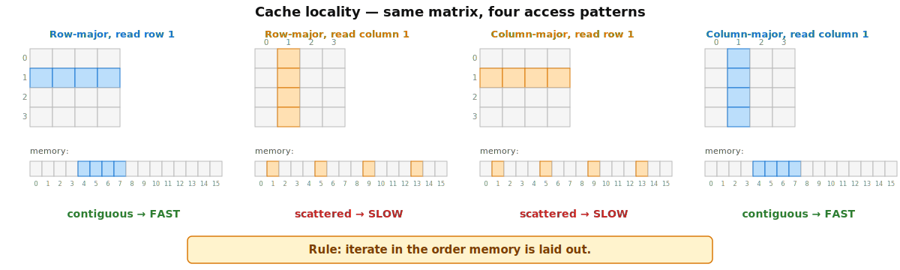{fig-alt="Four scenarios in a 2-by-2 grid showing a 4x4 matrix and its 16-cell linear memory representation. Top-left: row-major, reading row 1 highlights contiguous cells. Top-right: row-major, reading column 1 highlights scattered cells. Bottom row mirrors for column-major." width="85%"}

The slowdown is often 5-20×. Same code, same numbers, different access pattern.

::: notes
Cache locality is the single biggest reason performance-critical numerical code thinks hard about layout. The simple rule: iterate in the order memory is laid out. Row-major matrix? Outer loop on rows, inner loop on columns. Column-major matrix? The other way around. Get it wrong and you can easily lose an order of magnitude.
:::

## In Rust — `ndarray` {.smaller}

[`ndarray`](https://docs.rs/ndarray/latest/ndarray/) is the standard crate for dense N-dimensional arrays.

```rust
use ndarray::{Array1, Array2, array};

let a: Array2<f64> = Array2::zeros((3, 3));         // 3x3 of zeros
let b: Array2<f64> = Array2::eye(3);                // 3x3 identity
let m = array![[1.0, 2.0, 3.0],
               [4.0, 5.0, 6.0]];                    // literal
let x: Array1<f64> = array![1.0, 2.0, 3.0];

let y  = m.dot(&x);                                 // matrix-vector multiply
let mt = m.t();                                     // transpose, no copy
```

If you know NumPy, you know 90% of `ndarray`. See the [ndarray-for-NumPy-users guide](https://docs.rs/ndarray/latest/ndarray/doc/ndarray_for_numpy_users/index.html).

The equivalent in R:

```r
a  <- matrix(c(1, 2, 3, 4, 5, 6), nrow = 2, byrow = TRUE)  # 2x3 matrix
b  <- diag(3)                                              # 3x3 identity
x  <- c(1, 2, 3)
y  <- a %*% x                                              # matrix-vector multiply
at <- t(a)                                                 # transpose
```

R stores matrices in **column-major** order — same data, opposite layout from `ndarray`.

::: notes
Array2 is the bread-and-butter 2-D matrix type. Most things you'd reach for in NumPy have a direct ndarray equivalent: zeros, eye, dot, transpose, slicing, broadcasting, element-wise arithmetic. The big practical difference is that ndarray is strictly typed — Array2<f64> and Array2<i32> are different types.
:::

## Most biology matrices are sparse

:::: {.columns}
::: {.column width="55%"}

A typical 10x Genomics single-cell experiment:

| Dimension | Size |
|---|---|
| Genes (rows) | ~ 10 000 |
| Cells (columns) | ~ 100 000 |
| Total entries | 10⁹ |
| Non-zero fraction | 1-5% |

As a dense `f64` matrix: `10⁹ × 8 bytes = 8 GB`. As a sparse matrix: **80-400 MB**, a 20-100× saving — and most matrix operations get faster too, because zero times anything is zero and we skip it.

:::
::: {.column width="45%"}

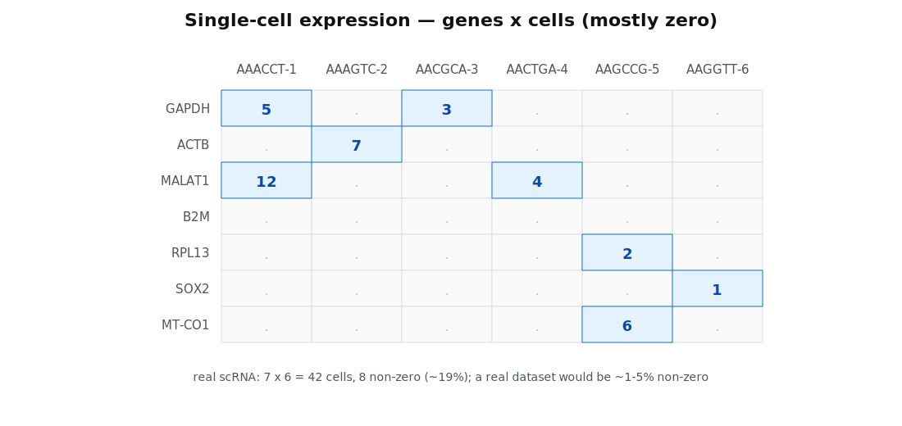{fig-alt="A 7-row, 6-column table with gene names down the left side (GAPDH, ACTB, MALAT1, B2M, RPL13, SOX2, MT-CO1) and 10-bp cell-ID barcodes across the top. Most cells are empty or display a dot, a few are filled with small integer counts." width="100%"}

:::
::::

::: notes
This is why sparse storage exists. The dense version of a real single-cell dataset would not even fit in RAM on a laptop. Once you accept the more complicated bookkeeping, you get back both the memory and most of the compute time. The same argument applies to k-mer count tables, protein-interaction adjacency matrices, and most real network data.
:::

## COO — the simplest sparse format

Three parallel arrays: `row`, `col`, `value`. Entry `k` lives at `(row[k], col[k]) = value[k]`.

```text
A =  [ 0  0  5  0 ]
     [ 0  8  0  0 ]
     [ 2  0  0  0 ]
     [ 0  0  0  7 ]

row    = [0, 1, 2, 3]
col    = [2, 1, 0, 3]
value  = [5, 8, 2, 7]
```

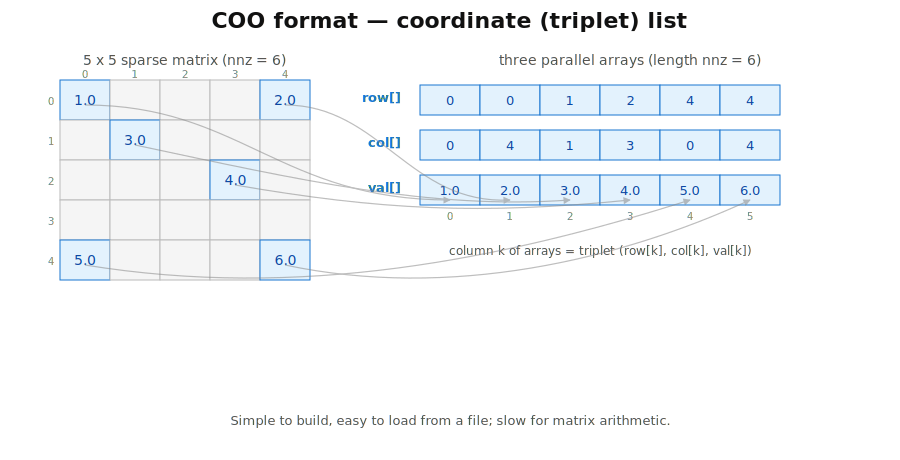{fig-alt="A small 4x4 matrix with four non-zero entries. Arrows point from those entries down to three parallel arrays labelled row, col, value, each of length 4." width="60%"}

**Use COO** for: loading data (e.g., from a TSV), building a matrix incrementally. **Avoid COO** for matrix-vector multiplication — there is no row or column order, so the multiply algorithm cannot stream cleanly.

::: notes
COO is the easy format. You read a sparse TSV: one row, one column, one value per line. You push triplets. Done. The cost is paid later when you try to do math with it — the multiply algorithm has to look up which entries belong to which row, and there is no fast way to do that. So we use COO as a staging format and convert to CSR for the real work.
:::

## CSR — compressed sparse row

Three flat arrays: `values`, `col_indices`, **`row_pointers`** of length `rows + 1`.

```text
A =  [ 0  0  5  0 ]
     [ 0  8  0  0 ]
     [ 2  0  0  0 ]
     [ 0  0  0  7 ]

values   = [5, 8, 2, 7]
col_idx  = [2, 1, 0, 3]
row_ptr  = [0, 1, 2, 3, 4]    // row i lives at values[row_ptr[i] .. row_ptr[i+1]]
```

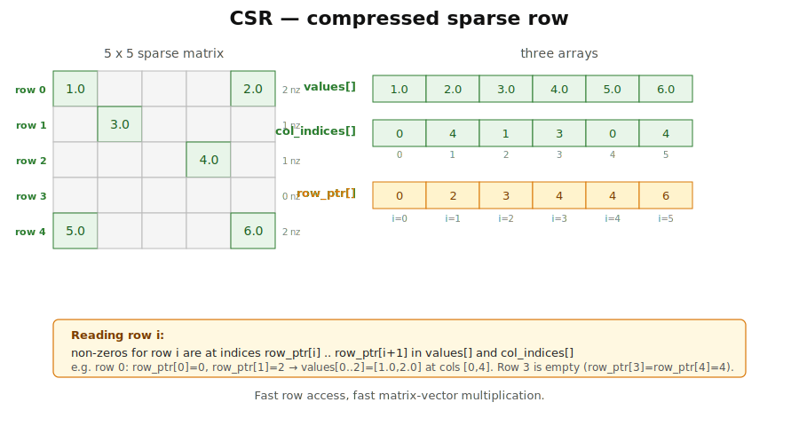{fig-alt="A 4x4 matrix with four non-zero entries displayed above three arrays. The values and col_idx arrays each have length 4; the row_ptr array has length 5 (rows+1), with arrows indicating the start of each row's slice within values." width="95%"}

Fast row access. **Fast matrix-vector multiplication** — for each row you walk a contiguous slice of `values` and `col_idx`. This is the workhorse format for numerical sparse code.

::: notes
CSR is the format you actually compute with. The trick is the row_pointers array: it tells you where each row's non-zeros start and end inside the flat values array. So matrix-vector multiplication becomes a clean loop — for row i, iterate over a small contiguous slice, multiply each value by the matching x entry, accumulate. Cache-friendly, branch-light. This is what every serious sparse library uses under the hood.
:::

## CSC — compressed sparse column

The mirror image of CSR — column-oriented.

```text
A =  [ 0  0  5  0 ]
     [ 0  8  0  0 ]
     [ 2  0  0  0 ]
     [ 0  0  0  7 ]

values   = [2, 8, 5, 7]
row_idx  = [2, 1, 0, 3]
col_ptr  = [0, 1, 2, 3, 4]    // column j lives at values[col_ptr[j] .. col_ptr[j+1]]
```

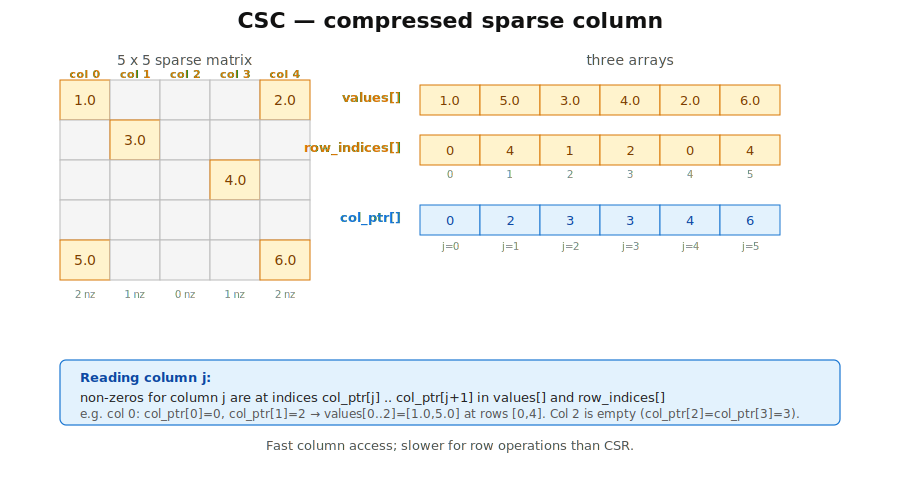{fig-alt="A 4x4 matrix with four non-zeros, displayed above three arrays for the CSC representation. The values and row_idx arrays each have length 4; the col_ptr array has length 5 (cols+1), with arrows indicating the start of each column's slice within values." width="95%"}

Fast column access; slow row access. Use CSC when you frequently pull out single columns — e.g., a single-cell pipeline processing one cell (column) at a time.

::: notes
CSC is exactly the same idea as CSR with rows and columns swapped. Most libraries support both and let you convert between them in O(nnz). The choice between CSR and CSC depends on which axis you slice along most often. If in doubt, CSR — it's the more common default.
:::

## Picking a format — quick guide

| Use case | Best format |
|---|---|
| Loading from disk, building incrementally | **COO** |
| Matrix-vector multiplication, iterative solvers | **CSR** |
| Slicing or extracting single columns | **CSC** |
| Whole matrix is dense (or near-dense), small | dense `Array2` |

**Typical workflow**: read a TSV into COO → convert to CSR for math.

::: notes
There is no single best sparse format. The right choice depends on what you do with the matrix once you have it. The typical pipeline is COO during ingest, CSR for computation. If your downstream work is mostly column slicing — common in single-cell — you might convert to CSC instead.
:::

## In Rust — `sprs`

[`sprs`](https://docs.rs/sprs/latest/sprs/) is the standard sparse-matrix crate. The main type is [`CsMat<f64>`](https://docs.rs/sprs/latest/sprs/struct.CsMatBase.html) — compressed sparse, CSR or CSC.

```rust
use sprs::{TriMat, CsMat};

let mut triplets = TriMat::new((3, 3));            // (rows, cols)
triplets.add_triplet(0, 2, 5.0);
triplets.add_triplet(1, 1, 8.0);

let csr: CsMat<f64> = triplets.to_csr();           // build COO, convert to CSR
let nnz = csr.nnz();                               // 2 non-zeros

let x = vec![1.0, 2.0, 3.0];
let y = &csr * &x;                                 // sparse mat-vec multiply
```

Conversion COO → CSR is one method call. Matrix-vector multiply uses the standard `*` operator.

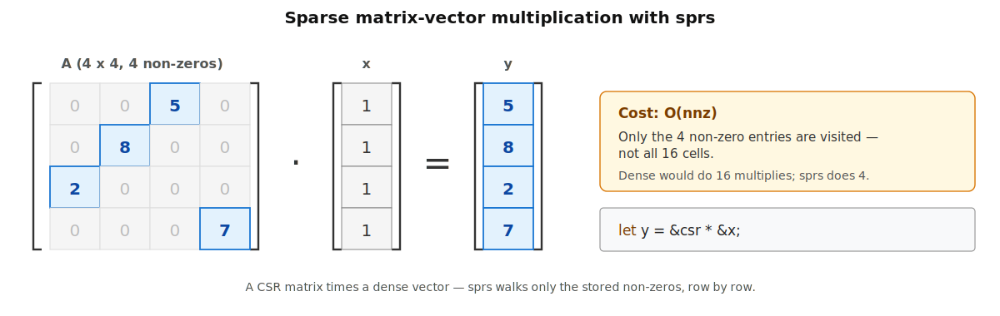{fig-alt="A 4x4 sparse matrix A with 4 non-zero entries shown in tall brackets, followed by a dot operator, then a column vector x of four ones in brackets, then an equals sign, then a column vector y with the values 5, 8, 2, 7 in brackets. Below the equation a code snippet shows let y = &csr * &x." width="100%"}

::: notes
sprs follows the standard build-in-COO-then-convert pattern. TriMat is the COO type; CsMat is the compressed (CSR or CSC) type. The crate also provides addition, multiplication, transposition, and conversions to and from dense ndarray matrices. For most day-10 work, those four operations are enough.
:::

## Matrix-vector multiplication — where does the time go

For an `n × n` matrix and a length-`n` vector:

| Format | Operations | Notes |
|---|---|---|
| Dense | `n²` multiply-adds | Cache-friendly, vectorisable |
| Sparse (CSR) | `nnz` multiply-adds | Only non-zeros visited |

For `n = 100 000` and **density 0.5%** (`nnz = 5 × 10⁷`):

- Dense: `10¹⁰` operations (~10 s)
- Sparse: `5 × 10⁷` operations (~0.05 s)

That is a **~200× speedup** before counting the memory saved.

::: notes
This is the practical case for sparse formats. For real scRNA-seq matrices the density is below 5%, often below 1%, so the speedup is even larger. The constant factor is slightly worse for sparse — pointer indirection, less vectorisation — but the asymptotic win dominates the moment your density drops below a few percent.
:::

## Solving `A·x = b` — two approaches

A huge chunk of numerical bioinformatics is "find `x` such that `A·x = b`":

- **Direct methods** — factor `A` (LU, Cholesky), back-substitute. Exact to floating-point. **`O(n³)`** time, **`O(n²)`** memory. Fine for `n ≤ a few thousand`.
- **Iterative methods** — Jacobi, Gauss-Seidel, conjugate gradient. Start with a guess, refine. Approximate, but **`O(nnz × iterations)`**. Scales to `n = 10⁶+`.

For large sparse problems you choose iterative.

::: notes
This is the fork in the road. Direct methods give you an exact answer but build a dense O(n²) factorisation that does not fit for large sparse problems. Iterative methods give you an approximate answer but only ever multiply by the original sparse matrix, so the memory and per-step cost stay tiny. Modern numerical libraries default to iterative for anything more than a few thousand rows.
:::

## Gauss-Seidel — the idea and the update rule

Start with a guess $\mathbf{x}$ (zeros are fine). Sweep through the rows. For each row $i$, isolate $x_i$ in the equation $\mathbf{A}\mathbf{x} = \mathbf{b}$:

$$x_i^{\,k+1} \;=\; \dfrac{1}{A_{ii}} \left( b_i \;-\; \sum_{j \ne i} A_{ij}\, x_j \right)$$

The right-hand side uses **the latest available value** of each $x_j$ — newly updated $x_0, \dots, x_{i-1}$ from the current sweep, and old $x_{i+1}, \dots, x_{n-1}$ from the previous one. Writing $x_i$ back in place is what makes it Gauss-Seidel rather than Jacobi.

```rust
// One Gauss-Seidel sweep over a dense ndarray::Array2<f64>.
for i in 0..n {
    let mut sum = 0.0;
    for j in 0..n {
        if i != j { sum += a[[i, j]] * x[j]; }     // x[j] is current value
    }
    x[i] = (b[i] - sum) / a[[i, i]];               // write in place
}
```

For the matrix `A = [[4, -1, 0], [-1, 4, -1], [0, -1, 4]]` and `b = [2, 6, 2]`, the first sweep gives `x = [0.5, 1.625, 0.906]`; a few more sweeps bring it within `1e-6` of the true solution.

::: notes
The simplest iterative solver to write by hand. The equation is just A·x = b rearranged to isolate x_i; everything on the right-hand side is treated as known. The trick that distinguishes Gauss-Seidel from its even simpler cousin Jacobi is that Gauss-Seidel uses already-updated values within the current sweep — Jacobi instead works from a full snapshot of the previous sweep. Gauss-Seidel converges roughly twice as fast as Jacobi for the same cost per sweep, which is why it is usually preferred.
:::

## When does Gauss-Seidel converge?

Two common sufficient conditions:

- **Symmetric positive-definite (SPD)** [$\mathbf{A} = \mathbf{A}^T$, and $\mathbf{x}^T \mathbf{A}\mathbf{x} > 0$ for every non-zero $\mathbf{x}$] — common when $\mathbf{A}$ comes from a least-squares or covariance problem.
- **Strictly diagonally dominant** [$|A_{ii}| > \sum_{j \ne i} |A_{ij}|$ for every row] — each diagonal entry larger than the sum of the off-diagonals in its row.

For matrices outside these classes Gauss-Seidel **may diverge** — the successive `x` vectors blow up instead of homing in.

In practice: most matrices that arise from physical or biological modelling problems are SPD or close to it, and Gauss-Seidel just works.

::: notes
This is the small print. Gauss-Seidel is not a universal solver — feed it a wild matrix and you can get garbage. The two convergence guarantees above cover most of the matrices you meet in well-posed problems. Outside those classes you might switch to a more robust method like conjugate gradient or use a preconditioner. We do not go that deep this week; the takeaway is to recognise the keywords SPD and diagonally dominant when you read papers.
:::

## Convergence picture

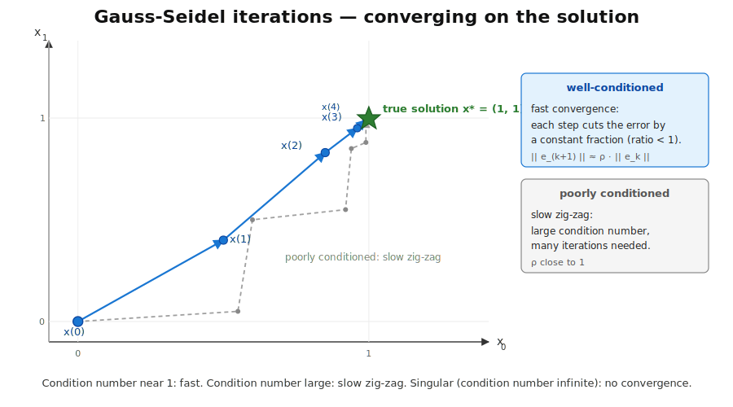{fig-alt="A 2-D plot showing several successive estimates of x converging toward a true solution marked with a star. The first few iterates are far away; each subsequent iterate is closer; an arrow chain connects them in order. A side label notes that the convergence rate depends on the condition number." width="70%"}

Each iteration moves the current `x` closer to the true solution. The rate of convergence depends on the **condition number** [a single number summarising how "stretched" the matrix is; close to 1 is great, very large is slow or unstable] of `A`. Well-conditioned: handful of iterations. Ill-conditioned: thousands, or never.

::: notes
The condition number is to linear algebra what Big-O is to algorithms — a one-number summary that tells you how a method will behave at scale. You will not compute condition numbers by hand in this course, but the word is worth knowing. When a paper says "well-conditioned linear system", that is a promise that iterative methods will converge quickly.
:::

# Markov chains

## Markov chains — biology examples

- **Viral strain succession** — model which influenza strain follows which
- **Codon-usage models** — `64 × 64` matrix of codon-to-codon transitions
- **Hidden Markov models (HMMs)** — gene finders ([GENSCAN](https://en.wikipedia.org/wiki/GENSCAN)), profile-HMM search ([HMMER](http://hmmer.org/))
- **Random walks on networks** — Personalized PageRank over protein-interaction graphs
- **Sequence segmentation** — promoter / coding / UTR labelling

Whenever you have "what comes next depends only on what is now", a Markov chain is the standard model.

::: notes
Markov chains are everywhere in sequence analysis and network biology. The "memoryless" assumption — only the current state matters — is a strong one, but in practice it captures enough structure to be useful, and the math is tractable. HMMs in particular have been a workhorse of computational biology since the 1990s.
:::

## A Markov chain in one picture

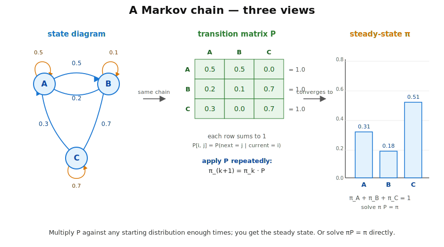{fig-alt="Left: a directed graph with three nodes labelled A, B, C and directed arrows between them annotated with transition probabilities summing to 1 out of each node. Middle: the corresponding 3x3 row-stochastic transition matrix P with rows summing to 1. Right: the equation p_{t+1} = P^T p_t, with a small numerical example showing one step of evolution." width="80%"}

Three pieces: **states** (the nodes), **transition probabilities** (the edge weights — each row of `P` sums to 1), and a **current distribution** `p_t` that evolves one step at a time.

::: notes
This is the picture to keep in mind. The graph and the matrix encode the same information. The matrix lets you do the math; the graph lets you reason about reachability and cycles. The dynamics are one matrix-vector product per step — that is it.
:::

## Multiplying P against itself — power iteration

![Starting from the all-mass-on-A distribution `p_0 = [1, 0, 0]`, multiplying by `P^T` once gives `p_1 = [0.7, 0.2, 0.1]`, twice gives `p_2 = [0.56, 0.25, 0.19]`, and many more steps converge to the stationary distribution `π ≈ [0.296, 0.185, 0.519]`.](images/lec1-markov-power-iteration.svg){fig-alt="At the top, a three-state Markov chain diagram with nodes A, B, C and labelled transition probabilities. At the bottom, four small bar charts side by side showing the probability distribution at t=0, t=1, t=2, and t=infinity; the all-on-A spike gradually spreads and rebalances over time." width="85%"}

Start with any distribution `p_0`. Multiply by `Pᵀ` over and over. The sequence converges to the **stationary distribution** `π`:

```rust
use ndarray::Array1;

let mut p: Array1<f64> = Array1::from_elem(n, 1.0 / n as f64);    // uniform start
for _ in 0..200 {
    p = p_matrix.t().dot(&p);                                     // one step
}
// p is now close to the stationary distribution π.
```

Convergence is guaranteed when the chain is **ergodic** [every state reachable from every other, and the chain is not stuck in a cycle].

::: notes
Power iteration is the simplest possible algorithm. Pick any starting distribution, multiply by the transition matrix repeatedly, stop when it stops changing. For sparse P each step is O(nnz), and convergence usually happens within a few dozen to a few hundred iterations. This is how PageRank computes its ranking on graphs of billions of pages — it is just power iteration on a very sparse transition matrix.
:::

## The steady-state equation

Alternatively, solve directly for the eigenvector with eigenvalue 1:

$$\pi = \pi \cdot P \qquad \Longleftrightarrow \qquad (P^T - I)\,\pi = 0,\ \ \sum_i \pi_i = 1$$

In words: $\pi$ is **the distribution that doesn't change when we apply $P$** — the state we arrive at after one transition is the same as the state we started from.

```rust
// Sketch: solve (P^T - I) pi = 0 with the normalisation constraint sum(pi) = 1.
// Direct dense linear solve; works well for small n.
let pt_minus_i = p_matrix.t().to_owned() - Array2::<f64>::eye(n);
// ...feed pt_minus_i and the normalisation row into a dense solver...
```

For **small dense** `P` this is fast and exact. For **large sparse** `P` power iteration is more practical — the steady-state solve would densify the factorisation.

::: notes
The steady-state equation is just "find the distribution that doesn't change when we apply P". That is by definition the left eigenvector of P associated with eigenvalue 1, which always exists for a valid transition matrix. For small problems a direct solve is fast and gives an exact answer; for huge sparse P, factorising would blow up the memory and we fall back on power iteration.
:::

## PageRank — Markov chains on the web

Google's original ranking algorithm is a Markov chain. Each web page is a **state**; each hyperlink is a **transition**; the imaginary "random surfer" walks the graph by following random outgoing links. The probability of being on page `i` after many steps is page `i`'s rank — and the algorithm to compute it is **power iteration on a giant sparse transition matrix**.

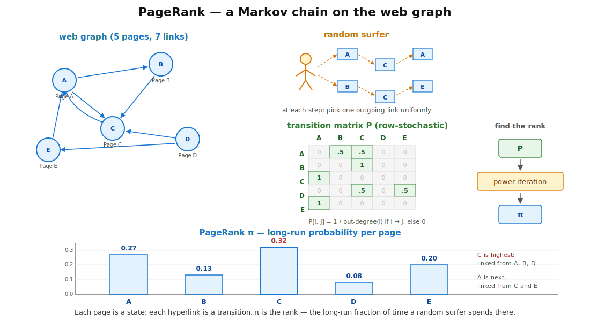{fig-alt="Top-left: a directed graph of 5 nodes labelled Page A through Page E with directed arrows representing hyperlinks. Top-right: a stick-figure random surfer following arrows from page to page. Middle: a 5x5 transition matrix derived from the graph. Bottom: a horizontal bar chart showing the steady-state PageRank score of each page; Page C and Page A score highest, Page D lowest." width="85%"}

Bioinformatics borrowed the trick: **Personalized PageRank** on protein-interaction graphs to score "how related is gene X to my list of seed genes"; random walks on co-expression networks; HotNet-style algorithms that find mutated subnetworks in cancer.

::: notes
PageRank is the canonical large-scale application of power iteration. The transition matrix has one row per web page — Google's matrix is in the billions of rows but extremely sparse (every page links to only a few dozen others). Power iteration on this sparse matrix converges in a few dozen iterations and gives a ranking score for every page. The same algorithm shows up across bioinformatics under the name Personalized PageRank or Random Walk with Restart — same math, different graph.
:::

## When to use which

| | Power iteration | Direct eigenvector |
|---|---|---|
| Works for | any sparse `P` | small dense `P` |
| Cost | `O(nnz × iters)` | `O(n³)` |
| Output | full trajectory `p_0, p_1, ..., π` | just `π` |
| Convergence | needs ergodicity | always (when valid) |
| Typical use | network analysis, PageRank | small biological models |

Power iteration is the default for anything large or sparse.

::: notes
The split mirrors the direct-vs-iterative split for A·x = b. Direct is exact and fast for small n; iterative is the only thing that scales. Note one bonus of power iteration: you get the intermediate distributions, which can be biologically interesting in their own right (e.g., the distribution at time t in a viral-spread model).
:::

## Recap

- Pick the **sparse** representation for sparse data — single-cell, networks, k-mer tables. Use **COO** to build, **CSR** for math.
- **Iterative solvers** (Gauss-Seidel and friends) scale where direct factorisation cannot — `O(nnz × iters)` instead of `O(n³)`.
- **Markov chains** converge to a stationary distribution under mild conditions; **power iteration** is the simplest way to find it.

::: notes
Three takeaways. First, match the storage to the data — dense for dense, sparse for sparse, with CSR as the default for serious sparse math. Second, accept approximate-but-cheap iterative solvers when the matrix is too big for a direct factorisation. Third, the same iterative pattern — repeated matrix-vector multiplication — is what powers Markov chain analysis, and through it PageRank, HMMER, gene finders, and a long list of bioinformatics tools.
:::

## To the exercises

Four exercises, in order:

- **[Exercise 1 — Loading and operating on a dense matrix](01-dense-matrix.qmd)** — `ndarray::Array2`, slicing, mat-vec multiply
- **[Exercise 2 — Sparse representations](02-sparse-matrix.qmd)** — `sprs::CsMat`, triplet → CSR, memory comparison
- **[Exercise 3 — Implement Gauss-Seidel](03-gauss-seidel.qmd)** — your own iterative solver
- **[Exercise 4 — Markov chain](04-markov-chain.qmd)** — power iteration vs steady state

::: notes
Work through them in order. Exercise 1 and 2 set up the two storage formats; 3 builds a real iterative solver on top of the dense format; 4 puts it all together with Markov chains. By the end you will have written and tested your own sparse matrix code, your own iterative linear solver, and your own power-iteration loop.
:::
