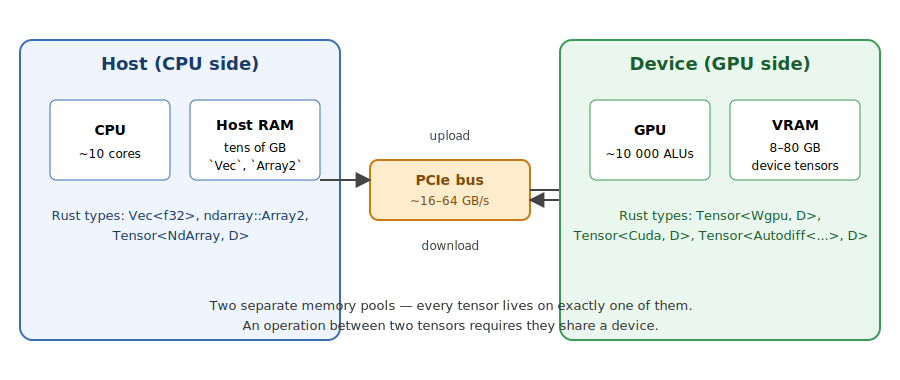
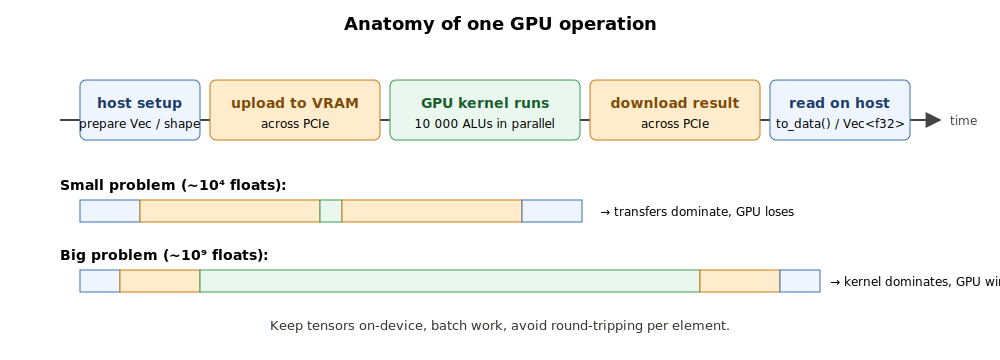
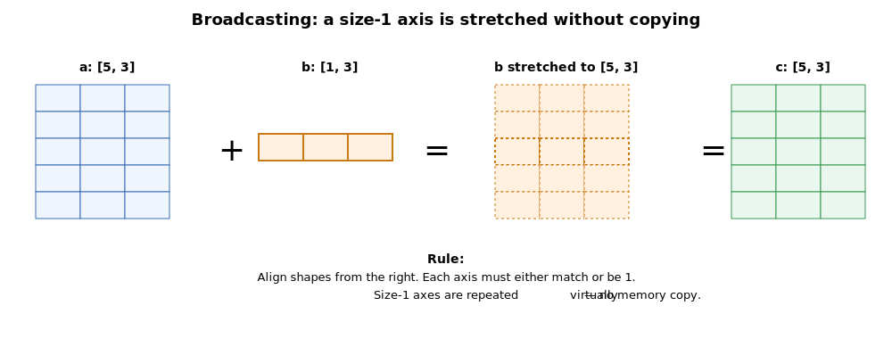
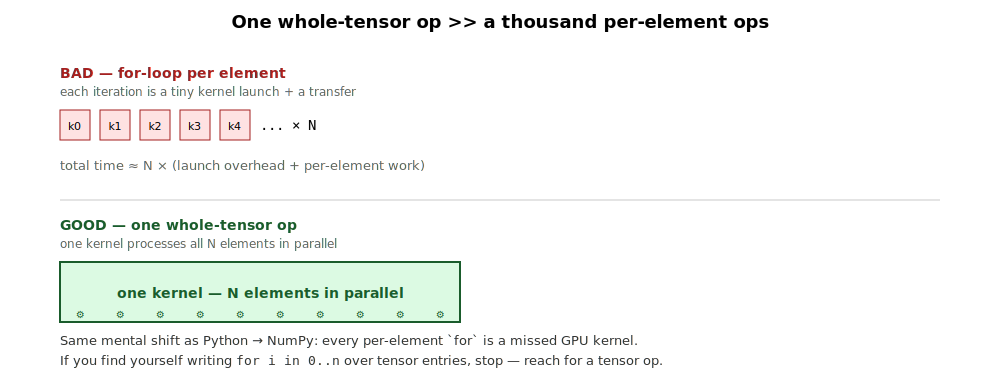
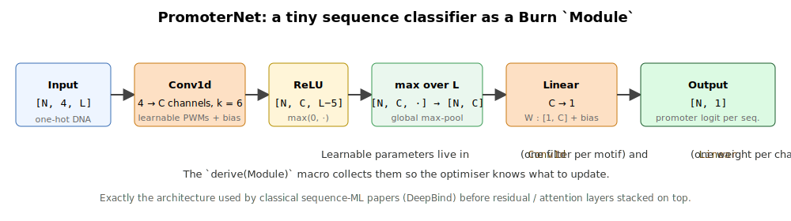
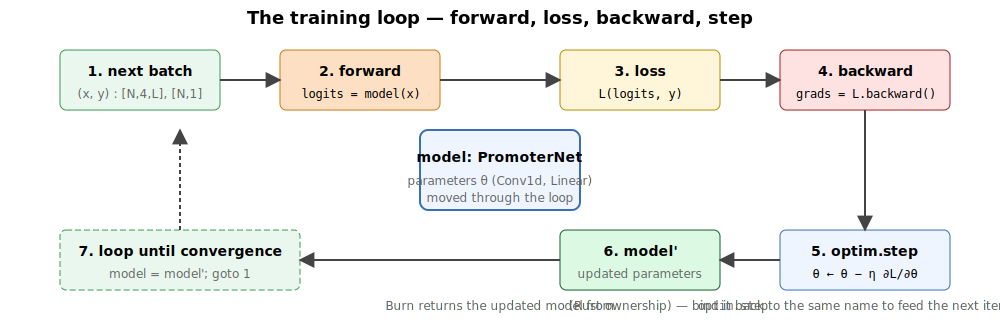

## What this lecture is

- We move from CPU `ndarray::Array2` (day 10) to **GPU tensors** — same idea, different hardware
- We use [**Burn**](https://burn.dev/) — a Rust framework that looks like PyTorch and runs on CUDA, wgpu, Metal, or the CPU
- We connect today's material back to **day 8 traits** — `Backend` is "just" a trait, and one function works on every device

::: notes
Day 11 is the GPU day. The hook is simple: most numerical bioinformatics is a small set of operations done many times — matrix multiply, element-wise add, reductions. The CPU does them in a serial-ish way; the GPU does them in parallel by the thousand. Burn is the Rust framework that lets us write the same code for either. Today we learn the tensor vocabulary, see it next to PyTorch line by line, and build up to a small motif scanner and classifier.
:::

## How CPU and GPU share the work — two memory pools

{fig-alt="Two large boxes labelled Host and Device. Host contains a CPU and Host RAM, with Rust types Vec, ndarray::Array2, and Tensor<NdArray, D>. Device contains a GPU and VRAM, with Rust types Tensor<Wgpu, D>, Tensor<Cuda, D>, and Tensor<Autodiff<...>, D>. Between them is a narrow bridge labelled PCIe ~16-64 GB/s with arrows for upload and download." width="85%"}

The host (your laptop / workstation CPU) and the device (GPU) each have their own memory. They talk over the **PCIe bus** [*the wire connecting CPU and GPU; tens of GB/s, much slower than each side's local RAM*], which is the bottleneck.

::: notes
This is the first thing to internalise. A Vec on the host and a Tensor on the GPU are not the same object — they live in physically different memory chips. To "do GPU work" you copy your data into VRAM, run a kernel, copy the result back. PCIe bandwidth is the bottleneck, so the practical advice is: keep tensors on the device once they're there, batch the work, avoid round-tripping per element.
:::

## One GPU operation, end to end

{fig-alt="A horizontal timeline showing five stages: host setup (blue), upload to VRAM (orange), GPU kernel runs (green), download result (orange), read on host (blue). Below the timeline, two scaled comparisons: small problem with large transfer bars and a tiny kernel bar (transfers dominate); big problem with small transfer bars and a long kernel bar (kernel dominates)." width="90%"}

Tensor libraries (Burn, PyTorch, JAX) hide the upload and download — but only when *both* operands already live on the device. Two rules of thumb:

1. Build tensors on the device once; keep them there.
2. Vectorise — one big kernel beats many small ones because each kernel pays the launch overhead.

::: notes
This timeline picture is the most useful thing to keep in mind when debugging "why is my GPU code slow". Almost always the answer is: too many host-device round trips, or too many tiny kernels. The fix is to express more of the computation in one tensor expression. Burn's lazy evaluation and operator fusion help, but they can't magic away PCIe.
:::

## CPU vs GPU — different shapes of fast

| | CPU | GPU |
|---|---|---|
| Cores | ~10 | ~10 000 arithmetic units |
| Good at | irregular control flow, system calls | the same op applied to lots of numbers |
| Latency per op | ~1 ns | ~µs (kernel launch overhead) |
| Throughput | ~10² GFLOPS | ~10⁴ GFLOPS |
| Coding style | loops, branches | whole-tensor expressions |

For a 10 000 × 10 000 matrix multiply: laptop CPU ~5 s, mid-range GPU ~50 ms. The crossover is the moment your problem is large enough to amortise the kernel-launch cost.

::: notes
This is the central trade-off to teach. GPUs are not faster at *one* thing; they are faster at *a lot of the same thing*. Small problems are slower on a GPU because the launch overhead dominates. Big problems are 50-100x faster. The bioinformatics matrices in today's exercises are intentionally small (so the laptop CPU keeps up) but the code we write is exactly what scales to a real dataset.
:::

## Where bioinformatics meets the GPU

- **Single-cell PCA / UMAP** — `[cells × genes]` matrices with `n` up to millions
- **Pairwise sequence distances** — `[N × N]` k-mer or embedding distances
- **PWM scanning across a genome** — 1-D convolution of one-hot DNA against motif weights
- **Sequence neural networks** — DeepBind, Basenji, Enformer; all built from conv layers
- **Variant-effect models, AlphaFold-style pipelines** — large transformers / attention on protein sequences
- **Embedding search** — vector databases for similar reads / cells / proteins

Every one of these reduces to a handful of tensor operations done at scale.

::: notes
The pattern across modern bioinformatics: we used to write hand-coded inner loops; we now write tensor expressions and let the GPU do the work. Once you can read "expression matrix is a `[N, G]` tensor" the rest of single-cell tooling becomes a few lines.
:::

## What is a tensor {.smaller}

A **tensor** [*an N-dimensional array of numbers, with a known shape and a device it lives on*] is the GPU-aware generalisation of `ndarray::Array2`. Element-wise addition and the matrix-vector product are the workhorse operations:

$$
(X + Y)_{i,j} = X_{i,j} + Y_{i,j}, \qquad
(X\mathbf{v})_i = \sum_{j=0}^{C-1} X_{i,j} \, v_j .
$$

:::: {.columns}
::: {.column width="55%"}
```rust
use burn::backend::NdArray;
use burn::tensor::Tensor;

type B = NdArray;
let device = Default::default();

let x: Tensor<B, 2> = Tensor::from_floats(
    [[1.0, 2.0, 3.0],
     [4.0, 5.0, 6.0]], &device);   // shape [2, 3]
let y = x.clone() + x;             // element-wise
let s = y.sum();                   // scalar 42.0
```
:::
::: {.column width="45%"}
```python
# PyTorch
import torch
x = torch.tensor([[1., 2., 3.],
                  [4., 5., 6.]])
y = x + x
s = y.sum()         # tensor(42.)
```
:::
::::

::: notes
Two pieces of code doing the same thing. The Rust version carries the backend `B` and the rank `2` in the type system. Some classes of bug — shape mismatches, mixing GPU and CPU tensors — become impossible to write.
:::

## `Tensor<B, D>` — read the type

```rust
let x: Tensor<B, 2> = ...;
//          ^  ^^
//          |  rank D — number of dimensions (2 = matrix)
//          backend B — which device + element type
```

- `Tensor<NdArray, 1>` — CPU vector
- `Tensor<NdArray, 2>` — CPU matrix
- `Tensor<Wgpu, 3>` — GPU 3-D tensor `[N, C, L]`
- `Tensor<Autodiff<NdArray>, 2>` — CPU matrix with gradient tracking

One generic type, four very different runtime objects. Generic code only sees `Tensor<B, D>`.

::: notes
The two type parameters carry everything you need to know: which device the tensor lives on, and how many axes it has. When you read Burn code in the wild, train yourself to read the type signature first — it tells you exactly what shape of data is flowing and where.
:::

## Quick quiz — reading the type

::: {.fragment}
For each signature below, say (a) which device the tensor lives on, and (b) what its rank is — i.e., how many axes it has.

```rust
let a: Tensor<NdArray, 2>           = ...;
let b: Tensor<Wgpu, 3>              = ...;
let c: Tensor<Autodiff<NdArray>, 1> = ...;
let d: Tensor<Cuda, 4>              = ...;
```
:::

::: {.fragment}
**Answers:** &nbsp; a) CPU, rank 2 (matrix) &nbsp; b) GPU via WebGPU, rank 3 &nbsp; c) CPU **with gradient tracking**, rank 1 (vector) &nbsp; d) NVIDIA GPU, rank 4 (`[N, C, H, W]` is the typical 4-D shape).
:::

::: {.fragment}
**Bonus:** what would the signature of "a CUDA tensor of one-hot DNA in shape `[N, 4, L]`" be?

→ `Tensor<Cuda, 3>` — the channel count `4` is a *runtime* property of the shape, not part of the type. The type only records the *rank*, never the sizes.
:::

::: notes
Spend a minute on this. Reading the type fluently is half of reading Burn code. The rank is in the type; the sizes are in the value. Common student confusion: "doesn't the type know the shape?" — no, only the rank. The shape (the actual sizes) is dynamic.
:::

## The `Backend` trait — yesterday's lesson, today's tool

Burn defines a Rust trait:

```rust
pub trait Backend {
    type Device;
    type FloatTensorPrimitive<const D: usize>;
    type IntTensorPrimitive<const D: usize>;
    // ... + several dozen kernels (add, matmul, conv, ...)
}
```

Several concrete impls ship with Burn:

| Backend | What it is |
|---|---|
| [`NdArray`](https://docs.rs/burn-ndarray/) | CPU, pure Rust — the default for tests |
| [`Wgpu`](https://docs.rs/burn-wgpu/) | any GPU via WebGPU — Vulkan / Metal / DX12 / browser |
| [`Cuda`](https://docs.rs/burn-cuda/) | NVIDIA GPUs |
| `Candle` | CPU or CUDA via Hugging Face's [candle](https://github.com/huggingface/candle) |
| `Autodiff<B>` | wraps any other backend, adds gradient tracking |

::: notes
The trait is the connection back to day 8. Backend is a contract — if you want to call yourself a backend you must provide these tensor types and these kernels. The CPU implementation, the wgpu implementation and the CUDA implementation each fulfil the contract their own way. Code that consumes a `<B: Backend>` does not care which one.
:::

## Generic over the backend

A function written once, runs anywhere:

```rust
use burn::tensor::{Tensor, backend::Backend};

fn standardise<B: Backend>(x: Tensor<B, 2>) -> Tensor<B, 2> {
    let mean = x.clone().mean_dim(0);
    let std  = x.clone().var_dim(0).sqrt();
    (x - mean) / std
}
```

```python
# PyTorch — also device-generic, but without compile-time checking:
def standardise(x):
    return (x - x.mean(dim=0)) / x.std(dim=0)
```

In symbols, for an $n \times d$ matrix $X$ with columns indexed by $j$, this computes

$$
\hat X_{i,j} = \frac{X_{i,j} - \mu_j}{\sigma_j}, \qquad
\mu_j = \frac{1}{n}\sum_{i=1}^n X_{i,j}, \quad
\sigma_j = \sqrt{\frac{1}{n}\sum_{i=1}^n (X_{i,j} - \mu_j)^2 \,} .
$$

`standardise` works on `NdArray` (CPU), `Wgpu` (GPU), `Cuda` (GPU), `Autodiff<NdArray>` (gradients) — without one line changing.

::: notes
Generic over Backend is the daily idiom. Every function you write should take `<B: Backend>` unless you have a specific reason to pin a concrete backend. Tests can run on NdArray (no driver needed). Production can swap to Wgpu or Cuda by changing one type alias. Training can wrap in Autodiff for gradients. Same function body throughout.
:::

## What "dims" mean — a picture

{fig-alt="Three side-by-side panels labelled Rank 1 vector, Rank 2 matrix, and Rank 3 3-D tensor. The vector is a row of five coloured cells with the label dims = [5]. The matrix is a 3-row, 4-column grid labelled dims = [3, 4] with axis 0 labelled as the row direction and axis 1 as the column direction. The 3-D tensor is three stacked grids drawn in perspective, labelled dims = [3, 4, 5]." width="90%"}

- **Rank** $D$ = how many axes the tensor has. Lives in the *type*: `Tensor<B, D>`.
- **dims** = how big each axis is. Lives in the *value*: `tensor.dims()` returns `[usize; D]`.

::: notes
This is the slide that prevents a week of confusion. Students conflate "dimension" (the rank — number of axes) with "size of a dimension" (the size along one axis). Burn separates them cleanly: D is the rank, in the type; dims() returns the per-axis sizes, at runtime.

The convention `[N, C, L]` for sequence ML — batch, channels, length — is the one we'll use throughout. For images it's `[N, C, H, W]` (rank 4). For text tokens it's `[N, L]` (rank 2). Always think shape *first*.
:::

## Shape — the most important metadata

{fig-alt="Three side-by-side panels showing the same tensor's progression. Left: Tensor::zeros([32, 4, 100]) shown as a labelled empty rectangle, dims = [32, 4, 100], note '12 800 floats, allocated on device'. Middle: x.swap_dims(1, 2) showing [32, 4, 100] → [32, 100, 4], note 'no copy — only stride metadata changes'. Right: y.reshape([3200, 4]) showing [32, 100, 4] → [3200, 4], note 'total element count unchanged'." width="92%"}

Every tensor has a **shape** [*the tuple of sizes along each axis*]. Most bugs are shape bugs.

```rust
let x: Tensor<B, 3> = Tensor::zeros([32, 4, 100], &device);   // [N, C, L]
println!("{:?}", x.dims());      // [32, 4, 100]
let y = x.swap_dims(1, 2);       // [32, 100, 4]
let z = y.reshape([32 * 100, 4]);  // [3200, 4]
```

```python
x = torch.zeros(32, 4, 100)
print(x.shape)                       # torch.Size([32, 4, 100])
y = x.transpose(1, 2)                # [32, 100, 4]
z = y.reshape(32 * 100, 4)           # [3200, 4]
```

::: notes
Train yourself to think of every tensor as `[N, C, L]` or `[N, D]` and write the shape down before you write the code. Burn forces you to commit to the rank at compile time, which is half the battle; the other half is keeping track of which axis means what. Comments like `// [N, 4, L] one-hot DNA` go a very long way.
:::

## Broadcasting

{fig-alt="Equation a + b = c drawn as grids. a is a 5x3 blue grid. b is a 1x3 orange strip. b is shown stretched into five identical copies (dashed outline rows) before the addition. The result c is a 5x3 green grid." width="92%"}

Two tensors of nearly-the-same shape can be combined; size-1 axes are stretched.

```rust
let a: Tensor<B, 2> = Tensor::ones([5, 3], &device);
let b: Tensor<B, 2> = Tensor::ones([1, 3], &device);
let c = a + b;                       // shape [5, 3]
```

```python
a = torch.ones(5, 3)
b = torch.ones(1, 3)
c = a + b                            # shape (5, 3)
```

Rule: align from the right; each axis must either match or be 1. The size-1 axis is repeated without copying.

::: notes
Broadcasting is the trick that lets you express "subtract the mean of each column from every row" in one line. Identical to NumPy / PyTorch. Once you get the hang of it you stop writing loops for these patterns.
:::

## Reductions

{fig-alt="A 2x3 blue grid with entries 1, 2, 3, 4, 5, 6. Three arrows from it point to: a single blue cell labelled 21 (sum() — scalar), an orange 2x1 strip labelled 6, 15 (sum_dim(1) — collapse axis 1, dims [2, 1] → [2]), and a green 1x3 strip labelled 2.5, 3.5, 4.5 (mean_dim(0) — collapse axis 0, dims [1, 3] → [3])." width="90%"}

Collapse one or more axes to a scalar or smaller tensor.

```rust
let x: Tensor<B, 2> = Tensor::from_floats(           // 2x3
    [[1.0, 2.0, 3.0],
     [4.0, 5.0, 6.0]], &device);

let total    = x.clone().sum();           // scalar tensor 21.0
let row_sum  = x.clone().sum_dim(1);      // shape [2, 1]
let col_mean = x.mean_dim(0);             // shape [1, 3]
```

```python
total    = x.sum()
row_sum  = x.sum(dim=1, keepdim=True)
col_mean = x.mean(dim=0, keepdim=True)
```

GC content per sequence, average expression per gene, k-mer counts — every reduction in a bioinformatics pipeline is one of these.

::: notes
sum, mean, max, min, argmax — same names as PyTorch, same semantics. The `_dim(k)` suffix says "collapse axis k". You will use these constantly in today's exercises.
:::

## No for-loops — the GPU mental shift

{fig-alt="Top: a row of five red squares labelled k0, k1, k2, k3, k4 with '... × N' to the right, captioned 'for-loop per element, total time ≈ N × (launch + per-element work)'. Bottom: a single long green bar labelled 'one kernel — N elements in parallel', filled with little gear icons representing the ALUs running concurrently." width="90%"}

```rust
// BAD: launches a kernel per element.
let mut x = Tensor::<B, 1>::zeros([1_000_000], &device);
for i in 0..1_000_000 {
    x = x.slice_assign([i..i+1], scalar);
}

// GOOD: one allocation, one kernel.
let x = Tensor::<B, 1>::from_floats(vec![scalar; 1_000_000], &device);
```

```python
# Same shift in Python — for-loop bad, vectorised op good.
x = torch.full((1_000_000,), scalar)
```

::: notes
The single most useful mental adjustment when learning a tensor library: replace `for i in range(n): out[i] = f(in[i])` with one whole-tensor expression. The library is doing the loop for you, in parallel, on the device.
:::

## One-hot encoding DNA — example

![Each base becomes a column of the [4, L] one-hot block: A → row 0, C → row 1, G → row 2, T → row 3. Column sum is 1 everywhere.](images/lec1-one-hot.svg){fig-alt="On the left, a DNA sequence A C G T A drawn as five coloured letter cells (A, C, G, T, A). An arrow points to the right where a 4x5 grid is drawn with row labels A, C, G, T. The hot cells (value 1) are coloured: (A, position 0), (C, position 1), (G, position 2), (T, position 3), (A, position 4); all other cells contain 0. The columns are labelled with the position index 0..4." width="85%"}

```rust
use burn::tensor::{Int, Tensor};

fn one_hot_dna<B: Backend>(seqs: Tensor<B, 2, Int>) -> Tensor<B, 3> {
    seqs
        .one_hot(4)                              // [N, L, 4]
        .float()
        .swap_dims(1, 2)                         // [N, 4, L]
}
```

```python
def one_hot_dna(seqs):                           # seqs: [N, L] int
    return F.one_hot(seqs, num_classes=4).float().transpose(1, 2)
```

::: notes
One-hot encoding is the bridge between strings and tensors. Once your sequences are `[N, 4, L]` floats, every downstream operation — GC content, motif scanning, conv layers — is a standard tensor op. We do this in exercise 2.
:::

## Pairwise distances — broadcasting in anger

![Inserting a size-1 axis lets `[N, 1, D]` and `[1, N, D]` broadcast to a virtual `[N, N, D]` cube of differences; squaring, summing axis 2, and `sqrt` collapses it to the `[N, N]` distance matrix.](images/lec1-pairwise-distances.svg){fig-alt="A flow of tensor shapes. x of shape [N, D] is shown as a blue 4-row strip. Arrow to a [N, 1, D] tensor (unsqueeze axis 1), minus a [1, N, D] tensor (unsqueeze axis 0). The subtraction broadcasts into a [N, N, D] cube drawn in perspective. An arrow then leads to a green [N, N] grid labelled with the final reduction sequence pow(2).sum_dim(2).sqrt().squeeze_dim(2). The Euclidean distance formula appears at the bottom." width="92%"}

Pairwise Euclidean distance between $N$ samples each of dimension $D$:

$$
D_{i,j} \;=\; \sqrt{\;\sum_{k=0}^{D-1} (x_{i,k} - x_{j,k})^2 \;}
$$

```rust
fn pairwise_l2<B: Backend>(x: Tensor<B, 2>) -> Tensor<B, 2> {
    let a = x.clone().unsqueeze_dim::<3>(1);             // [N, 1, D]
    let b = x.unsqueeze_dim::<3>(0);                     // [1, N, D]
    (a - b).powf_scalar(2.0).sum_dim(2).sqrt().squeeze_dim(2)
}
```

```python
def pairwise_l2(x):                              # x: [N, D]
    return torch.cdist(x, x)                     # [N, N]
```

::: notes
Adding a size-1 axis turns a 2-D thing into a virtual 3-D cube, lets broadcasting stretch it, and the subtraction-and-sum then produces all N*N pairs in one shot. The op is one kernel on the GPU. The same idea generalises to any "all pairs of X and Y" computation — and crucially, to attention layers in modern transformer models.
:::

## PCA — back to day 10, then forward {.smaller}

Day 10 used `ndarray` for dense matrices but stopped before decompositions like SVD. For full linear algebra on the CPU we reach for [**`nalgebra`**](https://nalgebra.org/) — pure Rust, no LAPACK build dependency.

```rust
use nalgebra::DMatrix;

let mut m = DMatrix::from_row_slice(n_samples, n_genes, &data);
// centre each column
for j in 0..n_genes {
    let mean: f64 = m.column(j).mean();
    m.column_mut(j).iter_mut().for_each(|v| *v -= mean);
}
let svd = m.svd(true, true);
let pcs = svd.u.unwrap() * DMatrix::from_diagonal(&svd.singular_values);
```

```python
from sklearn.decomposition import PCA
pcs = PCA(n_components=k).fit_transform(expression)
```

PCA is the singular value decomposition of the centred data matrix:

$$
X_{\mathrm{centred}} = U \, \Sigma \, V^\top,\qquad
\text{PC scores} = U_{:,1:k} \,\Sigma_{1:k,1:k} .
$$

::: notes
nalgebra is the closest Rust gets to Eigen or Armadillo — full classical linear algebra in one crate. The naming convention is column-major (R / MATLAB style), unlike ndarray's row-major. For PCA we need SVD; nalgebra has it as a one-liner.

The connection to day 10: ndarray is great for the data; nalgebra is better for the decompositions. Real pipelines often use both, converting at the boundary.
:::

## 1-D convolution = PWM scanning

![Sliding a PWM (a [4, w] weight matrix) along one-hot DNA gives a score at every valid starting position. Score 4 (perfect match) sits exactly where GATA occurs.](images/lec1-conv1d-pwm.svg){fig-alt="Top: a 4 x 12 one-hot DNA grid, with the four rows labelled A, C, G, T, hot cells coloured per base, and a dashed orange window highlighting positions 6-9 where the motif GATA sits. Bottom-left: a 4 x 4 PWM grid for motif GATA with 1s at A[1], A[3], G[0], T[2]. Bottom-right: a row of 9 cells showing the convolution output 0 1 1 2 2 2 4 1 0 along the sequence; position 6 has the perfect score 4 highlighted. Below the figure, the equation 'score(p) = Σ_{b,k} one_hot[b, p+k] · PWM[b, k] + bias' is displayed." width="92%"}

A motif **PWM** [*position weight matrix — a `[4, w]` matrix of log-odds scores, one column per position in the motif*] scanned along DNA is exactly a 1-D convolution.

For one input sequence (one-hot encoded as $x \in \{0,1\}^{4 \times L}$), one motif (kernel $w \in \mathbb{R}^{4 \times W}$), and a learned scalar bias $b$:

$$
\mathrm{score}(p) \;=\; \sum_{c=0}^{3} \sum_{k=0}^{W-1} x_{c,\, p+k}\, w_{c,k} \;+\; b .
$$

```rust
use burn::nn::conv::{Conv1d, Conv1dConfig};

let conv: Conv1d<B> = Conv1dConfig::new(4, n_motifs, motif_width)
    .with_bias(true)              // learnable per-motif threshold
    .init(&device);
let scores = conv.forward(one_hot_dna);          // [N, M, L−w+1]
```

```python
import torch.nn as nn
conv = nn.Conv1d(in_channels=4, out_channels=n_motifs, kernel_size=motif_width, bias=True)
scores = conv(one_hot_dna)                       # [N, M, L−w+1]
```

The bias $b$ acts as a learned *threshold*: positive bias shifts every score up (the motif is easy to "find"), negative bias shifts every score down (only strong matches survive `ReLU`).

::: notes
This is the bridge slide. The classical bioinformatics tool — slide a PWM along DNA, score every position — is one Conv1d call. Same math, vastly faster, and now in the same framework as the deep-learning models that build on top of it. DeepBind, Basenji, Enformer all open with exactly this layer.

The bias is a small but pedagogically useful detail. Without it the model can only learn matching patterns; with it the model can additionally learn how loose or strict its threshold should be. In a multi-motif Conv1d, each output channel has its own bias — so each motif has its own threshold.
:::

## Autodiff — gradients for free

Wrap any backend in `Autodiff` and the framework records every operation:

```rust
use burn::backend::{Autodiff, NdArray};
type B = Autodiff<NdArray>;

let x: Tensor<B, 1> = Tensor::from_floats([3.0], &device).require_grad();
let y = x.clone().powf_scalar(2.0);              // y = x^2
let grads = y.backward();
let dx = x.grad(&grads).unwrap();                // 6.0
```

```python
x = torch.tensor([3.0], requires_grad=True)
y = x ** 2
y.backward()
print(x.grad)                                    # tensor([6.])
```

Behind the scenes, `Autodiff` builds the **computation graph** [*a DAG of tensor operations recorded during the forward pass; `.backward()` walks it in reverse*] and applies the chain rule. For a scalar loss $\mathcal{L}$ that flows through a chain of tensor ops $\mathcal{L} = f_n(\dots f_2(f_1(x)) \dots)$:

$$
\frac{\partial \mathcal{L}}{\partial x}
\;=\; \frac{\partial f_n}{\partial f_{n-1}} \cdot \frac{\partial f_{n-1}}{\partial f_{n-2}} \cdots \frac{\partial f_1}{\partial x} .
$$

In our toy example, $y = x^2$ so $\partial y / \partial x = 2x$, evaluated at $x = 3$ gives $6$.

::: notes
Autodiff is the magic ingredient that turned tensors into neural networks. The framework builds a directed acyclic graph as you do operations, then runs the chain rule backwards through it when you call `.backward()`. You never write a single derivative by hand. We use this in exercise 7 to train a classifier.

The chain-rule slide is for students who haven't seen autodiff before — naming the mechanism prevents it from feeling like magic. The whole training loop later is "build a graph forward, walk it backward".
:::

## A neural network is a `Module` {.smaller}

{fig-alt="A horizontal block diagram with six labelled boxes connected by arrows. From left to right: Input [N, 4, L] one-hot DNA; Conv1d 4→C channels, k=6, learnable PWMs + bias; ReLU; max over L: [N, C, ·] → [N, C] global max-pool; Linear C→1, W: [1, C] + bias; Output [N, 1] promoter logit per sequence. A footnote points out which boxes contain learnable parameters." width="95%"}

A `Module` is a struct of parameters plus a `forward` method.

```rust
#[derive(Module, Debug)]
struct PromoterNet<B: Backend> {
    conv: Conv1d<B>,
    fc:   Linear<B>,
}

impl<B: Backend> PromoterNet<B> {
    fn forward(&self, x: Tensor<B, 3>) -> Tensor<B, 2> {
        let h = relu(self.conv.forward(x));          // [N, C, L−5]
        let h = h.max_dim(2).squeeze_dim(2);         // [N, C] global maxpool
        self.fc.forward(h)                           // [N, 1] logits
    }
}
```

```python
class PromoterNet(nn.Module):
    def __init__(self, ...):
        self.conv = nn.Conv1d(4, C, w)
        self.fc   = nn.Linear(C, 1)
    def forward(self, x):
        h = self.conv(x).relu()
        h, _ = h.max(dim=2)
        return self.fc(h)
```

::: notes
The `derive(Module)` is the analogue of inheriting from nn.Module. It tells Burn "these fields are parameters; collect them, give them to the optimiser, save and load them as a unit". The `forward` is yours to write.
:::

## Training loop — what it looks like {.smaller}

{fig-alt="A flowchart with a central box representing the model (parameters θ). Numbered steps around it: 1. next batch (x, y); 2. forward (logits = model(x)); 3. loss L(logits, y); 4. backward grads = L.backward(); 5. optim.step updates θ; 6. updated model'; 7. loop. Dashed lines connect each step back to the central model to indicate that they share the parameters being updated. The footnote notes that optim.step returns the new model — bind it back to the same name." width="95%"}

```rust
let mut model: PromoterNet<B> = PromoterNet::init(&device);
let mut optim = AdamConfig::new().init();

for (x, y) in batches {
    let logits = model.forward(x);
    let loss = binary_cross_entropy(logits, y);
    let grads = loss.backward();
    let grads = GradientsParams::from_grads(grads, &model);
    model = optim.step(LR, model, grads);
}
```

```python
for x, y in loader:
    logits = model(x)
    loss = F.binary_cross_entropy_with_logits(logits, y)
    optim.zero_grad(); loss.backward(); optim.step()
```

The shape of the loop is exactly the same as a PyTorch loop. Burn's flavour is just more explicit about ownership — `optim.step` takes the model and returns the updated model.

::: notes
The training loop is the boring part: forward, loss, backward, step. Burn does the unusual thing of returning the updated model from optim.step rather than mutating in place — that is Rust's ownership system showing through. Functionally identical to PyTorch otherwise.
:::

## Recap

- A **tensor** is the GPU-aware Array2; its type carries both backend and rank
- **`Backend`** is a trait — write `<B: Backend>` once, run on CPU, wgpu, CUDA, or Autodiff
- **Broadcasting + reductions** replace `for` loops, on CPU and GPU alike
- For non-GPU linear algebra (SVD, eigenvalues), use **`nalgebra`**
- `Module` + `Autodiff` give you the standard PyTorch shape of model + training loop

::: notes
Three things to keep. First, tensors are arrays with a device — the type tells you both. Second, Backend is the trait that lets one function body run on every device. Third, the rest of today is just doing bioinformatics with that vocabulary — one-hot, GC, distances, PCA, conv, classifier.
:::

## To the exercises

Seven exercises, in order:

- **[1 — Tensors on any backend](01-tensors.qmd)** — `<B: Backend>`, basic ops, run on `NdArray` and `Wgpu`
- **[2 — One-hot encoding DNA](02-one-hot.qmd)** — int tensor → `[N, 4, L]` floats
- **[3 — GC content across a batch](03-gc-content.qmd)** — reductions, masking
- **[4 — Pairwise distance matrix](04-distance-matrix.qmd)** — broadcasting + `cdist` by hand
- **[5 — PCA on expression data](05-pca.qmd)** — `nalgebra` SVD (CPU-only)
- **[6 — 1-D conv motif scanner](06-motif-scanner.qmd)** — PWM as a Conv1d weight
- **[7 — Promoter classifier](07-promoter-classifier.qmd)** — full Burn training loop

::: notes
Work through them in order. Exercise 1 grounds the backend trait pattern; 2-4 build sequence-tensor fluency; 5 puts the classical-linalg piece in place; 6 and 7 stitch everything into a small sequence-ML model. By the end you have written a generic GPU-ready function library and trained your first model in Rust.
:::
