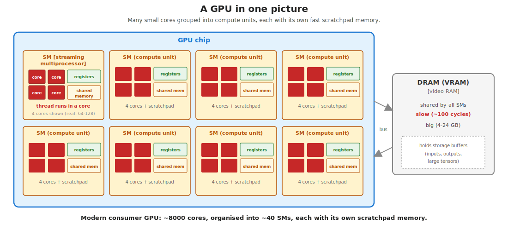
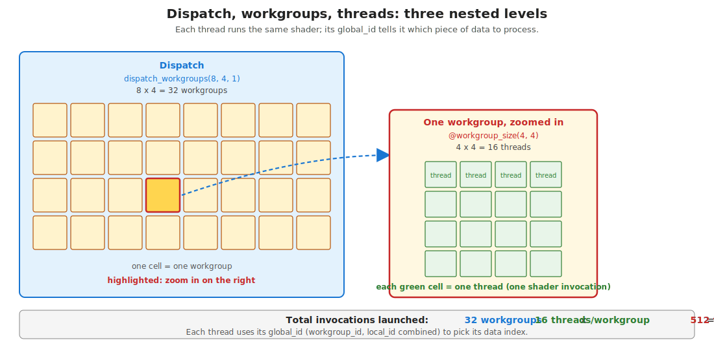
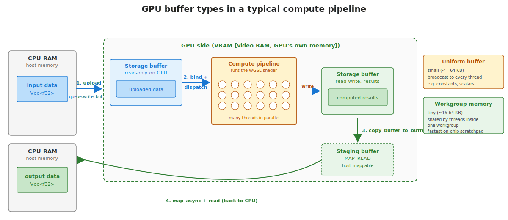

## What this lecture is

- Day 11 used **Burn** — a tensor framework that hides the GPU
- Today we go one level lower: **WGSL compute shaders** dispatched by hand with [`wgpu`](https://docs.rs/wgpu/)
- Several exercises **revisit problems from earlier days** (GC content, reverse complement, pairwise distances) as raw GPU kernels — so you can compare side by side

::: notes
The premise of day 12: Burn was the "what". Today is the "how". You're going to see exactly the machinery Burn uses to put a tensor on a GPU and run an op on it. After this day, "the GPU is faster" stops being a black box — you can read a compute shader, predict its cost, and write your own when no off-the-shelf op fits.
:::

## A GPU in one picture

{fig-alt="Diagram of a GPU chip containing 8 streaming multiprocessors, each with 4 cores plus a small register file and shared memory; off to the side a large DRAM/VRAM block connected by a bus, labelled slow ~100 cycles."}

- A **GPU** is essentially a chip of **thousands of small cores** [*ALUs that do one floating-point op per cycle*]
- Cores are grouped into **SMs** [*streaming multiprocessors, also called "compute units"*] — each SM has its own **register file** [*per-thread fast storage*] and **shared memory** [*per-workgroup scratchpad, ~100x faster than VRAM*]
- A separate, much larger **VRAM** [*video RAM*] is shared by all SMs but is far slower

::: notes
The single most useful mental model: small fast cores on the chip, big slow memory off the chip. Everything about GPU performance is "how do I keep the cores busy without waiting for VRAM". Workgroups, shared memory, coalesced reads — they all serve that one goal. Don't get bogged down in vendor terminology; NVIDIA calls them SMs, AMD calls them CUs, WebGPU calls them compute units; they're the same idea.
:::

## Why workgroups and queues exist

- **Workgroups** = groups of threads that **share fast on-chip memory** and can synchronise with each other; they map to one SM
- **Queues** [*serial streams of commands from CPU to GPU*] = the CPU posts uploads, dispatches and copies; the GPU pulls work off the queue when it's ready
- **Why this shape?** GPUs are *massively parallel* — you can't tell each thread what to do one at a time, so you describe work in **batches** (one dispatch = one batch); and you can't easily synchronise between batches without going back to the CPU

::: notes
The conceptual point: a GPU is not a fast CPU with more threads. It's a different machine. You don't run code on it, you submit work to it. The CPU is the conductor; the GPU is the orchestra. Once that lands, the rest of the API stops looking arbitrary — write_buffer, dispatch, submit, poll are just steps in handing work to the orchestra and waiting for the result.
:::

## Why bother — Burn already works

Two reasons:

- **Granularity.** If your problem isn't naturally a tensor op (matmul, conv, attention) but rather "for each byte of this 4 GB DNA buffer, do X, atomically count Y", a hand-written shader is the natural fit.
- **Understanding.** Knowing what Burn does under the hood — kernels, workgroups, buffer transfers — turns "the GPU is faster" from magic into something you can debug and optimise.

In production most bioinformatics GPU code uses a high-level framework (PyTorch, Burn, JAX). But under the hood that framework eventually translates to **exactly the same 6-step pipeline** you're going to write today.

::: notes
Frame this honestly: students don't need wgpu for routine work. They need wgpu for novel kernels, for understanding existing code, and as a building block for tools that don't yet exist. It's a "knowing what's underneath" day more than a "use this every day" day.
:::

## WebGPU and the wgpu crate

**WebGPU** [*a cross-vendor GPU standard published by the W3C; modern replacement for OpenGL/WebGL for compute*] runs on Vulkan, Metal, and DX12. **`wgpu`** is the pure-Rust implementation.

| Platform | Backend wgpu uses |
|---|---|
| Linux + NVIDIA / AMD / Intel GPU | Vulkan |
| macOS / iOS | Metal |
| Windows + GPU | DX12 (or Vulkan) |
| Browser | WebGPU directly (compiles to WASM) |
| No GPU | software fallback (slow) |

One Rust + WGSL codebase, all of the above.

::: notes
The portability story is the practical win. CUDA only runs on NVIDIA; OpenCL is fading; SYCL is niche. wgpu+WGSL is the only thing that runs everywhere from a phone to a workstation to a browser tab. The price is that wgpu is younger, slightly less polished, and not yet uniformly supported by every bioinformatics tool — but the trajectory is clearly upward.
:::

## The 6-step compute pipeline

Every wgpu compute program has these six steps. Memorise the shape — every exercise today walks through them.

1. **`Instance` → `Adapter`** — pick a physical GPU
2. **`Device` + `Queue`** — logical handles for resources and commands
3. **`Buffer`s** — GPU memory for inputs, outputs, scratch
4. **`ShaderModule` + `ComputePipeline`** — compile and ready the shader
5. **`BindGroup`** — bind buffers to shader bindings
6. **`CommandEncoder` + dispatch + `queue.submit`** — run, then read back

```rust
let instance = wgpu::Instance::new(
    wgpu::InstanceDescriptor::new_without_display_handle()
);
let adapter  = instance.request_adapter(&wgpu::RequestAdapterOptions::default()).await?;
let (device, queue) = adapter.request_device(&wgpu::DeviceDescriptor::default()).await?;
// ... create buffers, shader module, bind group, pipeline ...
let mut encoder = device.create_command_encoder(&Default::default());
{
    let mut pass = encoder.begin_compute_pass(&Default::default());
    pass.set_pipeline(&pipeline);
    pass.set_bind_group(0, &bind_group, &[]);
    pass.dispatch_workgroups(workgroups, 1, 1);
}
queue.submit([encoder.finish()]);
```

::: notes
The 6-step pattern is the most useful thing to walk away with. Every wgpu tutorial, every Burn backend, every WebGPU example follows it. The first time you write it, it's 100 lines of boilerplate. By the third exercise you'll skim past it to the shader.
:::

## A minimal WGSL shader

```wgsl
@group(0) @binding(0) var<storage, read>       a: array<f32>;
@group(0) @binding(1) var<storage, read>       b: array<f32>;
@group(0) @binding(2) var<storage, read_write> c: array<f32>;

@compute @workgroup_size(64)
fn main(@builtin(global_invocation_id) gid: vec3<u32>) {
    let i = gid.x;
    if (i >= arrayLength(&c)) { return; }
    c[i] = a[i] + b[i];
}
```

Things to read:

- `@group(0) @binding(N)` — slot in bind group 0. The Rust side must match.
- `var<storage, read>` — read-only storage buffer.
- `@compute @workgroup_size(64)` — entry point; each workgroup is 64 threads.
- `@builtin(global_invocation_id)` — every thread's unique 3-D index. We use `gid.x`.
- Bounds check — required, because we dispatch more threads than elements.

::: notes
WGSL is small. The whole language fits in a one-page cheatsheet. Static types, no pointers, no recursion, deterministic execution — designed to be safe enough to run inside a browser. If you can read Rust you can read WGSL; the surface syntax is C-like but the semantics are deliberately restricted.
:::

## Workgroups, threads, dispatch

A **workgroup** [*a group of threads that run together on one GPU compute unit; can share memory and synchronise*] is the unit of dispatch.

For 1-D work over `n` elements, workgroup size 64:

```rust
let workgroups = (n + 63) / 64;        // ceiling division
encoder.dispatch_workgroups(workgroups, 1, 1);
```

Total threads launched: `workgroups * 64`. Always ≥ `n`. Each thread reads its `gid.x` to know which element to handle; the extras bounds-check and return.

For 2-D work (e.g. `[N, N]` distance matrix), workgroup size `(8, 8)`:

```rust
encoder.dispatch_workgroups((N + 7) / 8, (N + 7) / 8, 1);
```

Each thread uses `(gid.x, gid.y)` as `(row, col)`.

{fig-alt="Left: an 8 by 4 grid of small boxes labelled workgroups, sitting inside a big dispatch box labelled dispatch_workgroups(8, 4, 1). One workgroup is highlighted in red. Right: that workgroup zoomed in, showing a 4 by 4 grid of green thread cells labelled @workgroup_size(4, 4). Bottom strip summarises 32 workgroups x 16 threads = 512 invocations."}

Each thread runs the same shader code; its `global_id` (workgroup_id combined with local_id) tells it which piece of data to process.

::: notes
Workgroup size 64 (or a multiple of 64) is the most common pick. Underneath, NVIDIA hardware runs 32 threads per "warp" and AMD runs 64 per "wavefront"; aligning to those sizes keeps the GPU busy without wasted threads. 8×8 is the natural 2-D analogue. The exact best number is hardware-dependent — for production, profile.
:::

## Buffer types — a cheatsheet

| Kind | Rust `BufferUsages` | WGSL | Use for |
|---|---|---|---|
| Storage (input) | `STORAGE \| COPY_DST` | `var<storage, read>` | inputs uploaded once, read by many threads |
| Storage (output) | `STORAGE \| COPY_SRC` | `var<storage, read_write>` | outputs written by threads, copied back to host |
| Uniform | `UNIFORM \| COPY_DST` | `var<uniform>` | small constants (~64 KB), broadcast to every thread |
| Staging | `MAP_READ \| COPY_DST` | (host-only) | host-readable buffer, target of the read-back copy |

{fig-alt="Pipeline diagram: CPU RAM with input data on the far left, an upload arrow to a Storage buffer (read-only) on the GPU, an arrow into a Compute pipeline with many thread dots, an arrow into a Storage buffer (read-write, results), a copy_buffer_to_buffer arrow down to a Staging buffer (MAP_READ), and a curved arrow back to CPU RAM with output data. On the right two side panels describe Uniform buffer (small, broadcast) and Workgroup memory (tiny, per-workgroup, fastest)."}

::: notes
Storage for arrays, uniform for scalars and small structs. The "copy via staging buffer to read back" pattern is required because GPU-only storage buffers can't be mapped into host memory directly on most backends. Apple Silicon's unified memory makes the copy a no-op in practice, but the API still wants it.
:::

## Reading results back — the four lines

```rust
// 1. After dispatch, copy the on-GPU output into a host-mappable staging buffer.
encoder.copy_buffer_to_buffer(&output, 0, &staging, 0, byte_size);
queue.submit([encoder.finish()]);

// 2. Map the staging buffer for reading.
let slice = staging.slice(..);
slice.map_async(wgpu::MapMode::Read, |_| {});

// 3. Drive the map to completion.
device.poll(wgpu::PollType::wait_indefinitely()).unwrap();

// 4. Read the bytes; transmute to your element type.
let data = slice.get_mapped_range();
let result: Vec<f32> = bytemuck::cast_slice(&data).to_vec();
staging.unmap();
```

::: notes
The poll step is the part that trips everyone up the first time. map_async only schedules the mapping; the callback fires when the queue work finishes and the device is polled. Without poll(Wait) the callback never runs and your program hangs.
:::

## Atomics — when you have a single counter

```wgsl
@group(0) @binding(0) var<storage, read>       seq: array<u32>;   // packed bytes
@group(0) @binding(1) var<storage, read_write> count: atomic<u32>;

@compute @workgroup_size(64)
fn main(@builtin(global_invocation_id) gid: vec3<u32>) {
    let i = gid.x;
    if (i >= arrayLength(&seq)) { return; }
    let b = seq[i];
    if (b == 0x47u || b == 0x43u) {                  // 'G' or 'C'
        atomicAdd(&count, 1u);
    }
}
```

- `atomic<u32>` + `atomicAdd` — race-free updates.
- Slow under heavy contention — every increment serialises at the atomic unit.

For large reductions, prefer the **workgroup-tree reduction** pattern (exercise 5) — orders of magnitude faster.

::: notes
Atomics are the right tool for histograms and sparse counters. Wrong tool for "sum 100 million floats" — at that scale the atomic unit is the bottleneck. The general lesson: always think about contention before reaching for atomics, and benchmark.
:::

## Workgroup shared memory + parallel reduction

```wgsl
var<workgroup> partial: array<f32, 64>;

@compute @workgroup_size(64)
fn main(
    @builtin(global_invocation_id) gid: vec3<u32>,
    @builtin(local_invocation_id)  lid: vec3<u32>,
    @builtin(workgroup_id)         wid: vec3<u32>,
) {
    let i = gid.x;
    partial[lid.x] = select(0.0, x[i], i < arrayLength(&x));
    workgroupBarrier();

    // tree reduction within the workgroup
    var stride = 32u;
    loop {
        if (stride == 0u) { break; }
        if (lid.x < stride) { partial[lid.x] = partial[lid.x] + partial[lid.x + stride]; }
        workgroupBarrier();
        stride = stride / 2u;
    }

    if (lid.x == 0u) { partial_sums[wid.x] = partial[0]; }
}
```

Each workgroup produces one partial sum; the host (or a second pass) reduces those. Exercise 5 is this.

::: notes
Tree reduction within a workgroup is the standard pattern for "sum all the things fast". The trick: workgroup shared memory is ~100x faster than going through global VRAM, so doing the bulk of the reduction inside the workgroup is the win. After this each workgroup writes ONE result back; you're left with at most `n / workgroup_size` partial sums to finish on the CPU.

The select(0.0, x[i], i < arrayLength(&x)) pattern handles the tail without branching — equivalent to "x[i] if in bounds else 0.0".
:::

## Today's exercises — six kernels, three revisits

| # | Kernel | Revisits |
|---|---|---|
| 1 | Vector add | — (the hello-world) |
| 2 | SAXPY (`c = a·x + y`) | — (uniforms) |
| 3 | GC content on the GPU | day 1 / day 5 |
| 4 | Reverse complement on the GPU | day 2 |
| 5 | Parallel reduction (sum) | — (shared memory) |
| 6 | Pairwise distance matrix | day 11 exercise 4 |

For 3, 4, 6 — compare your wgpu version against the earlier CPU (or Burn) version. The GPU code is longer and harder to get right. **At small N the CPU wins**; at large N the GPU pulls away.

::: notes
Pace the day around exercises 3, 4, 6 — these are where students see "oh, I wrote this on day 1, now I can do it 1000x faster on the GPU." That's the moment the abstraction clicks. Exercises 1, 2, 5 are mechanical preparation; the revisit exercises are the payoff.
:::

## When to reach for wgpu vs Burn

| Task | Reach for |
|---|---|
| Train a neural network | **Burn** — autodiff, optimisers, layers |
| Matrix multiply, conv, attention, FFT | **Burn** — battle-tested kernels |
| One custom byte-level kernel | **wgpu** — write it once, dispatch directly |
| Histogram with atomics | **wgpu** |
| Reading existing wgpu code | well, you're reading it |
| Embedded / browser / no GPU drivers installed | **wgpu** — runs in WebAssembly |

In production they often coexist: Burn for the bulk of the model, raw wgpu shaders for custom kernels Burn doesn't ship.

::: notes
The decision boils down to: do you want the framework, or do you want the wires? Most people, most of the time, want the framework. But knowing how to drop down a level is what separates a user from a contributor.
:::

## Recap

- **wgpu** is the Rust implementation of **WebGPU** — cross-vendor, runs on Vulkan / Metal / DX12 / browser.
- Every compute program has the same **6 steps**: adapter → device → buffers → pipeline → bind group → dispatch.
- Shaders are written in **WGSL** — small, type-safe, Rust-ish.
- Threads are organised into **workgroups**; you dispatch enough workgroups to cover your data and bounds-check inside.
- **Atomics** for counters; **workgroup shared memory + tree reduction** for fast sums.
- Day 11's Burn does all of this under the hood — today you saw it directly.

## To the exercises

- **[1 — Vector add](01-vector-add.qmd)** — the boilerplate, end to end
- **[2 — SAXPY](02-saxpy.qmd)** — uniforms for scalars
- **[3 — GC content on the GPU](03-gc-content.qmd)** — atomics; revisit day 1 / day 5
- **[4 — Reverse complement on the GPU](04-revcomp.qmd)** — per-byte map; revisit day 2
- **[5 — Parallel reduction](05-reduction.qmd)** — workgroup shared memory + tree
- **[6 — Pairwise distance matrix](06-pairwise-distance.qmd)** — 2-D dispatch; revisit day 11 exercise 4

::: notes
The exercises build on each other. Work through them in order — by exercise 4 you'll skim the boilerplate and read the WGSL straight; by exercise 6 you'll be reasoning about workgroup sizes and dispatch shapes without thinking. That's the goal.
:::
