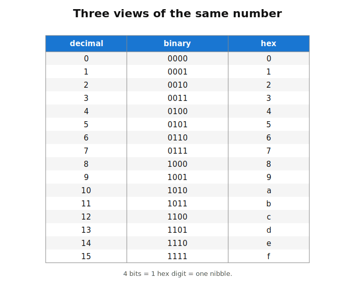
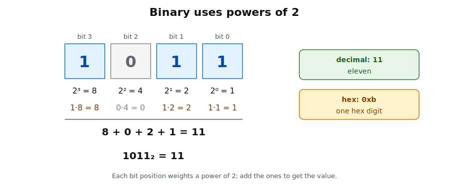
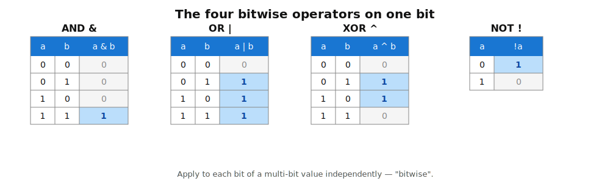
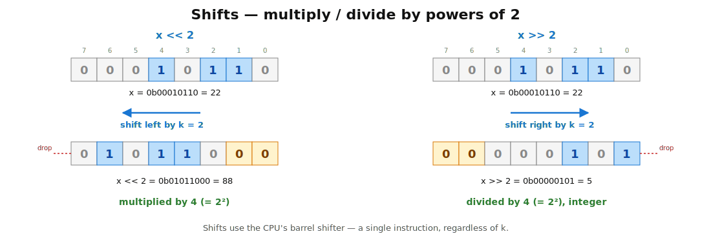
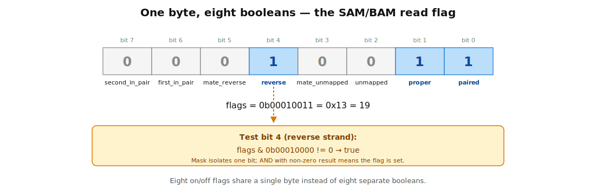

## What this lecture is

- Today we step under the floats and ints and look at what the machine actually stores: **bits** [single binary digits, 0 or 1]
- We learn three ways to *write* the same number — **decimal**, **binary**, **hex** [hexadecimal, base 16]
- We learn the handful of **bitwise operations** that act on individual bits: AND, OR, XOR, NOT, shifts, **popcount** [count of 1-bits in an integer]
- Tomorrow's lec2 spends these tools on DNA: 2-bit encoding, k-mers, single-cell barcodes

::: notes
Day 13 is a two-lecture arc. Today is pure "how do numbers work in a computer" — no biology. You will see binary, hex, the bitwise operators, and popcount. Lec2 takes the same operators and applies them to DNA: encode A/C/G/T in two bits, pack 32 bases into a u64, compute Hamming distance with one XOR and one popcount. By the end of the exercises today you will have written your own barcode whitelist matcher, which is the foundation of every single-cell pipeline.
:::

## Three bases for one number

The number "thirteen" can be written three ways. The number does not change; the *display* does.

- **Decimal** (base 10) — `13`        — digits 0..9
- **Binary**  (base 2)  — `1101`      — digits 0..1
- **Hex**     (base 16) — `0xd`       — digits 0..9, a..f

The machine always stores binary. Humans read decimal. Programmers reach for hex when they need to *see* the bits clearly without writing 64 zeros and ones in a row.

{fig-alt="A three-column table from 0 to 15. Left column shows decimal digits 0 through 15. Middle column shows the 4-bit binary representation 0000 through 1111. Right column shows the single hex digit 0 through f, with a-f shown in lowercase." width="60%"}

::: notes
Three bases, one number. The display is a notational convenience for humans; the bits underneath are always the same. The reason we will keep switching back and forth in this lecture is that each base makes a different property easy to see. Decimal is good for "how big is this number". Binary lets you see individual bits. Hex compresses binary by a factor of four and aligns naturally with bytes.
:::

## Binary — positional notation

The rules are identical to decimal: each digit is multiplied by a power of the base, and the powers grow from right to left. In binary the base is 2, so the place-values are `..., 8, 4, 2, 1`.

```text
   1   0   1   1₂
 · 8 · 4 · 2 · 1
   8 + 0 + 2 + 1   =   11₁₀
```

So `1011₂ = 11₁₀`. No new ideas — the only difference from decimal arithmetic is which multipliers you write under the digits.

{fig-alt="A horizontal layout of the four binary digits 1, 0, 1, 1 with the weights 8, 4, 2, 1 written below them. Arrows or lines join each digit to its weight; a sum below shows 8 + 0 + 2 + 1 = 11." width="70%"}

::: notes
This is the one slide your audience needs to internalise. Once you see binary as "the same positional notation, with powers of 2 instead of powers of 10", every other thing in this lecture follows. The convention that the *least* significant bit is written on the *right* matches decimal — the rightmost digit is the ones place in both systems.
:::

## Hex — a compact view of binary

**Every hex digit packs exactly four binary digits.** That is the whole rule.

```text
binary:   1111_1111
hex:      f    f       →  0xff  =  255₁₀
```

So `0xff` is one byte. `0xffff` is two bytes. `0xffff_ffff` is a 32-bit `u32` with every bit set. Reading hex is faster than reading 32 ones — and unlike decimal, you can convert hex to binary in your head one digit at a time.

The Rust convention is `0x` prefix for hex, `0b` prefix for binary, no prefix for decimal: `0xff == 0b1111_1111 == 255`.

::: notes
Hex is the programmer's compromise. It is compact like decimal but it aligns cleanly with bits — one hex digit equals four bits, two hex digits equal one byte. When you see a memory address like 0x7ffe_a830, you can read off how the bits are arranged without doing any arithmetic. Decimal would obscure that. Binary would take three lines per address.
:::

## Why three bases at all

Different jobs, different bases:

- **Binary** — what the *machine* runs on; you read it when you care about individual bits (flags, masks, packed DNA).
- **Decimal** — what *humans* think in; you read it when you care about magnitude.
- **Hex** — what *programmers* read when looking at raw memory, addresses, byte patterns; the compromise.

Rust supports all three as literals: `0b1010_1010`, `170`, `0xaa` are the same number. The `_` is ignored — it's just visual grouping.

::: notes
The takeaway from this slide is simply that "the same number can be written three ways, pick the one that makes the property you care about obvious". When debugging a packed-DNA bug you reach for binary or hex; when reporting a sequence length you reach for decimal. Switching base is free in Rust — it is only the printf-style formatting that changes.
:::

## Converting decimal → binary

**Algorithm**: divide by 2 repeatedly; write down each remainder; read them bottom-up.

```text
13 / 2 = 6 remainder 1   ← least significant bit (written rightmost)
 6 / 2 = 3 remainder 0
 3 / 2 = 1 remainder 1
 1 / 2 = 0 remainder 1   ← most significant bit  (written leftmost)

13₁₀ = 1101₂
```

This is the same algorithm you'd use to convert any number to any base; for base 2 the "divide" step is especially easy because you only need to ask "odd or even?".

::: notes
You will never actually do this by hand once you are writing Rust — format!("{:b}", x) prints binary for free. But understanding *why* it works pins down the positional-notation idea. Each division-by-2 strips off the least-significant bit; what remains is the same number shifted right by one position. The remainders, read bottom-up, are the bits from most-significant to least-significant.
:::

## Converting binary → decimal

Sum the place-values where the bit is 1.

```text
1101₂  =  1·8 + 1·4 + 0·2 + 1·1
       =  8 + 4 + 0 + 1
       =  13₁₀
```

For up to 8 or 16 bits this is fast enough to do mentally; for longer values let the computer do it: `let n = 0b1101_u32;` already *is* the number 13.

::: notes
Direction matters: from the right, the weights are 1, 2, 4, 8, 16, 32, .... When you see 1101, the leftmost 1 is the 8 because the number has four bits. If it had been 01101 — five bits — the leftmost 1 would still be the 8, because the new high bit is 0. The position relative to the right end is what counts.
:::

## Converting binary ↔ hex

**Group in fours from the right.** Each group is one hex digit.

```text
1101_0011₂  →  1101 | 0011  →  d  3   →  0xd3
```

And the inverse: replace each hex digit with its 4-bit pattern using the 0..15 table.

```text
0x4a  →  4    a    →  0100  1010   →  0100_1010₂
```

This is why hex sticks around: it is the only base where you can convert to and from binary in your head with no arithmetic.

::: notes
This is the most useful conversion to commit to muscle memory. Memorise the 16-row table (decimal 0..15, binary 0000..1111, hex 0..f) once and you will read packed binary fluently for the rest of your career. The grouping is always from the *right* because that is the side where positional notation begins.
:::

## In Rust — literals and formatting

```rust
let a = 0b1101;        // binary literal:  13
let b = 0xd3;          // hex literal:     211
let c = 13;            // decimal literal: 13
assert_eq!(a, c);      // same number

println!("{:08b}",  b);   // "11010011"   width 8, zero-padded, binary
println!("{:#06x}", b);   // "0x00d3"     width 6, zero-padded, with 0x
println!("{}",      b);   // "211"        default decimal
```

The underscore in `0b1101_0011` or `1_000_000` is purely for human readability — Rust ignores it.

See the [`format!` syntax reference](https://doc.rust-lang.org/std/fmt/) and the [`u64` primitive docs](https://doc.rust-lang.org/std/primitive.u64.html).

::: notes
Three literal prefixes, three formatting specifiers. The {:08b} variant is the one you will use most often when debugging bit-twiddling code — it always prints exactly 8 binary digits, zero-padded, so successive prints line up visually. {:#06x} is the equivalent for hex, with the # adding the "0x" prefix. The default {} is decimal and is what you reach for in user-facing output.
:::

## The bitwise operators — one bit at a time

The four primitives. Each acts on a single bit position; on wide integers the same rule applies independently to all 64 (or 32, or 8) positions.

| op  | Rust | one-bit rule |
|---|---|---|
| AND | `a & b` | 1 if **both** inputs are 1 |
| OR  | `a \| b` | 1 if **either** input is 1 |
| XOR | `a ^ b` | 1 if inputs **differ** |
| NOT | `!a`    | flip every bit (**bitwise complement** [each 0 becomes 1, each 1 becomes 0]) |

{fig-alt="Four small truth tables side by side. Three tables for AND, OR, XOR each have columns a, b, result with the four rows 0/0, 0/1, 1/0, 1/1. A fourth one-column NOT table shows 0 mapping to 1 and 1 mapping to 0." width="80%"}

::: notes
These four operators are the entire bitwise vocabulary. AND, OR, and XOR each take two inputs and produce a result by looking at one bit position at a time. NOT takes a single input and flips every bit. The "one-bit rule" idea is important — there is no carry, no propagation across positions, unlike addition. Every bit-position is handled independently and in parallel by the CPU.
:::

## On whole integers, position by position

```rust
let a: u8 = 0b1100;
let b: u8 = 0b1010;

assert_eq!(a & b,  0b1000);   // AND: only the leftmost bit is on in both
assert_eq!(a | b,  0b1110);   // OR : bits set in either input
assert_eq!(a ^ b,  0b0110);   // XOR: bits that differ
assert_eq!(!a,     0b1111_0011); // NOT: flip all 8 bits of the u8
```

Two facts about XOR that we will use over and over: `x ^ x == 0` and `x ^ 0 == x`. Combined, this makes XOR the "differ-mask" operator — `a ^ b` has a 1-bit exactly where `a` and `b` differ.

::: notes
Walk through the AND example: a is 1100, b is 1010, so the only column where both are 1 is the leftmost — result 1000. OR sets the bit anywhere either input has it — 1110. XOR sets the bit where they differ — left columns 1-1 same, then 1-0 differs, then 0-1 differs, then 0-0 same — result 0110. NOT flips every bit of the u8, including the unused high bits, so !0b1100 is 0b1111_0011, not just 0b0011.
:::

## Shifts — multiply and divide by 2

`x << k` shifts every bit `k` places to the **left** (zeros come in from the right). This multiplies by `2^k`. `x >> k` shifts to the right; for unsigned types this divides by `2^k`, rounding down.

```rust
let x: u8 = 0b0000_1011;          // 11
assert_eq!(x << 2, 0b0010_1100);  // 44  (= 11 · 4)
assert_eq!(x >> 1, 0b0000_0101);  //  5  (= 11 / 2 rounded down)
```

{fig-alt="Three rows of eight bit-boxes. Top row is the original value 0000_1011. Middle row is the same value shifted left by two, with arrows showing each bit moved two places left and two zero boxes appearing on the right. Bottom row is the value shifted right by one, with arrows showing each bit moved one place right and one zero box appearing on the left." width="80%"}

For signed types `>>` is an **arithmetic shift right** [the sign bit is copied into the new high bits, preserving the sign]; for unsigned it is a **logical shift right** [zeros come in from the top]. Bit-twiddling DNA code always uses unsigned integers (`u8`, `u32`, `u64`), so we never hit the signed case.

::: notes
Shifts are the cheap-multiply, cheap-divide of integer code. They are also how you move data around inside a packed representation — when we pack 32 bases into a u64 next lecture, the way to put base i into the right slot is to shift its 2-bit code left by 2·i positions and OR it into an accumulator. Remember: shifting is the cheapest non-trivial CPU operation, almost always a single cycle.
:::

## Bits as flags — one byte, eight booleans

A single byte holds 8 yes/no answers. The classic bioinformatics example is the SAM/BAM **`FLAG`** field, which packs about a dozen properties of a sequenced read into one 16-bit integer.

| bit | meaning |
|---:|---|
| 0 | read is paired |
| 1 | read is mapped in proper pair |
| 2 | read is unmapped |
| 4 | read is reverse-complement |
| 8 | this is the first in the pair |
| ... | ... |

```rust
let flags: u16 = 0b0000_0001_0011;            // bits 0, 1, 4 set
let is_reverse = flags & 0b0001_0000 != 0;    // true
```

{fig-alt="A horizontal strip of eight cells representing an 8-bit byte, numbered from bit 7 on the left to bit 0 on the right. Each cell carries a label naming a SAM/BAM flag such as paired, mapped-pair, unmapped, mate-unmapped, reverse, mate-reverse, first-in-pair, second-in-pair." width="85%"}

::: notes
This is the most common practical use of bitwise operators that you will encounter outside hot algorithmic loops. Any time a file format packs multiple yes/no fields into one integer, you reach for the `& MASK != 0` idiom to test a single flag. SAM/BAM is the canonical bioinformatics example; the same trick shows up in network protocols, file permissions, image-format headers, and on and on.
:::

## Combining: testing, setting, clearing one bit

Three idioms — each is one line. `MASK` is a value with a single bit set, e.g. `0b0001_0000`.

```rust
// Test:  is the masked bit on?
let on = (flags & MASK) != 0;

// Set:   force the masked bit to 1, leave others alone
let flags2 = flags | MASK;

// Clear: force the masked bit to 0, leave others alone
let flags3 = flags & !MASK;     // !MASK has all bits set EXCEPT the one we want off
```

OR sets, AND-with-complement clears, AND tests. Three operators, three jobs.

::: notes
These three lines together cover essentially every flag manipulation in low-level code. The cleverest of the three is "clear" — !MASK is a value with every bit set except the one you want to clear, so AND-ing it leaves every other bit untouched and zeros the one bit you care about. Once you internalise these three patterns you can read any flags-y bioinformatics file format spec without slowing down.
:::

## Popcount — count the 1-bits

The **population count** (or **popcount** [number of 1-bits in an integer]) is the headline operation of bit-twiddling. Rust exposes it on every integer type:

```rust
let x: u64 = 0b1101_0110_1010_0011;
let n = x.count_ones();          // 9
```

On every x86 CPU since 2008 this compiles to a **single** `popcnt` instruction — roughly one clock cycle, independent of how many bits are set. ARM, RISC-V, and POWER have equivalents.

→ [`u64::count_ones`](https://doc.rust-lang.org/std/primitive.u64.html#method.count_ones)

::: notes
Popcount is the operation that turns bit-twiddling from a curiosity into an industrial-strength tool. Because it is one cycle in hardware, you can ask "how many bits are set in this 64-bit value" essentially for free. Combine it with XOR — which tells you which bits two values differ at — and you can ask "how many bits differ between these two 64-bit values" in two cycles. That is exactly Hamming distance, and exactly the kernel under every fast aligner.
:::

## Why bioinformatics cares

DNA has 4 letters: `A C G T`. Two bits encode four values: `00 01 10 11`. So:

- One base fits in **2 bits**.
- A 64-bit integer holds **32 bases** — one short k-mer or seed.
- **Hamming distance** between two 32-base sequences is one XOR, one fold-by-OR, one mask, and one `count_ones` — **four CPU instructions** regardless of length.

Every fast aligner (BWA, minimap2), every k-mer counter (jellyfish, KMC), every minimizer hash, every single-cell barcode matcher is built on this idea. Lec2 spells out the encoding and the math.

::: notes
This is the punchline that motivates the whole day. The fact that DNA has exactly four letters is a happy accident from the point of view of computer architecture — four letters fit perfectly in two bits, which means we can pack short sequences into ordinary integer registers and do whole-sequence operations as a single arithmetic instruction. Without this trick, modern short-read alignment would be at least an order of magnitude slower. Lec2 takes the abstract operators of today and applies them to DNA in detail.
:::

## Recap

Three things to remember:

1. **One number, three displays.** Decimal for magnitude, binary for individual bits, hex for compact reading. `0b1101_0011 == 0xd3 == 211`.
2. **Bitwise operators act position-by-position.** AND, OR, XOR, NOT, shift left, shift right. XOR is special: `a ^ b` has a 1 exactly where `a` and `b` differ.
3. **`u64::count_ones()` is one CPU instruction** — the foundation of every two-instruction Hamming-distance kernel you will write tomorrow.

::: notes
Three takeaways. First, fluency with the three bases — you should be able to read 0xff as 1111_1111 as 255 without thinking. Second, the bitwise operators are a tiny vocabulary that combines into a huge amount of useful behaviour, because each operator acts on every bit-position independently and in parallel. Third, popcount is the secret weapon that makes bit-twiddling fast enough to dominate hot inner loops in bioinformatics tools.
:::

## To lec2 and the exercises

- **Next lecture** — [`lec2-dna-2bit-and-barcodes.qmd`](lec2-dna-2bit-and-barcodes.qmd) — apply today's tools to DNA: 2-bit encoding, packed k-mers, Hamming distance with XOR and popcount, single-cell barcode whitelist matching.
- **Exercise 1** — [`01-numbers-and-bits.qmd`](01-numbers-and-bits.qmd) — write your own conversion and bitwise-op functions in Rust; verify against `format!` and built-in operators.

Subsequent exercises (2-5) build the DNA-side machinery on top of today's primitives.

::: notes
Lec2 follows directly from today. The four operators and the popcount trick we just met will be applied verbatim to DNA — the difference is purely interpretation. Bit pair 00 instead of "bit pair 00" now means the base A. Exercise 1 is the gentle warm-up where you confirm the lecture's claims by writing tiny functions; exercises 2 through 5 then build the packed-DNA pipeline, ending with a real barcode whitelist matcher of the kind that runs at the front of every single-cell pipeline.
:::
