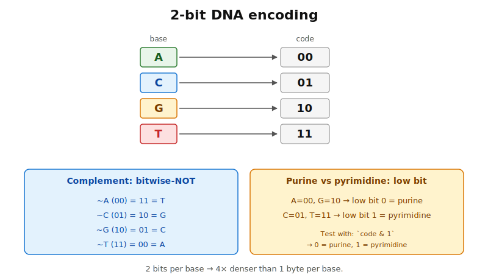
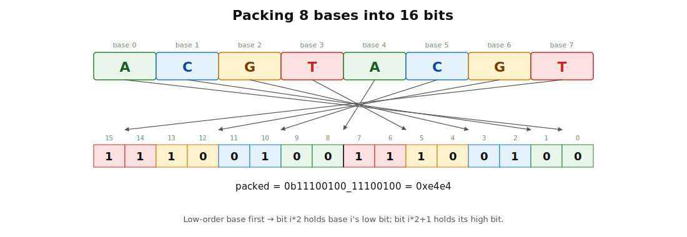
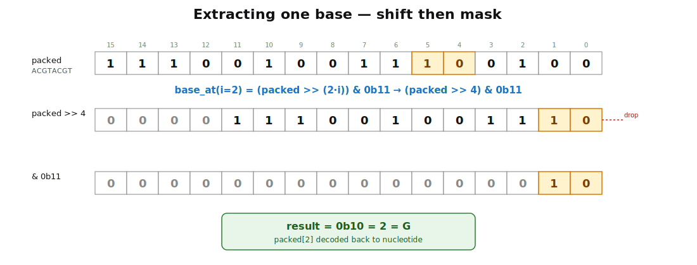
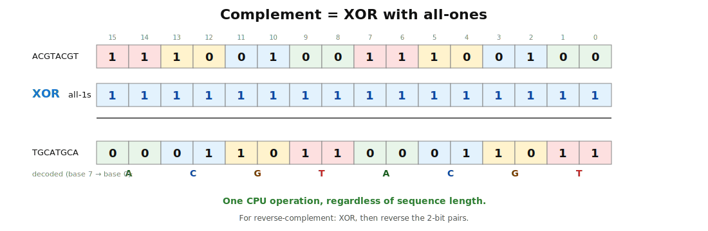
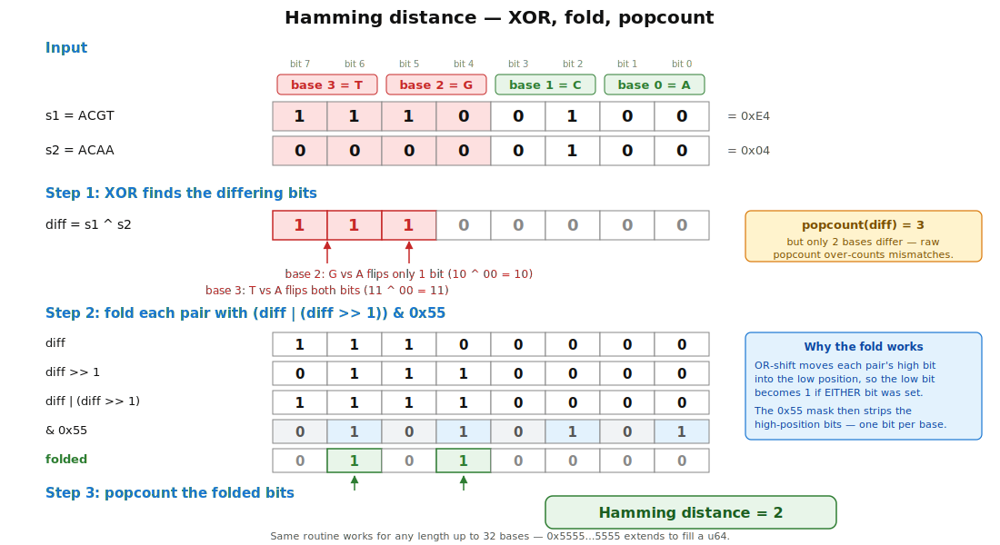
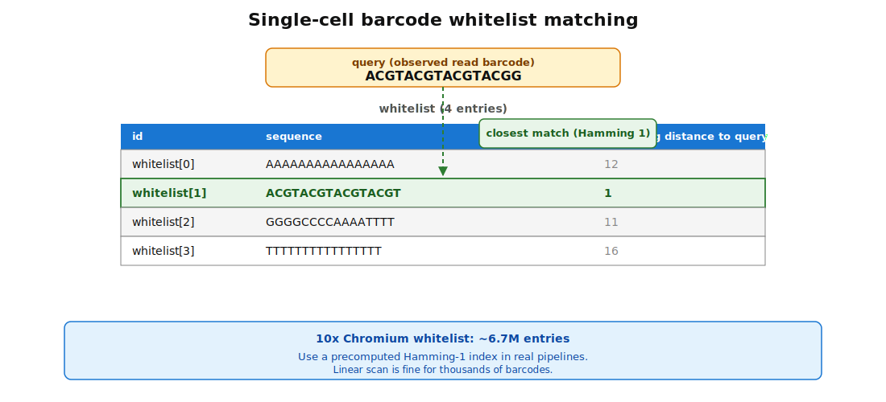

## What this lecture is

- Lecture 1 gave you the **bitwise toolkit** [the primitive integer operations: AND, OR, XOR, NOT, shifts, `count_ones`] — now we use it on real data
- Goal: store DNA **compactly** and **compute on it fast** using nothing but integers
- We land on a working solution to a real industrial problem — **single-cell barcode whitelist matching** [identifying which "valid" cell barcode an observed read belongs to]

::: notes
Lecture 1 was abstract — bits, hex, shifts, popcount as standalone tricks. This lecture spends the whole hour applying those primitives to one concrete bioinformatics workload: representing DNA as packed integers, and using bitwise operations as the inner loop of sequence comparison. By the end of the hour we have a real algorithm for an industrial problem. Everything we do today is one or two integer operations per base.
:::

## DNA has 4 letters — fits in 2 bits

DNA is a 4-letter alphabet: **A, C, G, T**. Four symbols means **2 bits per base** ($2^2 = 4$).

| Storage | Bits | Bases held |
|---|---|---|
| `u8`   | 8   | 4   |
| `u16`  | 16  | 8   |
| `u32`  | 32  | 16  |
| `u64`  | 64  | 32  |
| `u128` | 128 | 64  |

A naive `String` uses **8 bits per base** (one byte per ASCII character). The packed form is **4× smaller**, and as a bonus we can do whole-sequence arithmetic on it in one CPU instruction.

::: notes
This is the entire premise. Most bioinformatics tools — alignment, k-mer counting, indexing — start by packing DNA into 2 bits per base. The motivation is two-fold: memory (a human genome of 3 Gbp goes from 3 GB as a String to 750 MB packed), and speed (bulk operations become bitwise integer operations that the CPU can do in one cycle).
:::

## The 2-bit code

The standard mapping used by samtools, bwa, jellyfish, and most modern tools:

| Base | Bits |
|---|---|
| A | `00` |
| C | `01` |
| G | `10` |
| T | `11` |

{fig-alt="A 2-column table mapping A to 00, C to 01, G to 10, T to 11. To the right, a column groups A and C together (high bit 0, pyrimidines [single-ring bases]) and G and T together (high bit 1, purines [double-ring bases]). An arrow shows that flipping all bits maps A↔T and C↔G — the Watson-Crick complement." width="80%"}

Two nice properties fall out for free:

- **Complement = bitwise NOT.** `!00 = 11` (A → T) and `!01 = 10` (C → G).
- **High bit distinguishes purines from pyrimidines** [purines = A, G (two-ring); pyrimidines = C, T (one-ring); the second-most-common DNA classification].

::: notes
The specific assignment matters. Many alternative orderings would work, but the canonical A=00, C=01, G=10, T=11 ordering is universal because it makes the Watson-Crick complement trivial: a single bitwise NOT flips every base to its pair. Other orderings would force a lookup table for complementation. This is a small example of a recurring theme — pick your encoding so that the operations you care about become cheap.
:::

## Packing a sequence

Eight bases `ACGTACGT` → 16 bits → 2 bytes.

{fig-alt="Top: the string A C G T A C G T with each letter above its 2-bit code 00 01 10 11 00 01 10 11. Middle: the codes concatenated into a 16-bit binary number. Bottom: the same value displayed as two hexadecimal bytes." width="85%"}

```rust
fn encode(b: u8) -> u64 {
    match b { b'A' => 0, b'C' => 1, b'G' => 2, b'T' => 3, _ => panic!() }
}

let seq = b"ACGTACGT";
let mut packed: u64 = 0;
for (i, &b) in seq.iter().enumerate() {
    packed |= encode(b) << (2 * i);     // place base i at bits 2i..2i+2
}
// packed == 0b1101_1000_1101_1000  (little-base-first layout)
```

::: notes
The packing loop is the prototype for nearly every operation we will do. For each base we encode it as a 2-bit number, shift it to its position, and OR it into the accumulator. We chose little-base-first (base 0 in the lowest bits) — it makes the math simpler. The opposite convention (big-base-first) is also valid, and you will see both in the wild. Pick one and stick with it.
:::

## A `u64` holds 32 bases

The most useful packed sizes:

| Container | Bases | Common name |
|---|---|---|
| `u32`  | 16 | a 16-mer, a typical cell barcode |
| `u64`  | 32 | a 32-mer, a typical k-mer in assembly |
| `u128` | 64 | a 64-mer, the BWA seed length |

For sequences **longer** than 64 bases, use `Vec<u64>` with `(n + 31) / 32` words — each word holds 32 bases, the final word is partially filled.

::: notes
The 32-mer fitting in a u64 is the single most important coincidence in modern bioinformatics. It means k-mer counting, k-mer hashing, minimizer extraction, and BWT alignment all run on single integer registers. The whole genome assembly pipeline of tools like SPAdes, minimap2, and bwa lives in this regime. For longer reads you switch to Vec<u64> and operate one word at a time, but the inner loop is the same.
:::

## Extracting one base by index

Base `i` lives at bits `2*i` and `2*i + 1`:

```rust
fn base_at(packed: u64, i: usize) -> u8 {
    ((packed >> (2 * i)) & 0b11) as u8       // 0=A, 1=C, 2=G, 3=T
}
```

{fig-alt="A 16-bit binary number with bits grouped into 8 pairs of 2. Bits 6 and 7 (counting from the right) — the pair for base 3 — are highlighted. An arrow labelled 'packed >> 6' moves those bits down to the low end. A second arrow labelled '& 0b11' masks all other bits to zero, leaving just the 2-bit base code." width="85%"}

Two CPU instructions: one shift, one AND. **Constant time regardless of where `i` lies in the sequence.**

::: notes
Random access into a packed sequence is O(1). This matters: it means a packed sequence behaves like an array even though the elements are sub-byte-sized. The shift positions the wanted base at the low end; the mask discards every other base. No branches, no lookups. Compare with the unpacked alternative where you would just index into a [u8] — same complexity, but four times less memory.
:::

## Setting one base by index

To overwrite a base, **clear** its two bits, then **OR** the new value in:

```rust
fn set_base(packed: u64, i: usize, base: u8) -> u64 {
    let shift = 2 * i;
    let cleared = packed & !(0b11 << shift);          // zero the two bits
    cleared | ((base as u64) << shift)                // OR new base in
}
```

The clear step is essential — if we skipped it, the new bits would be ORed with the old, giving garbage.

::: notes
Two steps because OR alone cannot clear a bit. The pattern `x & !mask` clears every bit set in mask, leaving the others alone; then OR drops the new value in. This is the standard read-modify-write pattern for sub-word fields, used everywhere from packed DNA to network packet headers to hardware registers.
:::

## Complement — one XOR for the whole sequence

To flip every base to its Watson-Crick complement:

```rust
let complemented = packed ^ 0xFFFF_FFFF_FFFF_FFFF;    // flip all 64 bits
// or equivalently:
let complemented = !packed;
```

Each 2-bit base flips: `00`↔`11` (A↔T), `01`↔`10` (C↔G). XOR with all-1s is bitwise NOT.

{fig-alt="Top: original packed 16-bit value with the 8 base pairs labelled A C G T A C G T. Middle: an all-1s mask 0xFFFF below it with an XOR symbol. Bottom: the resulting packed value with bases T G C A T G C A — each original base flipped to its Watson-Crick partner." width="85%"}

**One CPU operation regardless of sequence length.** A 32-mer complements in one cycle; a 64-mer in two.

::: notes
Compare with the String-based version: a loop, a match per base, 32 conditional branches for a 32-mer. The packed version is one instruction. For a single sequence the difference is microscopic — but in a typical assembly or alignment workflow you complement billions of sequences, and the constant factor becomes the difference between a one-minute job and a one-hour job.
:::

## Reverse complement — reverse + complement

Reversing 2-bit packed data is **not** bit-by-bit reversal — that would scramble each base. It is a **pair-wise** reversal: swap whole 2-bit pairs end-to-end.

```rust
fn reverse_complement_32mer(packed: u64) -> u64 {
    let reversed = reverse_pairs_u64(packed);          // swap base 0 with 31, 1 with 30, ...
    !reversed                                          // complement every base
}
```

In practice we build `reverse_pairs_u64` from `u64::swap_bytes` (reverses byte order — same as reversing 4-base chunks) plus a small **in-byte pair swap** [shuffle the 4 bases within each byte from order 0-1-2-3 to 3-2-1-0] using a couple of masks and shifts.

You will implement this in **Exercise 4**.

::: notes
Reverse complement is the operation a lot of bioinformatics code does most often — every alignment tool runs it on every read. The naive String version is O(n) with a loop and a per-base swap. The packed version is O(1) for 32-mers: swap_bytes is one CPU instruction, the in-byte pair swap is a constant handful of shifts and ANDs, and the final complement is one XOR. For longer reads you do this per 64-bit word and then reverse the word order — still very fast.
:::

## Hamming distance — XOR then popcount {.smaller}

For two unpacked strings, **Hamming distance** [the number of positions at which two equal-length sequences differ] is a loop with a counter. For two packed sequences, **XOR finds the differing positions** and **popcount totals them** — almost.

The catch with the `A=00, C=01, G=10, T=11` code: a mismatched base flips **either 1 or 2 bits**, depending on which two bases were swapped. So we cannot just popcount the XOR — we have to first **fold each 2-bit pair to a single "differs/same" bit**.

```rust
fn hamming_packed(a: u64, b: u64) -> u32 {
    let diff = a ^ b;                                  // bits differ where bases differ
    let folded = (diff | (diff >> 1)) & 0x5555_5555_5555_5555;  // 1 bit per base
    folded.count_ones()                                // popcount the folded bits
}
```

{fig-alt="Top: two packed 8-base sequences shown as binary stacked on top of each other, with arrows pointing to positions where the bases differ. Middle: the XOR of the two values. Bottom: the SWAR-fold result and the final popcount giving the base-level Hamming distance." width="85%"}

`0x5555_5555_5555_5555` is the alternating mask `…0101_0101` — one bit per base position. The whole function is **four operations regardless of sequence length** (up to 32 bases).

::: notes
This is the "XOR-popcount" trick at the heart of every fast aligner, every k-mer matcher, every barcode-correcting demultiplexer. The naive form `(a ^ b).count_ones() / 2` is tempting and **wrong** — try it on the pair `(A, C)` and you get 0 differences instead of 1. The fold-then-popcount form is the standard fix; exercise 3 walks the student through discovering the bug and earning the correction.
:::

## Why this is fast

| Operation | Naive (loop over `&[u8]`) | Packed |
|---|---|---|
| Compare 32 bases | 32 compares + 32 branches + counter | XOR, OR, mask, popcount (4 ops) |
| Complement | 32 branches + 32 writes | one XOR |
| Reverse-complement | 64 ops + memory writes | a handful of shifts/ANDs |
| Memory | 32 bytes (a 32-mer String) | 8 bytes (a `u64`) |

Modern x86 CPUs execute [`popcnt`](https://doc.rust-lang.org/std/primitive.u64.html#method.count_ones) in **one cycle**.

- For a single 32-mer Hamming: roughly **30× speedup**.
- For billions of comparisons (one read alignment workload): the difference between **minutes and weeks**.

::: notes
The constant factor between the two columns is the whole reason 2-bit packing exists. Memory savings alone would justify it; the compute speedup is the bonus. The deep reason it works is that the CPU was already going to handle a 64-bit word as a single unit — by squeezing 32 bases into one word, we get 32-way parallelism essentially for free on every integer operation.
:::

## Real-world example — single-cell barcodes

Modern single-cell RNA-seq (10x Genomics Chromium, Drop-seq) works by **droplet partitioning** [each cell is captured in its own oil droplet alongside a barcoded bead]:

- Each droplet contains one cell and one **bead** [a microscopic resin sphere coated in millions of identical capture oligos]
- Every capture oligo on the bead carries the same **cell barcode** [a random 16-bp DNA tag that uniquely identifies the bead, and hence the cell]
- All mRNAs from one cell pick up the same barcode → reads from the same cell can be pooled later

A single run produces **hundreds of millions of reads**, each labelled with a 16-bp barcode.

::: notes
Quick orientation for anyone who has not seen single-cell data. The droplet trick is a wet-lab way to attach a per-cell label to every transcript without needing physically separated wells. The barcode is the tool that makes this work — it is the cell's name tag. The downstream bioinformatics question is always: which cell did this read come from? Answering that requires recognising the barcode in the read.
:::

## The whitelist problem

10x Genomics ships a **whitelist** [the list of oligonucleotides actually synthesised onto the beads] of ~6.7 million valid 16-bp barcodes. The rest of $4^{16} \approx 4.3$ billion possible 16-mers were not synthesised.

For every read, we observe a barcode and ask: **which whitelist entry does this correspond to?**

- **Exact match** — easy, look it up.
- **One sequencing error** — match to the closest whitelist entry at Hamming distance 1.
- **Two or more errors** — discard the read.

{fig-alt="Top: an observed 16-bp barcode from a sequencing read shown in blue. Middle: a column labelled 'Whitelist (~6.7M entries)' with a few example 16-bp sequences. Bottom: arrows from the query barcode connecting to a matching whitelist entry, with the differing position highlighted in red and a Hamming distance of 1 annotated." width="80%"}

::: notes
This is the workhorse step at the start of every single-cell pipeline. Cell Ranger, alevin, STARsolo, kallisto-bustools all do this. Get it wrong and reads end up attributed to the wrong cell, polluting the entire downstream analysis. The constraint is that it has to run at the speed of the sequencer — hundreds of millions of reads per run, processed in minutes. Bitwise tricks are what make that throughput possible.
:::

## 16-bp barcode → 32 bits → one `u32`

| Quantity | Value |
|---|---|
| Barcode length | 16 bases |
| Bits per base | 2 |
| Total bits | 32 |
| Container | `u32` |
| Whitelist as set | `HashSet<u32>` |
| Exact lookup | **O(1)** |

```rust
use std::collections::HashSet;

let whitelist: HashSet<u32> = read_whitelist("10x_barcodes.txt");  // 6.7M entries
let query: u32 = pack_16mer(observed_barcode);
if whitelist.contains(&query) {
    // exact hit, done
}
```

**6.7M `u32` entries = 27 MB of RAM** — easily fits.

::: notes
The whole whitelist is 27 MB. A HashSet adds maybe a 3-4x overhead for the hash table, so call it 100 MB. That's nothing on a modern server; you load it once and reuse it across millions of lookups. The 32-bit barcode key is what makes this tractable — a String-keyed HashSet would be many times larger and much slower to hash.
:::

## Hamming-1 lookup with bit tricks {.smaller}

When the exact lookup misses, generate all **48 possible 1-base substitutions** of the query and test each:

```rust
fn hamming1_neighbors(query: u32) -> impl Iterator<Item = u32> {
    (0..16).flat_map(move |i| {
        let original = (query >> (2 * i)) & 0b11;
        (0..4u32).filter(move |&b| b != original).map(move |b| {
            let cleared = query & !(0b11 << (2 * i));
            cleared | (b << (2 * i))
        })
    })
}
// For each of 16 positions, 3 alternative bases = 48 neighbors.
```

For each of the 48 candidates, one [`HashSet::contains`](https://doc.rust-lang.org/std/collections/struct.HashSet.html#method.contains) call. If exactly one hits the whitelist, that is the corrected barcode. **Total: 48 hash lookups per read → microseconds.**

This is **one** way to do Hamming-1 lookup — not necessarily the fastest. Production tools also use precomputed neighbour hash tables, locality-sensitive hashing, SIMD-vectorised distance scans, or trie / BK-tree indices. The 48-neighbour enumeration above wins on simplicity and is fast enough at single-cell-pipeline scale; profile before optimising further.

::: notes
This is the standard correction step. Generate all single-substitution neighbors (only 48 for a 16-bp barcode), check each against the whitelist, accept if exactly one matches. If zero match, the read has too many errors; if more than one matches, the correction is ambiguous and we discard to avoid mis-assigning the cell. The whole thing runs in a few microseconds per read — fast enough to keep up with the sequencer. There are faster approaches (precomputed neighbour tables, BK-trees, SIMD scans) but they cost code complexity that this simple version doesn't.
:::

## Other places this trick appears

The same 2-bit + popcount toolkit underpins:

- **k-mer counting** — [Jellyfish](https://github.com/gmarcais/Jellyfish), [KMC](https://github.com/refresh-bio/KMC)
- **Minimizer-based hashing** — [minimap2](https://github.com/lh3/minimap2)
- **Burrows-Wheeler / FM-index** — [BWA](https://github.com/lh3/bwa), [bowtie2](https://github.com/BenLangmead/bowtie2)
- **Suffix-array construction** — [libdivsufsort](https://github.com/y-256/libdivsufsort)
- **Bloom filters** — `count_ones` is at the heart of cardinality estimators like [HyperLogLog](https://en.wikipedia.org/wiki/HyperLogLog)
- **GPU pairwise-distance kernels** — XOR + popcount is one of the fastest CUDA ops (Day 12)

If you read a modern bioinformatics paper that mentions speed, **2-bit DNA + bitwise operations is almost always part of the answer**.

::: notes
Worth knowing what cluster of techniques the 2-bit encoding belongs to. It is one of the foundational ideas of modern sequence-analysis software. Every fast aligner, every fast k-mer counter, every fast read corrector relies on packed encodings and bitwise inner loops. Once you see the pattern in one tool you start spotting it in all of them.
:::

## Recap

- DNA's 4-letter alphabet packs into **2 bits per base** — a `u64` is a 32-mer
- The canonical `A=00, C=01, G=10, T=11` encoding makes **complement = bitwise NOT** for free
- **Hamming distance = XOR + popcount**, ~30× faster than the naive loop
- The same bits power **exact and approximate barcode lookup** at hundreds-of-millions-of-reads scale

::: notes
Three takeaways. First, packed encoding gives you 4x memory savings and 30x compute speedup for free — just match your encoding to the problem. Second, the specific encoding matters: the canonical 2-bit order makes complement trivial. Third, the same primitives — XOR, popcount, hash-set membership — solve a real industrial problem (single-cell barcode demultiplexing) at the speed it needs to run.
:::

## To the exercises

Five exercises, in order:

- **[Exercise 1 — Numbers and bits](01-numbers-and-bits.qmd)** — warm-up: conversions, bitwise ops, popcount
- **[Exercise 2 — Pack DNA in 2 bits](02-pack-dna-2bit.qmd)** — encode/decode a sequence to/from a `u64`
- **[Exercise 3 — Hamming via popcount](03-hamming-popcount.qmd)** — implement and benchmark against the naive loop
- **[Exercise 4 — Reverse complement on packed DNA](04-revcomp-2bit.qmd)** — `swap_bytes` + pair swap + XOR
- **[Exercise 5 — Barcode whitelist matching](05-barcode-whitelist.qmd)** — exact + Hamming-1 lookup at scale

::: notes
Work through them in order. Exercise 1 drills the primitives from lecture 1. Exercise 2 packs DNA. Exercise 3 implements Hamming and shows you the speedup. Exercise 4 does reverse complement, the operation every aligner runs millions of times. Exercise 5 puts it all together with the real single-cell barcode problem. By the end you will have written, from scratch, the inner loop of a single-cell barcode demultiplexer.
:::
