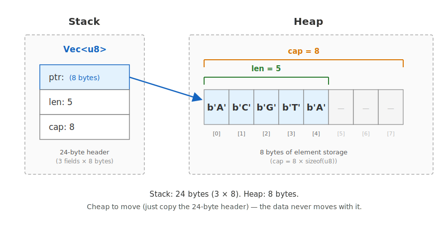
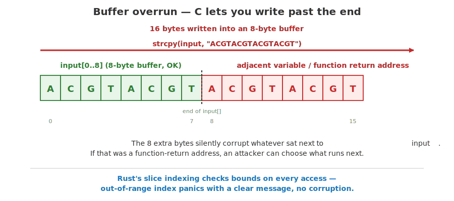
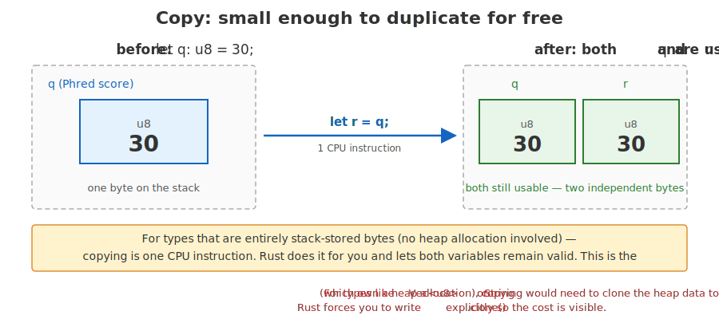
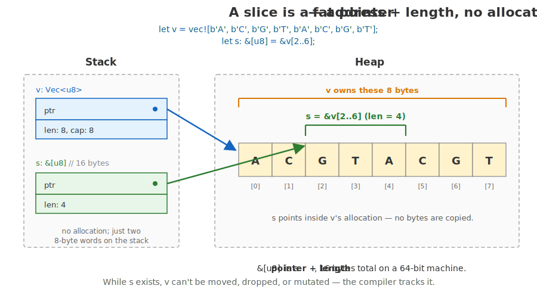
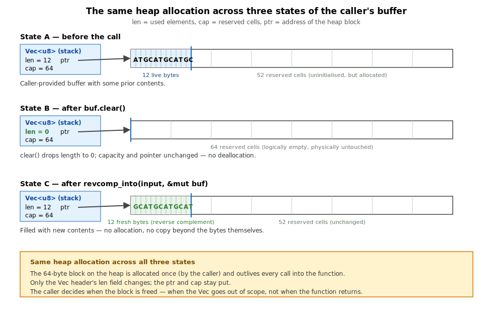
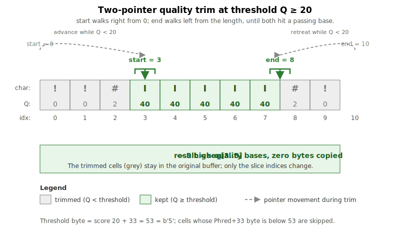
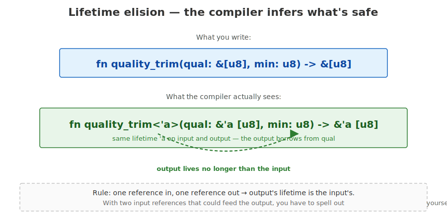
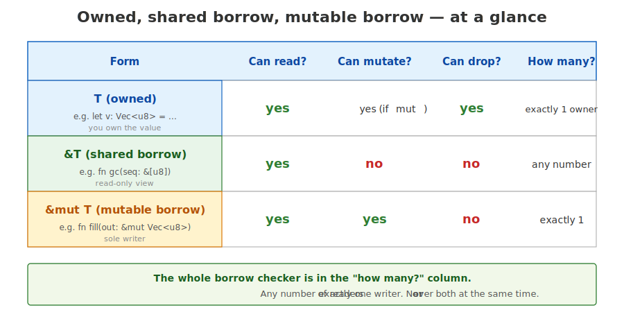

## What this lecture is

- The conceptual heart of Rust: who owns a value, who can read it, who can write it
- Today's tools: **ownership** (the rule that exactly one variable is responsible for cleaning up each value), **borrowing** (giving someone temporary access without handing ownership over) via `&T` and `&mut T`, **slices** (`&[u8]` — a borrowed view into a contiguous run of values), `Vec<T>`

::: notes
Yesterday was syntax. Today is the thing that makes Rust *Rust* — the part that no other mainstream language does, and the part that pays for itself a hundred times over once you've absorbed it.

The four exercises this afternoon all hinge on these ideas: who owns the bytes, who is reading them, who is writing them. Get the ownership story right and the code is short and fast; get it wrong and the compiler stops you before any damage is done.

Keep the concepts page open in a tab. I'll move fast.
:::

## Where Day 1 left off

Yesterday: a `Vec<u8>` is a 24-byte header on the stack pointing at a heap allocation.

{fig-alt="Stack/heap split with a Vec<u8> three-field header (ptr, len, cap) on the stack pointing to an 8-cell heap allocation holding ACGTA."}

Today: **who is allowed to touch that heap allocation, and when?**

::: notes
Quick recap of where day 1 left us. The Vec is a header — ptr, len, cap — sitting on the stack. The actual bytes live on the heap, separately. Cheap to pass around, because moving a Vec just copies 24 bytes; the heap data doesn't budge.

But this picture leaves a question unanswered: when there are several variables and several function calls in flight, who is allowed to read those heap bytes? Who is allowed to write them? Who is allowed to free them? That's the question ownership and borrowing answer.
:::

## Ownership in one sentence

**Every value has exactly one owner. When the owner goes out of scope, the value is dropped.**

```rust
fn main() {
    let v = vec![b'A', b'C', b'G', b'T'];
    // v owns the heap allocation here.
}   // v goes out of scope -> heap allocation is freed automatically.
```

In Python you never free memory; the garbage collector does it later, on its own schedule. In C you must remember to free every allocation yourself, and forgetting causes leaks or crashes. In Rust, neither &mdash; the compiler sees where the value goes out of scope and inserts the cleanup for you, at compile time. Same effect as garbage collection, no runtime cost, no leaks.

::: notes
This is the headline rule. Every value — every Vec, every String, every File handle — has exactly one variable that owns it. When that variable goes out of scope, Rust runs cleanup code: for a Vec, it frees the heap allocation.

This happens at compile time, not at runtime. The compiler can see exactly where `v` goes out of scope, and it inserts the free call there for you. No garbage collector pause, no manual `free()` call, no double-free bug. The memory is gone the instant it isn't needed any more.

This is half of why Rust is fast and predictable. The other half is borrowing, which we get to in a moment.
:::

## Why ownership at all? The bug it prevents

Use-after-free in C — about 70% of all C/C++ security bugs. Rust prevents the whole class at compile time.

```c
char* buf = malloc(1000);   // char* (a pointer to bytes); malloc(1000) (ask the system for 1000 bytes)
// ... use buf ...
free(buf);                  // free(buf) (give the memory back to the system)
// ... 50 lines later, someone else still has a pointer to it:
buf[0] = 'X';               // CRASH or silent corruption — that memory may
                            // belong to a different variable by now
```

::: notes
This is the single biggest reason Rust exists. Decades of C and C++ codebases have struggled with use-after-free, double-free, and dangling-pointer bugs &mdash; not because C programmers are careless, but because the language gives them no help. Once a program is big enough that one team allocates memory and another team frees it, keeping track of who still holds a pointer becomes humanly impossible.

Rust's answer is to make the compiler track it. Every value has exactly one owner; when the owner goes out of scope, the value is freed; nobody else can be holding a pointer because the borrow checker would have stopped them. The bug doesn't just become rarer &mdash; it becomes impossible to express in safe Rust.

Everything else in this lecture &mdash; move semantics, borrowing, slices &mdash; is machinery in service of this one guarantee.
:::

## Another classic — buffer overrun

```c
char input[8];
strcpy(input, "ACGTACGTACGTACGT");  // writes 16 bytes into 8!
```

The extra 8 bytes silently corrupt adjacent memory — often a function return address, which an attacker can hijack.

{fig-alt="A small diagram: a buffer of 8 cells labelled 'input' with the bytes ACGTACGT, followed by 8 more cells. A red arrow shows the strcpy writing through the buffer boundary into the adjacent region, with the labels turning red." width="80%"}

- **In the wild**: most browser / PDF / image-parser CVEs
- **In bioinformatics**: genome browsers and viewers parsing untrusted BAM/VCF/GFF
- **In Rust**: every slice access is bounds-checked — out-of-range panics cleanly instead of silently corrupting memory

::: notes
Pair this with the use-after-free slide. The two together cover ~70% of the C/C++ vulnerability class. Buffer overruns are arguably more famous because they enable remote code execution, not just crashes.
:::

## Move: assignment transfers ownership

```rust
let v = vec![b'A', b'C', b'G', b'T'];
let w = v;                    // ownership MOVES from v to w
// println!("{:?}", v);       // compile error: v has been moved
println!("{:?}", w);          // OK
```

After `let w = v`, `v` is no longer a valid name. Using it is a compile error, not a runtime crash.

::: notes
Assigning a Vec to a new variable does not copy the data. It transfers ownership. After `let w = v`, the variable `v` simply doesn't refer to anything any more — the compiler invalidates that binding.

Why? Two reasons. First, copying a million-byte vector on every assignment would be a hidden cost; explicit is better than implicit. Second — the deeper reason — if both `v` and `w` could refer to the same heap allocation, then when both went out of scope you'd try to free the same memory twice. That's a classic C bug. Rust's solution: only one of them gets to own it.

If you try to use `v` after the move, the compiler stops you with a clear error message. No segfault. No "use after free". The bug is impossible.
:::

## What "move" actually moves

{fig-alt="An SMIL-animated diagram. Step 1: `let v = vec![b'A', b'C', b'G', b'T'];` is highlighted; a stack box for v appears with its three fields (ptr, len, cap) and arrows to a heap box holding ACGT. Step 2: `let w = v;` is highlighted; a stack box for w appears beside v and the three fields copy across. Step 3: v is greyed out and crossed in red; w's arrow remains pointing at the same heap box; the data has not moved." width="80%"}

::: notes
This is what's actually happening at the machine level. The 24-byte Vec header — ptr, len, cap — gets copied bit-for-bit from v's stack slot to w's stack slot. That's fast: 24 bytes.

The heap allocation — the actual ACGT bytes — does not move. Same address, same bytes. What moved was the *right to use it*. After the assignment, w is the unique owner; v is a name with nothing behind it.

When this function returns, w goes out of scope, and the heap allocation gets freed. Once. Never twice. The compiler made that impossible by invalidating v at the point of assignment.
:::

## `Copy` types — the exception

Primitive types implement [`Copy`](https://doc.rust-lang.org/std/marker/trait.Copy.html). Assigning them duplicates the value instead of moving — copying one `u8` is one CPU instruction, so there's no point making you clone every integer.

```rust
let q: u8 = 30;
let r = q;  // Phred 30 — both q and r still usable
println!("{} {}", q, r);   // both still valid
```

{fig-alt="Two small boxes labelled q and r, both containing the byte 30 (a Phred score); the value q was copied to r and both are valid afterwards."}

::: notes
If everything moved on assignment, primitives would be unusable — you couldn't even write `let r = q; if r >= 20 && q >= 20`. Rust handles this with a trait called `Copy`. Types that implement `Copy` are duplicated on assignment instead of moved. The next slide gives the rule of thumb for which types are Copy.
:::

## What is `Copy`, and what isn't?

**Rule of thumb:** if it fits in a CPU register and owns no resource, it's `Copy`. Otherwise, it's move-only.

| Type | Copy? |
|---|---|
| `u8`, `i32`, `f64`, `bool`, `char` | yes |
| `[u8; 4]` — fixed-size array of `Copy` items | yes |
| `&T` — a shared reference (just a pointer) | yes |
| `Vec<T>`, `String`, `File`, `HashMap<K, V>` | **no** — owns a heap allocation or OS resource |

If a type owns a heap allocation, copying its header would create two owners and a double-free. So Rust moves it instead.

::: notes
The line is drawn at "does this type own a heap allocation or other resource?" A Phred score `u8` is just 1 byte; there's no resource to free, no duplication hazard. Copy it. A Vec owns a heap allocation; copying its 24-byte header would create two owners and a double-free. Move it.

So quality scores, base bytes, floats, bools — copy. Vec, String, File handles, mutex guards — move. That's the rule. You'll internalize it within a day.
:::

## References — `&T` and `&mut T`

To use a value **without taking ownership**, borrow it via a reference.

```rust
fn gc_content(seq: &[u8]) -> f64 { /* ... */ }   // takes a shared borrow

let v = vec![b'A', b'C', b'G', b'T'];
let g = gc_content(&v);          // pass &v, not v
println!("{:?}", v);             // v still owns the data
```

`&v` makes a reference; the function reads through it. `v` is never moved.

{fig-alt="A stack region with three small boxes labelled v, r, s — v contains the Vec header (ptr/len/cap), r and s are both &Vec<u8> pointers. All three point at the same heap allocation holding A C G T. Both r and s have a small 'read-only' annotation; v has 'owner'." width="80%"}

::: notes
Think of borrowing a library book: you can read it, put a bookmark in it, but the book still belongs to the library. You must return it eventually, and while you're holding it the library can't lend the same copy mutably to someone else.

A reference is a borrow. The owner keeps owning; the function gets temporary access through a pointer.

In the example, `gc_content` doesn't need to own the sequence — it just needs to read each byte and count. So we pass `&v`, a reference, instead of `v` itself. After the call, `v` is unchanged and still valid.

The syntax `&v` is "make a reference to v". The type `&[u8]` is "a reference to a slice of u8". And here's where the slice idea creeps in: when you take a reference to a Vec, Rust often gives you a slice — a view of the bytes without the Vec header. We'll see this more in a few slides.

For now: borrowing is the default when a function only needs to read. Moves are for transferring ownership; borrows are for temporary access.
:::

## Two flavours of borrow

| Form | Meaning | How many at once |
|---|---|---|
| `&T` | **shared** borrow — read-only view | any number |
| `&mut T` | **unique** borrow — read + write | exactly one |

A value has either **any number of `&T`** *or* **exactly one `&mut T`**.

Never both. The compiler enforces this at every program point.

::: notes
Two flavours, one rule.

A shared borrow, written `&T`, is read-only. You can make as many as you like, and they can coexist freely — readers don't fight.

A mutable borrow, written `&mut T`, is exclusive. While it exists, nothing else may touch the value — not another `&mut`, not even a read-only `&`. That's because a mutating function can move bytes around, reallocate buffers, change indices — and if someone else were reading through a stale pointer at the same time, you'd get garbage or a crash.

This rule — "many readers OR one writer, never both" — is checked at compile time. Not at runtime. There is no lock, no atomic, no overhead. If your code compiles, it cannot have a data race on this value. That is the whole foundation of Rust's safety story.
:::

## Many shared borrows, all at once

{fig-alt="An SMIL-animated diagram that starts with the owner `v` and its first borrow `r1`, then animates the addition of `r2` and `r3` — three pointer arrows accumulating to the same heap region. The animation freezes on the final state showing three read-only views of the same data." width="80%"}

::: notes
Three names — v, r, s — all touching the same four bytes. v owns them; r and s borrow them. All three can read. None of them can write. None of them can free.

This is fine. Concurrent readers never conflict, because no one is changing anything underneath them. You can pass `&v` to ten functions in a row, or hand it to ten threads in parallel; none of them can step on each other.

This is the "many readers" half of the rule.
:::

## One mutable borrow, alone

{fig-alt="Left panel labeled OK: v with one &mut v borrow, with note 'sole writer'. Right panel labeled compile error: v with both &mut v and &v, the &v crossed out and the compiler error printed below — trying to add a second borrow while a &mut is alive is rejected."}

::: notes
The other half: exclusive writers. On the left, we have a `&mut v` and nothing else. That compiles — m can mutate the Vec, push to it, even cause a reallocation. Safe, because no other borrow could be invalidated.

On the right, we tried to add a read-only borrow `r = &v` while the mutable borrow m is still alive. The compiler refuses with error E0502 — "cannot borrow as immutable because it is also borrowed as mutable". The mutable borrow's exclusivity is what makes a subsequent `push` safe; if r were allowed to coexist, a reallocation triggered by m would leave r pointing at freed memory.

You will see this error often in week one. It is almost always the compiler protecting you from a real bug. Read the message; the suggestion at the bottom usually contains the fix.
:::

## The same bug in Python — silent

Python doesn't have a borrow checker. The same shape of bug compiles, runs, and gives you wrong answers:

:::: {.columns}
::: {.column width="55%"}
```python
v = [[1, 2], [3, 4]]
first = v[0]         # SAME object as v[0]
v.append([5, 6])     # grow outer list
v[0].append(99)      # mutate inner list
print(first)
# [1, 2, 99] — `first` silently changed
```

Two Python variables can quietly point at the same heap object. Mutating through one changes what the other sees — no warning. The anti-pattern has a name: **aliasing**.

Same trap: pandas chained-assignment (`SettingWithCopyWarning`), NumPy views, R reference semantics.
:::
::: {.column width="45%"}
![Python list aliasing: `first` and `v[0]` are two names for the same heap object. After `v[0].append(99)`, both see the mutated list.](images/lec1-python-aliasing.svg){fig-alt="Two-panel before/after diagram. Left panel 'before v[0].append(99)': a stack region with two variables 'v' and 'first'; an arrow from 'v' to a heap object showing a 2-element list of pointers, the first of which goes to a heap object [1, 2], the second to [3, 4]; 'first' also points to the [1, 2] object. Right panel 'after v[0].append(99)': same layout, but the [1, 2] object is now [1, 2, 99]; both v[0] and first still point to it, so first now shows the mutated list." width="100%"}
:::
::::

::: notes
Pandas users know this pain — `df_subset = df[df.col > 0]; df_subset.col = ...` then a cryptic warning saying "you've created a view, not a copy". Rust catches this entire category at compile time. Python and R don't catch it at all — you find it by reading the wrong answer in a downstream plot.
:::

## Why the borrow rules pay off — a concrete trap

This snippet would compile in C; it would silently work in Python. Rust rejects it:

```rust
let mut v = vec![1u8, 2, 3];
let first = &v[0];       // shared borrow of the first element
v.push(4);               // pushes — may cause a reallocation
println!("{}", first);   // ❌ compile error: cannot borrow v as mutable
                         //                  while first is alive
```

- `let first = &v[0];` — fine, valid in any language; `first` points at the byte `1`.
- `v.push(4);` — if `v` is full, this allocates a new bigger buffer, *copies the bytes over, and frees the old buffer*. `first` now points at freed memory.
- In C: undefined behaviour, often silent. In Python (with mutable elements): silent aliasing, wrong answer downstream. In Rust: **compile error before you even run the program**.

The previous slide showed the Python version of this same trap. Below is the Rust version — note the compiler refuses to build.

::: notes
This is the canonical example of why the rule matters, and it's drawn straight from real-world bioinformatics code. You're walking through a sequence; you decide to append something to the same sequence inside the loop; the buffer grows; your loop reference now points at memory that doesn't belong to anyone any more.

In C++ this is one of the most common sources of silent crashes in production code &mdash; the famous `std::vector::iterator` invalidation. In Java, it's a `ConcurrentModificationException` thrown at runtime, *if you're lucky*. In Python, as the previous slide showed, the aliasing simply succeeds and corrupts your data quietly. In Rust, the compiler refuses to build the program. Same bug, four different consequences. Rust's is the only one that catches it before you ship.

The fix is mechanical: don't keep `first` alive across the push, or use an index `i` instead of a reference. The compiler tells you exactly which line is the problem.
:::

## Borrowing in function signatures

Three concrete shapes, one for each ownership story:

```rust
// Read-only — takes &T:
fn count_g(seq: &[u8]) -> usize { /* counts G's */ }

// Mutates in place — takes &mut T:
fn trim_in_place(buf: &mut Vec<u8>) { /* shortens buf */ }

// Consumes — takes owned T:
fn into_codons(seq: Vec<u8>) -> Vec<[u8; 3]> { /* repackages the bytes */ }
```

- `&[u8]` &mdash; "I read your bytes; you keep them."
- `&mut Vec<u8>` &mdash; "I write into your buffer; you keep the allocation."
- `Vec<u8>` &mdash; "Hand it over; I own it now."

**Default to `&T`**; use `&mut T` only to mutate; take ownership only to consume.

::: notes
The right way to read a Rust signature is as a contract about ownership.

If you see `&T`, the function is promising not to modify your value and not to keep it after the call returns. You can pass it and forget about it.

If you see `&mut T`, the function is going to mutate the value through the reference. Your binding is unchanged — you still own the underlying data — but its contents may differ when the call returns.

If you see `T` by value, the function takes ownership. After the call you cannot use that variable any more. If you want to use the value yourself later, either keep a clone or have the function return it back to you.

These three shapes cover almost every Rust function you will ever read. Today's exercises use all three.
:::

## `Vec<T>` — owned, growable heap buffer

```rust
let mut v: Vec<u8> = Vec::new();           // empty, no allocation yet
v.push(b'A');                              // append
let n = v.len();                           // current length
```

`Vec<T>` **owns** its heap buffer. Returning it from a function transfers that ownership.

::: notes
[`Vec`](https://doc.rust-lang.org/std/vec/struct.Vec.html) is the standard growable array — the workhorse of Rust just as `list` is the workhorse of Python.

The three operations on this slide cover almost everything: `Vec::new` makes an empty Vec with no heap allocation (the first push allocates), `push` appends, `len` reports the current length. The next slide adds capacity-management methods that matter for the buffer-reuse exercise.

Returning a Vec from a function moves it to the caller. No copying — just the 24-byte header.
:::

## Capacity control — for hot loops

When you know the rough size ahead of time, three more methods avoid reallocation:

:::: {.columns}
::: {.column width="55%"}
```rust
let mut v = Vec::with_capacity(100);   // pre-allocate room for 100
v.push(b'A');                          // no growth until full
v.clear();                             // len -> 0, allocation KEPT
v.reserve(50);                         // grow only if needed
```

`with_capacity` and `clear` are the trick behind the revcomp-buffer exercise: allocate once, reuse forever.
:::
::: {.column width="45%"}
{fig-alt="Three side-by-side states of a Vec on the heap. State 1 'with_capacity(100)': stack struct shows len=0, cap=100; heap shows a 100-slot buffer all empty. State 2 'after 3 pushes': len=3, cap=100; first three heap slots filled. State 3 'after clear()': len=0, cap=100; heap buffer still allocated (slots empty but reserved)." width="100%"}
:::
::::

::: notes
`with_capacity(n)` pre-allocates room for n elements up front. Useful when you know the rough size — it avoids the geometric "double the capacity" reallocations as the Vec fills.

`clear` sets the length to zero but does *not* free the allocation. The capacity stays the same; the storage is ready for the next batch.

`reserve(extra)` tops up capacity if needed; it's a no-op if you already have room.

Together, these are the API shape that fast bioinformatics tools use in their inner loops, which we'll see in exercise 2.
:::

## Slices — `&[T]`, a *view* into someone's buffer

```rust
let v = vec![b'A', b'C', b'G', b'T', b'A', b'C', b'G', b'T'];
let s: &[u8] = &v[2..6];        // view of indices 2, 3, 4, 5 (length 4)
println!("{}", s.len());        // 4
```

A slice is a **pointer + length**. No allocation. It borrows from the source.

While `s` exists, `v` cannot be moved, dropped, or mutated.

::: notes
A slice is the second great idea of day 2. Where a Vec owns its data, a slice borrows it. A slice has two fields — a pointer to the first element, and a length — and that's it. 16 bytes on a 64-bit machine. No allocation, no copying.

In the example, `&v[2..6]` makes a slice pointing at the four bytes starting from index 2 of v. The slice itself lives on the stack. The bytes still live in v's heap allocation. There are now two ways to reach those bytes: through v, and through s. The compiler tracks both.

The crucial property: while s is alive, v is frozen. You can't mutate v, you can't move it, you can't drop it — because that would invalidate s. The borrow checker enforces this for you.
:::

## A slice = pointer + length

A slice is two fields — a pointer to the first element, and a length. 16 bytes on a 64-bit machine, no copy. (The informal name is "fat pointer" — a pointer that carries extra metadata alongside the address.)

{fig-alt="Stack on the left contains v's Vec header and s's fat pointer (ptr + len = 4); heap on the right shows an 8-cell allocation owned by v with a green bracket marking the &v[2..6] range that s points into."}

::: notes
This picture is the whole slice abstraction in one diagram. The owning Vec on the left has its three-field header. The slice s has just two fields — pointer and length. Both point into the same heap allocation.

Notice what's *not* there: no separate copy of the bytes. The slice is purely metadata. That's why `&v[2..6]` is essentially free — you're not copying four bytes, you're computing one address and writing one length.

This is also why the same `fn gc_content(seq: &[u8])` works on `b"ACGT"`, on a piece of a chromosome, or on a chunk of a FASTA record. The function never knows or cares where the bytes came from. It just sees pointer-plus-length.
:::

## DNA is `&[u8]`, not `&str`

```rust
fn gc_content(seq: &[u8]) -> f64 {       // YES
    let mut gc = 0usize;
    for &b in seq {
        if b == b'G' || b == b'C' { gc += 1; }
    }
    gc as f64 / seq.len() as f64
}

// fn gc_content(seq: &str) -> f64 { ... }   // worse: UTF-8 tax, slow indexing
```

`&[u8]` is just bytes — fast indexing (covered Day 9), drops straight into byte-literal patterns.

::: notes
A reminder from day 1 that gets reinforced today: DNA functions take `&[u8]`, not `&str`.

`&str` is UTF-8. Every byte has to be valid Unicode. Indexing is slow because a character may span 1 to 4 bytes — you have to walk the string from the beginning. That's right for natural-language text. It is wrong for DNA, where every base is exactly one ASCII byte.

`&[u8]` has none of that overhead. Indexing is one pointer offset. Byte literals like `b'G'` drop into match patterns without conversion. And — this is the new bit — a `&[u8]` is a slice, which means it's a fat pointer into someone else's buffer. Zero allocation, zero copy.

For the rest of the week, any function that touches DNA takes `&[u8]`. Any function that touches FASTQ quality takes `&[u8]`. You will rarely see `&str` in real bioinformatics Rust.
:::

## Range expressions for slicing

```rust
&seq[..]                   // the whole thing
&seq[..3]                  // first 3-mer (prefix)
&seq[seq.len()-3..]        // last 3-mer (suffix)
&seq[a..b]                 // a (inclusive) to b (exclusive)
&seq[a..=b]                // a to b inclusive
```

Out-of-bounds slicing **panics at runtime**:

```rust
let seq = b"ACGT";
let bad = &seq[2..10];   // panics: "byte index 10 out of bounds"
```

::: notes
The compiler only sees that you took a slice; it can't predict the length of `seq` at the use-site, so it can't statically check that `10 <= seq.len()`.

The full menu of slice notations. They all produce a `&[T]` of the appropriate length, all in essentially zero work, all without copying.

The empty form `&seq[..]` is the whole thing — a slice covering the entire Vec. This is how you turn a `Vec<u8>` into a `&[u8]` when calling a function that expects one. (In many cases, Rust does this conversion implicitly via a feature called Deref coercion — the compiler quietly turning `&Vec<u8>` into `&[u8]` because `Vec` has opted in to the conversion — but the explicit form is always available.)

Out-of-bounds slicing panics — that is, the program stops with a clear message at the offending line. This is different from C, where slicing past the end is silent corruption. The runtime cost of the bounds check is small, and in tight loops the compiler often proves the check unnecessary and removes it.
:::

## k-mers as slice views

```rust
fn kmers(seq: &[u8], k: usize) -> Vec<&[u8]> {
    let mut out = Vec::with_capacity(seq.len() - k + 1);
    for i in 0..=seq.len() - k {
        out.push(&seq[i..i + k]);     // a view, not a copy
    }
    out
}
```

For a 100 Mb genome with k=21: ~100M *slices* (16 bytes each), **zero bytes of DNA duplicated.**

::: notes
This is exercise 3 this afternoon, foreshadowed. The function takes a sequence and a window size, and returns every k-length window.

Two design choices, both important. First, the return type is `Vec<&[u8]>`, not `Vec<Vec<u8>>`. If we returned `Vec<Vec<u8>>`, every k-mer would be a separate heap allocation containing a copy of those bytes — gigabytes of duplicated DNA for a real genome. Returning `Vec<&[u8]>` instead returns a vector of slice descriptors — pointer-plus-length pairs — that all point back into the original sequence.

Second, the lifetime of the returned slices is tied to `seq`. The compiler enforces that the returned vector cannot outlive seq. You don't write any annotation for this; one input reference, output reference, the compiler infers the rest. That's lifetime elision, which we'll meet in two slides.
:::

## k-mers — picture

{fig-alt="A 7-cell row of DNA bytes ACGTACG with three coloured brackets below labelling the three k=3 sliding windows ACG, CGT, GTA, each a &[u8] view into the same backing storage."}

::: notes
This is what `kmers(b"ACGTACG", 3)` produces. Seven bytes in the input. Five possible 3-mers. Each 3-mer is a slice — a 16-byte pointer-plus-length — pointing at the appropriate offset in the same backing buffer. No bytes are copied. The total heap allocation is just the vector of five slice descriptors; the DNA itself is unchanged.

If you scaled this up to a real genome with k=21, you'd produce roughly one slice per base, each 16 bytes — about 1.5 GB of metadata for a human chromosome. That sounds like a lot until you remember the alternative: copying every k-mer as its own Vec, which would be roughly 21 times bigger plus a per-Vec header tax. Day 3 makes this even cheaper using iterators that don't even allocate the outer vector.
:::

## Writing into a caller-owned buffer

A function that allocates a fresh `Vec` on every call is wasteful in a hot loop. **Allocation has a real cost** — every `Vec::new()` or `String::from(...)` goes through the system allocator, takes ~100-500 ns, and competes with every other thread doing the same.

```rust
fn reverse_complement_into(seq: &[u8], out: &mut Vec<u8>) {
    out.clear();                          // len = 0, allocation KEPT
    out.reserve(seq.len());
    for i in (0..seq.len()).rev() {
        out.push(complement_base(seq[i]));
    }
}
```

The same heap allocation is reused across millions of calls. **One allocation instead of a million.**

::: notes
A "hot loop" is the innermost loop that runs millions or billions of times — the part that dominates total runtime. Bioinformatics has many: every k-mer pass, every base comparison, every quality check.

This is exercise 2 this afternoon. The shape — `&[u8]` in, `&mut Vec<u8>` out — is what every fast bioinformatics tool uses in its inner loop.

The trick is `clear()`. It sets the Vec's length to zero, but it does *not* hand the underlying memory back to the system. The capacity stays the same. Next time the function fills the buffer, no fresh memory request is needed &mdash; the storage is right there from last time.

For a million reads, this is the difference between a million round-trips to the system asking for memory and effectively zero. Asking the system for memory is one of the few things in Rust that has measurable per-call cost, so removing it from the hot path matters.

You'll see this exact API shape in crates like `noodles` and `rust-htslib`. Now you know why.
:::

## Buffer reuse — picture

{fig-alt="Three rows showing the same heap allocation across three states of a caller-owned Vec<u8>: filled (len 12, cap 64) from a previous call, cleared (len 0, cap 64) after clear() but same allocation, and refilled with the reverse complement (len 12, cap 64) after revcomp_into wrote into the existing storage."}

::: notes
The same heap block in all three rows. Top: 12 bytes from the previous call. Middle: `clear()` set the length to 0; the memory is still ours. Bottom: `revcomp_into` walked the input in reverse, complemented each base, and pushed into the existing storage &mdash; no new request to the system, because the capacity was already 64.

Multiply this by a hundred million reads and you have the difference between a tool that takes an hour and a tool that takes a minute.
:::

## Quality trim returns a slice, not a Vec

:::: {.columns}
::: {.column width="55%"}
```rust
fn quality_trim(qual: &[u8], min_score: u8) -> &[u8] {
    let threshold = min_score + 33;

    let mut start = 0;
    while start < qual.len() && qual[start] < threshold {
        start += 1;
    }

    let mut end = qual.len();
    while end > start && qual[end - 1] < threshold {
        end -= 1;
    }

    &qual[start..end]
}
```

Zero allocation. The returned slice borrows from `qual`.
:::
::: {.column width="45%"}
{fig-alt="A 10-cell strip of Phred+33 quality bytes with cells 0-2 and 8-9 shaded grey (trimmed) and cells 3-7 shaded green (kept); two green brackets mark final positions start=3 and end=8; faded dashed arrows arc inward from the initial positions 0 and 10." width="100%"}
:::
::::

::: notes
Exercise 4 this afternoon. Two-pointer trim: walk `start` rightward until you find a base that passes, walk `end` leftward until you find one, return the slice in between. The signature returns `&[u8]` — a borrow of the input, not a fresh allocation. Returning a slice is fixed tiny work regardless of input length. The returned slice's lifetime is tied to `qual`; the caller cannot use the trimmed slice after `qual` itself is gone. The middle five bytes pass the threshold, so the function returns `&qual[3..8]`. Zero bytes copied, zero allocations.
:::

## Lifetime elision

*Elision* = "leaving something out that the compiler can figure out for you."

**The rule:** one reference in, one reference out &rArr; the output borrows from the input.

```rust
fn quality_trim(qual: &[u8], min: u8) -> &[u8] { /* ... */ }
//                    ^^^^^                ^^^^^
//                    output borrows from qual; can't outlive it
```

{fig-alt="Top: the signature fn quality_trim(qual: &[u8], min: u8) -> &[u8] as the programmer writes it. Below: the same signature with the implicit lifetime 'a drawn in on both input and output reference, plus a dashed arrow linking input to output and the rule 'output lives no longer than the input'."}

::: notes
For the rare case where the compiler can't decide which input the output borrows from, you write it explicitly: `fn f<'a>(s: &'a str) -> &'a str`. Today's exercises don't need that.

You'll notice we haven't written a single `<'a>` annotation today. That's lifetime elision: in common cases the compiler infers the lifetimes for you.

The rule that matters this week: if a function takes one reference parameter and returns a reference, the output's lifetime is the input's. So in `fn quality_trim(qual: &[u8], min: u8) -> &[u8]`, the returned slice borrows from qual, and the compiler enforces that the returned slice cannot outlive qual.

You only need to write explicit lifetimes when the inference is ambiguous — typically when there are two input references that could feed the output, and the compiler needs you to say which one. That comes up later in the week. For today's exercises, elision covers everything.
:::

## The whole rulebook on one slide

{fig-alt="A three-row reference table with rows T (owned), &T (shared borrow), and &mut T (mutable borrow), and columns Can read?, Can mutate?, Can drop?, How many?. T can read, mutate (if mut) and drop, exactly 1 owner. &T can read only, any number. &mut T can read and mutate, exactly 1."}

::: notes
This is the whole borrow checker on one slide. Keep this picture in your head and the compiler errors stop being surprising.

Three forms — owned, shared borrow, mutable borrow. Four questions — read, mutate, drop, count. The "how many?" column is where the rule lives: exactly one owner, any number of shared borrows, exactly one mutable borrow.

When the compiler complains, it's almost always because you tried to violate the count rule. The error message will say so. The fix is usually one of: scope a borrow down by introducing a block; switch from `&mut` to `&`; clone the value if you really do need two owners.
:::

## What you can `Copy`, and what you must `move`

| Type | On assignment |
|---|---|
| `u8`, `i32`, `usize`, `f64`, `bool`, `char` | **copied** (Copy) |
| `[u8; 4]` and other fixed arrays of Copy types | **copied** |
| References `&T`, `&mut T` (the *pointer* itself) | **copied** |
| `Vec<u8>`, `String`, `File`, `HashMap<K, V>` | **moved** |

If in doubt: anything that owns a heap allocation is move-only.

::: notes
A quick reference table for which types Copy and which move. The line is "does it own a heap allocation or an OS resource?" Primitives don't, so they copy. Vec and String do, so they move.

References are interesting: the pointer itself is Copy, because a pointer is just 8 bytes. Copying a `&T` gives you two `&T`s pointing at the same place, which is fine — the rule allows multiple shared borrows. Copying a `&mut T` is *not* allowed, because that would give you two mutable borrows, which violates exclusivity. The compiler enforces this.

For the rest of the week, just remember: numerics copy, owners move. If you really do want to duplicate a Vec, call `.clone()` explicitly. That makes the cost visible.
:::

## Common borrow-checker errors (1/2)

**E0382 — borrow of moved value.** You used `v` after handing it away.

```rust
let v = vec![b'A', b'C'];
let w = v;
println!("{:?}", v);   // error: v was moved into w
```
*Fix:* pass `&v` (borrow) instead of `v`, or do the print first.

**E0502 — cannot borrow as mutable / immutable.** A `&` and a `&mut` overlap.

```rust
let mut v = vec![b'A'];
let r = &v[0];
v.push(b'C');          // error: v is already borrowed by r
println!("{}", r);
```
*Fix:* narrow the scope of `r`, or copy the byte (`let r = v[0];`).

::: notes
Three errors cover almost everything you will see this afternoon. They are not bugs — they are the compiler protecting you.

E0382 is the move-then-use error. Often you didn't actually mean to take ownership; passing `&v` instead solves it.

E0502 is the borrow overlap. The fix is to make sure the shared borrow ends before the mutable borrow begins, often by introducing a `{ }` block or reordering operations. E0502 also subsumes E0596 (forgetting `mut` is the trivial special case — fix is `let mut v = ...`).
:::

## Common borrow-checker errors (2/2)

**E0507 — cannot move out of borrowed content.** You tried to take ownership from behind a `&T`.

```rust
fn first(v: &Vec<u8>) -> Vec<u8> { *v }   // error: can't move out of &
```
*Fix:* `v.clone()`, or change the API to take `Vec<u8>` by value.

The error messages are good — they almost always include a suggested fix at the bottom. Read them.

::: notes
E0507 happens when you try to pull a non-Copy value out from behind a reference. You can't move out of someone else's value — you only borrowed it.

The error messages are good. They almost always include the fix in a suggestion at the bottom. Read them.
:::

## A function that returns ownership

```rust
fn reverse_complement(seq: &[u8]) -> Vec<u8> {
    let mut out = Vec::with_capacity(seq.len());
    for i in (0..seq.len()).rev() {
        out.push(complement_base(seq[i]));
    }
    out                  // ownership of the Vec MOVES to the caller
}
```

Caller receives a fresh `Vec<u8>` they own. Function keeps nothing.

::: notes
Exercise 1 this afternoon. Read the signature: takes `&[u8]` (a borrow — we'll only read), returns `Vec<u8>` (a fresh, owned vector — caller takes ownership).

Inside, we allocate a Vec, fill it in reverse order with complemented bases, and return it. The bare `out` at the end — no `return`, no `;` — is the function's value. That value is a Vec, and returning it moves ownership to the caller.

No copying. The 24-byte Vec header is moved out; the heap allocation is now the caller's. When the caller's binding eventually goes out of scope, the heap is freed.

This is the "produce a new owned value" shape. The next exercise rewrites it as "fill a caller-owned buffer" — same algorithm, different ownership story, much faster in a loop.
:::

## Recap

- Every value has one owner; out of scope &rArr; dropped (no GC).
- Assignment **moves** by default; primitives are `Copy`.
- `&T` &mdash; shared, many readers, no writers.
- `&mut T` &mdash; unique, sole writer, no other borrows.
- Slices `&[u8]` are fat pointers (ptr + len); zero allocation.
- `Vec<u8>` owns its heap buffer; `clear()` keeps the allocation.
- Lifetime elision: one-in, one-out reference signatures need no annotation.

::: notes
Seven bullets. The whole afternoon hangs off these.

Ownership, moves, Copy, two flavours of borrow, slices, Vec, elision. If you remember the picture from the ownership-table slide, you have most of it; the rest comes from doing the exercises.

The borrow checker will yell at you. Read the error. The fix is usually small and obvious once you see what the compiler is protecting.
:::

## To the exercises

- Reference companion: [day 2 &mdash; Concepts](00-concepts.qmd)
- Start here: [Exercise 1 &mdash; Reverse complement](01-reverse-complement.qmd)

In a terminal:

```bash
cd day2/ex-reverse-complement
cargo test
```

::: {.fragment .fade-in style="margin-top: 1em;"}
Four exercises today: reverse complement, buffer reuse, k-mers, quality trim. They build on each other.
:::

::: notes
Same drill as yesterday. Open the concepts page in one tab as a reference. Open exercise 1. Open a terminal in the exercise directory.

Exercises 1 and 2 are the same algorithm with two different ownership stories. Exercise 3 introduces returning slice views. Exercise 4 returns a slice from the input.

Three hours. See you at the recap.
:::
