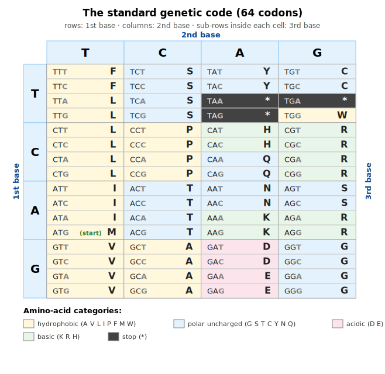
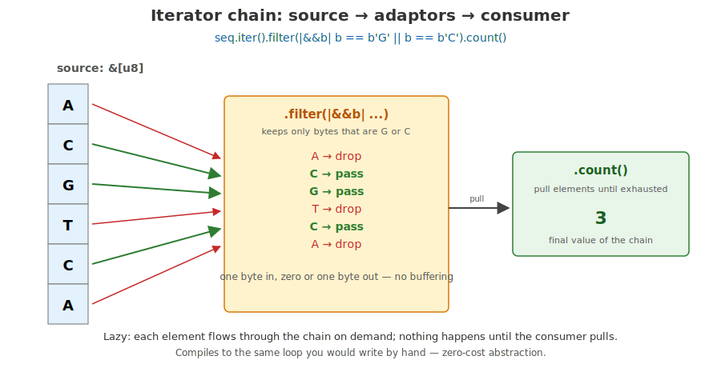
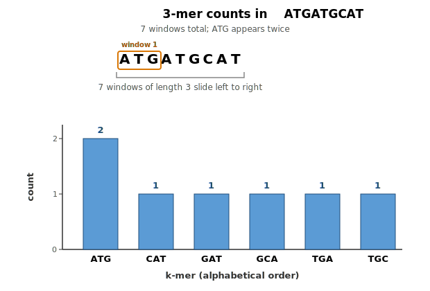
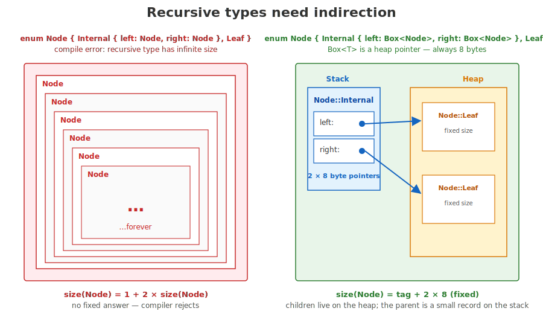
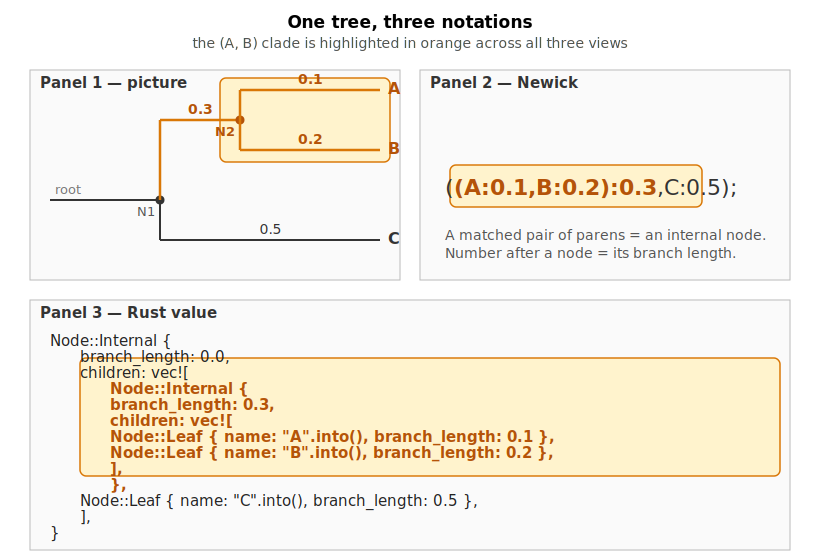
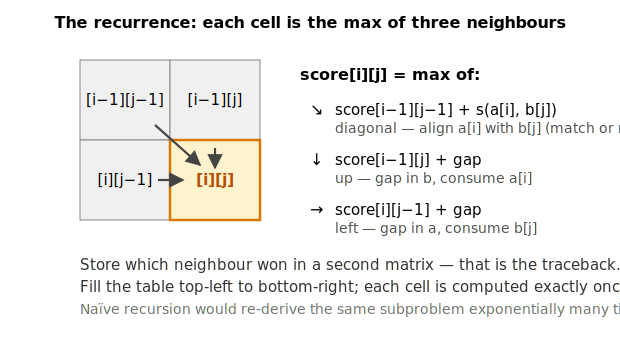
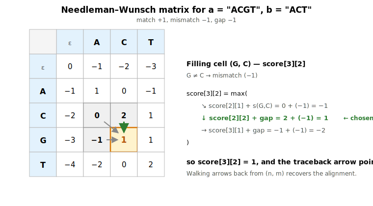

## What this lecture is

::: {.incremental}
- Day 3 is where Rust starts to feel like Rust: types model the biology, the compiler keeps you honest
- One concept per slide — *what it is*, *why it works this way*, a bioinformatics example
- Written companion: [day 3 — Concepts](00-concepts.qmd) (keep open in a tab)
- ~30 minutes; then six exercises — interval, region parser, codon table, k-mers, phylogeny, alignment
:::

::: notes
Yesterday you wrote functions over slices of bytes. Today the data gets shape. A genomic interval has a chromosome, a start, an end, and a strand — that wants to be one value, not four loose variables. A variant is either a SNP or an insertion or a deletion — that wants to be one type with three shapes, not a tagged tuple.

The two language features for this are `struct` and `enum`. They lead directly to `Option`, `Result`, exhaustive matching, and recursive data — every exercise today exercises some combination of them.
:::

## `struct` — a named bundle of fields

```rust
struct GenomicInterval {
    chrom: String,
    start: u64,
    end: u64,
}

let iv = GenomicInterval {
    chrom: "chr1".to_string(),
    start: 1000,
    end: 2000,
};
println!("{}-{}", iv.start, iv.end);
```

Field-by-field construction. Access fields with `iv.start`. → [Book: structs](https://doc.rust-lang.org/book/ch05-00-structs.html)

::: notes
A struct names a fixed set of fields and groups them into one value. The fields have types — here `String` and `u64` — and the compiler lays them out in memory in the order you declared them.

Construction is field-by-field. You name every field; there's no "positional" form for a struct with named fields. That sounds verbose, and it is, deliberately: a year from now when you read this code, you don't have to remember which u64 was start.

Accessing fields is `value.field` — same dot syntax as Python or R's `$`.
:::

## A struct in memory

{fig-alt="Diagram of struct GenomicInterval in memory. A blue Stack panel shows the struct as five 8-byte rows: chrom.ptr, chrom.len = 4, chrom.cap = 4 (grouped with a brace labelled String header), start = 1000, end = 2000; total 40 bytes on the stack. An orange Heap panel shows a four-cell allocation holding the bytes c, h, r, 1 with indices [0]..[3]; an arrow runs from the chrom.ptr row on the stack to the first heap cell. Footer notes that each field is laid out in place, owned strings keep their characters on the heap, and the struct itself remains a fixed-size record."}

::: notes
The struct itself is a fixed-size record on the stack — 40 bytes here. The chromosome name's characters live separately on the heap; the String header on the stack holds a pointer to them.

This is the same Vec layout from yesterday, applied to a field rather than a top-level variable. The compiler computes the struct's size at build time by adding up the sizes of its fields. That fixed size is what lets you put a `GenomicInterval` directly into a `Vec<GenomicInterval>` with no per-element heap allocation.
:::

## `impl` — methods belong to the type

```rust
impl GenomicInterval {
    fn length(&self) -> u64 {                  // borrow read-only
        self.end - self.start
    }

    fn shift(&mut self, by: u64) {             // borrow mutably
        self.start += by;
        self.end   += by;
    }

    fn new(chrom: String, start: u64, end: u64) -> Self {   // associated fn
        Self { chrom, start, end }
    }
}
```

Call sites: `iv.length()`, `iv.shift(100)`, `GenomicInterval::new(...)`.

::: notes
Methods live in an `impl` block, separate from the data definition. The first parameter is one of `&self`, `&mut self`, or `self` — borrow read-only, borrow mutably, or consume the value. Same ownership rules you saw yesterday, now applied to method receivers.

A function in an `impl` block with no `self` is an "associated function" — a constructor or helper attached to the type. The `Self` keyword inside the block means "the type we're implementing" — handy because if you rename `GenomicInterval` you don't have to touch the impl block.

Call sites read naturally: `iv.length()` for the methods, `GenomicInterval::new(...)` for the constructor.
:::

## `#[derive(...)]` — boilerplate the compiler writes for you

```rust
#[derive(Debug, Clone, PartialEq, Eq)]
struct GenomicInterval {
    chrom: String,
    start: u64,
    end: u64,
}
```

The four you will reach for this week:

- **`Debug`** — `{:?}` printing, for diagnostics
- **`Clone`** — explicit `.clone()` deep copy
- **`Copy`** — assignment copies (only for stack-only types)
- **`PartialEq`** / `Eq` — `==` and `!=`

::: notes
A `derive` tells the compiler to write a trait implementation for you, field by field. You almost always want Debug and Clone — Debug to be able to print the value when something is wrong, Clone to make an explicit copy when ownership rules push back.

Copy is more specialised. A type can only be Copy if everything inside it is also Copy. `String` is not Copy because copying it would require allocating new heap storage — so any struct containing a String can be Clone but not Copy. Plain integer types and small enums like `Strand` are fine to make Copy.

PartialEq enables `==` and `!=`. Add `Eq` too when equality is reflexive — which is almost always; the famous exception is `f64`, because `NaN != NaN`.
:::

## `enum` — a value that is one of several shapes

```rust
enum Strand { Plus, Minus }

let s = Strand::Plus;
```

A C-style enum lists its variants with no data. Compiles to a single small integer tag.

→ [Book: defining an enum](https://doc.rust-lang.org/book/ch06-01-defining-an-enum.html)

::: notes
The simplest enum is a closed list of names. Strand is either Plus or Minus, full stop. The compiler stores this as a single byte: 0 for Plus, 1 for Minus.

You write `Strand::Plus` at the use site, with the type name as a prefix. This is namespacing — two different enums in the same module can both have a `Plus` variant without colliding.

This is the same shape as a Python enum or an R factor with two levels, but with one major difference: the compiler tracks which variant you have at each point in the program, statically. You cannot accidentally pass a Strand where some other enum was expected.
:::

## Enums with data — a sum type

```rust
enum Variant {
    Snp       { pos: u64, alt: u8 },
    Insertion { pos: u64, bases: Vec<u8> },
    Deletion  { pos: u64, len: u64 },
}
```

Each variant carries its own fields. A `Variant` value is one of the three shapes — and the compiler tracks which.

::: notes
This is the move that turns enum from "list of names" into "list of shapes". Each variant has its own fields, and a `Variant` value is exactly one of the three forms at a time.

The biology maps directly: a variant call from a VCF is either a substitution, an insertion, or a deletion. The fields you care about are different for each. With a struct you'd need a nullable field for everything that doesn't apply, plus a "kind" tag — and nothing stops you reading insertion bases out of a SNP. With an enum, the SNP literally doesn't have a `bases` field; you cannot ask for it.

Other languages call this an algebraic data type, a tagged union, or a sum type — same idea.
:::

## Two enum kinds, two memory layouts

{fig-alt="Two-panel diagram. Left panel: enum Strand { Plus, Minus } shown as a single tiny tag cell with values 0 = Plus, 1 = Minus, labelled 1 byte total and fits in a register. Right panel: enum Variant { Snp{..}, Insertion{..}, Deletion{..} } shown as a small tag cell plus a payload box. The payload box contains three stacked variant rows: Snp { pos: u64, alt: u8 } at ~16 B, Insertion { pos: u64, bases: Vec<u8> } at ~32 B highlighted in orange as the largest variant, Deletion { pos: u64, len: u64 } at 16 B. A brace and annotation explain the size is tag + size of the largest variant, ~40 bytes per Variant value. Footer notes a C-style enum is a tagged integer while a sum-type enum is a tag plus a union of payloads; the compiler reads the tag to know which match arm applies."}

::: notes
A C-style enum is essentially a small integer. A sum-type enum is a tag plus a union of all variant payloads — every value reserves room for the largest variant. So even an `Snp` carries a slot the size of the `Insertion` payload, most of it unused.

This is the cost of the abstraction. In return, you get a value that is provably one of N shapes, you cannot read fields from the wrong variant, and the compiler can check that every match expression handles every case.
:::

## `match` — the way you read an enum

```rust
fn ref_alt_delta(v: &Variant) -> i64 {
    match v {
        Variant::Snp { .. }              =>  0,
        Variant::Insertion { bases, .. } =>  bases.len() as i64,
        Variant::Deletion  { len, .. }   => -(*len as i64),
    }
}
```

`match` binds the variant's fields by name inside the arm. The `..` pattern means "ignore the rest".

::: notes
You can't just read `v.bases` — there is no such field on a SNP variant. To get at the contents you have to first establish which variant you have, and `match` is the canonical tool.

Each arm pattern names the variant and destructures its fields. Inside the Insertion arm, `bases` is bound to the actual Vec; inside the Deletion arm, `len` is bound to the actual u64. The compiler enforces that you only touch fields that actually exist on the matched variant.

The `..` in a struct pattern means "any remaining fields I don't care about". Use it freely — it documents intent and keeps the pattern short.
:::

## Exhaustiveness — the safety net

```rust
enum Strand { Plus, Minus }

match strand {
    Strand::Plus  =>  1,
    Strand::Minus => -1,
    // add Strand::Unknown to the enum later? this match becomes
    // a compile error until we handle the new case
}
```

The compiler refuses any `match` that does not cover every variant.

::: notes
This is one of the most practically valuable things in the language. When you add a new variant to an enum — a new strand type, a new variant call, a new file format — the compiler will tell you every single match expression in the entire codebase that needs to be updated to handle the new case.

You cannot ship "I updated the type but forgot one place" bugs of this shape in Rust. The wildcard `_` defeats the check, so reach for it only when you really mean "any other". The compile error is the feature.
:::

## `Option<T>` — values that may be absent

```rust
enum Option<T> {
    Some(T),
    None,
}

fn first_g(seq: &[u8]) -> Option<usize> {
    for (i, &b) in seq.iter().enumerate() {
        if b == b'G' { return Some(i); }
    }
    None
}
```

`Option<T>` replaces `null`. There is no other way to express absence in a typed value.

::: notes
A function that might not have an answer returns `Option<T>` rather than a "magic" sentinel value or a nullable pointer. Some(value) is "yes, here is one"; None is "no answer".

`<T>` is the generic parameter — Option works for any type. `Option<usize>` is "maybe an index"; `Option<&[u8]>` is "maybe a slice". The variant is the part that carries information about presence; the type parameter is the kind of thing that's optionally present.

Java has "Optional", Python has "Maybe" libraries, but in Rust this is *the* way — there is no separate nullable pointer construct. The standard library uses Option<T> for "no such key", "end of iteration", "first element of an empty slice", everywhere.
:::

## Option in memory

{fig-alt="Diagram titled Option<u64> — the same shape, two states, showing the enum Option<T> { Some(T), None }. Left panel headed let opt: Option<u64> = Some(42) shows a blue stack region with a small tag cell containing 1 next to a wider u64 payload cell containing 42, labelled Some and contains the value. Right panel headed let opt: Option<u64> = None shows an orange stack region with a tag cell containing 0 next to a dashed-border u64 payload cell labelled (unused, garbage), with the captions None and compiler refuses to read. A green callout at the bottom reads: Option<T> replaces null. The compiler refuses to read the value until you have checked which variant you have, followed by a match opt example."}

::: notes
The memory shape of Option is exactly what you'd expect from a tagged union: a tag byte plus enough room for the inner value. For None, the payload region still exists, but its contents are undefined garbage — and the compiler enforces that you never look at it.

The compiler's refusal to let you blindly read the payload is the whole point: a `null pointer dereference` simply cannot happen, because there is no `.value()` method that doesn't first force you to handle the None case.
:::

## Using `Option` — `match`, `if let`, helpers

```rust
match first_g(seq) {
    Some(i) => println!("first G at {i}"),
    None    => println!("no G in this read"),
}

if let Some(i) = first_g(seq) {                  // only care about Some
    println!("first G at {i}");
}

let i = first_g(seq).unwrap_or(0);               // missing G means 0
let i = first_g(seq).expect("read must contain a G");  // panic if None
```

→ [`Option` docs](https://doc.rust-lang.org/std/option/enum.Option.html)

::: notes
Four ways to consume an Option, in decreasing order of how much they make you think about None.

`match` is the full case analysis — explicit, exhaustive, always correct.

`if let Some(x) = opt` is sugar for a match where you only care about one variant; the None case is silently dropped. Use when the absence is uninteresting.

`unwrap_or(default)` returns the inner value or the default — handy for "missing means zero" reductions.

`expect("...")` returns the inner value or panics with your message if None. Use when None really shouldn't happen here and you want a loud crash if it does — never use it in code that could see real-world bad input.

There's no plain `.unwrap()` on this slide on purpose; it's the same as `expect` with a useless message.
:::

## `Result<T, E>` — operations that can fail

```rust
enum Result<T, E> {
    Ok(T),
    Err(E),
}

fn parse_start(s: &str) -> Result<u64, ParseError> {
    match s.parse::<u64>() {
        Ok(n)  => Ok(n),
        Err(_) => Err(ParseError::InvalidStart),
    }
}
```

`Result` is `Option`'s richer sibling — failure carries a value of its own.

::: notes
Result is Option's richer sibling: where Option says "value or nothing", Result says "value or this specific error". Both arms carry data; both arm types are generic.

Use Result when failure is meaningful and recoverable: parsing user input, opening a file, parsing a region string. Use Option when "missing" is the right framing and there's no useful error to attach.

The second type parameter, `E`, is the error type. It can be anything: a string, a custom enum like `ParseError` with a variant per failure mode, or a library error type. For the parse_region exercise today, you'll define your own.
:::

## The `?` operator — propagate errors

```rust
fn parse_region(s: &str) -> Result<(String, u64, u64), ParseError> {
    let (chrom, rest)    = s.split_once(':').ok_or(ParseError::MissingColon)?;
    let (start_s, end_s) = rest.split_once('-').ok_or(ParseError::MissingDash)?;
    let start: u64 = start_s.parse().map_err(|_| ParseError::InvalidStart)?;
    let end:   u64 = end_s  .parse().map_err(|_| ParseError::InvalidEnd)?;
    Ok((chrom.to_string(), start, end))
}
```

`?` means *if this is `Err`, return it; otherwise unwrap and continue*.

::: notes
The question mark is Rust's shorthand for the four-line match you'd otherwise write at every fallible call site. On `Ok`, it pulls out the inner value and the next line runs as if nothing happened. On `Err`, it returns that Err from the enclosing function immediately.

For `?` to compile, the enclosing function must itself return Result (or Option). The error type you propagate has to convert into the function's declared error type — for today's exercises we make those the same type.

`ok_or` turns `Option<T>` into `Result<T, E>` so we can use `?` for the missing-colon case as well. `map_err` rewrites the error type, which is how we squeeze the standard `ParseIntError` into our custom `ParseError` enum.
:::

## `?` — control flow visualised

{fig-alt="Diagram of the ? operator. A blue call box at the top reads parse_chrom(s) — returns Result<String, ParseError>. Two arrows diverge from the call: a green arrow labelled Ok(chrom) leads to a green box on the left titled unwrap and continue, showing let chrom: String = ... and the caption next line of the function runs; a red arrow labelled Err(e) leads to a red box on the right titled early return from this function, showing return Err(e); and the caption caller gets the same Err. A dashed grey caller-frame box below reads: enclosing function must itself return Result<_, E> (or Option) for ? to compile, and shows fn parse_region(s: &str) -> Result<Region, ParseError> { ... }."}

::: notes
This is what `?` desugars to. The call returns a Result. On `Ok(value)`, control falls through to the next line of the function and `value` is bound. On `Err(e)`, the same `e` is returned from the enclosing function — execution skips everything below the `?`.

Each `?` in your code is a possible early-return path. That's the trade-off: error propagation is silent at the call site (one keystroke), but it's also local — you can see every place control might leave the function by scanning for `?`.
:::

## Exhaustive matching keeps codon tables honest

```rust
fn translate(codon: &[u8]) -> Option<u8> {
    match codon {
        b"ATG" => Some(b'M'),
        b"TAA" | b"TAG" | b"TGA" => Some(b'*'),
        b"GCT" | b"GCC" | b"GCA" | b"GCG" => Some(b'A'),
        // ... 60 more arms ...
        _ => None,                   // invalid / non-canonical input
    }
}
```

64 codons. `match` checks you cover every byte string in your domain.

{fig-alt="A 4x4 grid showing the standard genetic code. Rows are first base T, C, A, G; columns are second base T, C, A, G; each cell holds four sub-rows for the third base. Each row gives the codon and its one-letter amino acid. Codons are coloured by amino-acid category: hydrophobic in cream, polar uncharged in light blue, basic in light green, acidic in pink, stop codons in dark grey."}

::: notes
Codon translation is a function from a 3-byte sequence to an amino acid. The natural Rust shape is a match on byte-string patterns: each arm is one codon, the body is the amino acid.

The pipe operator combines synonymous codons into one arm — alanine is GCT, GCC, GCA, GCG; the four arms collapse to one. The trailing `_ => None` covers anything that isn't a valid codon — an ambiguous base, a partial codon at the end of a sequence.

The genetic code is a small finite table, so a match expression is faster, smaller, and easier to read than a HashMap lookup. This is exercise 3.
:::

## Iterators — describe, don't loop

Iterators are **lazy**. Adaptors (`map`, `filter`, `take`) build a chain; **consumers** (`collect`, `count`, `sum`, `for`) drive it.

```rust
let gc_count = seq.iter()
    .filter(|&&b| matches!(b, b'G' | b'C'))
    .count();

let upper: Vec<u8> = seq.iter()
    .map(|&b| b.to_ascii_uppercase())
    .collect();
```

→ [Book: iterators](https://doc.rust-lang.org/book/ch13-02-iterators.html)

::: notes
An iterator is a value that produces other values one at a time. The methods you call on it split into two families: adaptors that wrap one iterator into another (map, filter, take, enumerate) and consumers that actually pull elements through (count, sum, collect, for).

Each adaptor returns a new iterator — no work happens. The whole chain only runs when the consumer asks for elements. This means you can compose long chains without worrying about intermediate allocations.

For most "loop with an accumulator" patterns, an iterator chain is shorter, more declarative, and exactly as fast. The compiler is genuinely good at inlining the closures.
:::

## Iterator chains visualised

{fig-alt="Diagram titled Iterator chain: source to adaptors to consumer, with the code seq.iter().filter(|&&b| b == b'G' || b == b'C').count() across the top. On the left is a vertical column of six source cells labelled source: &[u8] containing A, C, G, T, C, A. In the middle is an orange filter stage labelled .filter(|&&b| ...) keeping only bytes that are G or C; six lines inside read A → drop, C → pass, G → pass, T → drop, C → pass, A → drop, with red drop arrows for the drops and green pass arrows for the passes connecting source to filter. On the right is a green .count() consumer pulling elements until exhausted and displaying the final value 3. Footer: Lazy: each element flows through the chain on demand; nothing happens until the consumer pulls. Compiles to the same loop you would write by hand — zero-cost abstraction."}

::: notes
This is the mental model. Elements flow left to right through the chain. The filter stage examines each one and either lets it pass or drops it. The `count` consumer is on the receiving end, pulling elements until the source is exhausted, incrementing a counter each time.

The chain doesn't materialise any intermediate Vec. There's no "filtered copy of seq" anywhere in memory — each byte is checked and either counted or discarded in place. The compiled code is the same loop you'd write by hand.
:::

## `HashMap` — keys to values, amortised O(1)

```rust
use std::collections::HashMap;

let mut counts: HashMap<&[u8], usize> = HashMap::new();
counts.insert(b"ATG", 1);
counts.insert(b"TAA", 1);

if let Some(&n) = counts.get(b"ATG") {
    println!("seen ATG {n} times");
}
```

The standard hash table — generic over key type and value type.

→ [`HashMap` docs](https://doc.rust-lang.org/std/collections/struct.HashMap.html)

::: notes
HashMap is Rust's standard hash table. The two type parameters are the key type and the value type — `HashMap<Vec<u8>, usize>` for "k-mer string to count", `HashMap<String, GenomicInterval>` for "gene name to interval", and so on.

`insert` and `get` are the basics. `insert(k, v)` puts an entry in; `get(&k)` returns `Option<&V>` — yes, you have to handle the absent case. Iteration over a HashMap yields key-value pairs in arbitrary order.

For DNA k-mer keys, `Vec<u8>` works but allocates per insertion. Smarter key types — fixed-size arrays, packed 2-bit encodings — exist; we'll mention them but the exercise uses `Vec<u8>` for clarity.
:::

## The entry API — read-modify-write in one call

```rust
use std::collections::HashMap;

let mut counts: HashMap<Vec<u8>, usize> = HashMap::new();

for window in seq.windows(k) {
    *counts.entry(window.to_vec()).or_insert(0) += 1;
}
```

`entry(key).or_insert(default)` returns `&mut V` — either the existing slot or a freshly-inserted one. Dereference and mutate in place.

{fig-alt="Diagram showing 3-mer counts in ATGATGCAT — 7 windows total; ATG appears twice. The DNA sequence ATGATGCAT is shown at the top with a bracket below noting 7 windows of length 3 slide left to right; the first window ATG is outlined in orange. Below is a bar chart of counts for the six distinct 3-mers in alphabetical order: ATG has count 2, while CAT, GAT, GCA, TGA, and TGC each have count 1."}

::: notes
This is the canonical histogram pattern in Rust. Without the entry API you'd write three lines per insert: look up, branch on Some/None, insert default or increment.

`entry(k)` returns an `Entry` enum that's either occupied or vacant. `.or_insert(default)` collapses both cases into a single `&mut V` — a mutable reference to the value in the slot, either the one that was already there or the default you just inserted.

The deref-and-add-assign at the front (`*entry... += 1`) modifies the value in place. Net effect: one expression, one hash lookup, exactly one allocation if the key is new. This is exercise 4: count every k-mer in a sequence.
:::

## Closures — anonymous functions that capture

```rust
let threshold = 30;
let high_quality = quals.iter()
    .filter(|&&q| q >= threshold)         // captures `threshold` from outside
    .count();

let bump = |q: u8| q + 1;                 // boost a Phred score by 1
let positions: Vec<usize> =
    (0..seq.len()).step_by(3).collect();  // codon start positions
```

`|args| body`. Closures capture the variables they mention from the enclosing scope.

::: notes
A closure is a function value you can pass around — like a Python `lambda`, but more capable. Pipes around the parameter list, then the body.

What makes them "closures" rather than just "function literals" is capture: a closure can refer to variables in the surrounding scope, and the compiler arranges to keep those variables alive as long as the closure is. In the example, `threshold` is captured by the filter's closure.

For iterator combinators you'll write a lot of one-liners with closures. The double ampersand `&&q` is destructuring two layers of reference at once — once because iter yields &T, once because filter passes a reference to that reference. Comes up often enough to memorise.
:::

## Recursive types — direct recursion is forbidden

```rust
// This does NOT compile:
enum Node {
    Internal { left: Node, right: Node },
    Leaf,
}
// error[E0072]: recursive type `Node` has infinite size
```

`size(Node) = 1 + 2 × size(Node)` — there is no fixed answer.

The fix: indirection through a heap pointer.

::: notes
A type that contains itself directly cannot have a fixed size — every layer would add the size of one more Node, recursively, forever. The compiler can't lay it out and rejects the definition.

The same problem turns up in C if you write `struct Node { struct Node left; }`. The C fix is "use a pointer"; the Rust fix is the same in spirit, but the pointer is a typed owned heap pointer called `Box`.
:::

## `Box<T>` makes the size finite again

{fig-alt="Two-panel diagram. Left panel headed enum Node { Internal { left: Node, right: Node }, Leaf } in red with subtitle compile error: recursive type has infinite size shows six nested Node boxes Russian-doll-style, the innermost containing ellipses and ...forever, with the footer size(Node) = 1 + 2 × size(Node), no fixed answer — compiler rejects. Right panel headed enum Node { Internal { left: Box<Node>, right: Box<Node> }, Leaf } in green with subtitle Box<T> is a heap pointer — always 8 bytes shows a blue Stack region containing a Node::Internal with two pointer cells left: and right:, labelled 2 × 8 byte pointers; on the right an orange Heap region holds two child Node::Leaf boxes labelled fixed size, with blue arrows from the pointer cells to the child boxes. Footer: size(Node) = tag + 2 × 8 (fixed); children live on the heap, the parent is a small record on the stack."}

::: notes
`Box<T>` is the standard owned heap pointer — a non-null pointer that owns the value it points at, and frees it when the box is dropped. The pointer itself is always 8 bytes on a 64-bit machine, regardless of how big T is.

So `Box<Node>` is 8 bytes. The parent Node now has a fixed size: tag plus two 8-byte pointers. Each child Node lives on the heap and may itself contain Boxes pointing at further descendants. The tree's depth becomes a runtime property; the layout of any one node is fixed at compile time.

For the phylogeny exercise the children live in a `Vec<Node>` instead of `Box<Node>`. A Vec is also a fixed-size header (24 bytes) pointing at heap storage, so the same trick applies — Vec gives you variable arity for free.
:::

## A phylogenetic tree as a recursive enum

```rust
enum Node {
    Leaf     { name: String,        branch_length: f64 },
    Internal { branch_length: f64,  children: Vec<Node> },
}
```

A leaf is a tip species; an internal node groups child sub-trees. `Vec<Node>` provides the indirection (heap-allocated children).

{fig-alt="A diagram titled One tree, three notations with the subtitle the (A, B) clade is highlighted in orange across all three views. Panel 1, picture: a rooted tree drawn left to right with a root stub leading to internal node N1, which branches down to leaf C with branch length 0.5 and up to internal node N2 with branch length 0.3; N2 branches up to leaf A with length 0.1 and down to leaf B with length 0.2; the N2 sub-tree containing A and B is highlighted in orange. Panel 2, Newick: the string ((A:0.1,B:0.2):0.3,C:0.5); with the inner (A:0.1,B:0.2):0.3 substring highlighted in orange. Panel 3, Rust value: a multi-line Node::Internal literal with the inner Node::Internal sub-tree containing the two Node::Leaf children highlighted in orange."}

::: notes
This is exercise 5. A phylogenetic tree is naturally a recursive structure: each node is either a tip (Leaf) carrying a species name and the branch length leading to its parent, or an internal node grouping a list of child sub-trees.

The Vec<Node> gives us two things at once. First, the indirection that makes the enum's size finite — Vec's three-field header is fixed even when the children list grows. Second, variable arity — an internal node can have two children or twenty.

The same tree has three faithful representations on this slide: drawn as a picture, written as a Newick string (the standard text format in phylogenetics), and constructed as a Rust enum literal. They contain the same information; the Rust value is the one we can compute on.
:::

## Recursive functions match the type

```rust
fn count_tips(node: &Node) -> usize {
    match node {
        Node::Leaf { .. } => 1,
        Node::Internal { children, .. } =>
            children.iter().map(count_tips).sum(),
    }
}
```

One arm per variant. The internal arm recurses on each child via an iterator chain.

::: notes
The function shape mirrors the type shape. A leaf contributes one tip. An internal node's tip count is the sum of its children's tip counts. The match exhausts both variants; the recursion bottoms out at leaves.

Notice how `map(count_tips).sum()` composes — `count_tips` is passed as a function value to `map`, which produces an iterator of usize, which `sum` reduces. No mutable accumulator, no manual loop.

Rust does not guarantee tail-call optimisation. Very deep recursion can overflow the stack — phylogenies of biological depth (a few hundred internal nodes) are fine, but if you need to recurse a million levels deep you'd convert to an explicit stack-based iteration.
:::

## Dynamic programming — memoised recursion

A recursive formula that revisits the same subproblem many times — fill a table once instead.

{fig-alt="A 2x2 grid showing four cells [i-1][j-1], [i-1][j], [i][j-1] in grey as predecessors, with the cell [i][j] highlighted in orange as the target. Three arrows from the predecessors converge on the target. A side panel lists three options being maximised: diagonal score[i-1][j-1] + s(a[i], b[j]) (match or mismatch), up score[i-1][j] + gap (gap in b), left score[i][j-1] + gap (gap in a). Footer notes that storing which neighbour won gives the traceback, the table fills top-left to bottom-right with each cell computed exactly once, and naïve recursion would re-derive the same subproblem exponentially many times."}

::: notes
Pure recursion is correct but exponentially slow when subproblems overlap. The fix is to fill a table once: every cell is the value of one subproblem, and you compute each cell exactly once by walking the table in dependency order.

That's all dynamic programming is — recursion turned inside-out so the bottom of the recursion tree is computed first. The recurrence becomes a nested for loop; the recursive calls become array lookups.

The day-3 alignment exercise is the textbook example. Needleman-Wunsch fills a (n+1)×(m+1) score matrix where each cell maxes over three neighbours. Each cell is one subproblem; the whole table is filled in O(n × m).
:::

## Needleman–Wunsch in one matrix

{fig-alt="A worked Needleman–Wunsch matrix for a = ACGT and b = ACT with scoring match +1, mismatch -1, gap -1. The grid has columns labelled ε, A, C, T (b's letters) and rows labelled ε, A, C, G, T (a's letters). The first row reads 0, -1, -2, -3 and the first column reads 0, -1, -2, -3, -4. The cell (G, C) is highlighted in orange with the score 1. Three arrows converge on it: a grey diagonal arrow from the cell scoring 0, a grey left arrow from the cell scoring -1, and a thick green up arrow from the cell scoring 2 (chosen). A right-hand panel works through the recurrence: score[3][2] = max of ↘ 0 + (-1) = -1, ↓ 2 + (-1) = 1 (chosen), → -1 + (-1) = -2; so score[3][2] = 1 and the traceback arrow points up. A footer notes that walking arrows back from (n, m) recovers the alignment."}

::: notes
This is the global alignment matrix for two short sequences with simple scoring. Each cell is the best alignment score for the prefix pair (a[..i], b[..j]) — the max over three options corresponding to the three ways a single column of the alignment can be filled.

If you also store, per cell, which neighbour won, you can walk the arrows back from the bottom-right corner to recover an actual alignment — that's the traceback. This is exercise 6.

The same recurrence — replace max with min — gives edit distance. The same skeleton — different recurrence — gives local alignment (Smith-Waterman), affine gaps (Gotoh), and most other classical alignment algorithms. They're all variations on "fill this table".
:::

## To the exercises

- Reference: [day 3 — Concepts](00-concepts.qmd)
- Start: [Exercise 1 — Genomic interval](01-genomic-interval.qmd)

```bash
cd day3/ex-genomic-interval
cargo test
```

::: {.fragment .fade-in style="margin-top: 1em;"}
Six exercises today: struct + enum, error-typed parsing, codon translation, k-mer hash, recursive tree, dynamic-programming alignment.
:::

::: notes
Three things open: the concepts page as a reference, exercise 1 in another tab, a terminal in the exercise directory.

Each exercise builds on the previous one. Genomic interval gets you used to structs, enums, and methods. Parse region adds Result and `?`. Codon table is match practice. K-mer counts is the HashMap entry API. Phylogeny is the recursive enum. Alignment is dynamic programming. Try them in order.

See you tomorrow.
:::
