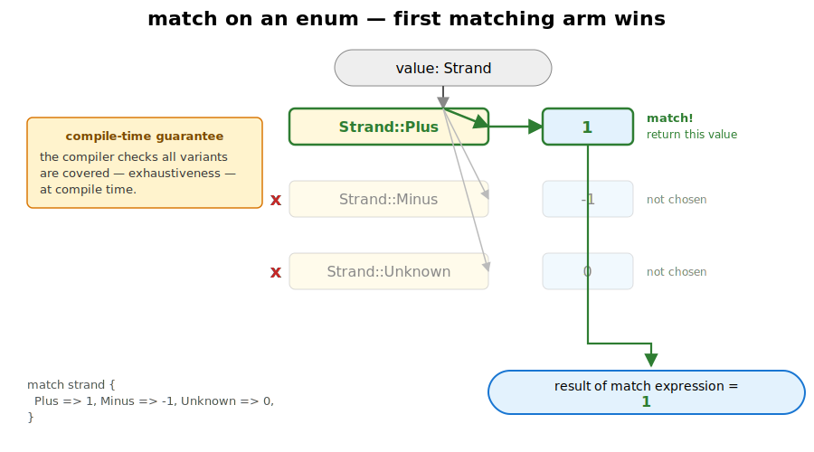
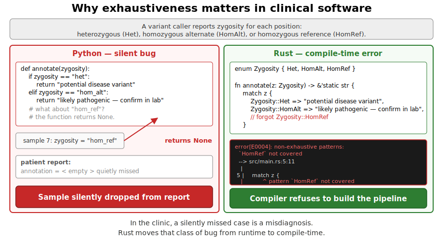
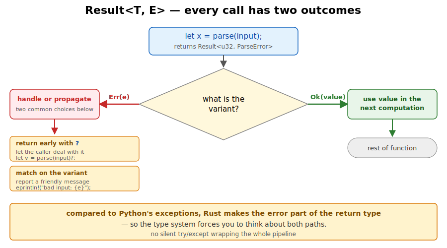

## What this lecture is

::: {.incremental}
- Day 3 is where Rust starts to feel like Rust: types model the biology, the compiler keeps you honest
- One concept per slide — *what it is*, *why it works this way*, a bioinformatics example
:::

::: notes
Yesterday you wrote functions over slices of bytes. Today the data gets shape. A genomic interval has a chromosome, a start, an end, and a strand — that wants to be one value, not four loose variables. A variant is either a SNP or an insertion or a deletion — that wants to be one type with three shapes, not a tagged tuple.

The two language features for this are `struct` and `enum`. They lead directly to `Option`, `Result`, exhaustive matching, iterators, and hash maps — every exercise today exercises some combination of them.
:::

## `struct` — a named bundle of fields

```rust
struct GenomicInterval {
    chrom: String,
    start: u64,
    end: u64,
}

let iv = GenomicInterval {
    chrom: "chr1".to_string(),
    start: 1000,
    end: 2000,
};
println!("{}-{}", iv.start, iv.end);
```

Field-by-field construction. Access fields with `iv.start`. → [Book: structs](https://doc.rust-lang.org/book/ch05-00-structs.html)

::: notes
A struct names a fixed set of fields and groups them into one value. The fields have types — here `String` and `u64` — and the compiler lays them out in memory in the order you declared them.

Construction is field-by-field. You name every field; there's no "positional" form for a struct with named fields. That sounds verbose, and it is, deliberately: a year from now when you read this code, you don't have to remember which u64 was start.

Accessing fields is `value.field` — same dot syntax as Python or R's `$`.
:::

## A struct in memory

::: {.columns}
::: {.column width="42%"}
**What the programmer wrote**

```text
GenomicInterval {
    chrom: String  // name of
                   // the chromosome
    start: u64     // 0-based,
                   // inclusive
    end:   u64     // 0-based,
                   // exclusive
}
```

A named record, three fields, fixed shape.
:::

::: {.column width="58%"}
**What the machine sees**

{fig-alt="Diagram of struct GenomicInterval in memory. A blue Stack panel shows the struct as five 8-byte rows: chrom.ptr, chrom.len = 4, chrom.cap = 4 (grouped with a brace labelled String header), start = 1000, end = 2000; total 40 bytes on the stack. An orange Heap panel shows a four-cell allocation holding the bytes c, h, r, 1 with indices [0]..[3]; an arrow runs from the chrom.ptr row on the stack to the first heap cell. Footer notes that each field is laid out in place, owned strings keep their characters on the heap, and the struct itself remains a fixed-size record."}
:::
:::

::: notes
The same struct, two views. On the left, what the programmer wrote — a named record of three fields. On the right, what the machine sees — a fixed-size 40-byte record on the stack, with the chromosome name's characters living separately on the heap and the String header on the stack pointing at them.

This is the same Vec layout from yesterday, applied to a field rather than a top-level variable. The compiler computes the struct's size at build time by adding up the sizes of its fields. That fixed size is what lets you put a `GenomicInterval` directly into a `Vec<GenomicInterval>` with no per-element heap allocation.
:::

## `impl` — methods belong to the type

::: {.columns}
::: {.column width="55%"}
**Rust**

```rust
impl GenomicInterval {
    fn length(&self) -> u64 {
        self.end - self.start
    }
}
```

`&self` is a read-only borrow of the value — the same borrow you saw yesterday, now used as the receiver of a method.
:::

::: {.column width="45%"}
**Python (for comparison)**

```python
class GenomicInterval:
    def length(self):
        return self.end - self.start
```

Same idea — methods attached to a type — different syntax.
:::
:::

Call site: `iv.length()`.

::: notes
Methods live in an `impl` block, separate from the data definition. The first parameter is the receiver: one of `&self`, `&mut self`, or `self` — borrow read-only, borrow mutably, or consume the value. Same ownership rules you saw yesterday, now applied to method receivers.

The Python side shows the equivalent class. `self` in Python is the explicit first parameter, same as Rust. The big practical difference: Rust distinguishes read-only borrows (`&self`) from mutable borrows (`&mut self`) at the type level, where Python silently allows mutation everywhere.

The next slide adds a mutating method and a constructor.
:::

## More methods — mutation and construction

```rust
impl GenomicInterval {
    fn shift(&mut self, by: u64) {
        self.start += by;
        self.end   += by;
    }

    fn new(chrom: String, start: u64, end: u64) -> Self {
        Self { chrom, start, end }
    }
}
```

- `&mut self` — mutable borrow; lets the method change the fields.
- `new` takes no `self` — it's an **associated function** [a function attached to the type itself, not to an instance], called as `GenomicInterval::new(...)`.
- `Self` inside the block is shorthand for "the type we're implementing".

Call sites: `iv.shift(100)`, `GenomicInterval::new("chr1".to_string(), 1000, 2000)`.

::: notes
A method with `&mut self` can mutate the receiver — `shift` here moves both endpoints by the same offset.

A function in an `impl` block with no `self` parameter is what Rust calls an "associated function" — it belongs to the type rather than to any particular instance. The conventional name for a constructor is `new`, but it's just a function — you can have several with different names (`from_string`, `with_strand`, etc.).

`Self` (with a capital S) inside an impl block means "the type we're implementing". Writing `Self { ... }` is shorter and survives renames better than typing `GenomicInterval { ... }` every time.
:::

## `#[derive(...)]` — the compiler writes the obvious code for you

```rust
#[derive(Debug, Clone, PartialEq, Eq)]
struct GenomicInterval {
    chrom: String,
    start: u64,
    end: u64,
}
```

The compiler writes the obvious **trait** implementations for you — equality, debug printing, cloning — so you don't type them by hand.

The four you will reach for this week:

- **`Debug`** — `{:?}` printing, for diagnostics
- **`Clone`** — explicit `.clone()` deep copy
- **`Copy`** — assignment copies (only if every field is also `Copy`)
- **`PartialEq`** / `Eq` — `==` and `!=`

::: notes
A trait is a named bundle of methods a type can opt in to — like a Java interface, but more powerful.

A `derive` tells the compiler to write a trait implementation for you, field by field. You almost always want Debug and Clone — Debug to be able to print the value when something is wrong, Clone to make an explicit copy when ownership rules push back.

Copy is more specialised. A type can only be Copy if everything inside it is also Copy. `String` is not Copy because copying it would require allocating new heap storage — so any struct containing a String can be Clone but not Copy. Plain integer types and small enums like `Strand` are fine to make Copy.

PartialEq enables `==` and `!=`. Add `Eq` too when equality is reflexive — which is almost always; the famous exception is `f64`, because `NaN != NaN`.
:::

## `enum` — one of a fixed set of named values

*Sometimes a variable should only hold one of a fixed set of named values — like `Strand::Plus` and `Strand::Minus`.*

::: {.columns}
::: {.column width="48%"}
**Python — the loose way**

```python
# strings as ad-hoc tags:
strand = "+"

if strand == "+":
    score += 1
elif strand == " +":  # typo, never matches
    score += 1
```

Misspelling `"+"` as `" +"` is a bug your test suite may never catch. Using an int (`STRAND_PLUS = 0`) loses self-documentation.
:::

::: {.column width="52%"}
**Rust — `Strand` is a type**

```rust
enum Strand { Plus, Minus }

let s = Strand::Plus;

// passing a string where Strand
// is expected:
fn step(s: Strand) { /* ... */ }
step("+");   // compile error
```

A `Strand` value is one of exactly two named variants. The compiler tracks which.
:::
:::

→ [Book: defining an enum](https://doc.rust-lang.org/book/ch06-01-defining-an-enum.html)

::: notes
The simplest enum is a closed list of names. Strand is either Plus or Minus, full stop. The compiler stores this as a single byte: 0 for Plus, 1 for Minus.

You write `Strand::Plus` at the use site, with the type name as a prefix. This is namespacing — two different enums in the same module can both have a `Plus` variant without colliding.

The Python side shows what we're avoiding. In Python you either pick magic strings — which silently accept any typo — or magic constants like `STRAND_PLUS = 0`, which lose readability and still don't prevent mixing them up with unrelated integer constants. Rust's enum is a type: passing the wrong type is a compile error, and adding a third variant later forces every match expression to be updated.
:::

## Enums that carry data

```rust
enum Variant {
    Snp       { pos: u64, alt: u8 },
    Insertion { pos: u64, bases: Vec<u8> },
    Deletion  { pos: u64, len: u64 },
}
```

Each variant carries its own fields. A `Variant` value is one of the three shapes — and the compiler tracks which.

*Aside: in type-theory jargon this is a "sum type" or "algebraic data type" (ADT) [a value that is exactly one of several named shapes]. You'll see those names in papers and in other languages; in this course we'll just call them enums.*

::: notes
This is the move that turns enum from "list of names" into "list of shapes". Each variant has its own fields, and a `Variant` value is exactly one of the three forms at a time.

The biology maps directly: a variant call from a VCF is either a substitution, an insertion, or a deletion. The fields you care about are different for each. With a struct you'd need a nullable field for everything that doesn't apply, plus a "kind" tag — and nothing stops you reading insertion bases out of a SNP. With an enum, the SNP literally doesn't have a `bases` field; you cannot ask for it.

Other languages call this an algebraic data type, a tagged union, or a sum type — same idea.
:::

## Two enum kinds, two memory layouts

{fig-alt="Two-panel diagram. Left panel: enum Strand { Plus, Minus } shown as a single tiny tag cell with values 0 = Plus, 1 = Minus, labelled 1 byte total and fits in a register. Right panel: enum Variant { Snp{..}, Insertion{..}, Deletion{..} } shown as a small tag cell plus a payload box. The payload box contains three stacked variant rows: Snp { pos: u64, alt: u8 } at ~16 B, Insertion { pos: u64, bases: Vec<u8> } at ~32 B highlighted in orange as the largest variant, Deletion { pos: u64, len: u64 } at 16 B. A brace and annotation explain the size is tag + size of the largest variant, ~40 bytes per Variant value. Footer notes a C-style enum is a tagged integer while a sum-type enum is a tag plus a union of payloads; the compiler reads the tag to know which match arm applies."}

**In plain English:** every `Variant` value reserves room equal to its biggest case, plus 1 byte to remember which case.

::: notes
The simple enum (`Strand`) compiles down to a single small integer tag. The richer enum (`Variant`) is a tag plus a union of all variant payloads — every value reserves room for the largest variant. So even an `Snp` carries a slot the size of the `Insertion` payload, most of it unused.

"Tagged union" is the traditional CS name for this layout — a memory region (the "union") that can hold one of several types, plus a small "tag" byte that records which type is currently in it. A C-style enum is just the tag part, with no payload.

This is the cost of the abstraction. In return, you get a value that is provably one of N shapes, you cannot read fields from the wrong variant, and the compiler can check that every match expression handles every case.
:::

## `match` — the way you read an enum

```rust
fn ref_alt_delta(v: &Variant) -> i64 {
    match v {
        Variant::Snp { .. }              =>  0,
        Variant::Insertion { bases, .. } =>  bases.len() as i64,
        Variant::Deletion  { len, .. }   => -(*len as i64),
    }
}
```

`match` binds the variant's fields by name inside the arm. The `..` pattern means "ignore the rest".

::: notes
You can't just read `v.bases` — there is no such field on a SNP variant. To get at the contents you have to first establish which variant you have, and `match` is the canonical tool.

Each arm pattern names the variant and destructures its fields. Inside the Insertion arm, `bases` is bound to the actual Vec; inside the Deletion arm, `len` is bound to the actual u64. The compiler enforces that you only touch fields that actually exist on the matched variant.

The `..` in a struct pattern means "any remaining fields I don't care about". Use it freely — it documents intent and keeps the pattern short.
:::

## `match` — control flow

{fig-alt="A value of an enum type enters at the top; below, three arms — one per variant — each labelled with the pattern (e.g. Strand::Plus, Strand::Minus, _); arrows show the value flowing into the first matching arm and its result coming out."}

::: notes
The flow: a value enters from the top; arms are tried top-to-bottom; the first matching arm's body runs; the result is the result of the match expression.
:::

## Exhaustiveness — the safety net

```rust
enum Strand { Plus, Minus }

match strand {
    Strand::Plus  =>  1,
    Strand::Minus => -1,
    // add Strand::Unknown to the enum later? this match becomes
    // a compile error until we handle the new case
}
```

The compiler refuses any `match` that does not cover every variant.

::: notes
This is one of the most practically valuable things in the language. When you add a new variant to an enum — a new strand type, a new variant call, a new file format — the compiler will tell you every single match expression in the entire codebase that needs to be updated to handle the new case.

You cannot ship "I updated the type but forgot one place" bugs of this shape in Rust. The wildcard `_` defeats the check, so reach for it only when you really mean "any other". The compile error is the feature.
:::

## Exhaustiveness in the clinic — why it matters

Imagine a variant-calling pipeline that classifies each genomic position as `Het`, `HomAlt`, or `HomRef`.

::: {.columns}
::: {.column width="50%"}
**Python — easy to forget a case**

```python
if zygosity == "het":
    report_het(call)
elif zygosity == "hom_alt":
    report_hom_alt(call)
# hom_ref silently dropped
```

No warning. No error. The patient gets the wrong report.
:::

::: {.column width="50%"}
**Rust — refuses to compile**

```rust
match zygosity {
    Zygosity::Het    => report_het(call),
    Zygosity::HomAlt => report_hom_alt(call),
    // HomRef missing -> compile error
}
```

The build fails. You cannot ship the bug.
:::
:::

::: notes
In a clinical context — a cancer panel, a rare-disease report — a silently dropped case is a silently missed call. A homozygous-reference position that should have been flagged as a normal control instead never appears in the report. A trailing-space typo on a string tag silently routes every het into the "unknown" bucket.

Rust's exhaustiveness check is not a stylistic nicety. It is the difference between "the test suite happened to cover it" and "the build won't even start if it isn't covered". When the types model the biology — zygosity, variant kind, strand — the compiler enforces the case analysis for free.
:::

## Exhaustiveness — picture

{fig-alt="Side-by-side: left, Python if/elif chain missing one case, with a red arrow showing a silently dropped sample; right, Rust match with a compile-error diagnostic pointing at the missing variant."}

::: notes
The same idea visualised: on the left, the Python pipeline silently drops the missing case at runtime — a sample never appears in the report. On the right, the Rust build fails before it ever runs.
:::

## `Option<T>` — values that may be absent

```rust
enum Option<T> {
    Some(T),
    None,
}

/// Returns the position of the first G base in `seq`,
/// or `None` if there isn't one.
fn first_g(seq: &[u8]) -> Option<usize> {
    for (i, &b) in seq.iter().enumerate() {
        if b == b'G' { return Some(i); }
    }
    None
}
```

`Option<T>` replaces `null`. There is no other way to express absence in a typed value. The `<T>` is a **generic parameter** [a placeholder for "any type" — fill it in at the use site, e.g. `Option<usize>` or `Option<&[u8]>`].

::: notes
A function that might not have an answer returns `Option<T>` rather than a "magic" sentinel value or a nullable pointer. Some(value) is "yes, here is one"; None is "no answer".

`<T>` is the generic parameter — Option works for any type. `Option<usize>` is "maybe an index"; `Option<&[u8]>` is "maybe a slice". The variant is the part that carries information about presence; the type parameter is the kind of thing that's optionally present.

Generics are how Rust avoids writing one Option type per element type. The compiler does what's called "monomorphisation" [generates a specialised copy of the code for each concrete `T` you use] — so `Option<u64>` and `Option<String>` are separate machine-level types under the hood, but you only write the source once.

Java has "Optional", Python has "Maybe" libraries, but in Rust this is *the* way — there is no separate nullable pointer construct. The standard library uses Option<T> for "no such key", "end of iteration", "first element of an empty slice", everywhere.
:::

## Option in memory

{fig-alt="Diagram titled Option<u64> — the same shape, two states, showing the enum Option<T> { Some(T), None }. Left panel headed let opt: Option<u64> = Some(42) shows a blue stack region with a small tag cell containing 1 next to a wider u64 payload cell containing 42, labelled Some and contains the value. Right panel headed let opt: Option<u64> = None shows an orange stack region with a tag cell containing 0 next to a dashed-border u64 payload cell labelled (unused, garbage), with the captions None and compiler refuses to read. A green callout at the bottom reads: Option<T> replaces null. The compiler refuses to read the value until you have checked which variant you have, followed by a match opt example."}

::: notes
The memory shape of Option is exactly what you'd expect from a tagged union: a tag byte plus enough room for the inner value. For None, the payload region still exists, but its contents are undefined garbage — and the compiler enforces that you never look at it.

The compiler's refusal to let you blindly read the payload is the whole point: a `null pointer dereference` simply cannot happen, because there is no `.value()` method that doesn't first force you to handle the None case.
:::

## Using `Option` — `match`, `if let`, helpers

```rust
match first_g(seq) {
    Some(i) => println!("first G at {i}"),
    None    => println!("no G in this read"),
}

if let Some(i) = first_g(seq) {                  // only care about Some
    println!("first G at {i}");
}

let i = first_g(seq).unwrap_or(0);               // missing G means 0
let i = first_g(seq).expect("read must contain a G");  // panic if None
```

→ [`Option` docs](https://doc.rust-lang.org/std/option/enum.Option.html)

::: notes
Four ways to consume an Option, in decreasing order of how much they make you think about None.

`match` is the full case analysis — explicit, exhaustive, always correct.

`if let Some(x) = opt` is sugar for a match where you only care about one variant; the None case is silently dropped. Use when the absence is uninteresting.

`unwrap_or(default)` returns the inner value or the default — handy for "missing means zero" reductions.

`expect("...")` returns the inner value or panics with your message if None. Use when None really shouldn't happen here and you want a loud crash if it does — never use it in code that could see real-world bad input.

There's no plain `.unwrap()` on this slide on purpose; it's the same as `expect` with a useless message.
:::

## `Result<T, E>` — operations that can fail

```rust
enum Result<T, E> {
    Ok(T),
    Err(E),
}

fn parse_start(s: &str) -> Result<u64, ParseError> {
    match s.parse::<u64>() {
        Ok(n)  => Ok(n),
        Err(_) => Err(ParseError::InvalidStart),
    }
}
```

`Result` is `Option`'s richer sibling — failure carries a value of its own.

{fig-alt="A function returning Result<T, E> shown with two output branches; the Ok(value) branch flows into the caller's next statement, the Err(e) branch routes to an error handler or short-circuits out."}

::: notes
Result is Option's richer sibling: where Option says "value or nothing", Result says "value or this specific error". Both arms carry data; both arm types are generic.

Use Result when failure is meaningful and recoverable: parsing user input, opening a file, parsing a region string. Use Option when "missing" is the right framing and there's no useful error to attach.

The second type parameter, `E`, is the error type. It can be anything: a string, a custom enum like `ParseError` with a variant per failure mode, or a library error type. For the parse_region exercise today, you'll define your own.
:::

## The `?` operator — propagate errors

A minimal example first — one fallible call, one `?`:

```rust
fn parse_count(s: &str) -> Result<u64, std::num::ParseIntError> {
    let n: u64 = s.parse()?;   // if Err, return it; if Ok, bind n
    Ok(n * 2)
}
```

`?` means *if this is `Err`, return it; otherwise unwrap and continue*.

For `?` to compile, the enclosing function must itself return `Result` (or `Option`).

::: notes
The question mark is Rust's shorthand for the four-line match you'd otherwise write at every fallible call site. On `Ok`, it pulls out the inner value and the next line runs as if nothing happened. On `Err`, it returns that Err from the enclosing function immediately.

This minimal example uses the simplest case — a fallible call whose error type matches the function's declared error type. The next slide shows the two helpers (`ok_or`, `map_err`) that bridge between different option/result/error types in a real parser.
:::

## `?` in a real parser — `ok_or` and `map_err`

```rust
fn parse_region(s: &str) -> Result<(String, u64, u64), ParseError> {
    let (chrom, rest)    = s.split_once(':').ok_or(ParseError::MissingColon)?;
    let (start_s, end_s) = rest.split_once('-').ok_or(ParseError::MissingDash)?;
    let start: u64 = start_s.parse().map_err(|_| ParseError::InvalidStart)?;
    let end:   u64 = end_s  .parse().map_err(|_| ParseError::InvalidEnd)?;
    Ok((chrom.to_string(), start, end))
}
```

- `ok_or(err)` turns `Option<T>` into `Result<T, E>` — `split_once` returns `Option`, but we want `?` to propagate a `ParseError`.
- `map_err(|_| ...)` rewrites the error type — `s.parse()` returns the standard `ParseIntError`; we squeeze it into our own `ParseError`.

::: notes
A real parser combines several fallible calls of different shapes. `split_once` returns `Option<(_, _)>` — Some if the separator is present, None if not. `parse()` returns `Result<u64, ParseIntError>` — the standard library's error type.

To make `?` work uniformly, we convert both into our function's declared error type. `ok_or` is the Option-to-Result bridge; `map_err` is the error-rewriter. Together they let every `?` in the function speak the same error language.

This is exercise 2 in shape — define a `ParseError` enum, use `?` to short-circuit on the first failure, return a typed result.
:::

## `?` — control flow visualised

{fig-alt="Diagram of the ? operator. A blue call box at the top reads parse_chrom(s) — returns Result<String, ParseError>. Two arrows diverge from the call: a green arrow labelled Ok(chrom) leads to a green box on the left titled unwrap and continue, showing let chrom: String = ... and the caption next line of the function runs; a red arrow labelled Err(e) leads to a red box on the right titled early return from this function, showing return Err(e); and the caption caller gets the same Err. A dashed grey caller-frame box below reads: enclosing function must itself return Result<_, E> (or Option) for ? to compile, and shows fn parse_region(s: &str) -> Result<Region, ParseError> { ... }."}

::: notes
This is what `?` desugars to. The call returns a Result. On `Ok(value)`, control falls through to the next line of the function and `value` is bound. On `Err(e)`, the same `e` is returned from the enclosing function — execution skips everything below the `?`.

Each `?` in your code is a possible early-return path. That's the trade-off: error propagation is silent at the call site (one keystroke), but it's also local — you can see every place control might leave the function by scanning for `?`.
:::

## Exhaustive matching keeps codon tables honest

```rust
fn translate(codon: &[u8]) -> Option<u8> {
    match codon {
        b"ATG" => Some(b'M'),
        b"TAA" | b"TAG" | b"TGA" => Some(b'*'),
        b"GCT" | b"GCC" | b"GCA" | b"GCG" => Some(b'A'),
        // ... 60 more arms ...
        _ => None,                   // invalid / non-canonical input
    }
}
```

64 codons. `match` checks you cover every byte string in your domain.

::: notes
Codon translation is a function from a 3-byte sequence to an amino acid. The natural Rust shape is a match on byte-string patterns: each arm is one codon, the body is the amino acid.

The pipe operator combines synonymous codons into one arm — alanine is GCT, GCC, GCA, GCG; the four arms collapse to one. The trailing `_ => None` covers anything that isn't a valid codon — an ambiguous base, a partial codon at the end of a sequence.

The genetic code is a small finite table, so a match expression is faster, smaller, and easier to read than a HashMap lookup. This is exercise 3.
:::

## The standard genetic code

{fig-alt="A 4x4 grid showing the standard genetic code. Rows are first base T, C, A, G; columns are second base T, C, A, G; each cell holds four sub-rows for the third base. Each row gives the codon and its one-letter amino acid. Codons are coloured by amino-acid category: hydrophobic in cream, polar uncharged in light blue, basic in light green, acidic in pink, stop codons in dark grey. The standard genetic code — 64 codons grouped by their first and second base."}

::: notes
The standard genetic code as a 4x4 grid. Rows are first base; columns are second base; each cell holds four sub-rows for the third base. Notice how synonymous codons cluster — most third-base changes don't change the amino acid (wobble). This is why the match arm for alanine collapses four codons into one.
:::

## Iterators — describe, don't loop

Iterators are **lazy** [no work happens until something asks for an element — the chain just describes what to do]. Adaptors (`map`, `filter`, `take`) build a chain; **consumers** (`collect`, `count`, `sum`, `for`) drive it.

```rust
let gc_count = seq.iter()
    .filter(|&&b| matches!(b, b'G' | b'C'))
    .count();

let upper: Vec<u8> = seq.iter()
    .map(|&b| b.to_ascii_uppercase())
    .collect();
```

→ [Book: iterators](https://doc.rust-lang.org/book/ch13-02-iterators.html)

::: notes
An iterator is a value that produces other values one at a time. The methods you call on it split into two families: adaptors that wrap one iterator into another (map, filter, take, enumerate) and consumers that actually pull elements through (count, sum, collect, for).

Each adaptor returns a new iterator — no work happens. The whole chain only runs when the consumer asks for elements. This means you can compose long chains without worrying about intermediate allocations.

For most "loop with an accumulator" patterns, an iterator chain is shorter, more declarative, and exactly as fast. The compiler is genuinely good at inlining the closures.
:::

## Iterator chains visualised

{fig-alt="Diagram titled Iterator chain: source to adaptors to consumer, with the code seq.iter().filter(|&&b| b == b'G' || b == b'C').count() across the top. On the left is a vertical column of six source cells labelled source: &[u8] containing A, C, G, T, C, A. In the middle is an orange filter stage labelled .filter(|&&b| ...) keeping only bytes that are G or C; six lines inside read A → drop, C → pass, G → pass, T → drop, C → pass, A → drop, with red drop arrows for the drops and green pass arrows for the passes connecting source to filter. On the right is a green .count() consumer pulling elements until exhausted and displaying the final value 3. Footer: Lazy: each element flows through the chain on demand; nothing happens until the consumer pulls. Compiles to the same loop you would write by hand — zero-cost abstraction."}

::: notes
This is the mental model. Elements flow left to right through the chain. The filter stage examines each one and either lets it pass or drops it. The `count` consumer is on the receiving end, pulling elements until the source is exhausted, incrementing a counter each time.

The chain doesn't materialise any intermediate Vec. There's no "filtered copy of seq" anywhere in memory — each byte is checked and either counted or discarded in place. The compiled code is the same loop you'd write by hand.
:::

## `HashMap` — keys to values

```rust
use std::collections::HashMap;

let mut counts: HashMap<&[u8], usize> = HashMap::new();
counts.insert(b"ATG", 1);
counts.insert(b"TAA", 1);

if let Some(&n) = counts.get(b"ATG") {
    println!("seen ATG {n} times");
}
```

The standard hash table — generic over key type and value type. Lookup is constant-time on average.

→ [`HashMap` docs](https://doc.rust-lang.org/std/collections/struct.HashMap.html)

::: notes
HashMap is Rust's standard hash table. The two type parameters are the key type and the value type — `HashMap<Vec<u8>, usize>` for "k-mer string to count", `HashMap<String, GenomicInterval>` for "gene name to interval", and so on.

`insert` and `get` are the basics. `insert(k, v)` puts an entry in; `get(&k)` returns `Option<&V>` — yes, you have to handle the absent case. Iteration over a HashMap yields key-value pairs in arbitrary order.

For DNA k-mer keys, `Vec<u8>` works but allocates per insertion. Smarter key types — fixed-size arrays, packed 2-bit encodings — exist; we'll mention them but the exercise uses `Vec<u8>` for clarity.
:::

## The entry API — read-modify-write in one call

::: {.columns}
::: {.column width="55%"}
**Rust — two steps, made explicit**

```rust
use std::collections::HashMap;

let mut counts:
    HashMap<Vec<u8>, usize> = HashMap::new();

for window in seq.windows(k) {
    let key = window.to_vec();
    let slot = counts.entry(key).or_insert(0);
    // step 1: get a &mut to the slot
    //         (insert 0 if it wasn't there)
    *slot += 1;
    // step 2: deref the &mut and add one
}
```
:::

::: {.column width="45%"}
**Python — same pattern**

```python
# Python equivalent:
counts[k] = counts.get(k, 0) + 1

# or:
from collections import defaultdict
counts = defaultdict(int)
counts[k] += 1
```

The Rust entry API does the lookup, the maybe-insert, and the get-mut all in one — same effect as `defaultdict`, no extra import.
:::
:::

Idiomatic one-liner: `*counts.entry(window.to_vec()).or_insert(0) += 1;`

::: notes
This is the canonical histogram pattern in Rust. Without the entry API you'd write three lines per insert: look up, branch on Some/None, insert default or increment.

`entry(k)` returns an `Entry` enum that's either occupied or vacant. `.or_insert(default)` collapses both cases into a single `&mut V` — a mutable reference to the value in the slot, either the one that was already there or the default you just inserted.

The deref-and-add-assign at the front (`*entry... += 1`) modifies the value in place. Net effect: one expression, one hash lookup, exactly one allocation if the key is new. This is exercise 4: count every k-mer in a sequence.

The Python side shows the two equivalent idioms. `dict.get(k, 0) + 1` does the same job in a stricter way; `defaultdict(int)` is closer to the Rust pattern but requires an extra import and a different dict type.
:::

## k-mer counts — picture

{fig-alt="Diagram showing 3-mer counts in ATGATGCAT — 7 windows total; ATG appears twice. The DNA sequence ATGATGCAT is shown at the top with a bracket below noting 7 windows of length 3 slide left to right; the first window ATG is outlined in orange. Below is a bar chart of counts for the six distinct 3-mers in alphabetical order: ATG has count 2, while CAT, GAT, GCA, TGA, and TGC each have count 1."}

::: notes
7 windows in ATGATGCAT; ATG appears twice. Each window does one entry-API lookup; new keys are inserted with value 0 then incremented; existing keys are incremented in place. Total: 7 hash lookups, 6 allocations for new keys.
:::

## Closures — anonymous functions that capture

```rust
let threshold = 30;
let high_quality = quals.iter()
    .filter(|q| *q >= threshold)          // captures `threshold` from outside
    .count();
```

`|args| body`. Closures capture the variables they mention from the enclosing scope.

::: notes
A closure is a function value you can pass around — like a Python `lambda`, but more capable. Pipes around the parameter list, then the body.

What makes them "closures" rather than just "function literals" is capture: a closure can refer to variables in the surrounding scope, and the compiler arranges to keep those variables alive as long as the closure is. In the example, `threshold` is captured by the filter's closure.

The `*q` dereferences once: `quals.iter()` yields `&u8`, and `filter` passes a reference to *that* — so `q` is `&&u8` and `*q` reads the byte. The shorter `|&&q| q >= threshold` form destructures both layers in the pattern.
:::

## Closures vs. named functions

```rust
// closure (anonymous, one-shot):
let bump = |q: u8| q + 1;

// equivalent named function — re-usable, no captures:
fn bump(q: u8) -> u8 { q + 1 }
```

The closure form is shorter when the function is one-line and only used here. The named-function form is what you reach for when the function needs a stable name and is called from elsewhere.

::: notes
The named-function `bump` shows what the closure replaces when there are no captures: same body, more syntax, but a real top-level function you can call from anywhere. Pick the closure when the function is throwaway; pick the named function when it needs a stable name.
:::

## To the next lecture

Next lecture: **recursion and trees — modelling a phylogeny.**

::: notes
We've built structs, enums, Option, Result, iterators, HashMap, and closures — enough to write five of today's six exercises directly. The sixth, phylogenetic trees, needs one more idea: a type that contains itself. That's the next lecture.
:::
