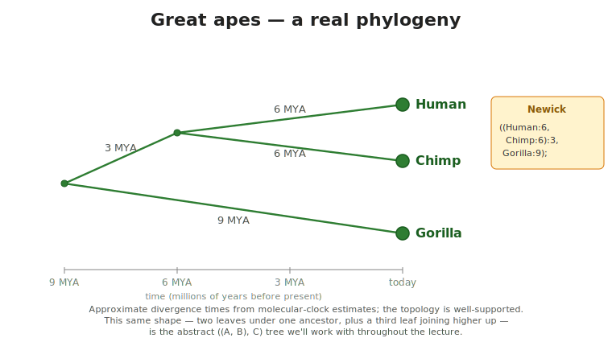
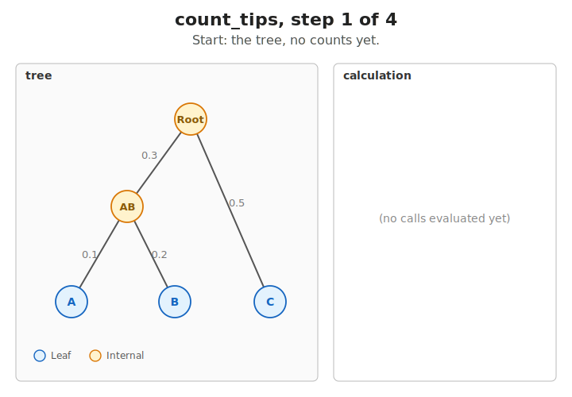
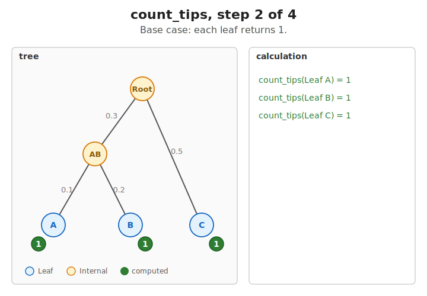
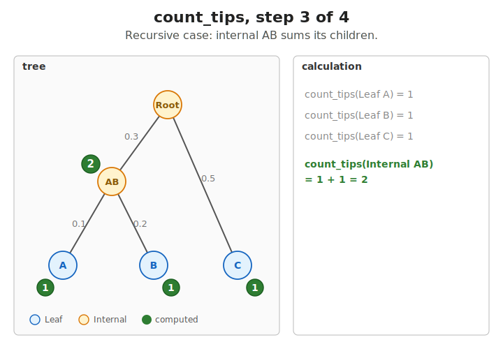
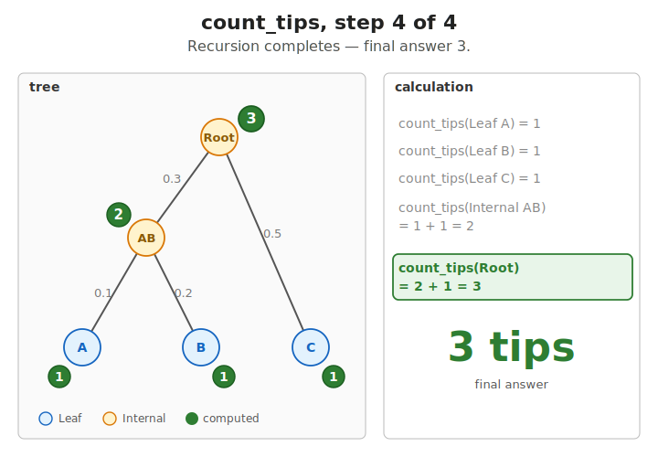
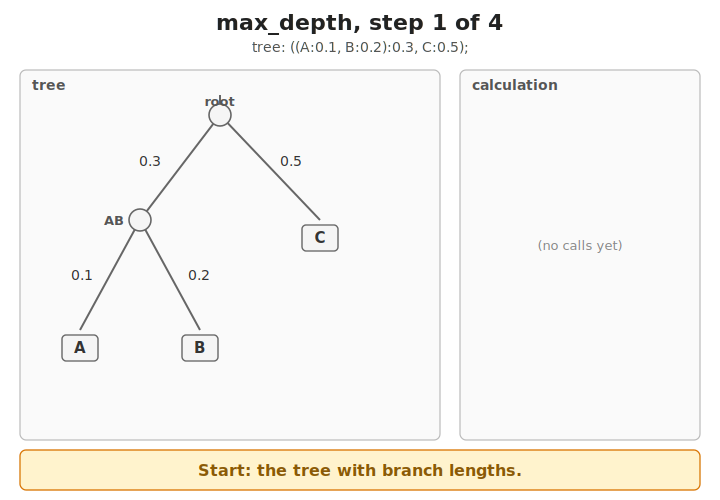
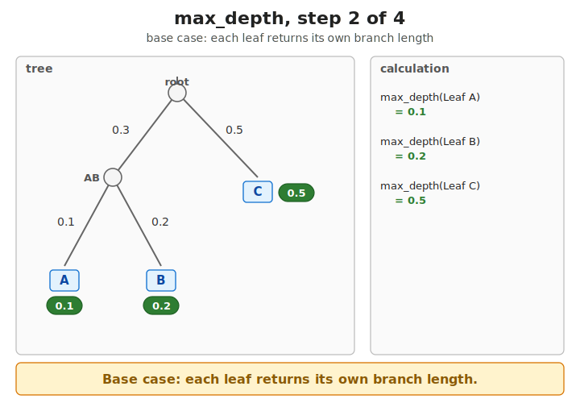
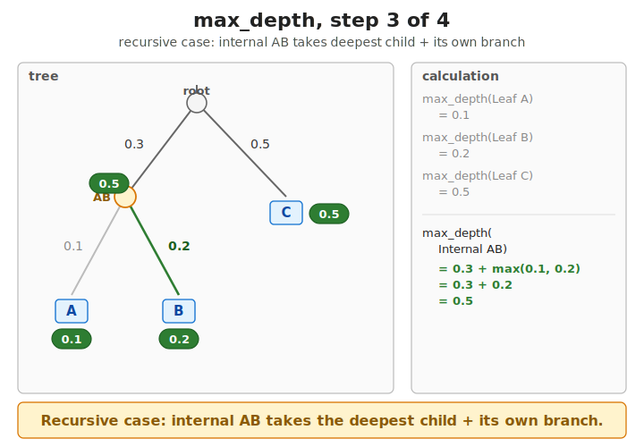
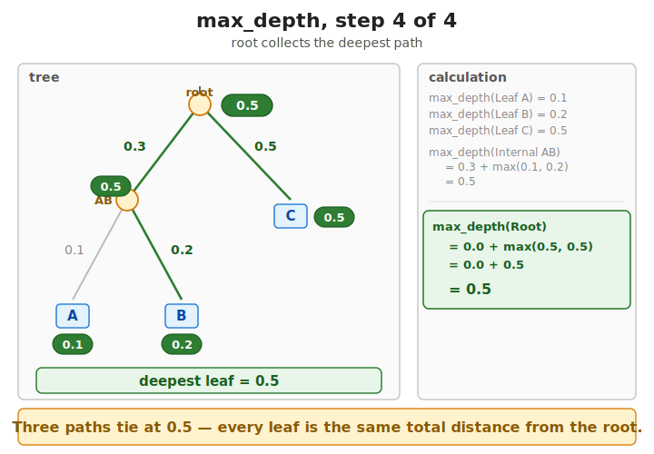

## What this lecture is

Recursive data and recursive code. We'll use a phylogenetic tree as the example throughout — first the data type, then the functions that walk it.

- A tree is a type that contains itself: a node holds its children, which are nodes
- Rust needs one extra ingredient — a small trick to give the compiler a fixed size — to make that type compile
- Once we have the type, the functions almost write themselves

::: notes
Up to now every type we've defined has had a fixed, finite size known at compile time. A struct's size is the sum of its field sizes. An enum's size is its tag plus its largest variant. The compiler computes the layout once and uses it everywhere.

A tree breaks this: a node can have child nodes, which can have child nodes, with no fixed depth. We'll see exactly how that fails to compile in a moment, and what the fix looks like.

The biological motivation is phylogenies. A phylogenetic tree relates species, gene families, viral strains — anything that descends from a common ancestor. Computing on phylogenies is one of the core things bioinformatics does.
:::

## A real lineage tree — great apes

Before any code, here is the kind of object we are going to model — a real, small phylogeny:

{fig-alt="A rooted phylogenetic tree drawn left-to-right. Root at left. Two branches leave the root: one descends to a Human-Chimp ancestor at 6 MYA, which splits to Human and Chimp tips at the present; the other branch is 9 MYA long and ends at the Gorilla tip. Branch lengths labelled in millions of years; a time axis at the bottom shows 9 MYA, 6 MYA, 3 MYA, today. A Newick string `((Human:6, Chimp:6):3, Gorilla:9);` shown in a callout."}

The shape is what we want to capture in Rust: **two tips share a recent common ancestor; a third tip joins higher up**. Throughout the lecture we'll use the same shape with abstract names `(A, B, C)` so the code stays compact — but the structure is the same as Human / Chimp / Gorilla above.

::: notes
Anchor the lecture in something the audience already knows. The picture says "phylogeny" without me having to define it. Note the time axis — branch lengths are real durations, not stylised. The two internal nodes are inferred ancestors we never sequenced; the three tips are living species. The whole rest of the lecture is "how do we write code that walks this shape".
:::

## Phylogenetic trees — what we want to model

A phylogeny (a branching diagram of evolutionary relationships) is built from **internal nodes** (inferred common ancestors) and **tips** / leaves (present-day samples).

At each node we record a **name** (at tips) and a **branch length** — the evolutionary distance to the parent.

{width="75%" fig-alt="A small 3-tip tree shown three ways: a graphical tree, the Newick string ((A:0.1,B:0.2):0.3,C:0.5);, and the equivalent Rust Node::Internal { ... } literal."}

::: notes
Three views of the same tree. The picture is what a biologist draws on a whiteboard; the Newick string is the standard text format the field uses for file storage and exchange; the Rust enum literal is what we'll be computing on for the next forty minutes.

Each view carries exactly the same information: two tips (A and B) form a clade (a group of related tips sharing a common ancestor), the clade joins a third tip (C) at the root, and each edge has a length.

What we want is to be able to ask programmatic questions about a tree value: how many tips, what's the deepest tip, which two tips are most similar. Those questions are naturally recursive — a question about a tree decomposes into the same question about each subtree.
:::

## Why this won't compile yet

```rust
// This does NOT compile:
enum Node {
    Internal { left: Node, right: Node },
    Leaf,
}
// error[E0072]: recursive type `Node` has infinite size
```

`size(Node) = 1 + 2 × size(Node)` — no fixed answer.

The `1` is the variant **tag**; the `2 × size(Node)` is two child Nodes inlined into the parent — that's the part with no finite answer.

The fix: store a pointer to each child instead of the child itself.

::: notes
A type that contains itself directly cannot have a fixed size — every layer would add the size of one more Node, recursively, forever. The compiler can't lay it out and rejects the definition.

The same problem turns up in any language where types have fixed sizes. The standard fix is "use a pointer instead": the pointer is a fixed size (8 bytes on a 64-bit machine) regardless of what it points at. We'll see Rust's version of that next.
:::

## `Box<T>` — indirection makes it work

- `Box<T>` = a small handle (8 bytes) that points to a value stored elsewhere in memory ("the heap" [the region the program allocates from at runtime when sizes aren't known up front]).
- The parent's size is now fixed; the child lives somewhere else.

{fig-alt="Two-panel diagram. Left panel headed enum Node { Internal { left: Node, right: Node }, Leaf } in red with subtitle compile error: recursive type has infinite size shows six nested Node boxes Russian-doll-style, the innermost containing ellipses and ...forever, with the footer size(Node) = 1 + 2 × size(Node), no fixed answer — compiler rejects. Right panel headed enum Node { Internal { left: Box<Node>, right: Box<Node> }, Leaf } in green with subtitle Box<T> is a heap pointer — always 8 bytes shows a blue Stack region containing a Node::Internal with two pointer cells left: and right:, labelled 2 × 8 byte pointers; on the right an orange Heap region holds two child Node::Leaf boxes labelled fixed size, with blue arrows from the pointer cells to the child boxes. Footer: size(Node) = tag + 2 × 8 (fixed); children live on the heap, the parent is a small record on the stack."}

::: notes
`Box<T>` is the standard owned heap pointer — a non-null pointer that owns the value it points at, and frees it when the box is dropped. The pointer itself is always 8 bytes on a 64-bit machine, regardless of how big T is.

So `Box<Node>` is 8 bytes. The parent Node now has a fixed size: tag plus two 8-byte pointers. Each child Node lives on the heap and may itself contain Boxes pointing at further descendants. The tree's depth becomes a runtime property; the layout of any one node is fixed at compile time.

This is what "heap indirection" means in CS jargon — you store a pointer (the "indirection") to a value on the heap, rather than the value itself.

For the phylogeny exercise the children live in a `Vec<Node>` instead of `Box<Node>`. A Vec is also a fixed-size header (24 bytes) pointing at heap storage, so the same trick applies — Vec gives you variable arity [the ability to have a different number of children at each node — two here, twenty there — without changing the type] for free.
:::

## A phylogenetic tree as a recursive enum

```rust
enum Node {
    Leaf     { name: String,        branch_length: f64 },
    Internal { branch_length: f64,  children: Vec<Node> },
}
```

A leaf is a tip species; an internal node groups child sub-trees. `Vec<Node>` provides the indirection (heap-allocated children) and the variable arity (two children or twenty — same type).

::: notes
This is exercise 5. A phylogenetic tree is naturally a recursive structure: each node is either a tip (Leaf) carrying a species name and the branch length leading to its parent, or an internal node grouping a list of child sub-trees.

The Vec<Node> gives us two things at once. First, the indirection that makes the enum's size finite — Vec's three-field header is fixed even when the children list grows. Second, variable arity — an internal node can have two children or twenty, same type.

Notice that the root has a `branch_length` field. In a strict reading of phylogenetics the root has no parent and therefore no branch length, but Newick stores one anyway (often zero or missing); we keep the field for symmetry and let it be zero at the root.
:::

## Building a tree by hand

The cleanest way to test a tree function: hard-code a small tree in `main` and call your function on it.

```rust
fn main() {
    // The tree ((A:0.1, B:0.2):0.3, C:0.5);
    let tree = Node::Internal {
        branch_length: 0.0,
        children: vec![
            Node::Internal {
                branch_length: 0.3,
                children: vec![
                    Node::Leaf { name: "A".to_string(), branch_length: 0.1 },
                    Node::Leaf { name: "B".to_string(), branch_length: 0.2 },
                ],
            },
            Node::Leaf { name: "C".to_string(), branch_length: 0.5 },
        ],
    };

    println!("{} tips", count_tips(&tree));
}
```

The repetition is on purpose: when you can read the *structure* of the literal, you can read any recursive enum.

::: notes
For real work you'd parse a Newick file. For learning the data structure, write it by hand once — the muscle memory of nesting `Internal { children: vec![ Internal { ... }, Leaf { ... } ] }` is the muscle memory of every recursive type.
:::

## A two-tip warm-up — the simplest tree

Before counting tips of the 3-tip tree, here's the absolute minimum:

```rust
let tiny = Node::Internal {
    branch_length: 0.0,
    children: vec![
        Node::Leaf { name: "A".to_string(), branch_length: 0.5 },
        Node::Leaf { name: "B".to_string(), branch_length: 0.7 },
    ],
};
```

Two leaves under one ancestor. If `count_tips(&tiny)` returns 2, your function works on the base cases (leaves) and on a one-deep recursive case. The 3-tip tree on the next slide adds a second level.

::: notes
A debugging trick: when a recursive function gives the wrong answer, hand it a 2-leaf tree first. If that's wrong, the bug is in the leaf or one-deep case, not the recursion.
:::

## Recursive functions — match the type

To count the tips of a tree:

> if the tree is a Leaf, the answer is **1**.
> If Internal, the answer is the **sum** of the tip counts of each child.

The explicit shape — an accumulator and a loop:

```rust
fn count_tips(node: &Node) -> usize {
    match node {
        Node::Leaf { .. } => 1,
        Node::Internal { children, .. } => {
            let mut total = 0;
            for child in children {
                total += count_tips(child);
            }
            total
        }
    }
}
```

::: notes
The function shape mirrors the type shape. A leaf contributes one tip. An internal node's tip count is the sum of its children's tip counts. The match exhausts both variants; the recursion bottoms out at leaves.

This version is the one most readers can read off without thinking: declare a mutable accumulator, loop, add, return.

This is the central pattern of recursive code on recursive types: one `match` arm per variant, and the recursive arms call the function on each contained sub-tree.
:::

## The idiomatic Rust version

The idiomatic Rust version collapses the loop into an iterator chain:

```rust
fn count_tips(node: &Node) -> usize {
    match node {
        Node::Leaf { .. } => 1,
        Node::Internal { children, .. } =>
            children.iter().map(count_tips).sum(),
    }
}
```

Same code, same speed — the second is what you'll see in Rust idiom.

::: notes
This uses iterators: `map(count_tips)` produces an iterator of usize values, and `sum()` reduces them. `count_tips` is passed by name as a function value to `map` — Rust functions are first-class.

Either version is fine to write; they produce the same machine code. The iterator form is what you'll see in idiomatic Rust because it composes well with `.filter()`, `.take_while()`, and so on.
:::

## Counting tips — step by step

Count accumulates bottom-up — leaves return 1, each internal node sums its children.

{fig-alt="The example tree shown with no annotations." width="65%"}

::: {.fragment}
{fig-alt="The same tree with each leaf labelled with the return value 1." width="65%"}
:::

::: {.fragment}
{fig-alt="Internal node now labelled with 2." width="65%"}
:::

::: {.fragment}
{fig-alt="Root labelled 3 — final answer." width="65%"}
:::

::: notes
The fragments [reveal.js term for slide-show steps that appear on successive clicks] step through the same call stack a debugger would show, but drawn on the tree. Each leaf hits the base case and returns 1; each internal node waits for all its recursive calls to return, then sums.
:::

## Another walk: deepest leaf

> The depth of a tree is the longest path from the root to any leaf.
> A leaf is at depth **0**. An internal node is at depth **1 + the max depth among its children**.

```rust
fn max_depth(node: &Node) -> usize {
    match node {
        Node::Leaf { .. } => 0,
        Node::Internal { children, .. } =>
            1 + children.iter().map(max_depth).max().unwrap_or(0),
    }
}
```

Same shape as `count_tips`: one arm per variant, recursive call per child, combine with an iterator method.

About the `unwrap_or(0)`: `.max()` on an empty list returns `None` (no answer); `unwrap_or(0)` says "treat that as 0". An internal node with no children is biologically odd but allowed by the type — this keeps the function total.

::: notes
The pattern generalises. To compute almost anything about a tree, write one arm per variant of `Node`. For each recursive arm, call the function on every child and combine the results — with `sum`, `max`, `min`, `count`, `collect`, or your own combiner.

`unwrap_or(0)` handles the edge case of an internal node with no children — `.max()` on an empty iterator returns None. In practice phylogenetic internal nodes have at least two children, but the type doesn't enforce that, so we cover the case.

If you wanted total branch length instead of depth, you'd add `*branch_length + ...` in the internal arm. If you wanted the name of the deepest leaf, you'd return a `(usize, String)` pair and combine with `max_by_key`. Same skeleton, different combiner.
:::

## Max depth — step by step

Same bottom-up flow as tip-counting, but the combiner is `max` over branch-lengths instead of `sum`.

::: {.fragment}
{fig-alt="The example tree with no depth annotations." width="65%"}
:::

::: {.fragment}
{fig-alt="Each leaf labelled with its branch length." width="65%"}
:::

::: {.fragment}
{fig-alt="Internal node labelled 0.5." width="65%"}
:::

::: {.fragment}
{fig-alt="Root labelled 0.5 — final answer." width="65%"}
:::

::: notes
This version of `max_depth` measures *evolutionary distance* (sum of branch lengths) rather than the integer hop-count we coded one slide back. Same recursive skeleton; the only differences are that leaves now return their own branch length (not zero) and the combiner adds the node's own branch length to the max of the children. Same shape, different arithmetic.
:::

## Collecting all tip names

Same recursion shape, different *return type* — instead of a number, a list of strings:

```rust
fn collect_tip_names(node: &Node) -> Vec<String> {
    match node {
        Node::Leaf { name, .. } => vec![name.clone()],
        Node::Internal { children, .. } => {
            children.iter()
                .flat_map(|child| collect_tip_names(child))
                .collect()
        }
    }
}
```

For `((A:0.1, B:0.2):0.3, C:0.5);` this returns `["A", "B", "C"]`.

`flat_map` (a built-in iterator method that maps and flattens in one step) collects each child's Vec of names and chains them together — the recursive pattern is identical to `count_tips`, but the return type changed.

::: notes
Two recipes — one returns `usize`, one returns `Vec<String>`. The *recursion structure* is identical: handle the leaf base case, recurse on each child, combine the results. Once you've written one, you've written them all.
:::

## More walks of the same shape

Once you have the recursion pattern, biology walks pour out:

| Function | Returns | Combine |
|---|---|---|
| `total_branch_length(node)` | `f64` | sum of own + all children's |
| `count_internal_nodes(node)` | `usize` | 1 + sum of children's (Leaf returns 0) |
| `find_tip(node, name)` | `Option<...>` | first matching leaf, else recurse |
| `tips_at_depth(node, d)` | `Vec<String>` | tips whose root-distance equals `d` |
| `prune_by_name(node, names)` | `Option<Node>` | drop subtrees whose only tips are in `names` |

All the same shape: match Leaf vs Internal, base case + recursive case, combine the children's answers. The combinator changes (`+`, `max`, `concat`, `first match`, etc.) but the skeleton is identical.

::: notes
Every one of these is 5-10 lines once you've internalised the pattern. None require a new concept beyond what we've shown — they reuse `match`, recursion, iterator combinators on `children.iter()`. Try one as a warmup at home.
:::

## Recursion has a depth cost

Every recursive call pushes a **stack frame** onto the **call stack**.

```text
max_depth(root)
  max_depth(child_1)
    max_depth(grandchild_1a)
      max_depth(great_grandchild_1a_i)   ← deeper = more frames
        ...
```

The stack has a fixed size (a few megabytes by default). Very deep recursion can run out of room — a **stack overflow**.

::: notes
A stack frame is a chunk of memory holding the call's local variables and return address. The call stack is the program's per-thread stack of in-progress function calls.

The call stack is the data structure your program uses to keep track of which function is currently running and where to return to when it finishes. Each call adds a frame; each return pops one.

The default stack size on Linux is 8 MB, on Windows 1 MB, on threads spawned by the standard library 2 MB. A typical recursive frame is a few dozen to a few hundred bytes — so you can usually go a few tens of thousands of levels deep before hitting the wall.
:::

## When recursion is safe

When recursion depth matters:

- **Phylogenies**: a few hundred internal nodes at most — well within the budget. Recursion is fine.
- **Long sequences**: a million bases would mean a million frames — would crash. Use an explicit loop or an iterative work-list instead.

Rust does not guarantee **tail-call optimisation**; some other languages do, but you can't rely on it here.

::: notes
Tail-call optimisation is a compiler trick that reuses a single stack frame for recursive calls in tail position — so it can't overflow.

The practical rule: trust recursion when the depth is bounded by something biologically small (tree heights, codon tables, parser states). Switch to iteration when the depth is bounded by something large (sequence length, genome size, number of reads).

Some functional languages — OCaml, Scheme, Haskell — optimise away tail calls and let you write deeply-recursive code without paying the stack cost. Rust does not. The LLVM backend sometimes will, in release mode, but it's not guaranteed and you should not depend on it.
:::

## To the next lecture

Next lecture: **when recursion isn't enough — dynamic programming, with sequence alignment as the example.**

::: notes
Recursion is enough for trees because each node is visited once: the work is proportional to the size of the tree. That's not true for every recursive problem — some recursions revisit the same sub-problem exponentially often, and naive recursion becomes unusable. The fix is dynamic programming, and the canonical example is sequence alignment. That's lecture 3.
:::
