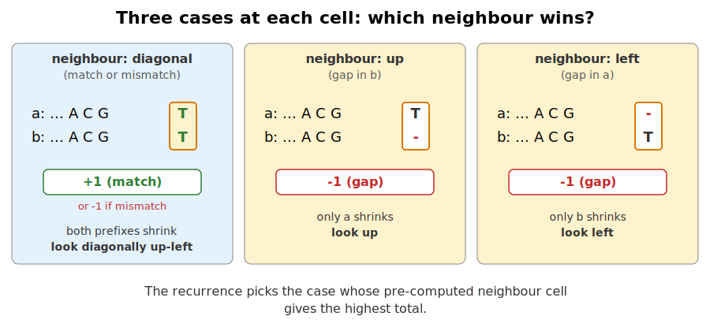
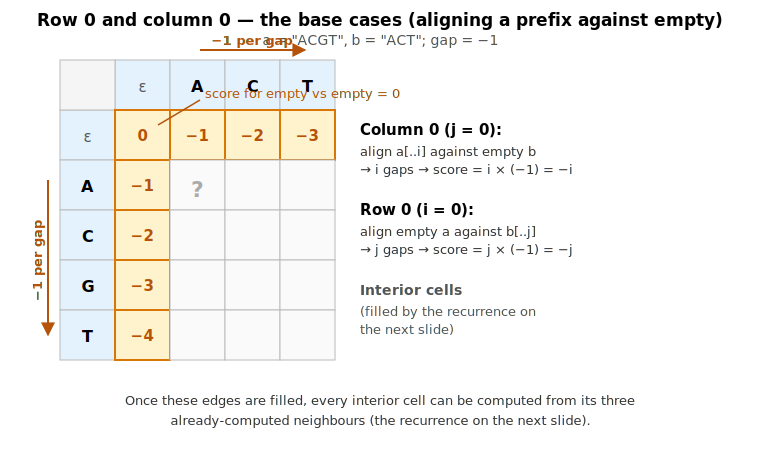

## What this lecture is

Some recursions redo the same work over and over. We'll see one (alignment) and the fix (remember answers in a table).

::: notes
In the previous lecture we wrote recursive code over a tree: one visit per node, total work proportional to the size of the tree. That works because each node is a distinct **subproblem** [a smaller version of the same problem, asked on part of the input].

Some recursions don't have that property. The same subproblem is reached from many different paths in the recursion tree, and naive recursion ends up redoing the same work an **exponential** number of times [the work doubles, triples, or worse for every one extra unit of input — quickly becoming impossible]. The fix is to compute each subproblem once and remember the answer — turning the run time into a **polynomial** [grows like input-size to a fixed small power — e.g. n² — and stays tractable].

That trick — "remember the answer in a table" — is dynamic programming. It shows up all over bioinformatics: alignment, edit distance, RNA folding, hidden-Markov-model decoding.
:::

## Sequence alignment — the problem

Given two sequences — two proteins, two reads, or a read against a reference — find the best way to line them up character-by-character so similar regions stack, allowing substitutions, insertions, and deletions.

A small example: align `CACGT` against `CAGT`.

```text
  C A C G T
  | |   | |
  C A - G T          score: 4 matches, 1 gap
```

Why we care: detecting orthologous genes, calling mutations from sequencing reads, searching a database for similar proteins, mapping reads to a reference genome — all variants of "find the best alignment".

::: notes
This is one of the oldest and most-used algorithms in bioinformatics. Needleman-Wunsch (the classic global-alignment DP) was published in 1970; the BLAST family of database-search tools, minimap2, bwa, and essentially every read mapper either run this directly or run a faster heuristic that approximates it.

For the example, we have `CACGT` and `CAGT`. The shorter sequence is missing one character compared to the longer one. The alignment above proposes that the missing character corresponds to position 3 of the longer sequence — that's the gap, written as a dash.

There are many other possible alignments; the question we want to answer is which alignment is "best", under some scoring scheme that rewards matches and penalises mismatches and gaps.
:::

## The naive recursion — what we'd write first

Follow the English: at each step, align the last two characters, drop one from `a`, or drop one from `b`. Take the best of the three.

**The key insight:** an alignment of `a` against `b` reads from left to right and ends somewhere. The very last column of any alignment falls into exactly one of three cases:

1. **Match or mismatch** — the last character of `a` is aligned with the last character of `b`. Both prefixes [the parts of each sequence up to that point] shrink by 1.
2. **Gap in `b`** — the last character of `a` is aligned with `-` (a gap). Only `a`'s prefix shrinks.
3. **Gap in `a`** — `b`'s last character is aligned with `-`. Only `b`'s prefix shrinks.

So the optimal score for the full alignment is the maximum of three smaller-prefix problems plus the appropriate score for that last column. That is what the function below computes — recursively.

```rust
fn align_naive(a: &[u8], b: &[u8]) -> i32 {
    if a.is_empty() || b.is_empty() {
        return missing(a, b);
    }
    max3(
        align_naive(&a[..a.len()-1], &b[..b.len()-1]) + score(a, b),
        align_naive(&a[..a.len()-1], b) + GAP,
        align_naive(a, &b[..b.len()-1]) + GAP,
    )
}
```

Each call makes three more calls. The same little subproblem is recomputed over and over — that's the explosion.

The function is correct because it covers exactly those three cases; what makes it **slow** is that the same sub-prefix gets computed over and over.

::: notes
This is the algorithm you'd write off the top of your head before knowing dynamic programming exists — and it's exactly what an exam paper would ask you to write. The structure is correct, the code is short, and the result it would compute (if it ever finished) is the true optimal alignment score.

The problem is purely computational. Look at what happens for tiny inputs. To compute `align("CA", "CA")` we need three subproblems: `align("C", "C")` plus a diagonal score, `align("C", "CA")` minus a gap, `align("CA", "C")` minus a gap. The latter two each in turn need `align("C", "C")` as one of *their* three subcalls. So `align("C", "C")` gets recomputed three separate times — from each of the three callers — and that ratio compounds at every level.

The fix on the next two slides is to compute each `(i, j)` subproblem exactly once and remember the answer in a table. That's dynamic programming.
:::

## Why naive recursion is too slow

The naive approach: try every possible alignment, return the highest score.

A length-$n$ alignment can independently choose match, insert, or delete at each position — the number of alignments of two length-$n$ sequences grows roughly like $3^n$.

| $n$ | $3^n$ |
|---|---:|
| 10 | 59 049 |
| 20 | 3.5 × 10⁹ |
| 50 | **7.2 × 10²³** |

For $n = 50$, that's about 7 × 10²³ alignments — **longer than the age of the universe in nanoseconds**.

We need a smarter approach. The smarter approach is dynamic programming.

::: notes
The exponential blow-up comes from making independent decisions at each position. If you write the naive recursion — "best alignment of a[..i] vs b[..j] is the max of three options, each of which recurses on a smaller prefix pair" — you'll find the recursion tree has 3 branches at every level.

Real protein alignments are routinely 300–500 residues; whole-genome alignment is millions. The naive algorithm is simply not an option. And yet the problem is solved millions of times a day, in milliseconds. That gap between "obvious algorithm impossible" and "real algorithm fast" is what dynamic programming fills.
:::

## Dynamic programming — the idea

**Observation:** many of those exponential alignments share subproblems. The optimal alignment of `CAC` vs `CA` is computed once but reused thousands of times in the naive recursion.

**Idea:** define `score[i][j]` = the score of the best alignment of `a[..i]` against `b[..j]`. Compute each cell **exactly once**, in dependency order. This is called **memoisation** [storing computed answers in a table so you never compute the same subproblem twice].

Each cell depends on three neighbours (diagonal, up, left).

For two length-50 sequences:

- Naive recursion: about **7 × 10²³** alignments — longer than the age of the universe.
- DP table: about **2500 cells**, each cheap.

::: notes
The shift in perspective: instead of building the answer top-down by recursive case analysis (which revisits subproblems), build it bottom-up by filling a table (which visits each subproblem once).

Each cell `score[i][j]` is one subproblem — "what is the best score for the prefix pair (a[..i], b[..j])?" There are exactly (n+1) × (m+1) such cells, and each is filled in constant time by looking at three already-filled neighbours.

For n = m = 50: 51 × 51 ≈ 2 500 cells, compared to 7 × 10²³ alignments. The CS shorthand for this is O(n × m) work versus O(3^n) — but the concrete comparison is the more striking one. Many orders of magnitude separate "tractable on a wristwatch" from "impossible in any practical sense".
:::

## Where else this trick shows up

The same recipe — define one subproblem per table cell, fill the table once — reappears in:

- **edit distance** — how many single-character edits separate two strings
- **longest common subsequence** — the `diff` algorithm
- **RNA secondary structure prediction**
- **shortest path in a directed acyclic graph**
- **Viterbi decoding for HMMs** — basecalling, gene finding

Once you've seen DP, you'll recognise it everywhere.

::: notes
The same skeleton — "define one subproblem per table cell, fill the table once" — works for an enormous range of problems beyond alignment. The list here is a small sample of the algorithms students will meet across a bioinformatics career, all of them written as a table-fill rather than a tree of recursive calls.

We'll revisit this list at the end of the lecture once the alignment example is concrete.
:::

## The rule for filling one cell

{width="70%" fig-alt="A 2x2 grid showing four cells [i-1][j-1], [i-1][j], [i][j-1] in grey as predecessors, with the cell [i][j] highlighted in orange as the target. Three arrows from the predecessors converge on the target."}

{fig-alt="Three small alignment diagrams shown side by side. Each shows the last column of an alignment: case 1 is the last character of a stacked over the last character of b with a match-or-mismatch score; case 2 shows the last character of a stacked over a gap dash; case 3 shows a gap dash stacked over the last character of b. Each case is labelled with which DP neighbour cell it corresponds to (diagonal, up, left)." width="80%"}

Three options for filling cell `[i][j]`:

- **diagonal**: `score[i-1][j-1] + s(a[i], b[j])` — match/mismatch
- **up**: `score[i-1][j] + gap` — `a[i]` aligns to a gap in `b`
- **left**: `score[i][j-1] + gap` — `b[j]` aligns to a gap in `a`

`score[i][j]` = the maximum of the three. CS jargon for this rule: the **recurrence**.

::: notes
Each cell is filled from its three already-computed neighbours; the rule is the same in every cell.

The function `s(a, b)` is the scoring function — typically +1 for a match, -1 for a mismatch, or in practice a substitution matrix like BLOSUM-62 for proteins. The gap penalty is some negative number that discourages introducing gaps.

There's a base case: the first row and first column are filled by "gap, gap, gap..." — aligning a non-empty prefix to an empty one. Once those are set, every other cell is the max of three already-filled neighbours.
:::

## Filling the edges first

Before we apply the rule to the interior cells, we have to fill **row 0 and column 0** by hand. They represent aligning a prefix of `a` against the empty string (or vice versa), and the only way to do that is with gaps.

For column 0 (aligning `a[..i]` against empty `b`): `i` gaps in `b`, total score `i * gap`.

For row 0 (aligning empty `a` against `b[..j]`): `j` gaps in `a`, total score `j * gap`.

{fig-alt="A 5×5 grid representing the DP matrix. Row 0 (top) and column 0 (left) are highlighted in yellow with the values 0, -1, -2, -3, -4 along each. Annotation arrows on row 0 and column 0 indicate the cumulative gap penalty pattern. The interior cells are blank."}

Once the edges are filled, the recurrence rule on the next slide fills every interior cell from its three already-computed neighbours.

::: notes
This is the bridge that the previous slide-deck version skipped. Students staring at the filled matrix on the next slide wonder where the `-1, -2, -3` along the edges came from. Now they know.
:::

## The filled matrix

{width="65%" fig-alt="A worked Needleman-Wunsch matrix for a = ACGT and b = ACT with scoring match +1, mismatch -1, gap -1."}

For the highlighted cell `score[3][2]` (row G, column C):

- diagonal: `0 + (-1) = -1`  (G vs C, mismatch)
- up: `2 + (-1) = 1` (gap in `b`)  &larr; **chosen**
- left: `-1 + (-1) = -2` (gap in `a`)

So `score[3][2] = 1`. The bottom-right cell holds the score of the best alignment.

::: notes
This is the global alignment matrix for two short sequences with simple scoring: match +1, mismatch -1, gap -1. Each cell is the best alignment score for the prefix pair `(a[..i], b[..j])` — the max over the three options from the previous slide.

The highlighted cell shows the filling rule in action. The same rule — replace max with min, and use unit costs — gives edit distance instead of alignment score.
:::

## Traceback — recovering the alignment

The score alone tells you how good the alignment is, not what it actually is.

**Trick:** at each cell, also remember **which neighbour won** the max. Walking those back-pointers from the bottom-right cell to the top-left reproduces the alignment — this walk is called the **traceback**.

{width="60%"}

::: notes
The traceback reads the choices back out of the filled table to recover the actual alignment, not just its score.

Each cell already knows which of its three predecessors was the max — so storing one extra byte per cell (a "back-pointer") lets you reconstruct an actual alignment, not just its score.
:::

## Traceback — the path

The path through the matrix for `CACGT` vs `CAGT`, each step labelled by which neighbour won:

```text
                    ε  C  A  G  T
                ε   0  ←  ←  ←  ←       legend
                C   ↑  ↘  .  .  .         ↘  diagonal (match/mismatch)
                A   ↑  .  ↘  .  .         ↑  up   (gap in b)
                C   ↑  .  .  ↓  .         ←  left (gap in a)
                G   ↑  .  .  .  ↘
                T   ↑  .  .  .  ↘
```

Reading chosen arrows along the path bottom-right → top-left:

```text
walk:   ↘ ↘ ↓ ↘ ↘
align:  C A C G T
        | |   | |
        C A - G T
```

::: notes
The traceback walk is its own short recursion: from cell `(n, m)`, follow the stored back-pointer to one of three predecessors, emit one column of the alignment, and repeat. When you reach `(0, 0)`, reverse the emitted columns. Total time: O(n + m).

For the exercise we ask for the score; the traceback is offered as a stretch goal. The full Needleman-Wunsch implementation — filling the matrix, recording back-pointers, walking the traceback — fits in about 60 lines of Rust.
:::

## What else is DP good for?

The same skeleton — "define one subproblem per table cell, fill the table once" — powers:

- **Edit distance** — how many single-character edits separate two strings (spell-checking, fuzzy matching)
- **RNA secondary structure prediction** — fold an RNA sequence to minimum free energy
- **Viterbi decoding for HMMs** — most likely hidden-state sequence; used in basecalling and gene finding

Once you've seen DP, you'll recognise it everywhere.

::: notes
The list is biased towards problems you'll meet in a bioinformatics career. Edit distance is essentially alignment with min instead of max; longest-common-subsequence is alignment with no mismatches allowed; shortest-path-in-a-DAG is alignment with arbitrary edge weights — all the same skeleton.

RNA folding is interestingly different: the subproblems are intervals of one sequence rather than pairs of prefixes, so the table is indexed by `(i, j)` meaning "best fold of bases i through j". But the structure — "fill a table in dependency order" — is the same. Classical implementations include Nussinov and Zuker.

Viterbi for hidden Markov models is the foundational algorithm behind Oxford Nanopore basecalling, behind a lot of older gene-finders (Genscan, Augustus), and behind protein-family annotation (HMMER). It's a DP over time × hidden-state, with the same fill-once-per-cell structure.

The takeaway: when you spot a rule with overlapping subproblems, reach for a table.
:::

## To the exercise

- Reference: [day 3 — Concepts](00-concepts.qmd)
- Exercise: [Exercise 6 — Needleman-Wunsch alignment](06-alignment.qmd)

```bash
cd day3/ex-alignment
cargo test
```

::: notes
The exercise asks you to implement Needleman-Wunsch: fill the score matrix from the filling rule, return the bottom-right score. Test cases check a handful of small alignments by hand.

If you finish quickly, add traceback — store a 2D array of back-pointers alongside the score matrix, then walk back from the bottom-right corner to reconstruct the alignment as two equal-length byte strings with gaps.

See you tomorrow.
:::
