## What this lecture is

::: {.incremental}
- Day 4 is when you stop writing every byte of every parser yourself
- File I/O with the standard library — `File`, `BufReader`, `BufWriter`
- Cargo's `[dependencies]` and how `crates.io` actually works
- `noodles` for FASTA / FASTQ, `plotters` for plots, `zip` for bundles
- Modules — splitting one crate across files
:::

::: notes
This lecture is the bridge from the standard-library Rust you have been writing for three days to the wider ecosystem. The standard library gives you traits like `Read` and `Write`, and types like `File` and `BufReader`. The ecosystem gives you bioinformatics-aware crates that build on those traits: `noodles` for FASTA, FASTQ, BAM, VCF; `plotters` for charts; `zip` for archives.

By the end of the lecture you should know how to add a crate to your project, where to find its documentation, what trait-based I/O looks like, and why `BufReader` matters for files that do not fit in RAM. The exercises today put each of these into your hands.
:::

## Day 4 in one diagram

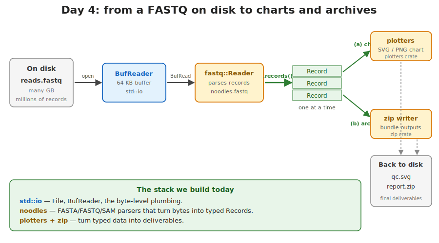{fig-alt="The Day 4 pipeline: a FASTQ on disk flows into a BufReader, then a noodles Reader produces Record structs one at a time; from there branches go to plotters (chart SVG), to zip (archive), and back to the filesystem."}

Files in, structured records out — the same five blocks reappear in every exercise.

::: notes
This pipeline is the day-4 mental model. The same five blocks reappear in every exercise.

On the left, you have a path and you open it. The standard library gives you a `File`. You wrap it in a `BufReader` so reads are efficient. You hand the buffered reader to a bioinformatics crate — `noodles_fasta`, `noodles_fastq` — which parses records for you. You iterate the records, do something useful, and write outputs back to disk, possibly via `plotters` or `zip`.

If you remember nothing else from today, remember this shape. The rest of the lecture is the details that make each block work.
:::

## Reading a file — the simplest possible thing

```rust
use std::fs;

let contents: String = fs::read_to_string("reads.fa")?;
println!("{contents}");
```

[`fs::read_to_string`](https://doc.rust-lang.org/std/fs/fn.read_to_string.html) reads the entire FASTA into memory as a `String`. Three lines, done — the first line is the FASTA header `>chr1`.

There is also [`fs::read`](https://doc.rust-lang.org/std/fs/fn.read.html) — returns `Vec<u8>` instead of a `String`, no UTF-8 check.

::: notes
For small files — a config file, a small TSV, an example FASTA of a few kilobytes — `fs::read_to_string` is the right tool. One call. Whole file in memory. Done.

`fs::read` is the bytes-version of the same thing. Use it when the file might not be valid UTF-8, or when you want to skip the UTF-8 validation pass — for example, a binary file, or a FASTA where you do not care about the encoding of the headers.

Both functions return a `Result` — the `?` propagates any I/O error up to the caller. We will see that pattern again and again today.

The catch: "whole file in memory". A 10 GB FASTQ does not fit. We need a way to stream.
:::

## The problem with whole-file reads

A FASTQ file from a single Illumina lane is 5–50 GB compressed.

A `String` of that size will not fit in the RAM of your laptop.

```rust
// DON'T do this on a real FASTQ
let everything = fs::read_to_string("big.fastq")?;   // OOM-killed
```

We need to **stream** — load a small piece, process it, drop it, load the next.

::: notes
This is the single most important practical fact about bioinformatics I/O. The inputs are bigger than the available memory. Every approach that says "read the whole thing first" fails on the real data.

The solution is streaming: load a small piece of the file into a buffer, process it, then move on to the next piece. The buffer never grows beyond a fixed size. The file can be arbitrarily large.

Rust does not do this automatically — you have to ask for it. The tool you ask with is `BufReader`, which we look at next.
:::

## `BufReader` — a small window onto a large file

{fig-alt="Diagram in three columns showing BufReader workflow. Left column titled 'On disk' shows a reads.fastq file labeled 10 GB containing FASTQ records (@read1, sequence, +, quality lines repeating). A dark arrow labeled '64 KB at a time' and 'one syscall per refill' leads to a middle column titled 'In RAM' showing a light-blue box labeled BufReader<File> with a 64 KB internal buffer holding the first few records as text. A green arrow labeled '.lines()' and 'one line at a time' leads to the right column titled 'Your code' showing a for-loop with successive String lines yielded into small boxes: '@read1', 'ACGTACGTAC', '+', '!!!!!!!!!!', noted as 'only one line lives at a time' with a bold 'O(1) memory' caption. A red-bordered footer panel titled 'The wrong way' shows the code 'let s = std::fs::read_to_string(\"reads.fastq\")?;' with a warning that a 10 GB FASTQ will not fit in RAM and the program will be killed by the OS."}

::: notes
This is the core picture for day 4. The file on disk is enormous. The buffer in RAM is small — 64 KB by default. The iterator your code touches yields one line at a time, and as soon as you stop using it, the line is dropped.

The pattern scales: doubling the file size does not change the memory used by the program. Tripling, quadrupling — same memory. Only the disk reads multiply.

The red panel at the bottom is the alternative we just ruled out: `read_to_string` on a giant FASTQ. The kernel will allocate until it cannot, then kill your process. Use `BufReader` instead.
:::

## The four I/O traits you will see today

The standard library defines small traits and every readable thing implements them:

| Trait | What it gives you | Implementors |
|---|---|---|
| [`Read`](https://doc.rust-lang.org/std/io/trait.Read.html) | `read(buf) -> Result<usize>` | `File`, `&[u8]`, `Cursor` |
| [`Write`](https://doc.rust-lang.org/std/io/trait.Write.html) | `write(buf) -> Result<usize>` | `File`, `Vec<u8>`, `Stdout` |
| [`BufRead`](https://doc.rust-lang.org/std/io/trait.BufRead.html) | line-buffered reading | `BufReader<R>`, `Cursor<&[u8]>` |
| [`Seek`](https://doc.rust-lang.org/std/io/trait.Seek.html) | jump to a position | `File`, `Cursor` |

Code that takes `R: BufRead` works with a file, an in-memory byte string, a gzip stream — anything that implements the trait.

::: notes
This is one of the most important design ideas in the Rust standard library. I/O is described by a few small traits, and every type that can be read or written implements one or more of them. Files implement `Read` and `Write`. `Vec<u8>` implements `Write`. A `&[u8]` implements `Read`. `BufReader` adds `BufRead` on top of any `Read`.

The practical payoff: functions you write today can take `R: BufRead` instead of `&File`, and they will accept any source that satisfies the trait. The same function will read a real file, a `Cursor` over a byte literal in your tests, and a decompressed gzip stream when you wire that in later. You do not have to write three versions of the function.

This is exactly how `noodles` is designed. We will see in a moment.
:::

## `File::open` and `File::create`

```rust
use std::fs::File;
use std::io::{BufReader, BufWriter};

let input  = File::open("sample.fasta")?;       // read-only
let output = File::create("out.tsv")?;          // write, truncates if exists

let reader = BufReader::new(input);             // wrap once
let writer = BufWriter::new(output);            // same for writes
```

Always wrap a `File` in `BufReader` or `BufWriter`. The unbuffered version makes one syscall per byte.

{fig-alt="An outer rounded box labelled BufReader contains a smaller rounded box labelled File, which contains an arrow into the kernel's file table. Annotation: 'BufReader holds a File and a buffer; the File holds an OS file descriptor.'"}

::: notes
[`File::open`](https://doc.rust-lang.org/std/fs/struct.File.html#method.open) opens an existing file for reading. [`File::create`](https://doc.rust-lang.org/std/fs/struct.File.html#method.create) creates a new file for writing, truncating it if it already exists. Both return `Result<File, io::Error>`, so a `?` propagates the failure.

The unwrapped `File` is technically usable directly — it implements `Read` and `Write` — but you should not. Each call to `read` or `write` makes a system call, which is slow. Buffering amortises that: one syscall reads 64 KB into RAM, then your code consumes it byte by byte at memory speed.

The pattern is so common that you should think of `BufReader::new(File::open(p)?)` as the canonical way to open a file for reading.
:::

## Lines, words, bytes — what `BufRead` gives you

```rust
use std::io::{BufReader, BufRead};

let f = File::open("sample.bed")?;
let reader = BufReader::new(f);

for line in reader.lines() {
    let line = line?;                         // Result<String, io::Error>
    let cols: Vec<&str> = line.split('\t').collect();
    println!("chrom = {}", cols[0]);
}
```

[`.lines()`](https://doc.rust-lang.org/std/io/trait.BufRead.html#method.lines) is an iterator that yields one `Result<String>` per line. Use it for line-oriented formats: BED, TSV, plain FASTA headers.

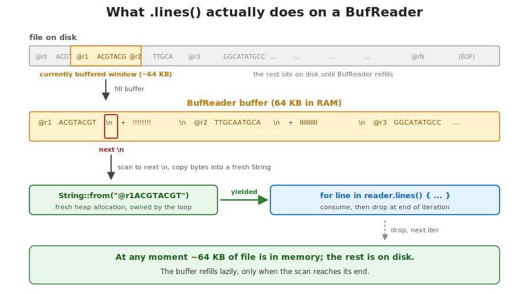{fig-alt="Horizontal flow: raw file bytes → BufReader internal buffer (64 KB) → find next \\n → yield String (owned by you) → loop body consumes it → next iteration drops it. Annotation: at any moment ~64 KB is in memory; everything else is on disk."}

::: notes
`BufRead` adds line-level convenience on top of byte-level `Read`. The method you will use most is `.lines()`, which yields one `Result<String>` for each line. The newline is stripped for you. The iterator is lazy — the file is only read as you advance.

For your hand-written BED parser in today's first exercise, this is exactly the loop you want. One line at a time, split on tab, parse the columns. The whole file streams through.

A subtle point: each yielded item is a `Result`, not a `String`. Even a single byte of mid-stream I/O failure surfaces as an `Err`. The `let line = line?;` shadowing pattern unwraps the happy path and short-circuits the error.
:::

## `Result` propagation — `?` is your verb

```rust
fn first_record_header(path: &Path) -> Result<String, io::Error> {
    let file   = File::open(path)?;                  // fail -> return Err
    let reader = BufReader::new(file);
    reader.lines().next()                            // e.g. ">chr1"
          .ok_or_else(|| io::Error::other("empty FASTA"))?
}
```

The `?` operator: *if the value is `Err`, return it from this function. Otherwise, unwrap to the inner value.*

::: notes
You met `?` on day 3 with `Result<T, E>`. Today is when it earns its keep. Every line of real I/O code is a fallible call: opening the file, reading a byte, parsing a number. Without `?` you would write nested match expressions that bury the happy path under three levels of error handling.

With `?`, the happy path is straight-line code that reads top to bottom. The error path is implicit: at every `?`, if the value is `Err`, the function returns that error immediately. The caller sees a `Result`, and either handles it or propagates again with another `?`.

The picture on the next slide visualises this as a fork in the road at every `?`.
:::

## `?` is a fork at every fallible call

{fig-alt="Diagram titled 'The ? operator: a fork at every fallible call' with the function signature 'fn first_line(path: &Path) -> Result<String, io::Error>' at the top. Three steps shown horizontally: 1) File::open(path)? — may fail if file missing or permission denied; 2) BufReader::new(f) — infallible, no ? needed; 3) .lines().next() .ok_or(empty)?? — may fail on empty file or I/O error. Green Ok arrows connect each step left to right; red Err arrows shoot upward from each fallible step into a red top lane reading 'any ? hits Err -> caller sees Err(io::Error), function body never reaches Ok'. The happy path arrow leaves the third step downward to a green Ok(line) return box. At the bottom, the full function code is shown."}

::: notes
Each `?` in the function body is a branch in disguise. The green arrows are what you read in the source — straight-line code. The red arrows are the implicit early returns. You do not see them in the source, but the compiler inserts them.

This is what makes `?`-heavy I/O code so readable: every line reads as if everything succeeds, and any failure is automatically routed back out to the caller with the original error preserved.

The function signature has to declare `Result<T, E>` so that the `?` knows where to return to. If a function does not return a `Result`, you cannot use `?` in its body.
:::

## Writing files — `BufWriter` and `writeln!`

```rust
use std::io::{BufWriter, Write};

let out = File::create("contigs.tsv")?;
let mut writer = BufWriter::new(out);

writeln!(writer, "name\tlength\tgc")?;
writeln!(writer, "{}\t{}\t{:.3}", name, length, gc)?;

writer.flush()?;                              // optional: drop also flushes
```

`writeln!` is `println!` but writes to any `Write`. The trailing `?` catches I/O failures.

::: notes
`println!` writes to standard out. `writeln!` writes to any type that implements the `Write` trait — including a `File`, a `BufWriter<File>`, a `Vec<u8>`, or a TCP stream. Same format syntax as `println!`. Same compile-time check that the arguments match the placeholders.

`BufWriter` matters even more than `BufReader`. A naked `File` plus a tight loop of small writes means one syscall per record. With a `BufWriter`, the writes accumulate in a 8 KB buffer and the kernel sees one syscall per buffer-full. Often 100x faster on a large output.

The `flush` is usually optional because dropping the `BufWriter` flushes automatically. But: a panic mid-program might skip the drop, so for critical outputs an explicit `flush?` lets you see the error rather than silently losing the last buffer.
:::

## Where the heavy work goes — external crates

The standard library gives you bytes and lines. Bioinformatics formats are more than bytes:

- FASTA / FASTQ — multi-line records, quality scores, line wrapping rules
- BAM / VCF — binary, indexed, compressed
- Plots — pixels, axes, scales, colours
- Archives — zip, tar, gzip

Writing each by hand is a lot of work. We use **crates** instead.

::: notes
The standard library is intentionally small. It gives you the I/O traits, fundamental data structures, and enough text and bytes manipulation to bootstrap anything. It does not ship a FASTA parser, a plot library, or a zip writer.

For everything beyond the basics, the community publishes crates to `crates.io`. There are over 150,000 crates today. For bioinformatics specifically, the `noodles` family covers most of the file formats we care about, with a unified design philosophy: every reader takes a `BufRead`, every writer takes a `Write`, every record is a small struct.

Reaching for a well-maintained crate instead of writing one is the right default. Writing one yourself is for the rare case where no crate fits.
:::

## What `[dependencies]` actually does

{fig-alt="Diagram titled 'Cargo.toml to running binary' showing a flow from top-left to bottom-right. Top-left: a yellow Cargo.toml box with [package] and [dependencies] sections listing 'noodles-fasta = \"0.50\"', 'plotters = \"0.3\"', 'zip = \"0.6\"'. Grey dashed arrows from each dep line lead down to a blue cloud shape labeled 'crates.io public registry' captioned '\"0.50\" resolves to e.g. 0.50.3'. A grey arrow leads down to a grey box labeled '~/.cargo/registry/' captioned 'downloaded once, reused forever'. A green arrow labeled 'linked in' leads right to an orange 'rustc + linker' box (your code + crates = one binary). A green arrow labeled 'produces' leads down to a green 'target/debug/qc-report' box captioned 'contains every byte of every dep'. Footer: 'You add one line to Cargo.toml. Cargo handles fetching, version resolution, caching, and linking.'"}

::: notes
This is the whole story behind `[dependencies]`. Three lines of TOML say "this project uses these crates". When you next run `cargo build`, Cargo reads the manifest, contacts `crates.io` to find a compatible version for each, downloads them once into `~/.cargo/registry`, builds them, and links them into your binary.

The local registry is shared across all your projects on this machine. The first time you depend on `noodles-fasta`, the build is slow because Cargo downloads and compiles it. The hundredth time, the cache hit is free.

The resulting binary contains the machine code for every dependency, statically linked. No "missing shared library" errors at deploy time. Hand the binary to a colleague and it just runs.
:::

## A real Cargo.toml for day 4

```toml
[package]
name = "qc-report"
edition = "2021"

[dependencies]
noodles-fasta = "0.50"
noodles-fastq = "0.20"
plotters      = "0.3"
zip           = "0.6"
serde         = { version = "1", features = ["derive"] }
```

One line per crate. Optionally a version, optionally a list of features.

::: notes
Five real dependencies, one per line. This is roughly what the day-4 capstone exercise would look like.

The simplest form is `name = "version"`. Cargo uses semver to pick the most recent compatible version. The expanded form — the one for `serde` — adds a `features` list, which turns on optional pieces of the crate. Features are how a library can ship "the small fast version" and "the full version with all the extras" from the same source.

After you save the file, `cargo build` does the rest. No separate `pip install`, no virtual environment, no `requirements.txt` versus `setup.py` confusion. One file, one source of truth, reproducible across machines because `Cargo.lock` pins the exact resolved versions.
:::

## Semver — what `"0.50"` means

| You write | Cargo accepts | Cargo rejects |
|---|---|---|
| `"0.50"` | `0.50.0`, `0.50.3`, `0.50.99` | `0.51.0`, `0.49.0` |
| `"1"`    | `1.0.0`, `1.5.3`, `1.99.0`    | `2.0.0`, `0.99.0` |
| `"=0.50.1"` | exactly `0.50.1` | anything else |
| `"0.50.1"` (in 0.x) | `0.50.1`, `0.50.2`, `0.50.x` | `0.51.0` |

The exact resolved version goes into `Cargo.lock` — commit that file for applications.

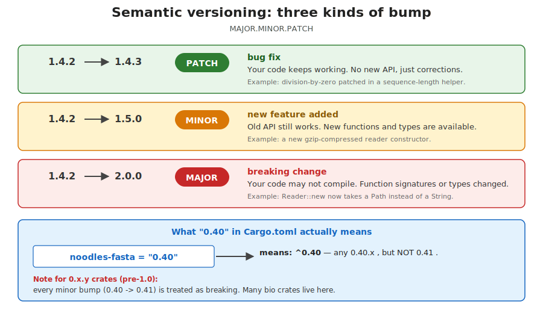{fig-alt="Three example version transitions: 1.4.2 → 1.4.3 (patch — bug fix, drop-in safe), 1.4.2 → 1.5.0 (minor — new feature, backward compatible), 1.4.2 → 2.0.0 (major — breaking change, code may not compile). Cargo defaults to '^1.4.2' meaning 'compatible with 1.4.2, ≤ 2.0.0'."}

::: notes
Crate versions follow [semantic versioning](https://semver.org): major.minor.patch. The rule is that breaking changes bump the major version, new backward-compatible features bump the minor, and bug fixes bump the patch.

When you write `"0.50"` in `Cargo.toml`, Cargo interprets that as "0.50.x — accept any patch release, but not 0.51". This is conservative: you get bug fixes automatically, you do not get breaking changes by surprise.

There is a wrinkle: 0.x versions are considered unstable, so the minor version is treated like a major version. `"0.50"` accepts 0.50.anything but not 0.51. Once a crate hits 1.0, `"1"` accepts everything in the 1.x series.

`Cargo.lock` records the exact version Cargo actually resolved. Commit it for applications so your CI builds the same bytes as your laptop. Leave it out for libraries so downstream users can resolve fresh.
:::

## `crates.io` and `docs.rs`

- **[crates.io](https://crates.io)** — the public registry. Search, browse, see download counts.
- **[docs.rs](https://docs.rs)** — every published crate is auto-documented here.
- `cargo doc --open` — build and view docs for your own deps, offline.

```text
https://docs.rs/noodles-fasta/             -> latest version
https://docs.rs/noodles-fasta/0.50.3/      -> a specific version
```

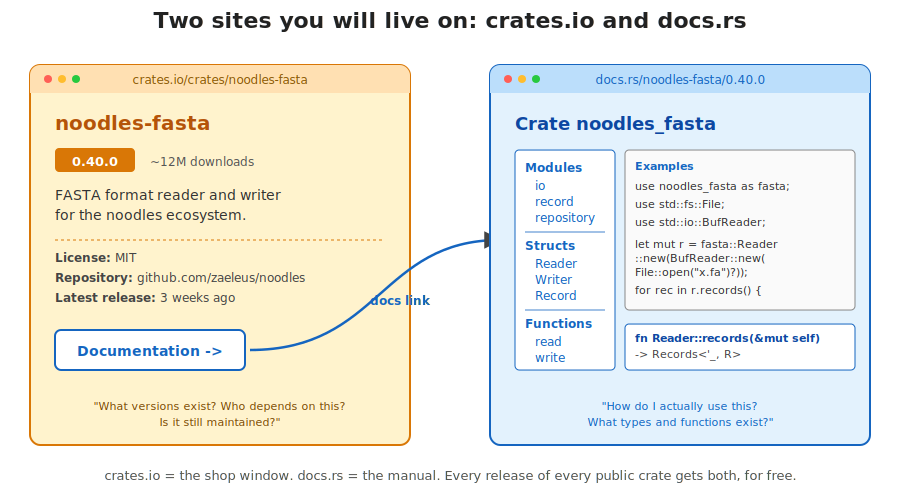{fig-alt="Two boxes side by side: crates.io (the package registry — metadata, downloads counts, link to source), and docs.rs (auto-generated documentation for every published version, with searchable API). Arrow: every publish to crates.io triggers a docs.rs build."}

::: notes
Two sites you will live in this week. `crates.io` is the registry — it is where crates are published, where you search for them, where the download counts and the README live. Think of it as PyPI for Rust.

`docs.rs` is more interesting. Every crate that is published to `crates.io` is automatically built with `cargo doc` and the output is hosted at `docs.rs/<crate-name>`. The pages are generated from the `///` doc comments in the source, so they always match the code of the version you depend on. There is no "the docs say one thing but the code does another" possible.

Locally, `cargo doc --open` does the same thing for the dependencies of your project — useful when you are offline or want to read the docs for the exact version you pinned.
:::

## How to learn a new crate — step 1: search crates.io

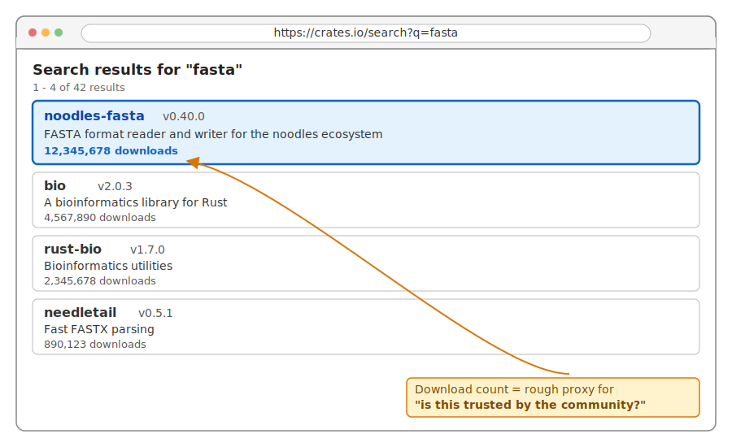{fig-alt="A mock crates.io search results page for the query 'fasta', showing top hits with download counts: noodles-fasta (12M downloads), bio (3M), rust-bio (3M). Highlight on the most-downloaded result."}

The downloads number is a rough proxy for "does the community trust this?"

::: notes
The first signal is "what's popular". A package nobody downloads has no track record.
:::

## How to learn a new crate — step 2: read the package page

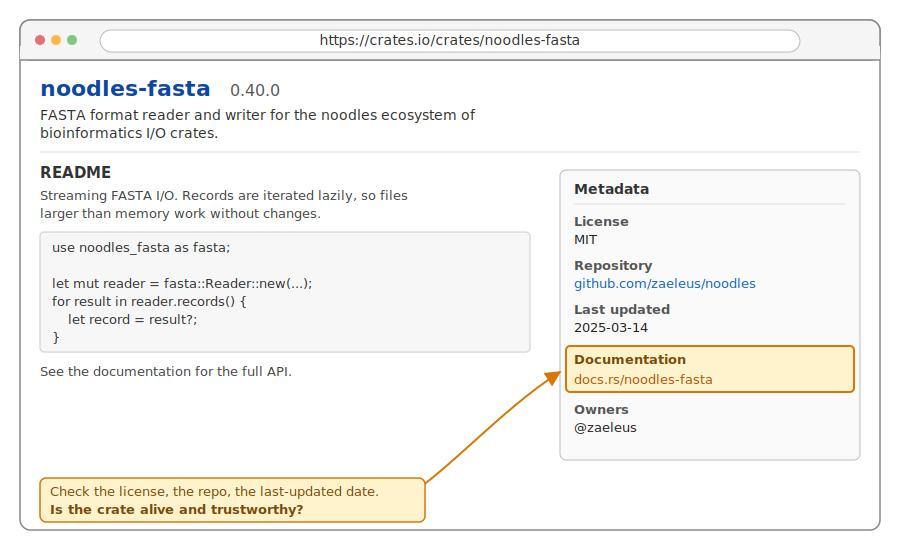{fig-alt="A mock crates.io page for noodles-fasta showing description, version, license, repository link, and 'docs.rs' link in the sidebar."}

Look at: license, last-updated date, repository link.

::: notes
You're checking that the package is alive and that its license is compatible with your project.
:::

## How to learn a new crate — step 3: open docs.rs

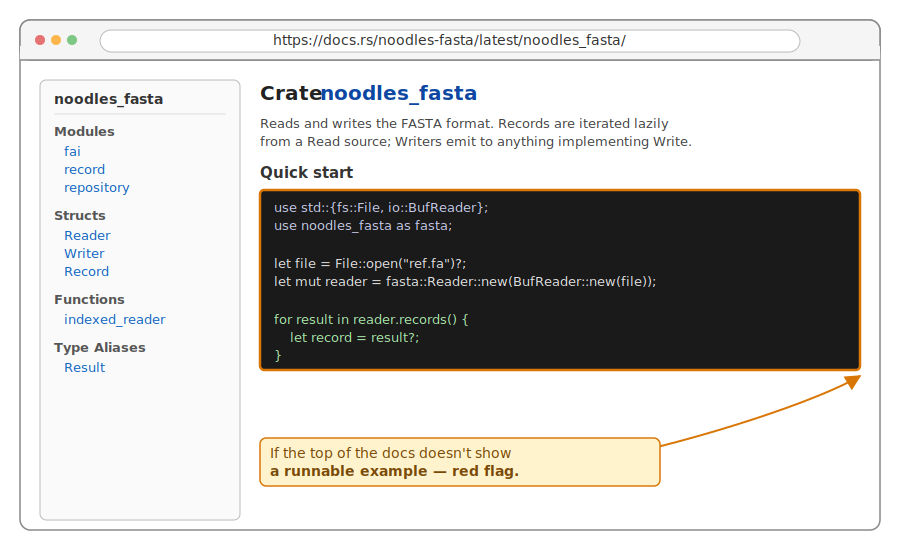{fig-alt="A mock docs.rs landing page for noodles-fasta, showing the module-level documentation with a short example and a list of submodules and types."}

The top-of-page docs are usually a small working example.

::: notes
If the top of the docs doesn't show you a runnable example, that's a red flag.
:::

## How to learn a new crate — step 4: find an example you can paste

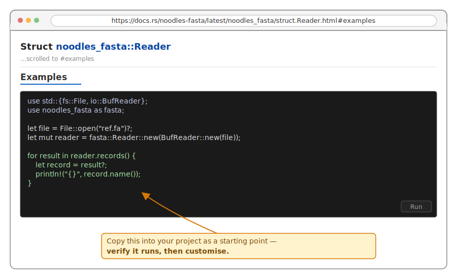{fig-alt="A docs.rs code-example block showing a small noodles-fasta program: opening a file, creating a Reader, iterating records."}

Copy it into your own project as a starting point.

::: notes
Practical workflow: get the canonical example running locally before customising. If the example doesn't work, the package is broken.
:::

## How to learn a new crate — step 5: add it to Cargo.toml

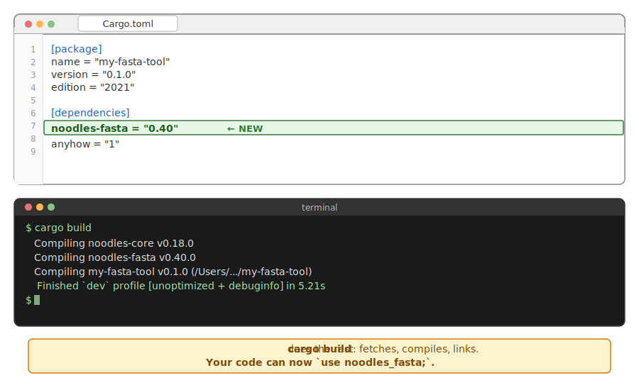{fig-alt="A Cargo.toml file showing the new noodles-fasta = '0.40' line added to [dependencies], with cargo build running in a terminal below."}

```toml
[dependencies]
noodles-fasta = "0.40"
```

`cargo build` does the rest: fetches, compiles, links.

::: notes
That's the full discovery-to-use loop. Most crates you'll ever use, you found this way.
:::

## `noodles` — streaming records, constant memory

The reader holds a window into the file; you process one record at a time.

::: {.fragment}
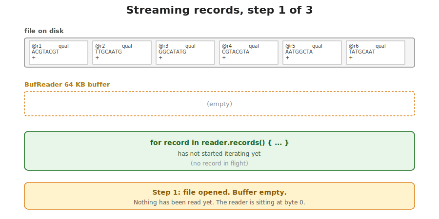{fig-alt="Step 1 of noodles streaming: a FASTQ file on disk; a Reader is constructed over a BufReader of the file, with an empty internal buffer ready to be filled."}
:::

::: {.fragment}
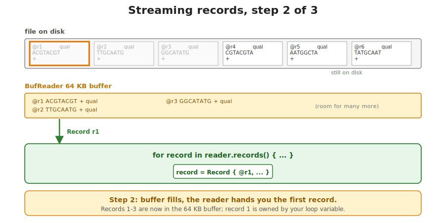{fig-alt="Step 2 of noodles streaming: the Reader has read the first record from disk into its buffer and yielded a Record value to your loop body."}
:::

::: {.fragment}
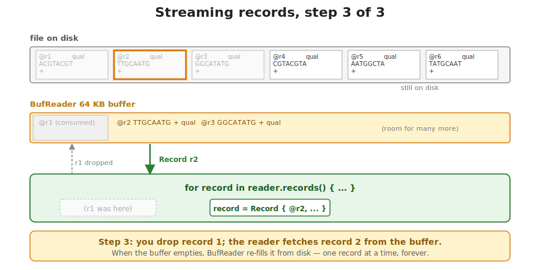{fig-alt="Step 3 of noodles streaming: the previous Record has been dropped (memory freed); the Reader fetches the next record from disk into the same buffer and yields it."}
:::

Memory stays roughly constant — independent of file size.

::: notes
This is the unifying picture of how every `noodles` crate works. You give a `Reader` something that implements `BufRead`. It internally parses one record at a time and yields it to your loop. When the loop body finishes one iteration, the record is dropped — its memory goes back to the allocator before the next record is read.

The consequence: program memory is constant in the file size. A 3 GB FASTQ takes the same RAM as a 3 KB one. Only disk reads multiply.

`noodles_fasta`, `noodles_fastq`, `noodles_bam`, `noodles_vcf`, and the dozen others in the family all share this design. Learn the shape once, apply it to any format.
:::

## `noodles-fasta` in eight lines

```rust
use noodles_fasta as fasta;
use std::io::{BufReader, BufRead};

fn count_records<R: BufRead>(reader: R) -> std::io::Result<usize> {
    let mut reader = fasta::io::Reader::new(reader);
    let mut n = 0;
    for result in reader.records() {
        let _record = result?;
        n += 1;
    }
    Ok(n)
}
```

[`fasta::io::Reader::new`](https://docs.rs/noodles-fasta/latest/noodles_fasta/io/struct.Reader.html) wraps any `BufRead`. [`.records()`](https://docs.rs/noodles-fasta/latest/noodles_fasta/io/struct.Reader.html#method.records) yields `Result<Record>`.

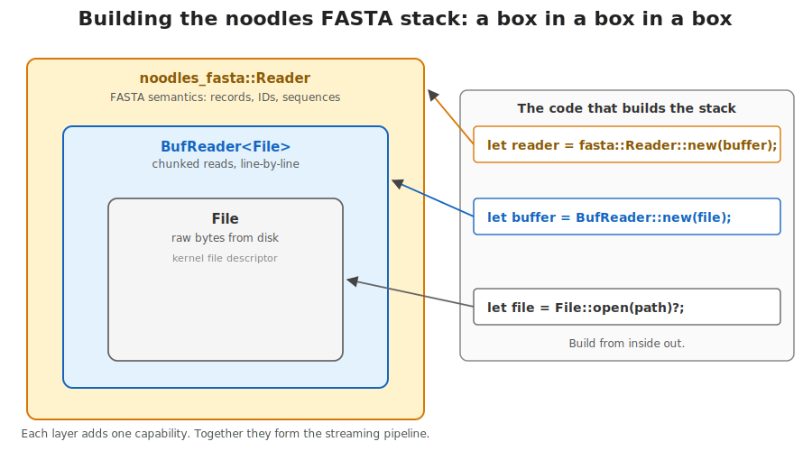{fig-alt="Three nested rectangles, outermost to innermost: 'noodles_fasta::Reader' contains 'BufReader<File>' contains 'File' contains an OS file descriptor. Each layer's purpose annotated: File = bytes from disk; BufReader = chunked reads; noodles Reader = FASTA semantics."}

::: notes
This is roughly the body of exercise 2 for today. Eight lines. Almost all the interesting work — parsing the header, joining wrapped sequence lines, handling CRLF, validating the format — happens inside `noodles_fasta`. Your job is to consume records and accumulate.

The function is generic over `R: BufRead`. In production you call it with a `BufReader<File>`. In tests you call it with a `Cursor` over a byte literal — no temp files. This is the trait-based design from earlier paying off.

Note the two `Result`s. The function itself returns `std::io::Result<usize>`, and each yielded record is `Result<Record>`. The `?` on the inner result short-circuits the outer one. No nested matches.
:::

## Reading a `Record` — name and sequence

```rust
for result in reader.records() {
    let record = result?;

    let name: &[u8]    = record.name();
    let seq:  &[u8]    = record.sequence().as_ref();
    let length         = seq.len();
    let gc = seq.iter()
                .filter(|&&b| matches!(b, b'G' | b'C' | b'g' | b'c'))
                .count() as f64 / length as f64;
}
```

Accessors return borrowed slices — no copying.

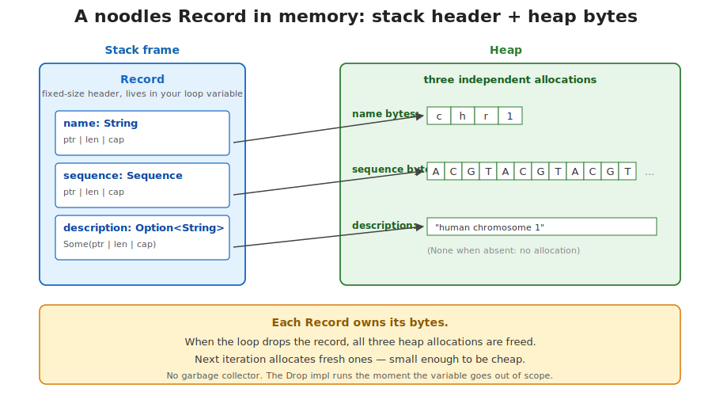{fig-alt="A `Record` struct on the stack with three fields (name: String, sequence: Sequence, description: Option<String>), each pointing to heap allocations holding the actual bytes. Annotation: the record owns its data — dropping it frees the heap allocations."}

::: notes
What you get back from `noodles` is a `Record` struct. The methods on it — `.name()`, `.sequence()` — return borrowed slices that point into the record's own buffer. No allocations, no copies. The record lives for the iteration; after that, the slices are gone too.

This is your day-2 ownership knowledge in action. The function does not own the bytes — `record` does. While `record` is alive in this loop iteration, `name` and `seq` are valid. Try to keep `seq` around past the end of the iteration and the compiler refuses. Good — those bytes are about to be overwritten by the next record.

`matches!` is the macro from day 3: a tidy shorthand for "does this value match this pattern". Inside a filter closure it reads cleanly.
:::

## `noodles-fastq` — read, filter, write

```rust
use noodles_fastq as fastq;

fn filter<R: BufRead, W: Write>(reader: R, writer: W, min_len: usize)
    -> std::io::Result<(usize, usize)>
{
    let mut reader = fastq::io::Reader::new(reader);
    let mut writer = fastq::io::Writer::new(writer);
    let (mut total, mut kept) = (0, 0);
    for result in reader.records() {
        let record = result?;
        total += 1;
        if record.sequence().len() >= min_len {
            writer.write_record(&record)?;
            kept += 1;
        }
    }
    Ok((kept, total))
}
```

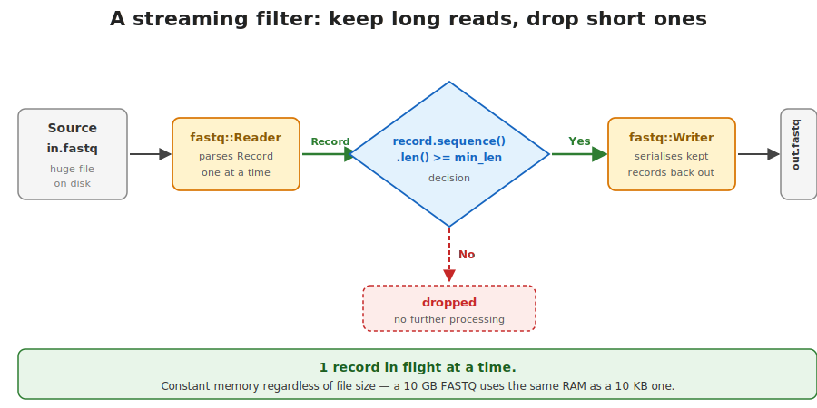{fig-alt="Horizontal flow: source FASTQ file → noodles_fastq::Reader → filter (`record.sequence().len() >= min_len`) → noodles_fastq::Writer → destination FASTQ file. Records that fail the filter are dropped (red arrow). Annotation: constant memory; one record in flight at a time."}

::: notes
Today's exercise 3 in one slide. Same shape as the FASTA reader. Add a `Writer` for the output, generic over `W: Write`. Iterate. Apply a predicate. Write the surviving records.

Notice how everything is generic. Real production code will call this with `BufReader<File>` reading the input and `BufWriter<File>` writing the output. Your tests will call it with `Cursor<&[u8]>` for input and `Vec<u8>` for output — fast, no temp files, parallelisable. Same function, different concrete types.

The two-counter return value is a common pattern: report what you did so the caller can log it or feed it to monitoring. Bioinformatics pipelines live or die on these counters.
:::

## Modules — splitting one crate across files

A real project does not live in one `main.rs`. Use `mod` to split it.

{fig-alt="Diagram titled 'Modules: split one crate across files'. Left side titled 'On disk' shows a directory tree: ex-fasta-stats/, Cargo.toml, src/, main.rs, parser.rs, stats.rs, captioned 'one source file per module'. Right side top: a blue box labeled 'src/main.rs' showing code 'mod parser;', 'mod stats;', 'use crate::parser::parse_record;', 'use crate::stats::ContigStat;', 'fn main() { /* ... */ }'. Right side bottom: a green box labeled 'src/parser.rs' showing code 'pub struct Record { pub name: String, pub sequence: Vec<u8>, }', 'pub fn parse_record(line: &str) -> Record { /* ... */ }', captioned 'pub = visible to other modules'. A grey dashed arrow labeled 'mod parser; -> look for parser.rs' connects the mod declaration to the parser.rs file. A green arrow labeled 'name lookup' connects the use statement to the pub function. Footer: 'mod declares a child module; pub controls what leaks out; use brings a name into scope.'"}

::: notes
The exercises so far have lived in a single `src/main.rs`. Real projects grow past that. Rust's tool for splitting code is the module system.

`mod foo;` in `main.rs` tells the compiler "there is a child module called `foo`; look for its code in `foo.rs` or `foo/mod.rs`". The compiler reads that file as if it were a `mod foo { ... }` block in the parent.

`pub` controls what is visible outside a module. A struct without `pub` is module-private. A field without `pub` is private even if the struct is public. The default is private — like immutability, the careful choice has to be opted into.

`use` brings a name into scope so you can write `parse_record(...)` instead of `crate::parser::parse_record(...)` every time.
:::

## A tiny module example

```rust
// src/main.rs
mod parser;            // look for src/parser.rs

use parser::parse_record;

fn main() {
    let rec = parse_record("chr1\t100\t200");
    println!("{}", rec.chrom);
}
```

```rust
// src/parser.rs
pub struct BedRecord {
    pub chrom: String,
    pub start: u64,
    pub end:   u64,
}

pub fn parse_record(line: &str) -> BedRecord { /* ... */ }
```

Three keywords carry the system: `mod`, `pub`, `use`.

::: notes
A complete two-file example you could type out in 30 seconds. The `mod parser;` line in `main.rs` is the declaration — without it, `parser.rs` is just a file the compiler ignores. With it, the compiler reads `parser.rs` and makes everything declared `pub` inside accessible as `parser::Name` from `main.rs`.

The `use` line is pure ergonomics. After `use parser::parse_record;`, the bare name `parse_record` works in `main`. Without the `use`, you would write `parser::parse_record(...)`.

For a 200-line crate this is overkill. For a 2000-line crate it is the difference between code you can navigate and code you cannot.
:::

## The same trait wraps real files and test bytes

```rust
use std::io::{BufReader, Cursor};

let real    = BufReader::new(File::open("sample.fa")?);
let in_test = Cursor::new(b">chr1\nACGT\n>chr2\nTTGCAA\n");

count_records(real)?;        // BufReader<File>: BufRead
count_records(in_test)?;     // Cursor<&[u8]>: BufRead
```

The function takes `R: BufRead`. Both arguments satisfy it. Both compile.

::: notes
This is the practical payoff of the trait-based I/O design. Your function — `count_records<R: BufRead>(reader: R)` — has one body, but Rust generates a specialised version of it for each concrete type you call it with. The version called with a `BufReader<File>` does real I/O. The version called with a `Cursor<&[u8]>` reads from memory.

For tests, `Cursor` is gold. You construct a byte literal that contains the format you want to test, wrap it in `Cursor::new`, and pass it to the function. No temp files, no fixture data on disk, no cleanup. The whole test runs in microseconds and is parallelisable across cores.

Every exercise today uses this trick in its test suite. Read the test file before you start coding — it shows the shape your function needs to take.
:::

## Putting it together — a day-4 main

```rust
use std::fs::File;
use std::io::{BufReader, BufWriter};

fn main() -> Result<(), Box<dyn std::error::Error>> {
    let reader = BufReader::new(File::open("sample.fastq")?);
    let writer = BufWriter::new(File::create("filtered.fastq")?);

    let (kept, total) = filter(reader, writer, 50)?;
    eprintln!("kept {}/{} reads", kept, total);
    Ok(())
}
```

Every piece you have seen in this lecture, in one tidy main.

::: notes
The whole day-4 toolkit in eight lines of `main`. Open a real file, wrap it in `BufReader`. Create a real output file, wrap it in `BufWriter`. Call the generic `filter` function with them. Report the counters on standard error so they do not contaminate the output stream.

If you replace `BufReader<File>` with `BufReader<GzDecoder<File>>`, the same code reads `.fastq.gz`. If you replace `BufWriter<File>` with `BufWriter<GzEncoder<File>>`, it writes `.fastq.gz`. The `filter` function does not change because it takes traits, not concrete types.

This is the picture you should carry into the exercises. Standard library does the I/O. Crates do the parsing. Your code does the logic.
:::

## To the next lectures

This was I/O and crates. Two more short lectures today:

- **`lec2-plotting`** — plotters, and how it compares to ggplot and matplotlib
- **`lec3-archives`** — zip files, compression, and why DNA only needs 2 bits per base

Then the exercises this afternoon: BED parse, FASTA stats, FASTQ filter, plot, zip bundle.

::: notes
Five exercises this afternoon, in order. The first one is intentionally crate-free — you parse a BED file with nothing but the standard library, so you feel what the crates are saving you from. The next four each introduce one ecosystem crate.

You will spend more time reading `docs.rs` than typing today. That is a healthy ratio and one you should get used to.
:::
