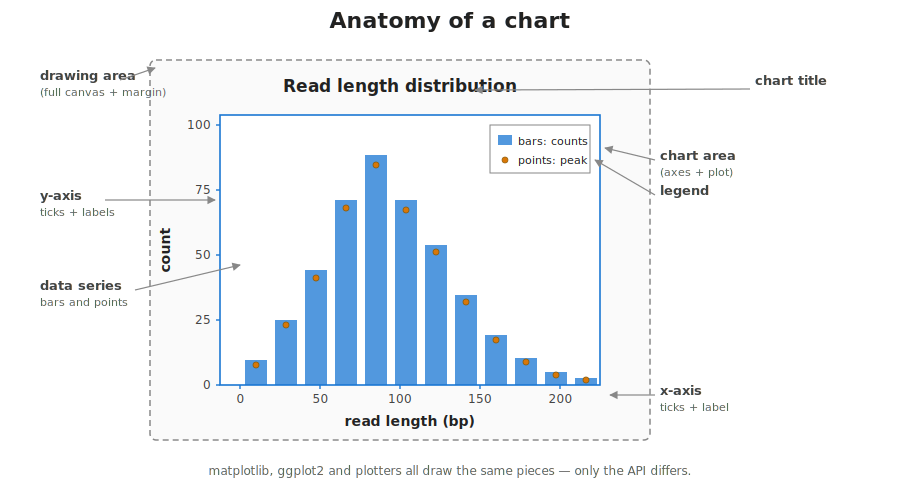
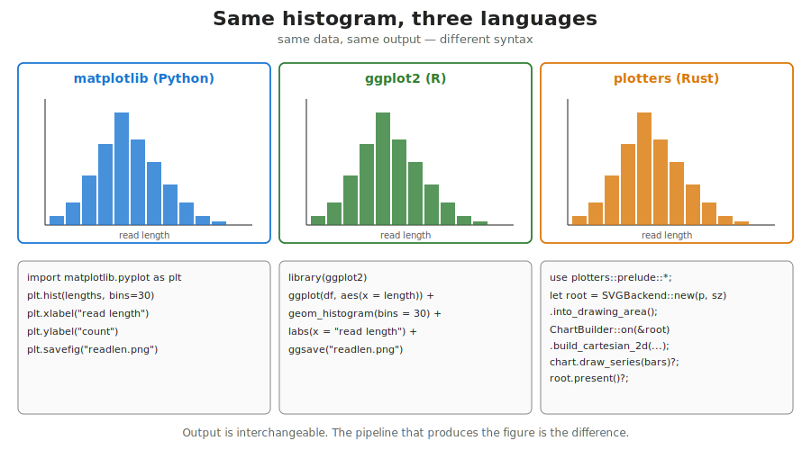
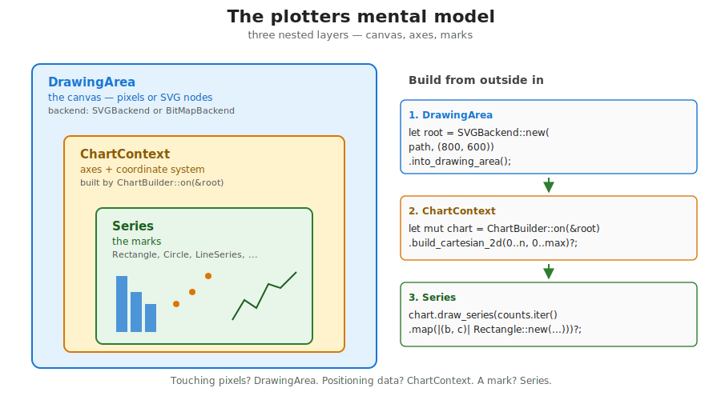

## What this lecture is

::: {.incremental}
- One picture per analysis — emitted by the analysis itself
- `plotters` as a Rust answer to matplotlib and ggplot2
- The mental model: drawing area, chart context, series
- Histograms, scatter plots, line plots, multiple series
- Where `plotters` is great, and where it is not
:::

::: notes
This is the plotting half of day 4. The first lecture was about getting bytes off disk and into structured records. This lecture is about turning those records into a figure that ends up in a paper, a slide, or a report.

You probably already know how to make a histogram in matplotlib or ggplot2. Today we add a third option: `plotters`, which produces SVG or PNG straight out of your Rust binary, with no Python or R in the loop. The point is not that `plotters` is better — it is that it removes one process boundary between your data and your figure.
:::

## Why plot from Rust?

::: {.incremental}
- The same binary that does the analysis emits the figure
- No "now open a notebook and `plt.hist`" step
- One language, one dependency manifest, one `cargo run`
- Output is SVG or PNG with deterministic, reproducible bytes
- Plays nicely with HPC: no display server, no interactive backend
:::

::: notes
The usual bioinformatics pipeline ends in a CSV or a TSV, which you then load into Python or R to plot. Two languages, two environments, two sources of bugs.

If the analysis is already in Rust, `plotters` lets you emit the figure from the same binary. One `cargo run`, one output directory containing both the table and the chart. On a cluster this is especially convenient — no X server, no Jupyter kernel, no `matplotlib.use("Agg")` dance. SVG bytes go straight to disk.

For exploratory plotting you will still want a notebook. For "the QC report this pipeline always produces", `plotters` is the right tool.
:::

## The three libraries you might compare

| Library | Language | Style | One-line summary |
|---|---|---|---|
| [matplotlib](https://matplotlib.org/) | Python | imperative | mature, huge API, the default |
| [ggplot2](https://ggplot2.tidyverse.org/) | R | declarative grammar | layered, tidy data in, plot out |
| [plotters](https://docs.rs/plotters/) | Rust | imperative builder | small, fast, SVG/PNG only |

::: notes
Three communities, three answers to the same problem.

matplotlib is what most of you have used. It is enormous, well-documented, and slightly inconsistent because it grew over twenty years. Pyplot is the easy interface; underneath it is the object-oriented API.

ggplot2 is the cleanest of the three intellectually. You describe the mapping from data columns to visual aesthetics and ggplot does the rest. The downside is that you need the rest of the R ecosystem to feed it.

plotters is the youngest. It is closer to matplotlib than to ggplot2: you build the figure imperatively, step by step. It does not have a grammar of graphics, no smoothers, no facets. But it produces clean SVG or PNG with no runtime dependencies, in milliseconds.
:::

## Anatomy of a chart

{fig-alt="A labelled diagram of a generic chart showing a chart title at the top, a drawing area margin around the outside, the chart area inside it containing axes (x-axis with ticks and labels at the bottom, y-axis with ticks and labels at the left), axis labels, two data series rendered as bars and points, and a legend in the upper right."}

::: notes
Before we look at code, here is the vocabulary. Every chart, in every library, has the same pieces: a drawing area that is the whole canvas; a chart area inside it where the data lives; two axes with ticks and labels; descriptive labels for the axes; a title at the top; data series — bars, points, lines; and usually a legend.

matplotlib, ggplot2 and `plotters` all use these names, with minor variations. `plotters` calls the chart area a `ChartContext`. ggplot calls it a `panel`. matplotlib calls it an `Axes` — confusingly, because that is also the name of the axis lines themselves.

Once you know the parts, switching libraries is mostly translation, not re-learning.
:::

## A histogram in three languages

{fig-alt="Three panels side by side, each showing the same read-length histogram with about six bars peaking near 100. The panels are labelled matplotlib (Python), ggplot2 (R), and plotters (Rust). Below each panel is a six-line code snippet in the corresponding language."}

```python
# matplotlib
import matplotlib.pyplot as plt
plt.hist(lengths, bins=30)
plt.xlabel("read length"); plt.ylabel("count")
plt.savefig("readlen.png")
```

```r
# ggplot2
library(ggplot2)
ggplot(df, aes(x = length)) +
  geom_histogram(bins = 30) +
  labs(x = "read length", y = "count") +
  ggsave("readlen.png")
```

::: notes
Same data on three toolchains, same picture out. The matplotlib version is three real lines. The ggplot2 version is four. The plotters version, on the next slide, is twelve — but most of those are setup, not logic.

The point of showing them together is that the *concepts* line up. Bin width, axis labels, output path. Different syntax, same nouns. If you can read one of these, you can read the others.

The `plotters` version is bigger because Rust does not have a one-call `plt.hist`. You construct the pieces yourself. The flip side: the resulting binary needs nothing but a filesystem to run.
:::

## plotters — a histogram, line by line

```rust
use plotters::prelude::*;                                  // pull in the common names
use std::path::Path;

fn plot_histogram(counts: &[u32], path: &Path)
    -> Result<(), Box<dyn std::error::Error>>
{
    let root = SVGBackend::new(path, (800, 600))           // pick backend + size
        .into_drawing_area();                              // wrap as a DrawingArea
    root.fill(&WHITE)?;                                    // paint background white
    let max = *counts.iter().max().unwrap_or(&0);          // tallest bar -> y range
    let mut chart = ChartBuilder::on(&root)                // start a chart on the canvas
        .caption("Read length", ("sans-serif", 24))        // title at the top
        .build_cartesian_2d(                               // x range, y range
            0u32..counts.len() as u32, 0u32..(max + 1))?;
    chart.configure_mesh().draw()?;                        // draw axes + gridlines
    chart.draw_series(counts.iter().enumerate().map(       // one Rectangle per bar
        |(b, &c)| Rectangle::new(
            [(b as u32, 0), (b as u32 + 1, c)],            // (x0,y0)-(x1,y1)
            BLUE.filled())))?;                             // fill style
    root.present()?;                                       // flush to disk
    Ok(())
}
```

::: notes
This is the whole thing, with a comment on every interesting line. You will write essentially this function in today's exercise 4.

Read top to bottom: pick a backend (SVG or PNG), wrap it as a drawing area, paint it white, decide your axis ranges, configure the axes, draw one rectangle per bar, present.

`SVGBackend::new(path, (800, 600))` is two arguments: where to write, and the size in pixels. `.into_drawing_area()` is the conversion that gives you something you can draw on. `ChartBuilder::on(&root)` starts the builder pattern; everything until `build_cartesian_2d` is configuration. `build_cartesian_2d` is the call that actually fixes the coordinate system. After that you have a `chart` you can `draw_series` into.

Every `?` is a real failure point — disk full, invalid path, malformed dimensions. The function returns `Result<(), Box<dyn Error>>` so all of them propagate cleanly.
:::

## The plotters mental model

{fig-alt="Three nested rounded rectangles. The outer box is labelled DrawingArea (the canvas), with a small caption 'SVGBackend or BitMapBackend'. Inside it is a smaller box labelled ChartContext (axes plus coordinate system), with caption 'built by ChartBuilder::on(&root)'. Inside that is the innermost box labelled Series (the marks), with caption 'Rectangle, Circle, PathElement, ...'. To the right is a code panel showing the three lines that build each layer: SVGBackend::new(...).into_drawing_area(), ChartBuilder::on(&root).build_cartesian_2d(...), chart.draw_series(...)."}

::: notes
This is the single most useful picture for `plotters`. Three concepts, nested.

The outermost is the `DrawingArea` — the canvas, the pixels, the bytes that will become a file. It comes from a backend, either `SVGBackend` or `BitMapBackend`. The drawing area knows nothing about charts; it just knows how to colour pixels.

In the middle is the `ChartContext` — axes plus a coordinate system. Once you build it with `build_cartesian_2d`, you can ask "what pixel is the data point (100, 50) at" and it knows. This is what `ChartBuilder` produces.

Innermost are the `Series` — the actual marks. Rectangles for bars, circles for scatter points, line strings for lines. They are coordinates in *data* space; the chart context handles the conversion to pixels.

If a piece of code is touching pixels, it goes through the drawing area. If it is positioning data, it goes through the chart context. If it is a mark, it is in a series.
:::

## A scatter plot — adding marks

```rust
use plotters::prelude::*;

let points: Vec<(f64, f64)> = vec![
    (1.0, 2.1), (2.0, 1.9), (3.0, 3.2), (4.0, 4.0), (5.0, 5.1),
];

let root = SVGBackend::new("scatter.svg", (640, 480)).into_drawing_area();
root.fill(&WHITE)?;
let mut chart = ChartBuilder::on(&root)
    .margin(20).x_label_area_size(35).y_label_area_size(40)
    .build_cartesian_2d(0.0..6.0, 0.0..6.0)?;
chart.configure_mesh().draw()?;
chart.draw_series(points.iter().map(|&(x, y)|
    Circle::new((x, y), 4, RED.filled())))?;     // one Circle per point
root.present()?;
```

[`Circle::new`](https://docs.rs/plotters/latest/plotters/element/struct.Circle.html) takes a centre, a radius in pixels, and a style. Like `plt.scatter(x, y)` or `geom_point()` — same idea, hand-rolled.

::: notes
A scatter is just a series of `Circle` elements. One circle per data point. The chart context maps the `(x, y)` in data units to pixels; you supply the radius in pixels directly.

In matplotlib this would be `plt.scatter(xs, ys)`. In ggplot it would be `geom_point()` with `aes(x=..., y=...)`. The conceptual move is the same — for each point, place a mark at its coordinates. `plotters` just asks you to write the iteration yourself, as a `map`.

The radius is in pixels, not data units, which is normally what you want for a scatter: zooming the axes does not blow the dots up.
:::

## A line plot — connecting points

```rust
let series: Vec<(f64, f64)> = (0..100)
    .map(|i| {
        let x = i as f64 * 0.1;
        (x, x.sin())                                   // y = sin(x)
    })
    .collect();

let root = SVGBackend::new("line.svg", (640, 480)).into_drawing_area();
root.fill(&WHITE)?;
let mut chart = ChartBuilder::on(&root)
    .margin(20).x_label_area_size(35).y_label_area_size(40)
    .build_cartesian_2d(0.0..10.0, -1.2..1.2)?;
chart.configure_mesh().draw()?;
chart.draw_series(LineSeries::new(series, &BLUE))?;     // one connected line
root.present()?;
```

[`LineSeries::new`](https://docs.rs/plotters/latest/plotters/series/struct.LineSeries.html) takes an iterator of `(x, y)` and a style. Equivalent to `plt.plot(x, y)` or `geom_line()`.

::: notes
For a connected line, `LineSeries` does what `Circle::new` did for the scatter: it takes the data and turns it into one drawable element. Compared to the scatter version, the only line that really differs is the call to `draw_series`.

This is the rhythm you will find with `plotters`. The setup is the same — backend, drawing area, chart builder, axes. The chart type — histogram, scatter, line — is one method call's worth of difference.

LineSeries also accepts any iterator, not just a `Vec`, so you can stream through values without collecting them first when memory matters.
:::

## Multiple series on one chart

```rust
let xs: Vec<f64> = (0..100).map(|i| i as f64 * 0.1).collect();
let s1: Vec<(f64, f64)> = xs.iter().map(|&x| (x, x.sin())).collect();
let s2: Vec<(f64, f64)> = xs.iter().map(|&x| (x, x.cos())).collect();

chart.draw_series(LineSeries::new(s1, &RED))?
    .label("sin(x)")                                       // legend entry
    .legend(|(x, y)| PathElement::new(
        vec![(x, y), (x + 20, y)], RED));

chart.draw_series(LineSeries::new(s2, &BLUE))?
    .label("cos(x)")
    .legend(|(x, y)| PathElement::new(
        vec![(x, y), (x + 20, y)], BLUE));

chart.configure_series_labels()
    .background_style(&WHITE.mix(0.8))
    .border_style(&BLACK)
    .draw()?;                                              // render the legend box
```

::: notes
Two `draw_series` calls, one per series, plus a `.label(...)` and `.legend(...)` on each to define what shows up in the legend. The `configure_series_labels` call at the end actually draws the legend box on the chart.

The legend closure is a little ugly because you have to describe what mark to draw next to the label. For a line, that is a short `PathElement`. For a scatter you would draw a small `Circle`. matplotlib and ggplot infer this from the series; `plotters` makes you spell it out.

This is a fair example of the verbosity trade-off. Two extra method calls per series and one configure call at the end. Not bad, but more than `legend()` in matplotlib.
:::

## Saving to SVG vs PNG

| Backend | Output | When to use |
|---|---|---|
| [`SVGBackend`](https://docs.rs/plotters/latest/plotters/backend/struct.SVGBackend.html) | vector XML | papers, posters, slides — scales without blurring |
| [`BitMapBackend`](https://docs.rs/plotters/latest/plotters/backend/struct.BitMapBackend.html) | PNG bitmap | screenshots, dashboards, large data with millions of marks |

```rust
let svg = SVGBackend::new("out.svg", (800, 600)).into_drawing_area();
let png = BitMapBackend::new("out.png", (800, 600)).into_drawing_area();
// ...everything after this point is identical
```

PNG requires a small amount of platform setup — `cairo` on Linux, otherwise the pure-Rust rasteriser. SVG works everywhere with no extras.

::: notes
The choice of backend is one line; everything downstream is identical because both implement the same `DrawingBackend` trait. This is the same trait-based dispatch you saw with `Read` and `Write` in lecture 1.

SVG is the default I recommend. The output is text — actual XML you can `cat`, diff, version-control. Browsers, Illustrator, Inkscape all read it. It scales to any resolution because it is vector.

PNG is a bitmap, fixed resolution. Pick it when you have millions of marks (SVG with a million circles is a multi-megabyte XML file), or when you want a thumbnail you can drop in a slack message. On some Linux distros `BitMapBackend` wants `cairo` installed; otherwise `plotters` falls back to its own rasteriser, which is fine for most things.

For a paper figure, always SVG.
:::

## Styling — colour, stroke, alpha

```rust
// Translucent fill — useful for overlapping bars or points
Rectangle::new([(0, 0), (1, 10)], RED.mix(0.5).filled());

// Thicker stroke — useful for lines that need to stand out
LineSeries::new(series, BLUE.stroke_width(2));

// Custom RGB
const TEAL: RGBColor = RGBColor(0x1f, 0x77, 0xb4);
Circle::new((x, y), 4, TEAL.filled());
```

::: notes
`RED`, `BLUE`, `GREEN`, `BLACK`, `WHITE` are constants exported by the prelude. Each one is a `RGBColor` value with helper methods.

`.mix(alpha)` returns a new colour with reduced opacity. Use it for overlapping marks where you want to see density — same trick as `alpha=0.5` in matplotlib.

`.stroke_width(n)` returns a line style with the given width in pixels. Without it you get the default 1-pixel stroke, which looks anaemic in slides.

For custom colours, construct an `RGBColor(r, g, b)` directly. The values are `u8`, 0-255. You can also use `HSLColor` if you prefer hue-saturation-lightness.
:::

## The "split a canvas" trick

```rust
let root = SVGBackend::new("grid.svg", (1200, 900)).into_drawing_area();
root.fill(&WHITE)?;

let cells = root.split_evenly((2, 2));            // 2 rows by 2 columns
// cells is a Vec<DrawingArea> with four entries

for (i, cell) in cells.iter().enumerate() {
    let mut chart = ChartBuilder::on(cell)
        .caption(format!("panel {}", i), ("sans-serif", 18))
        .build_cartesian_2d(0.0..1.0, 0.0..1.0)?;
    chart.configure_mesh().draw()?;
    // draw something different in each cell ...
}

root.present()?;
```

Also: [`split_horizontally`](https://docs.rs/plotters/latest/plotters/drawing/struct.DrawingArea.html#method.split_horizontally), [`split_vertically`](https://docs.rs/plotters/latest/plotters/drawing/struct.DrawingArea.html#method.split_vertically) for one cut.

::: notes
Multi-panel plots in `plotters` come from splitting the drawing area. `split_evenly((rows, cols))` returns a `Vec<DrawingArea>` you can iterate; each cell is itself a fully-fledged drawing area you can build a chart on.

This is the equivalent of matplotlib's `subplots(2, 2)` or `patchwork` in R. The mental model is the same: one canvas, divided into regions, one chart per region.

`split_horizontally(n)` and `split_vertically(n)` make a single cut at pixel `n`. They are convenient for "main plot plus margin plot" layouts where you do not want an even split.
:::

## When plotters falls short

Be honest about what `plotters` does not give you:

::: {.incremental}
- **No interactivity** — no zoom, no pan, no hover. Static SVG / PNG only.
- **No statistical transforms** — no `geom_smooth`, no `stat_summary`, no kernel density.
- **No grammar of graphics** — no `aes(fill = species)`, no auto-legend from a category column.
- **No tidy data input** — you wrangle the data yourself before drawing.
- **Limited types** — no boxplot, no violin, no heatmap as a first-class series.
:::

When you need those: keep the heavy compute in Rust, write a CSV, plot it in ggplot2 or seaborn.

::: notes
The honest version. `plotters` is great at "I have numbers, give me an SVG bar chart". It is not great at "fit a smoother through these points and colour by group". For the latter you want ggplot's layered grammar, full stop.

There is no shame in the hybrid pipeline. Use Rust for the things Rust is good at — fast inner loops, streaming over big files, parallel reductions — and write the result to a CSV. Then `read_csv` in R or pandas and plot in your favourite grammar. The CSV is the universal interchange format.

What `plotters` removes is the *required* trip to Python or R. For routine outputs — a QC histogram in every report, a coverage line in every BAM summary — that is enough.
:::

## A scatter for the exercise

```rust
// Mean quality vs read length, one point per FASTQ record.
let points: Vec<(f64, f64)> = records.iter()
    .map(|r| (r.length as f64, r.mean_quality))
    .collect();

let max_len = points.iter().map(|p| p.0).fold(0.0, f64::max);
let root = SVGBackend::new("qc.svg", (800, 600)).into_drawing_area();
root.fill(&WHITE)?;
let mut chart = ChartBuilder::on(&root)
    .caption("Quality vs length", ("sans-serif", 22))
    .margin(20).x_label_area_size(40).y_label_area_size(40)
    .build_cartesian_2d(0.0..max_len, 0.0..45.0)?;
chart.configure_mesh().x_desc("length").y_desc("mean Q").draw()?;
chart.draw_series(points.iter().map(|&(x, y)|
    Circle::new((x, y), 2, BLUE.mix(0.3).filled())))?;
root.present()?;
```

::: notes
A preview of what an "extension" of exercise 4 would look like. Instead of a histogram of lengths, a scatter of quality versus length, one circle per read.

Two things to notice. The radius is small — 2 pixels — and the fill is `BLUE.mix(0.3)`, very translucent. With a few thousand points that combination gives you a density plot for free: regions of overlap render darker because more semi-transparent circles stack up. Cheap trick, looks great.

You will not be asked to implement this in the exercise, but it is a natural next step once your histogram works.
:::

## To the exercise

- Reference: [day 4 — Concepts](00-concepts.qmd)
- Plotting exercise: [04 — plot read lengths](04-plot-readlen.qmd)
- Earlier exercises: [01 BED](01-bed-parse.qmd), [02 FASTA](02-fasta-stats.qmd), [03 FASTQ filter](03-fastq-filter.qmd)
- Capstone: [05 — zip bundle](05-zip-bundle.qmd) ties the histogram and a stats TSV into one archive

```bash
cd day4/ex-plot-readlen
cargo test
cargo run -- 5 readlen.png
```

::: notes
Exercise 4 is the one this lecture is built for. Bin a vector of read lengths, render a histogram, write the PNG. Two tests check that the file exists and starts with the PNG magic bytes — the rest is up to you.

After that, exercise 5 is the capstone: take the histogram from exercise 4, take a small stats TSV, and put both into a single `.zip` file. That is what you would actually hand to a collaborator as a per-sample QC report.

See you tomorrow for day 5 — tests, release builds, parallelism.
:::
