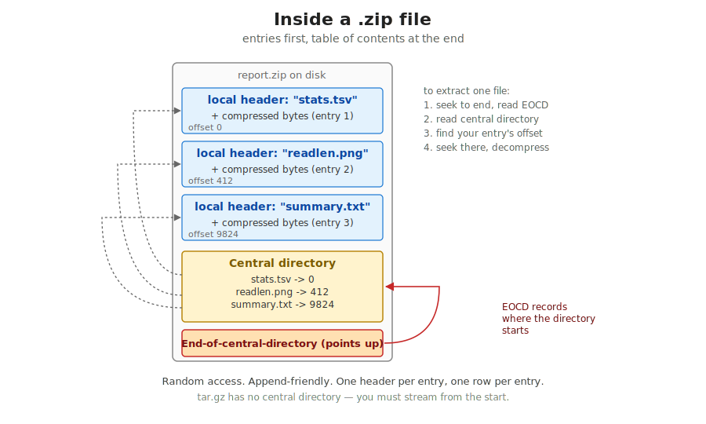
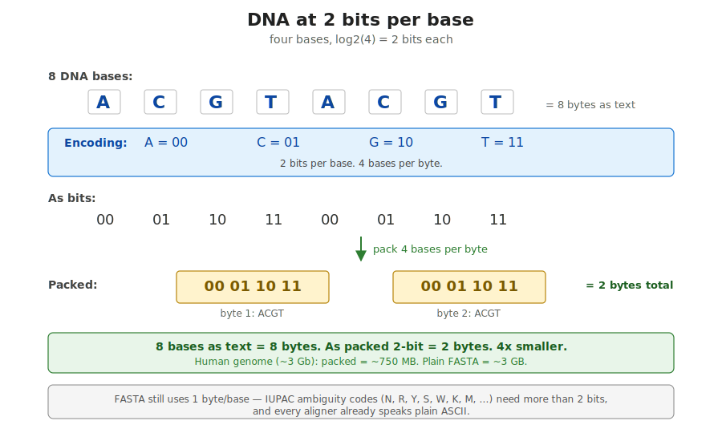
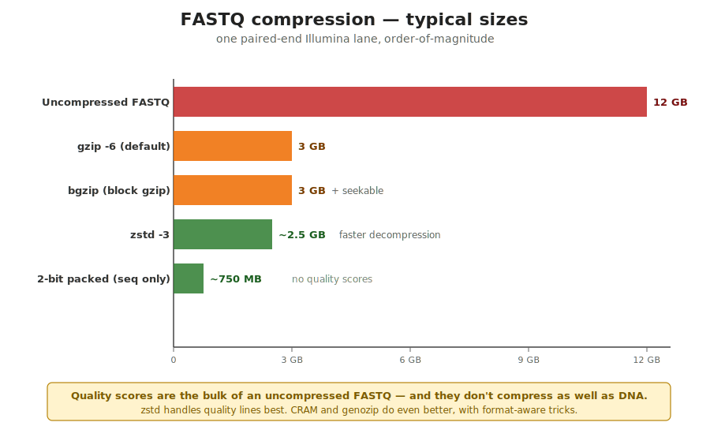

## What this lecture is

An **archive** is one file that bundles many — e.g. `.zip`, `.tar`. Compression (e.g. gzip) is a separate concern, often combined with archiving.

::: {.incremental}
- How a `.zip` file is actually laid out on disk
- What "lossless compression" means and one tiny example you can do by hand
- Why DNA can be stored at 2 bits per base, and why FASTA still uses 1 byte
- Real numbers for FASTQ compression — gzip, **bgzip** (block-gzip — seekable gzip used in bioinformatics for BAM/VCF), **zstd** (Zstandard — modern compressor, often faster and smaller than gzip)
- How to read and write `.zip` and `.gz` from Rust
:::

::: notes
You have all used `.zip` files. You have all double-clicked one and watched it expand into a folder of pictures. What you probably have not done is think about what is actually inside that file, why the bytes shrink when you compress, and what that means for the multi-gigabyte FASTQs you handle every day.

This lecture has three pieces. First, the structure of a ZIP archive — it is not magic, it is a list of compressed entries followed by a small table of contents at the end. Second, the idea of lossless compression — by the time we are done you will have done run-length encoding by hand. Third, the practical numbers for the formats you meet daily in bioinformatics.
:::

## What's inside a ZIP file

{fig-alt="The conceptual layout of a ZIP file. From top to bottom: local file header plus compressed bytes for entry 1, local file header plus compressed bytes for entry 2, local file header plus compressed bytes for entry 3, then a central directory listing each entry with its offset, then an end-of-central-directory record pointing to the start of the central directory. Annotation: to extract one file you read the central directory at the end, find the entry, and jump to its offset."}

::: notes
A `.zip` is not a magic block. It is a flat byte stream with a specific layout: each file you added becomes a "local file header" plus the compressed body, written one after the other. Then at the very end the format writes a "central directory" — a small table with one row per entry, pointing back to the offsets of each local header.

The reason the table goes at the end is historical and practical: it lets you grow a ZIP by simply appending — no need to rewrite the front of the file. To extract a single entry, an unzipper jumps to the end, reads the central directory, finds the entry it wants, and seeks to that offset. That is why ZIP supports random access and `.tar.gz` does not.
:::

## Lossless compression — the idea

**Lossless** = decoded output equals input, byte for byte. **Lossy** = decoded output is close but not identical (information thrown away).

Two principles every lossless compressor follows:

::: {.incremental}
- **Common patterns become shorter codes.** If the byte `A` shows up half the time, give it a 1-bit code instead of 8 bits.
- **The decoder reproduces the original exactly.** Byte-for-byte. No approximation.
:::

::: notes
For pictures and music it is fine to lose a little detail. For DNA it is not. Every compressor in our toolbox — gzip, bgzip, zstd, the zip in your laptop — is lossless. The decoded bytes equal the input bytes.
:::

## Lossy compression — and why not for DNA

**Lossy** compression — JPEG, MP3, MP4 — gives back something *close* to the original. Throws away detail the eye or ear will not notice. Wonderful for photos, **forbidden for DNA**:

```text
original: ACCT
decoded : ACGT   <- one base flipped C -> G
```

One byte changed in a quality-controlled FASTQ = one false variant call downstream. Variant callers cannot tell sequencing error from compressor error.

::: notes
If you compress a FASTQ and the decoder gives you back ACGT where the original said ACCT, you have just introduced a variant call. This is why bioinformatics compressors are always lossless.
:::

## Run-length encoding — the simplest example

{fig-alt="A step-by-step illustration of run-length encoding. Input string: AAAAAAAACCCCCGGGGGGGGGGTTT (8 A, 5 C, 10 G, 3 T). Output: 8A 5C 10G 3T. A small table shows the mapping of each run to its output token. An annotation notes the encoded form can be decoded back exactly. A warning footer points out that RLE only helps when there are runs — random DNA like ACGTACGTACGT does not compress well with RLE."}

::: notes
Run-length encoding is the simplest compressor you can explain in one sentence: write the count, then the byte. Eight A's become "8A". Three T's become "3T".

It is the algorithm used by some old image formats (PCX, BMP run-length variants) and by the FASTA index files `.fai` use a similar trick to record offsets. It is rarely a good general-purpose compressor, because most byte streams do not have long runs. But it is perfect as your mental model of what a lossless compressor *does*: it finds redundancy and writes it in fewer bytes.

The reversibility is the lossless property. Run "8A" through a decoder and you get exactly eight A's back — not seven, not nine.
:::

## How well does RLE compress DNA?

Random DNA has almost no runs:

```
ACGTACGTACGT  ->  1A 1C 1G 1T 1A 1C 1G 1T 1A 1C 1G 1T
```

That is *bigger* than the input. RLE made it worse.

Real genomes have **long low-complexity regions** where RLE does win:

- Poly-A tails: hundreds of A's in a row
- Centromeric and telomeric repeats: `TTAGGG TTAGGG TTAGGG ...`
- Simple satellite DNA

General-purpose compressors (gzip, zstd) handle both — they are what you use in practice.

::: notes
The honest answer to "does compression help on DNA" is "it depends what the DNA looks like". Random-looking coding DNA has very few runs, so RLE does almost nothing. Long poly-A regions and centromeric satellites are full of runs and compress dramatically.

Real compressors do not rely on runs alone. They find any repeated substring, not just same-byte runs, and they assign short codes to common bytes.
:::

## DEFLATE — what zip / gzip actually use

The algorithm inside `.zip` and `.gz` is **DEFLATE**. Two plain-English ideas, each with a fancy name:

- **find repeats** (**LZ77**) — when a substring already appeared in the recent window, write a back-reference (offset + length) instead of the bytes
- **give common letters shorter codes** (**Huffman coding**) — frequent bytes get short bit-codes, rare ones longer

When you write `Cargo.toml` with `flate2 = "1"`, this is the algorithm doing the work.

::: notes
DEFLATE was published in 1996 by Phil Katz, the author of PKZIP, and is now an internet RFC. Every browser, every operating system, and every bioinformatics tool you use knows how to decode it.

LZ77 is the part of DEFLATE that handles repetition. It slides a window over the input, and any substring that already appeared in the window gets encoded as a back-reference. Huffman coding is the part that handles byte frequency: build a tree from the byte counts, assign short codes to frequent bytes.

You do not write either by hand. You add `flate2` or `zip` to `Cargo.toml` and call the API.
:::

## LZ77 — a worked example

```text
input  : ACGTACGT ACGT ACGT
              ^^^^ ^^^^ this substring already appeared 8 bytes ago

encoded: ACGTACGT <go back 8, copy 4> <go back 8, copy 4>
```

After the first ACGTACGT, every subsequent occurrence is replaced by a short "go back N, copy M" instruction.

::: notes
Slides a window over the input. Any substring that has appeared in the window in recent bytes is encoded by a back-reference: an offset (how far back) and a length (how many bytes to copy). The decoder maintains the same window and re-expands the back-references.
:::

## DNA only needs 2 bits per base

{fig-alt="The 2-bits-per-base packing scheme. Top row: 8 DNA bases A C G T A C G T. Below each, the 2-bit encoding A=00, C=01, G=10, T=11, then the resulting bit stream 00 01 10 11 00 01 10 11. The bits are then packed into 2 bytes, four bases per byte. Annotation: 8 bases as text = 8 bytes; as packed 2-bit = 2 bytes. 4x smaller. A human genome at 2 bits per base is about 750 MB. A side note explains that FASTA still uses one byte per base because ambiguity codes such as N, R, Y, S, W need more than 2 bits."}

::: notes
This is the back-of-the-envelope calculation every bioinformatician should be able to do. There are four DNA bases. Two bits encode four states. So one base costs 2 bits — a quarter of a byte. A 100 megabase chromosome stored at 2 bits per base is 25 megabytes, plus a few kilobytes of metadata.

A FASTA file uses 1 byte per base because it is plain ASCII text. That is four times as much storage as the information-theoretic minimum. Compression closes some of that gap but not all of it: a gzipped FASTA is typically about 3-4 times smaller than the uncompressed FASTA, which gets you back into the same ballpark as 2-bit packed.
:::

## 2-bit DNA in practice — `.2bit` files and beyond

**IUPAC codes** are single letters that stand for ambiguity: `R` = "A or G", `Y` = "C or T", `S` = "G or C", `N` = "any / unknown", and so on — 15 codes in total.

The UCSC `.2bit` format stores the human reference at literally 2 bits per base. It is small (~750 MB for hg38) and supports random access by coordinate.

But FASTA stays at 1 byte per base in practice. Three reasons:

::: {.incremental}
- **Tools.** Every aligner, variant caller, and parser reads FASTA. The ecosystem assumes ASCII.
- **Ambiguity codes.** `N`, `R`, `Y`, `S`, `W`, `K`, `M`, ... — 15 IUPAC codes, more than 2 bits can encode.
- **"Good enough".** A FASTA.gz is roughly the same size as a 2-bit file (around 3-4x compression) with simpler tooling.
:::

::: notes
2-bit storage shows up where every byte matters: UCSC stores the human genome in `.2bit`, BLAST databases pack bases tightly, some short-read aligners use 2-bit indexes internally. Outside those niches, the world settles on "FASTA on disk, gzip when transferring".

The ambiguity codes are the bit that catches students out. If a sequence can contain only A, C, G, T then 2 bits is enough. The moment you allow N for "we do not know", you need 3 bits — and that doubles the table. By the time you have all 15 IUPAC codes plus gap characters, the saving over plain ASCII has shrunk a lot.

For everyday work, just trust that `samtools faidx` over `hg38.fa.gz` is the right answer.
:::

## A FASTQ file — what gzip does to it

{fig-alt="Bar chart of typical FASTQ file sizes for a paired-end Illumina lane, in descending order. Uncompressed FASTQ about 12 GB in red. gzip -6 about 3 GB in orange. bgzip about 3 GB in orange, annotated 'seekable'. zstd -3 about 2.5 GB in green. 2-bit packed sequence only about 750 MB in green, annotated 'no quality scores'. Annotation: quality scores are the bulk of an uncompressed FASTQ and they do not compress as well as DNA. zstd handles them best."}

::: notes
These are the order-of-magnitude numbers every bioinformatician carries in their head. A single paired-end Illumina lane writes roughly 12 GB of uncompressed FASTQ. Default gzip brings it down to about 3 GB — roughly a 4x reduction. zstd at default level brings it down a little further and decompresses faster.

The 2-bit number on the right is what you would get if you stored *only the sequence* — no quality scores, no read names. That is why it is so much smaller. In practice you cannot throw the quality scores away, so the realistic working size is 2.5-3 GB per lane.

Quality scores are the awkward part of FASTQ. They are nearly as long as the sequence and they look more random / less repetitive to a compressor, so the compressor finds fewer patterns to shorten. Tools like CRAM and Genozip use quality-aware tricks that beat general-purpose compressors significantly.
:::

## Why FASTQ compression matters

Three real costs at scale:

::: {.incremental}
- **Storage.** A sequencing core producing 50 lanes a week saves 450 GB/week by gzipping. Over a year that is 23 TB — real money.
- **Network.** Moving 12 GB across a slow link takes hours. Moving 3 GB takes a quarter as long.
- **IO bandwidth.** A pipeline that streams gzip on the fly often runs as fast as one that reads uncompressed files — the bottleneck is disk read, not CPU.
:::

::: notes
The bandwidth point is the surprising one. New students often think compression slows things down because the CPU has to do extra work. In reality, modern disks read at maybe 200 MB/s and modern decompressors can decompress gzip at 200-400 MB/s.
:::

## Disk-read time, 12 GB lane

200 MB/s disk, 300 MB/s gzip decode:

```text
raw 12 GB  : ##############################  ~60 s
gz   3 GB  : ########                        ~15 s  (read + decompress in parallel)
```

The compressed file is read and decoded in less time than the uncompressed file is read.

Standard practice in bioinformatics: **never store uncompressed FASTQ on disk.**

::: notes
Because the compressed file is 4x smaller, the disk has to do 4x less work. The pipeline often runs *faster* on `.fastq.gz` than on uncompressed `.fastq`. Every aligner, every QC tool, every read trimmer in 2026 reads `.fastq.gz` directly. You should not be writing pipelines that decompress to a temp file first.
:::

## The Rust `zip` crate — write

```rust
use std::fs::File;
use std::io::Write;
use zip::write::FileOptions;

let file = File::create("report.zip")?;
let mut zw = zip::ZipWriter::new(file);
let options = FileOptions::default();

zw.start_file("stats.tsv", options)?;
zw.write_all(b"reads\tmean_len\n1000\t148.2\n")?;

zw.start_file("readlen.png", options)?;
zw.write_all(&std::fs::read("readlen.png")?)?;

zw.finish()?;
```

[`ZipWriter::new`](https://docs.rs/zip/0.6/zip/write/struct.ZipWriter.html#method.new), [`start_file`](https://docs.rs/zip/0.6/zip/write/struct.ZipWriter.html#method.start_file), [`finish`](https://docs.rs/zip/0.6/zip/write/struct.ZipWriter.html#method.finish).

::: notes
The whole `.zip` writing API in one slide. Make a `ZipWriter` from anything that implements `Write + Seek`. For each entry, call `start_file` to open a new entry, then `write_all` to push its bytes. At the end, `finish()` writes the central directory and closes the archive.

This is exactly the body of today's exercise 5. You will bundle a stats TSV and a histogram PNG into one `.zip` for handover to a collaborator.
:::

## The Rust `zip` crate — read

```rust
use std::fs::File;
use std::io::Read;

let file = File::open("report.zip")?;
let mut archive = zip::ZipArchive::new(file)?;

for i in 0..archive.len() {
    let mut entry = archive.by_index(i)?;
    let name = entry.name().to_string();
    let mut body = Vec::new();
    entry.read_to_end(&mut body)?;
    println!("{name}: {} bytes", body.len());
}
```

[`ZipArchive::new`](https://docs.rs/zip/0.6/zip/read/struct.ZipArchive.html#method.new), [`by_index`](https://docs.rs/zip/0.6/zip/read/struct.ZipArchive.html#method.by_index), [`read_to_end`](https://doc.rust-lang.org/std/io/trait.Read.html#method.read_to_end).

Gotcha: you can only hold **one entry open at a time** — the archive has a single internal cursor.

::: notes
The read side mirrors the write side. Open the file, hand it to `ZipArchive::new`, then iterate over entries by index. Each entry implements `Read`, so the usual standard library methods work.

The constraint to remember: you cannot hold two entries open at once. The archive has a single internal cursor, and `by_index` moves it. If you need to extract several entries, do them one at a time.
:::

## `flate2` — gzip alone, no archive layer

```rust
use std::fs::File;
use std::io::{BufReader, BufWriter, Write};
use flate2::write::GzEncoder;
use flate2::Compression;

let raw = File::create("reads.fastq.gz")?;
let buf = BufWriter::new(raw);
let mut gz = GzEncoder::new(buf, Compression::default());

gz.write_all(b"@read1\nACGT\n+\n!!!!\n")?;
gz.finish()?;
```

`.gz` is just compressed bytes. `.zip` is multiple compressed files plus a directory. Use [`flate2`](https://docs.rs/flate2/) when you only need single-stream compression — FASTQ.gz, BAM internal compression, ...

::: notes
This is the second source of constant confusion. `.gz` and `.zip` are *not* the same format. A `.gz` is a single byte stream with a tiny header — no file names, no index, no random access. A `.zip` contains multiple named entries with an index at the end.

For bioinformatics this matters a lot. `reads.fastq.gz` is a gzip stream, *not* a zip archive. If you try to open it with the `zip` crate you will get an error. You need `flate2`.

The pattern in the code is the same as `BufWriter`: wrap your output destination, write to the wrapper, and the wrapper does the compression on the way through.
:::

## Picking a format

| Format | What it is | Good for |
|---|---|---|
| `.zip` | Multiple files, random access | Bundle outputs for handover |
| `.tar.gz` | Multiple files, streamed start-to-end | Source distributions, backups |
| `.gz` | Single compressed stream | `.fastq.gz`, `.fa.gz`, `.vcf.gz` |
| `.bgz` / bgzip | Like gzip but seekable in 64 KB blocks | Indexed BAM, VCF, tabix |
| `.zst` / zstd | Modern, faster, often smaller | Increasingly used in new tools |

Choose `.zip` for bundles. Choose `.gz` (or `.bgz`) for single streams. Choose `.zst` if your toolchain supports it.

::: notes
A short decision guide. For "I want to hand a folder of files to someone", `.zip` is the well-known default. For "I want one compressed file that streams", `.gz` is the universal answer. `bgzip` is the bioinformatics-specific variant — it is gzip-compatible but breaks the stream into independently decompressible blocks, so samtools and bcftools can jump to any genomic position without decompressing the whole file.

Zstandard (`zstd`, file extension `.zst`) is the modern entrant. Facebook released it in 2016 and it is faster than gzip at every compression level, often smaller too. Newer bioinformatics tools (e.g. the `cramino` family, parts of `nf-core`) accept `.fastq.zst`. If you start a new project today, consider `.zst` for archived results.
:::

## To the exercise

- Reference: [Day 4 — Concepts](00-concepts.qmd)
- Exercise: [05 — zip bundle](05-zip-bundle.qmd) — round-trip a few entries through `.zip`

```bash
cd day4/ex-zip-bundle
cargo test
```

::: notes
The exercise puts the `.zip` write and read functions into your hands. Tests round-trip a small set of named entries through an in-memory cursor and through a real temp file on disk. The shape is exactly the two API slides we just looked at.

After this lecture you should be comfortable explaining what a ZIP file is, why DNA compresses well, and which compressor to reach for in a new project. Tomorrow we move on to testing and release builds.
:::
