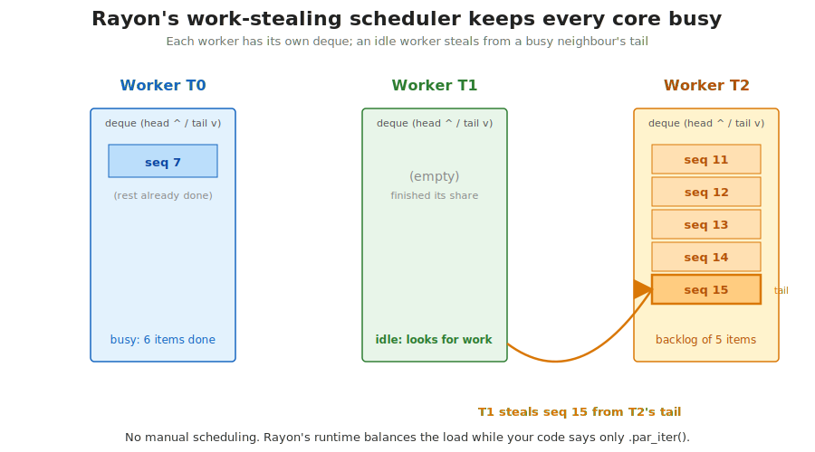
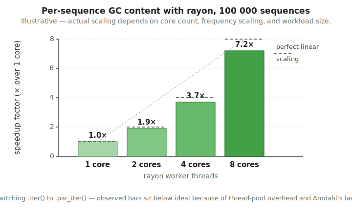

## What this lecture is

::: {.incremental}
- Three things that turn a working prototype into a deployable tool
- **Tests** — catch regressions before users do
- **Release builds** — the single most important performance flag
- **Parallelism with rayon** — fill all your CPU cores with three letters of change
- Written companion: [day 5 — Concepts](00-concepts.qmd)
:::

::: notes
By Friday you can write Rust that compiles, borrows, parses, errors. Today we cover the engineering practice around that code: how to test it, how to make it fast, how to make it use more than one core. Each topic gets a small block of slides, then an exercise.

The concepts page has the same material in written form with links to the Rust Book and to the rayon docs. Keep it open in a tab.
:::

# Part 1 — Tests

## Why bother writing tests?

::: {.incremental}
- The function you just wrote is probably right *today*
- In six months you (or somebody else) will refactor it
- Tests are the only thing that says "you broke `reverse_complement` on the N base"
- Real bioinformatics code lives for years; the original author moves on
- Test suites are the institutional memory of "what this is supposed to do"
:::

```rust
fn complement_base(b: u8) -> u8 {
    match b { b'A' => b'T', b'T' => b'A', b'C' => b'G', b'G' => b'C', _ => b }
}                                               // forgot lowercase!

#[test]
fn lowercase_complements_too() {
    assert_eq!(complement_base(b'a'), b't');    // fails: returns b'a'
}
```

::: notes
The argument for tests is not "you might write bugs", though you will. The argument is that code outlives its author's memory. Six months from now, when you change a helper to make a different caller happy, your tests are what tells you whether you also broke the original use case. Without tests, you find out from a user a year later when a published pipeline gives different numbers on the same input.
:::

## The anatomy of a Rust test

```rust
#[cfg(test)]
mod tests {
    use super::*;

    #[test]
    fn gc_of_acgt() {
        assert_eq!(gc_content(b"ACGT"), 0.5);
    }
}
```

- `#[cfg(test)]` — only compile this module when running `cargo test`
- `mod tests` — a sub-module living in the same file as the code it tests
- `use super::*;` — pull in everything from the surrounding file
- `#[test]` — mark this function for the test harness to discover

::: notes
This is the canonical layout for unit tests in Rust: a module at the bottom of the same source file as the code under test, gated by `cfg(test)` so the test code does not ship in the production binary.

`use super::*` is the idiom to pull in everything visible in the surrounding file so the test bodies do not have to spell out long paths. Each test is just a function annotated with `#[test]`.

Docs: [Book chapter 11.1 — Writing Tests](https://doc.rust-lang.org/book/ch11-01-writing-tests.html).
:::

## Tests live next to the code

![A single source file with the production function on top and a #[cfg(test)] mod tests at the bottom; cargo test runs the tests and reports two passes (green) and one failure (red) with the assert values shown.](images/lec1-test-mechanism.svg){fig-alt="Two-panel diagram. Left panel labelled src/lib.rs shows the gc_content function followed by a yellow-highlighted #[cfg(test)] band and a mod tests block containing a #[test] fn gc_of_acgt. An arrow labelled 'runs' points to the right panel, a dark terminal labelled $ cargo test showing two tests in green ok and one in red FAILED, with the failure expanded into an assertion `left == right` failed message naming left: 0.75 and right: 1.0 at src/lib.rs:14:9, and a final summary line in red showing 2 passed, 1 failed."}

::: notes
The `#[cfg(test)]` attribute is the key feature. It is a compile-time switch: the module only exists when the compiler is invoked by `cargo test`. In `cargo build --release` the test module simply is not in the source the compiler sees, so there is no binary bloat and no risk of test helpers leaking into the shipped binary.

When a test fails, the harness prints the values on both sides of the assertion, the file and line, and a summary line at the bottom. That is usually enough to localise the bug.
:::

## Three macros that do most of the work

```rust
assert!(seq.len() > 0);                 // the bool must be true

assert_eq!(gc_content(b"GC"), 1.0);     // left == right

assert_ne!(reverse_complement(b"A"),    // left != right
           b"A".to_vec());
```

- `assert!` — generic boolean check
- `assert_eq!` — prints both values on failure (most useful)
- `assert_ne!` — opposite; you want them to differ

::: notes
You will type `assert_eq!` most. The reason it is better than `assert!(a == b)` is that on failure it prints both the left and right values, which usually tells you immediately what went wrong: "left 0.75, right 1.0" — you computed a quarter less than you should have.

Docs: [`assert!`](https://doc.rust-lang.org/std/macro.assert.html), [`assert_eq!`](https://doc.rust-lang.org/std/macro.assert_eq.html), [`assert_ne!`](https://doc.rust-lang.org/std/macro.assert_ne.html).
:::

## `#[should_panic]` — testing the failure path

```rust
#[test]
#[should_panic]
fn complement_of_unknown_base_panics() {
    complement_base(b'X');
}

#[test]
#[should_panic(expected = "unsupported base")]
fn panic_message_is_useful() {
    complement_base(b'Z');
}
```

The test **passes** if (and only if) the function panics. The optional `expected = ...` matches a substring of the panic message.

::: notes
Sometimes your function's contract is "panic on bad input". You want a test that confirms it actually does panic when given bad input. `#[should_panic]` inverts the pass/fail logic: a panic means pass, a clean return means fail.

The variant with `expected = "..."` checks that the panic message contains a given substring, so a refactor that changes which precondition trips first is caught.

Docs: [Book chapter 11.1 — should_panic](https://doc.rust-lang.org/book/ch11-01-writing-tests.html#checking-for-panics-with-should_panic).
:::

## Running tests — `cargo test`

```bash
cargo test                       # compile + run every #[test] in the crate
cargo test gc                    # only tests whose name contains "gc"
cargo test --release             # tests compiled with --release (slower build)
cargo test -- --nocapture        # let println! output through to the terminal
cargo test -- --test-threads=1   # run tests serially (default: parallel)
```

The bare `--` separates cargo's flags from the test binary's flags.

::: notes
`cargo test` does three jobs in one: compile the crate, compile the tests, then run all the test functions in parallel. The filter argument (`cargo test gc`) matches any test whose path contains the string — useful when you are iterating on one fix.

`--nocapture` is the flag people forget. By default the test harness swallows `println!` output from passing tests; pass `--nocapture` to see it. You'll want that for diagnostic prints while debugging.

`--test-threads=1` is occasionally necessary when tests touch shared external state (a file, an env var). For pure-function tests, leave it on the parallel default.

Docs: [Book chapter 11.2 — Controlling How Tests Are Run](https://doc.rust-lang.org/book/ch11-02-running-tests.html).
:::

## A property-style test in three lines

```rust
#[test]
fn revcomp_round_trip() {
    for seq in [b"A".as_slice(), b"ACGT", b"NACGTN", b""] {
        let twice = reverse_complement(&reverse_complement(seq));
        assert_eq!(&twice[..], seq, "round trip failed for {:?}", seq);
    }
}
```

A property test asserts an invariant for **many inputs**, not one specific output.

For *random* inputs with automatic shrinking, use [`proptest`](https://docs.rs/proptest/) (teaser, not today).

::: notes
Property-based tests check relationships, not specific input-output pairs. The classic invariant for reverse-complement is "doing it twice gives you back the original". One test, four inputs, one assertion.

The optional message at the end of `assert_eq!` is shown only on failure. Including the value of `seq` makes it obvious which iteration broke.

Real property-testing libraries — [proptest](https://docs.rs/proptest/) and [quickcheck](https://docs.rs/quickcheck/) — generate hundreds of random inputs and, when one fails, shrink it to the smallest input that still triggers the failure. Very effective for bioinformatics, where the input space is enormous and hand-picked test cases miss most of it. Out of scope today; bookmark them.
:::

## Unit tests vs integration tests

```text
my-crate/
├── Cargo.toml
├── src/
│   ├── lib.rs            <-- unit tests live here, in #[cfg(test)] mod tests { }
│   └── kmer.rs
└── tests/                <-- integration tests
    ├── end_to_end.rs     each file is a separate crate that uses my-crate
    └── fasta_round_trip.rs
```

- **Unit tests** — alongside the code, see private items
- **Integration tests** — in `tests/`, only the public API, like a real user

::: notes
Rust ships with two flavours of test, distinguished by where the files live.

Unit tests sit in the same file as the function they test, inside a `#[cfg(test)] mod tests` block. They can see and call private functions — useful for testing internal helpers.

Integration tests live in a sibling `tests/` directory next to `src/`. Each file there is compiled as a separate crate that depends on your crate from the outside. That means they only see what's marked `pub`, exactly the way an external user of your library would. If your public API is wrong, an integration test catches it.

`cargo test` runs both kinds. Docs: [Book chapter 11.3 — Test Organisation](https://doc.rust-lang.org/book/ch11-03-test-organization.html).
:::

## Exercise 1 — find the bug

```bash
cd day5/ex-find-the-bug
cargo test
```

You are given a `reverse_complement` that compiles, runs, and *looks* right.

Your job:

1. Write six tests (empty input, palindrome, single base, known answer, N pass-through, round trip)
2. Watch one fail
3. Fix the function

Tests are the diagnostic tool — see [Exercise 1 page](01-find-the-bug.qmd).

::: notes
This is the most realistic test-writing exercise you can do: somebody else's nearly-correct function and you have to figure out what is wrong. You will almost never write green-field code in a real lab; you will inherit a half-working subroutine and need to characterise its actual behaviour.

The bug is small. The round-trip property test catches it most reliably.
:::

# Part 2 — Release builds

## The default build is slow on purpose

```bash
cargo build           # target/debug/<crate>  — fast to compile, slow to run
cargo run             # same: debug profile
cargo test            # same: debug profile
```

Debug builds prioritise **fast compile time** and **good error messages**, not runtime speed.

The single most important Rust performance flag:

```bash
cargo build --release   # target/release/<crate>  — slow to compile, fast to run
cargo run --release
```

::: notes
This trips up everyone. The default cargo profile is "dev", which optimises for the inner-loop developer experience: a small change recompiles in a few seconds, panics give clean line-by-line traces, indexing past the end of a slice tells you exactly where. The cost is runtime speed — easily 10x to 100x slower than what the same source code can do.

`--release` flips the trade-off. Compile time goes up by a factor of three to ten; runtime goes down by a factor of 10 to 100. Use it whenever you measure speed or ship a binary.

Docs: [Cargo Book — Profiles](https://doc.rust-lang.org/cargo/reference/profiles.html).
:::

## Same source, two pipelines

{fig-alt="A flow diagram. A central src/main.rs box branches into two pipelines. The top branch is the cargo build default: target/debug/, then a box saying the compiler keeps the safety net (array bounds checks, overflow panics, no inlining, full debug info), then a slow binary box labelled ~40s on the 7-mer workload. The bottom branch is cargo build --release: target/release/, then a box saying LLVM -O3 unleashed (inlining, loop unrolling, SIMD vectorisation, overflow wraps silently), then a fast binary box labelled ~0.8s on the same workload."}

::: notes
The diagram captures the four big differences. Debug keeps bounds checks and overflow checks active so you get a clean panic when something is wrong. Release strips those, lets LLVM do full optimisation passes, inlines aggressively, and auto-vectorises tight loops over byte slices.

The integer-overflow behaviour change matters. In debug, adding 1 to a `u8` that is already 255 panics with a clear message. In release, the same operation silently wraps to 0. We saw this on day 1; this is where it bites. The fix is to choose a wide-enough type at design time.
:::

## What --release actually changes

| Switch | Debug | Release |
|---|---|---|
| `opt-level` | 0 (none) | 3 (full) |
| Array bounds checks | always | always |
| Integer overflow checks | panic | wrap silently |
| Debug info embedded | yes | no |
| Function inlining | minimal | aggressive |
| SIMD auto-vectorisation | rarely | yes |
| Typical k-mer workload | 40 s | 0.8 s |

Bounds checks stay on in *both* — Rust does not give up memory safety for speed.

::: notes
The big-ticket items are opt-level going from 0 to 3, which enables every LLVM optimisation pass; debug info getting stripped, which makes the binary smaller; and inlining plus auto-vectorisation, which together account for most of the 50x speed-up on simple loops.

Bounds checks deserve special mention. They are kept in both profiles. The Rust team's stance is that bounds checks are too cheap to skip and the safety benefit is too large. So `seq[i]` in a release build still panics on out-of-range index — it does not return random memory the way C does. The optimiser does, however, often prove that an index is in range and remove the check at compile time.
:::

## Illustrative numbers

{fig-alt="Bar chart with two bars on a logarithmic time axis: a tall red 'debug' bar at 40 seconds and a short green 'release' bar at 0.8 seconds, with an arrow between them labeled '50x faster'."}

::: notes
The 50x figure is typical for tight loops over byte slices — the kind of code we have been writing all week. It is sometimes bigger (when the optimiser vectorises the loop) and sometimes smaller (when the work is dominated by allocation or I/O). The single fact you should remember: never compare Rust to anything else without `--release`.

In the exercise you will measure your own numbers on your own laptop. Expect at least 20x.
:::

## Measuring a block — `std::time::Instant`

{fig-alt="A diagram with a code panel on the left and an output panel on the right. The code panel shows: use std::time::Instant; let t = Instant::now(); a yellow comment-block containing a sequence iter-map-sum fold over 1,000,000 sequences; let dt = t.elapsed(); println!(\"elapsed: {:.3?}\", dt). The output panel is a dark terminal labelled $ cargo run --release showing 'counting GC over 1M reads...', then 'elapsed: 142.317ms' in green, then 'total GC: 53_812_419'. Below the output, a small timeline diagram shows two blue tick marks labelled t and t.elapsed() bracketing a yellow strip labelled 'the work'."}

::: notes
Three std-library lines and you have a real measurement. `Instant::now()` snapshots the OS monotonic clock. `t.elapsed()` returns a `Duration`, which is a struct holding nanoseconds. The `{:.3?}` format specifier prints it with three decimal places using the Debug formatter, which picks an appropriate unit (ns, us, ms, s).

This is the right tool for "give me an order-of-magnitude number". For statistically rigorous benchmarks — means, standard deviations, outlier detection, warm-up runs — reach for [`criterion`](https://docs.rs/criterion/). Out of scope today.
:::

## Detecting the profile from inside the program

```rust
fn main() {
    let profile = if cfg!(debug_assertions) { "debug" } else { "release" };
    println!("running in {profile} mode");

    let reads: Vec<Vec<u8>> = load_reads("input.fa");
    let start = std::time::Instant::now();
    count_kmers(&reads);
    println!("elapsed: {:.3?} ({profile})", start.elapsed());
}
```

`cfg!(debug_assertions)` is a compile-time boolean — `true` for debug, `false` for release.

::: notes
This is the cheap trick that prevents the most embarrassing kind of email: "your benchmark says Rust is slower than my Python, here is my command line: `cargo run -- input.fa`". They forgot the `--release` flag.

Putting `cfg!(debug_assertions)` into the timing output makes that mistake impossible to miss — the printed string says "debug" right next to the elapsed time.

Docs: [`cfg!` macro](https://doc.rust-lang.org/std/macro.cfg.html), [debug_assertions](https://doc.rust-lang.org/reference/conditional-compilation.html#debug_assertions).
:::

## Exercise 2 — measure the release speedup

```bash
cd day5/ex-release-mode

time cargo run -- 1000              # debug
time cargo run --release -- 1000    # release

# scale up until release takes around 1s:
time cargo run --release -- 5000
```

No code to write. Read the elapsed times.

Expect at least 20x; 50x is normal. See [Exercise 2 page](02-release-mode.qmd).

::: notes
The program counts every 7-mer across N random sequences. Run it both ways, note the wall-clock time, divide, write down the ratio. Then bump N up until the release version takes a second or two, and compare again.

Two seconds of typing for a 50x speed-up is the best return on investment in this whole course.
:::

# Part 3 — Parallelism with rayon

## Why parallelism

A modern laptop has 8 or more CPU cores. A single-threaded program uses one.

Many bioinformatics workloads are **embarrassingly parallel**:

- Compute GC content for each of 1 000 000 reads — every read is independent
- Score every k-mer in a sequence against a model
- Run an alignment for each query against a database

If items are independent, running them on N cores takes ~1/N the time.

::: notes
Modern CPUs gain throughput by adding cores, not by going much faster per core. To use the hardware you already paid for, your code has to do more than one thing at a time.

The good news for biology: most per-record analyses are embarrassingly parallel. Per-read GC content, per-read trimming, per-read mapping, per-sequence k-mer counting, per-alignment scoring — each item is independent of every other. That is exactly the shape rayon handles automatically.
:::

## Sequential vs parallel — a timeline

{fig-alt="A two-panel timeline diagram. The top panel labelled Sequential (.iter()) shows a single thread T0 with eight green boxes in a row, seq 0 through seq 7, total time 8 units. The bottom panel labelled Parallel (.par_iter()) shows four thread rows T0 through T3 each with two green boxes side by side; T0 holds seq 0 then seq 4, T1 holds seq 1 then seq 5, T2 holds seq 2 then seq 6, T3 holds seq 3 then seq 7; the total time is 2 units, with a dashed arrow on T0 labelled 'T0 reused'."}

::: notes
The picture is the whole pitch. The same eight items finish in roughly a quarter of the wall-clock time when split across four threads. The threads do not idle: as soon as a thread finishes one item, rayon hands it the next one in line.

Real speed-ups fall short of the ideal (4x here) because of overhead: spinning up the thread pool, atomic operations to hand out tasks, contention on memory bandwidth, the bit of the program that has to run sequentially at the end. We saw measured 7.2x on 8 cores in the GC-content figure earlier in the deck.
:::

## Rayon in one line

```rust
use rayon::prelude::*;

// sequential
let gcs: Vec<f64> = sequences.iter()
    .map(|seq| gc_content(seq))
    .collect();

// parallel
let gcs: Vec<f64> = sequences.par_iter()
    .map(|seq| gc_content(seq))
    .collect();
```

The change is literally three letters: `iter` to `par_iter`.

::: notes
This is rayon's headline feature: if your computation is shaped as an iterator chain ending in `.collect()` or `.sum()` or `.reduce()`, you parallelise it by switching `.iter()` to `.par_iter()`. The closure inside `.map` does not change. The output type does not change. The order of results in the output Vec does not change.

Add `rayon = "1"` to `[dependencies]` in Cargo.toml, `use rayon::prelude::*` at the top of the file, and you are done. There are no threads to manage, no mutexes to lock, no thread pool to size. Rayon configures itself for the number of CPU cores at startup.

Docs: [rayon crate](https://docs.rs/rayon/), [`par_iter`](https://docs.rs/rayon/latest/rayon/iter/trait.IntoParallelRefIterator.html#tymethod.par_iter).
:::

## Where the threads come from

`use rayon::prelude::*;` pulls in a runtime that owns a **thread pool**:

- Sized to the number of CPU cores at startup (override with `RAYON_NUM_THREADS=4`)
- Each thread owns a queue ("deque") of tasks
- When you call `.par_iter()`, rayon splits the work across the deques
- Done once per process — the pool is reused for every `.par_iter()` you call

You never call `spawn` or `join` yourself.

| How the pool gets sized | When |
|---|---|
| `RAYON_NUM_THREADS=8 ./my-tool` | env var, set by the user at launch |
| `num_cpus::get()` fallback | automatic, if the env var is unset |
| `ThreadPoolBuilder::new().num_threads(N).build_global()` | manual, called once at startup |

::: notes
Spinning up an OS thread takes milliseconds and they cost memory. Doing it per `.par_iter()` would be unusable. Rayon instead creates one pool of long-lived threads when the program starts and parks them on a condition variable when idle.

`RAYON_NUM_THREADS` is the only knob most people ever set, usually to pin scheduling for a benchmark.

Docs: [`ThreadPoolBuilder`](https://docs.rs/rayon/latest/rayon/struct.ThreadPoolBuilder.html).
:::

## Work-stealing keeps every core busy

{fig-alt="Three worker columns. T0 in blue shows a deque with one remaining item seq 7 and a caption 'busy: 6 items done'. T1 in green shows an empty deque captioned 'idle: looks for work'. T2 in orange shows a deque of five items seq 11 through seq 15 with the bottom item seq 15 (the tail) highlighted in a darker shade and labelled 'tail'; caption 'backlog of 5 items'. A curved orange arrow runs from T1's column down and back up to seq 15 in T2's deque, with the label 'T1 steals seq 15 from T2's tail'. A footer reads: No manual scheduling. Rayon's runtime balances the load while your code says only .par_iter()."}

::: notes
Work stealing is what keeps the cores busy when items take different amounts of time. Each worker pops tasks off the *head* of its own deque (fast, no contention). When a worker runs out, it picks a random victim, looks at the victim's deque, and steals from the *tail* — the opposite end. Two workers can therefore touch the same deque without colliding most of the time.

The practical consequence: if one sequence happens to take 10x as long as the others, the threads that finish their share early just steal from whoever is still working. You never have to estimate task sizes or pre-partition the data by length.

This is the same algorithm used in Cilk and the JVM's ForkJoin pool. Rayon is the Rust port.
:::

## What makes this safe — `Send` and `Sync`

![Two panels. Left panel titled 'Send' shows a value moving from Thread A to Thread B with the slogan 'T can be moved to another thread'; examples list Vec<u8> and String as OK, Rc<u8> and *mut T as NO. Right panel titled 'Sync' shows one value with &value borrowed by two threads with the slogan '&T can be shared between threads'; examples list &[u8], Mutex<T> as OK, Cell<u8> and RefCell<T> as NO.](images/lec1-send-sync.svg){fig-alt="Diagram with two large panels side by side. Left panel in blue is titled Send: T can be moved to another thread, with a small diagram showing a value moving from a Thread A box to a Thread B box along a green 'move' arrow; an examples list shows Vec<u8>, String, HashMap as OK (green) and Rc<u8>, *mut T as NO (red), with side notes 'DNA sequences travel freely', 'non-atomic refcount would race', 'raw pointer, no safety analysis'. Right panel in green is titled Sync: &T can be shared between threads, with a value box and two arrows out to Thread A and Thread B both carrying '&value'; examples show &[u8], &Vec<u8>, Mutex<T> as OK and Cell<u8>, RefCell<T> as NO with side notes 'read-only is safe', 'guards its own state', 'mutation w/o sync', 'single-thread only'. Footer: 'Fearless concurrency': the compiler refuses code that would race, before it ever runs."}

::: notes
These are two marker traits, automatically derived for almost every type you'll write. A type is `Send` if a value of that type can be moved to another thread without breaking its invariants. A type is `Sync` if a *shared reference* to a value of that type can be used from multiple threads.

`Vec<u8>` is both. So is `String`, `HashMap`, `[u8; N]`, and every primitive. The few non-Send-or-Sync types are single-thread tools: `Rc` (non-atomic reference counting), `Cell` and `RefCell` (interior mutability without synchronisation). Rayon refuses to compile any closure that captures one of those by shared reference, which is exactly the refusal that prevents data races.

Docs: [`Send`](https://doc.rust-lang.org/std/marker/trait.Send.html), [`Sync`](https://doc.rust-lang.org/std/marker/trait.Sync.html).
:::

## The compiler refuses the dangerous version

```rust
let mut total = 0usize;                    // shared mutable counter

sequences.par_iter().for_each(|seq| {
    total += gc_count(seq);                // compile error
});
// error[E0594]: cannot assign to `total`, as it is a captured variable
// note:  `total` is captured by an `FnMut` closure, but rayon requires `Fn`
```

The fix: each closure produces a value, then **collect** or **reduce**.

```rust
let total: usize = sequences.par_iter()
    .map(|seq| gc_count(seq))
    .sum();                                // rayon merges per-thread sums
```

::: notes
Try to share a mutable accumulator across rayon threads and the compiler stops you. The error message names the trait that didn't fit. The fix is to express the work as a fold: each thread produces a per-element value, rayon combines them.

This is the famous "fearless concurrency" pitch. The class of bugs that data-race detectors catch at runtime in other ecosystems is caught at compile time here, with no special tooling. If your code compiles and uses safe Rust + rayon, it cannot data-race.

Note the small caveat: parallel `.sum::<f64>()` is non-deterministic at the last-bit level, because floating-point addition is not associative. The per-item-then-`collect` shape used elsewhere in this deck is deterministic.
:::

## When parallelism helps — and when it doesn't

| Situation | Parallel? |
|---|---|
| 1 000 000 reads, GC content for each | yes, big win |
| 100 000 alignments, each ~1 ms | yes, near-linear |
| 8 sequences, simple arithmetic each | **no** — pool overhead > work |
| 10 sequences, each takes 30 s | yes — even small N helps |
| Per-byte loop inside one sequence | usually no — too fine-grained |

Rule of thumb: **at least a few microseconds of work per item, and at least thousands of items.**

::: notes
Parallelism is not free. Each `.par_iter()` call has microseconds of overhead to package the work, hand it to the pool, and collect results. If your total work is shorter than that overhead, the parallel version is slower than the sequential one.

Two questions to ask before reaching for `.par_iter()`. First: is the per-item work non-trivial? GC content of a 1000-base sequence is, computing `x + 1` is not. Second: are there enough items to amortise the pool overhead? A thousand or ten thousand is plenty; a dozen is usually not.

For the workloads in this course — many reads, real work per read — rayon wins handily. Measure when in doubt.
:::

## Three other rayon tools worth knowing

```rust
// 1. mutable parallel iteration
scores.par_iter_mut().for_each(|s| { *s = recalculate(*s); });

// 2. run two arbitrary closures in parallel (divide-and-conquer)
let (left_count, right_count) = rayon::join(
    || count_kmers(&seqs[..mid]),
    || count_kmers(&seqs[mid..]),
);

// 3. parallelise an arbitrary sequential iterator
let total: usize = my_records.par_bridge().map(|r| r.len()).sum();
```

::: notes
`par_iter_mut` parallelises writes into a mutable slice — useful when you want to update each element in place. The borrow checker still applies: each closure gets a `&mut` to its own element, never overlapping.

`rayon::join` is the building block under `par_iter` and is also useful directly for divide-and-conquer algorithms. Each closure runs on its own thread; the call returns when both finish.

`par_bridge` adapts any sequential `Iterator` to be processed in parallel. The iterator's `next()` is called from one thread under a lock, but downstream work is parallelised. Useful when the input comes from a sequential source you cannot rewrite.

Docs: [`par_iter_mut`](https://docs.rs/rayon/latest/rayon/iter/trait.IntoParallelRefMutIterator.html#tymethod.par_iter_mut), [`rayon::join`](https://docs.rs/rayon/latest/rayon/fn.join.html), [`par_bridge`](https://docs.rs/rayon/latest/rayon/iter/trait.ParallelBridge.html).
:::

## Observed speed-up on real cores

{fig-alt="Bar chart of speedup factor versus number of rayon worker threads: 1.0x at 1 core, 1.9x at 2 cores, 3.7x at 4 cores, 7.2x at 8 cores, with dashed grey markers at 1, 2, 4, and 8 showing perfect linear scaling above each bar."}

::: notes
The dashed grey markers show ideal linear scaling. Observed bars sit just below ideal because of thread-pool overhead, memory-bandwidth contention, and Amdahl's law (the unavoidable serial fraction of any program). 7.2x on 8 cores is a typical, healthy result for this kind of workload.

You will likely see slightly different numbers on your laptop depending on core count and whether the OS pins threads to performance cores or efficiency cores.
:::

## Exercise 3 — parallelise GC content

```bash
cd day5/ex-parallel-gc

cargo test                              # all three tests must pass
cargo run --release -- 10000            # times both versions
```

Take a sequential `per_seq_gc_sequential(&[Vec<u8>]) -> Vec<f64>` and write the rayon-parallel version. **The change really is three letters.**

See [Exercise 3 page](03-parallel-gc.qmd).

::: notes
The exercise is deliberately tiny: prove to yourself that on a workload where the closure does real per-item work and there are many items, swapping `.iter()` for `.par_iter()` is genuinely the whole change. The tests assert that both versions return the same `Vec<f64>` in the same order.

Run with `--release`. A debug build hides the speed-up under optimiser-free closure overhead.
:::

## Recap

::: {.incremental}
- **Tests** — `#[cfg(test)] mod tests { #[test] fn ... }`, `assert_eq!`, `cargo test`
- **Property tests** — assert invariants over many inputs, not specific outputs
- **Integration tests** — files in `tests/`, use only the public API
- **`--release`** — 10x to 100x faster; *always* benchmark with it
- **`Instant::now() ... .elapsed()`** — three lines, the right tool for order-of-magnitude
- **`rayon`** — `.par_iter()` plus a work-stealing pool; the compiler keeps you race-free
- **`Send` / `Sync`** — auto-derived for almost everything; the few exceptions are the trip wires
:::

::: notes
Three topics in 30 minutes, each with its own exercise. Tests catch regressions, release flips on the performance, rayon fills the rest of your cores. By the end of the day you will have written tests that found a real bug, measured a real 50x speed-up, and turned a sequential loop into a parallel one by editing three letters.
:::

## To the exercises

- Reference companion: [day 5 — Concepts](00-concepts.qmd)
- [Exercise 1 — Find the bug](01-find-the-bug.qmd)
- [Exercise 2 — Release mode](02-release-mode.qmd)
- [Exercise 3 — Parallel GC content](03-parallel-gc.qmd)

```bash
cd day5/ex-find-the-bug
cargo test
```

::: notes
Three exercises. Start with the bug hunt, then measure release speed, then parallelise. Each takes about half an hour. Get the first one green before lunch.
:::
