## Visualising biological data — why we're building a web app

The most useful tool you can give a biologist colleague is one they don't have to install. A web page in a browser is exactly that: paste a sequence, see GC content, click to load a sample, no setup.

Today we build one — entirely in Rust, frontend and backend.

::: notes
The motivation for this whole day: shipping bioinformatics insights to non-programmers means the browser, period. Email a colleague a URL, they see your data. No conda env, no Docker, no "first install Python 3.11".
:::

## Frontend, backend, full-stack — the words

- **Frontend** [the code that runs in the user's browser — HTML + JS, or in our case Rust compiled to WASM (WebAssembly, a binary format browsers can execute)]
- **Backend** [the code that runs on a server — receives requests, talks to databases, sends responses; ours is axum]
- **Full-stack** [writing both ends]
- Today we go full-stack, in Rust, end to end

::: notes
The three words appear in the next few slides; pin them down now so nobody has to guess. "Frontend" and "backend" sometimes get used loosely; for us today the split is literal — two crates, two processes, two ports.
:::

## What today is about

::: {.incremental}
- A web app written **entirely in Rust** — frontend, backend, shared types
- Frontend compiled to **WebAssembly**, runs in the browser
:::

::: notes
This lecture introduces the pieces of the pure-Rust web stack we use today. The same Rust we have been writing all week now runs in a browser tab. The companion concepts page covers the same material in writing with links to the upstream docs — keep it open.
:::

## The shape of the day

::: {.incremental}
- One workspace with three crates: `shared`, `frontend`, `backend`
- `frontend` builds to `.wasm`, served by **trunk** [a build tool and dev server for Rust web frontends — like webpack for Yew, with hot reload (auto-rebuild + browser refresh on save) built in]
- `backend` builds native, serves `/api/samples`
- Both crates depend on `shared` — same Rust types on the wire
- After class you are clicking a button, fetching a sequence, plotting GC content over a sliding window
:::

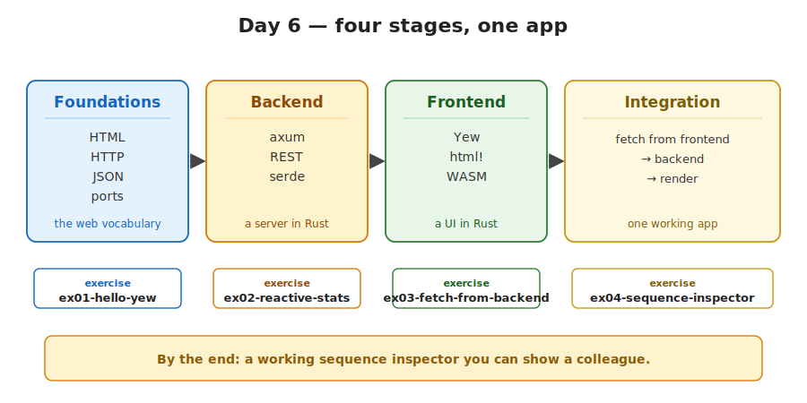{fig-alt="A horizontal flow with four stages — Foundations (HTML, HTTP, JSON, ports), Backend (axum), Frontend (Yew, WASM), Integration (browser fetches from backend) — labelled with which exercise covers each."}

::: notes
Today is structurally a "real" full-stack Rust application. The crates layout, the shared types, the dev proxy — these are not toy shortcuts. The same shape scales to a deployable product.
:::

## This is what we're building

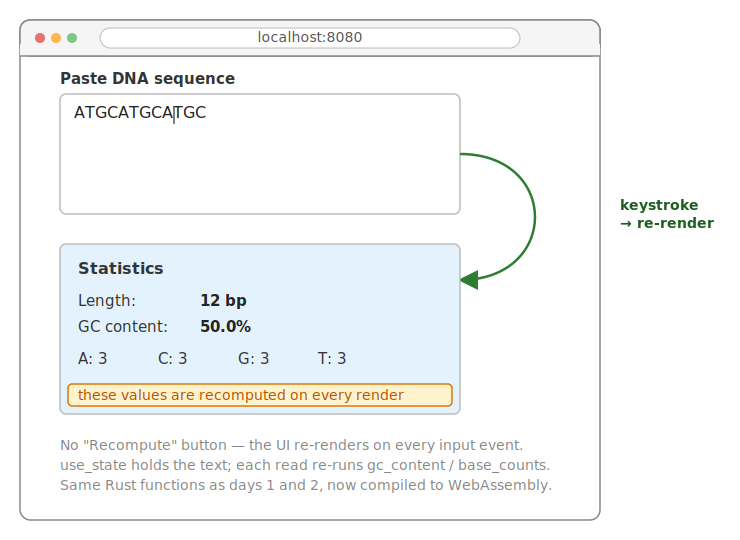{fig-alt="Mockup of the reactive sequence inspector UI: sample picker buttons at the top, a textarea showing the loaded DNA sequence, a stats panel showing length and GC content, and an inline SVG plot of GC content along a sliding window." width="80%"}

::: notes
Showing the destination up front. Every slide that follows is one ingredient of this UI. Refer back to this image when explaining where each piece lands.
:::

## Before you start — tooling checklist

- `rustup target add wasm32-unknown-unknown` [one-time; teaches `rustc` (the Rust compiler) to emit WASM]
- `cargo install trunk` [one-time; trunk is the build tool that runs the Yew dev server]
- `curl` or HTTPie installed [for sanity-checking the backend from the command line]
- Two terminals ready [one for the backend, one for trunk]

::: notes
Get the toolchain in place before the first exercise. Adding the wasm target and installing trunk are both one-time costs but they happen on the first attempt; do them now and they will not bite you mid-exercise.
:::

## Before we touch Rust: three things to know

Most browser-based code rests on three building blocks. None of them is Rust-specific:

1. **HTML** — how a page is structured.
2. **HTTP** — how the browser talks to a server.
3. **JSON** — how structured data moves between the two.

Plus one more cross-cutting concept: **ports**.

::: notes
If you've used the web — which is everyone — you've used all four implicitly. The lecture works better if you can name them.
:::

## HTML — a page is a tree of boxes

HTML is just text marked up with tags. The browser turns those tags into nested boxes on the screen.

```html
<!-- HTML -->
<html>
  <body>
    <h1>Sequence inspector</h1>
    <p>Paste DNA below:</p>
    <div>
      <textarea></textarea>
      <p>GC content: 50%</p>
    </div>
  </body>
</html>
```

The `<div>` is the workhorse: a generic box that can contain other boxes. Almost every interactive component you've seen on the web is a `<div>` (or a few `<div>`s) with style and code attached.

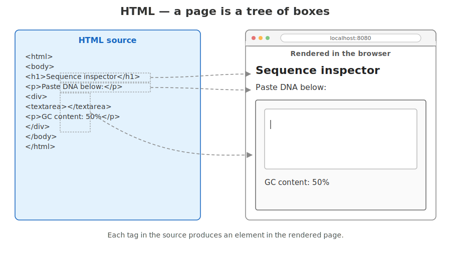{fig-alt="Side-by-side comparison: HTML source on the left and the rendered nested-boxes layout on the right."}

::: notes
The audience has read HTML before but probably hasn't written it. Quick reorientation.
:::

## The DOM — the in-memory tree the browser builds

When the browser parses your HTML, it builds an in-memory tree of nodes called the **DOM** (Document Object Model). Every box in the rendered page is a node in this tree.

Everything that changes the page after load — JavaScript, jQuery, React, Yew — does so by **manipulating the DOM tree**: adding a node, removing one, changing the text inside one. The browser re-renders whatever changed.

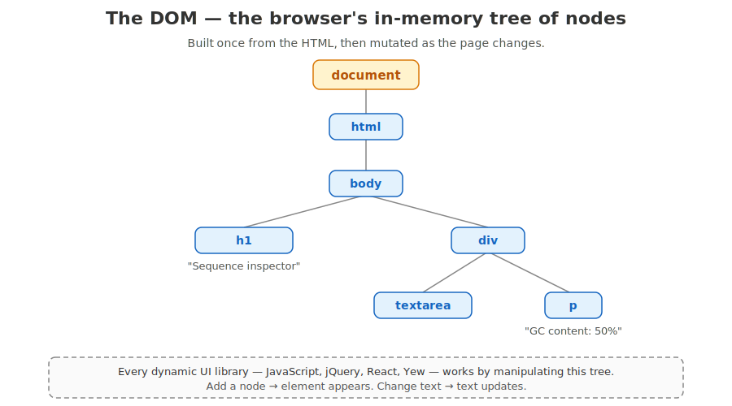{fig-alt="A tree diagram showing html as the root with body, h1, p, and div nodes as children, mirroring the HTML source."}

::: notes
This is the foundation for understanding what Yew actually does (next part of the lecture). Yew = "build me a virtual DOM in Rust, then diff against the real one and patch the differences".
:::

## HTTP — how the browser talks to a server

When you click a link, the browser sends an **HTTP request** to a server somewhere. The server sends back an **HTTP response**.

A request has:

- a **method** (`GET`, `POST`, ...),
- a **URL** (`https://api.example.com/samples/42`),
- optional **headers** (auth, content type, ...),
- optional **body** (for `POST` / `PUT`).

A response has:

- a **status code** (`200 OK`, `404 Not Found`, ...),
- headers,
- a body (HTML, JSON, an image, anything).

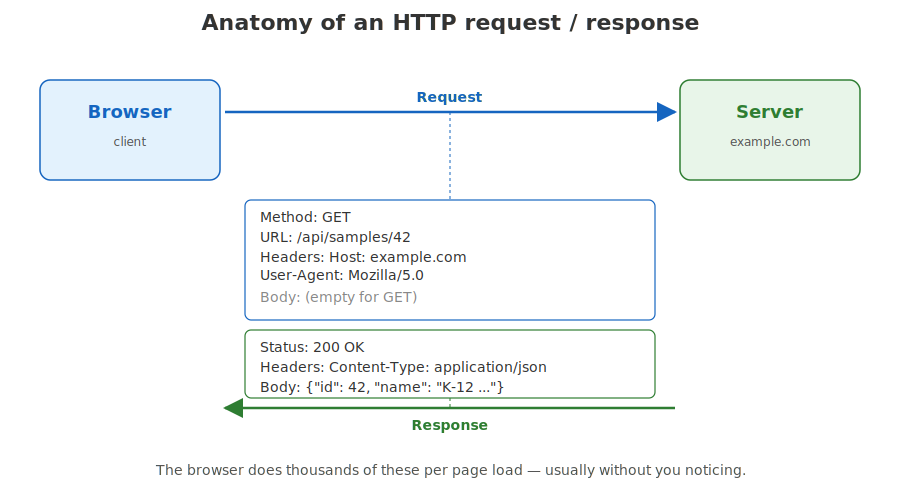{fig-alt="A browser on the left and a server on the right with arrows showing an HTTP request going out and a response coming back."}

::: notes
We'll use one `GET` and one `POST` in the exercises. The browser does this thousands of times per page; you barely notice.
:::

## Ports — finding the right service on a machine

A single computer can run many services at once: a web server, a database, an SSH daemon, your dev backend. To direct traffic to the right one, every service listens on a **port** — a number from 0 to 65535.

The browser combines IP + port to reach a service:

```
http://127.0.0.1:3000/api/samples/42
       ───────────  ─── ──────────────
       host         port   path
```

Common ports: `80` HTTP, `443` HTTPS, `22` SSH, `5432` PostgreSQL. Dev backends usually pick something high like `3000`, `8000`, or `8080` so they don't clash with real services.

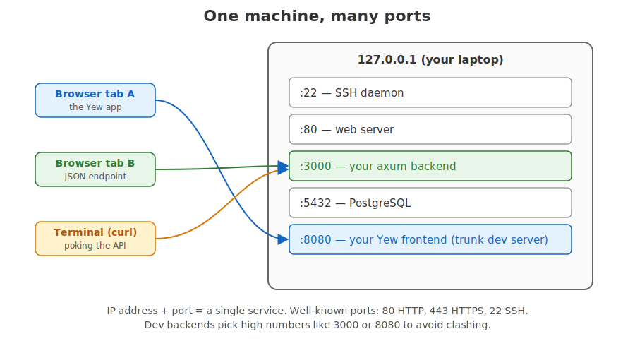{fig-alt="A single machine box with multiple numbered ports on its edge, a client connecting to one specific port number."}

::: notes
Today the axum backend runs on port 3000; the Yew frontend (via trunk) runs on port 8080. Two ports, one laptop.
:::

## JSON — how structured data crosses the wire

HTTP bodies are bytes. When you want to send structured data — a list of samples, a record with named fields — the most common encoding is **JSON** (JavaScript Object Notation).

A JSON record on the wire:

```json
{
  "id": 42,
  "name": "K-12 MG1655",
  "species": "Escherichia coli",
  "sequence": "ACGTACGT..."
}
```

JSON has just six types: object, array, string, number, boolean, null. Almost every language can read and write it. That's why the web settled on it.

::: notes
We send and receive JSON between axum and Yew today. serde handles both directions automatically — next slide.
:::

## JSON ↔ Rust struct (serde, preview)

`serde` is the Rust crate that converts back and forth between JSON and your structs — both directions, automatically, from one `#[derive]`:

```rust
// Rust
#[derive(Serialize, Deserialize)]
struct SampleRecord {
    id: u32,
    name: String,
    species: String,
    sequence: String,
}
```

{fig-alt="A JSON object on the left and a Rust struct on the right, with arrows mapping each JSON key to its corresponding struct field."}

`serde_json::to_string(&record)` → JSON.
`serde_json::from_str(&body)` → `SampleRecord`.

Same struct, both sides of the network call.

::: notes
We use this both in the backend (returning JSON) and the frontend (parsing JSON). Hit it again later in the lecture.
:::

## `async`/`await` — the minimum you need

An `async fn` [a function that does not block; it returns immediately] returns a **`Future`** [a description of work to be done later, not the result itself].

```rust
// Rust
async fn fetch_one() -> Result<SampleRecord, gloo_net::Error> {
    let resp = Request::get("/api/samples/lambda").send().await?;
    let data = resp.json::<SampleRecord>().await?;
    Ok(data)
}
```

`.await` [the operator that waits for a future to be ready] means: pause this task until the future is ready, let the **runtime** [the scheduler that decides which task runs when] do other work in the meantime.

We **do not** teach `Future` internals today — treat it as a single pattern.

::: notes
This is the only part of day 6 that introduces a genuinely new language feature. We are deliberately keeping it shallow. You need to know: async functions return futures, `.await` waits for a future, you call `.await` on each step of a fetch. The deep dive — pinning, poll semantics, executors — is real and learnable, but you do not need it to ship today's app.
:::

## What `.await` actually does

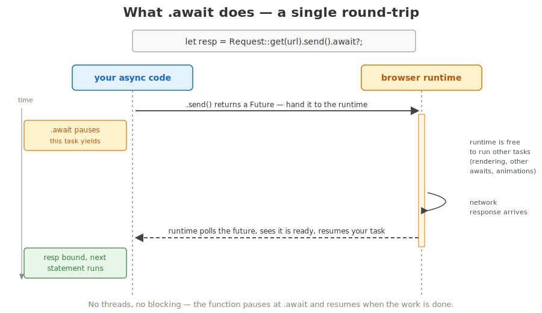{fig-alt="Sequence diagram with two lifelines: your async code (blue) on the left and browser runtime (yellow) on the right. The code is let resp = Request::get(url).send().await?;. Step 1: solid arrow from your code to browser runtime labelled .send() returns a Future, hand it to the runtime. Step 2: a yellow note on the left labelled .await pauses, this task yields. Step 3: the runtime is shown as active for a long span, annotated runtime is free to run other tasks (rendering, other awaits, animations). Step 4: a small self-call on the runtime lifeline labelled network response arrives. Step 5: dashed return arrow from runtime to your code labelled runtime polls the future, sees it is ready, resumes your task. Step 6: a green note labelled resp bound, next statement runs. A time arrow runs top to bottom. Footer: No threads, no blocking — the function pauses at .await and resumes when the work is done."}

::: notes
The picture is: at the `.await`, your function yields control. The browser keeps doing other work — rendering, animations, other concurrent awaits. When the awaited thing is ready, the runtime picks your task back up where it left off. There are no threads involved; this is cooperative concurrency inside a single thread.
:::

## A REST server in 20 lines of axum

**REST** [HTTP verbs + URL paths to access named resources]. `axum` [a Rust web framework for HTTP servers] is the backend library we use today. The smallest possible backend — accepts a DNA sequence, returns its GC content:

```rust
use axum::{routing::get, Router, extract::Query};
use serde::{Serialize, Deserialize};

#[derive(Deserialize)] struct GcQuery { seq: String }
#[derive(Serialize)]   struct GcAnswer { length: usize, gc: f64 }

async fn gc(Query(q): Query<GcQuery>) -> axum::Json<GcAnswer> {
    let n = q.seq.len();
    let g = q.seq.bytes().filter(|b| matches!(b, b'G' | b'C')).count();
    axum::Json(GcAnswer { length: n, gc: g as f64 / n.max(1) as f64 })
}

#[tokio::main]
async fn main() {
    let app = Router::new().route("/gc", get(gc));
    let l = tokio::net::TcpListener::bind("127.0.0.1:3000").await.unwrap();
    axum::serve(l, app).await.unwrap();
}
```

::: notes
This is the bare minimum to convince yourself that "Rust on the backend" works. No frontend yet — we'll add Yew in a moment.
:::

## REST server — the call flow

{fig-alt="A flow diagram showing a client sending GET /gc?seq=ACGT to axum, the router dispatching to the gc handler, and a JSON response being returned."}

## Calling it with curl

You can hit any REST endpoint from the command line — no browser needed:

```bash
# bash
$ curl 'http://127.0.0.1:3000/gc?seq=ACGTACGTGGGG'
{"length":12,"gc":0.6666666666666666}
```

`curl` is your sanity check: does the backend work? Yes? Then add the frontend.

::: notes
Test the backend in isolation before adding any frontend complexity. Saves you from chasing "is it the API or my JavaScript".
:::

## WebAssembly: a binary the browser can run

**WebAssembly** (or **WASM**) [a portable, sandboxed (isolated execution environment) binary format that every modern browser can load and execute] is just that: a compiled binary the browser knows how to run.

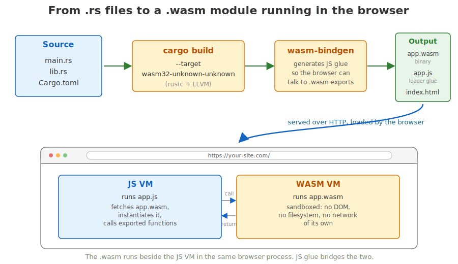{fig-alt="A diagram of the WebAssembly build flow: Rust source compiled by rustc into a .wasm binary, then loaded and executed by the browser."}

::: notes
The key sentence is "portable executable". The browser already knows how to load and run a `.wasm` file. The sandbox is the same one that protects you from any other page's JavaScript — wasm cannot read the disk or open arbitrary sockets.
:::

## Why it matters for us

- Rust → `.wasm` → browser, with near-native performance
- A **compile target**, not a language — Rust, C, C++, Go can all produce `.wasm`
- We write Rust today, change the build target, get a `.wasm` file the browser runs
- No JavaScript runtime cost on the hot path

::: notes
You do not learn a new language to use WebAssembly. The same Rust we have been writing all week now runs in a browser tab. Trunk and **wasm-bindgen** [a tool + crate that generates the JavaScript glue letting Rust call browser APIs and vice versa] handle the plumbing.
:::

## The build pipeline

::: {.fragment}
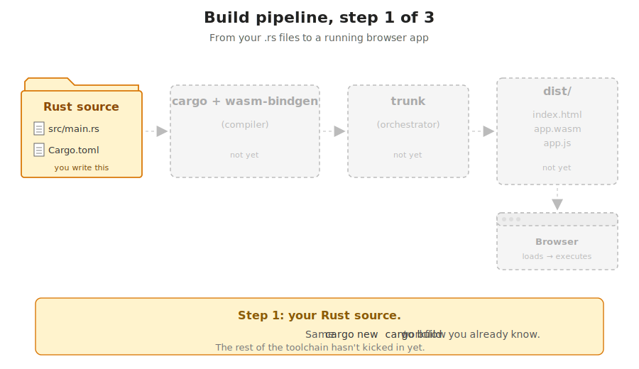{fig-alt="Step 1 of the build pipeline: Rust source files (main.rs, lib.rs, Cargo.toml) shown as the starting point."}
:::

::: {.fragment}
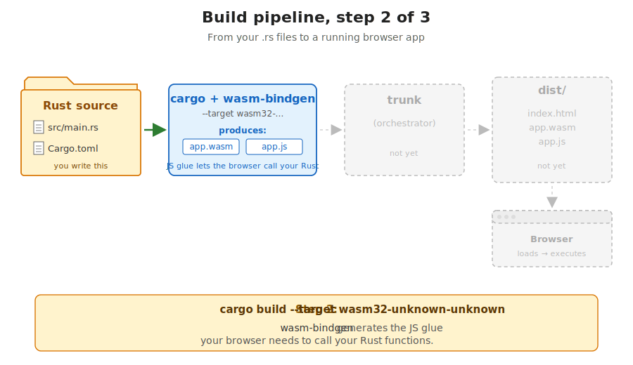{fig-alt="Step 2 of the build pipeline: cargo compiles Rust source to a .wasm binary and wasm-bindgen emits accompanying JavaScript glue."}
:::

::: {.fragment}
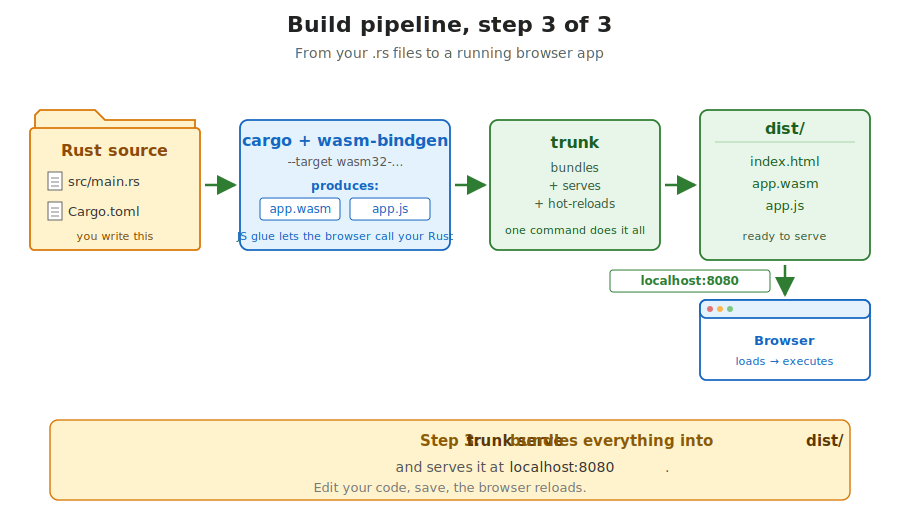{fig-alt="Step 3 of the build pipeline: trunk bundles the .wasm, JS glue, index.html and assets into a /dist directory served to the browser."}
:::

::: notes
Three stages: the Rust compiler emits a `.wasm` binary, `wasm-bindgen` writes a small JavaScript shim that knows how to call into the wasm exports, and the browser loads both. The wasm runs in its own virtual machine inside the same browser process as the JavaScript VM — they share memory only through carefully typed bridges.
:::

## `wasm32-unknown-unknown`

```bash
# bash
rustup target add wasm32-unknown-unknown
```

Rust target triples are `arch-vendor-os`:

- **`wasm32`** — 32-bit WebAssembly instruction set
- **`unknown`** — no specific vendor
- **`unknown`** — no specific OS (it is just a VM)

`cargo build --target wasm32-unknown-unknown` invokes `rustc` with that target. Output is `target/wasm32-unknown-unknown/debug/your_crate.wasm`.

::: notes
Targets in Rust are named with a triple. `wasm32-unknown-unknown` says "32-bit wasm, no specific vendor, no operating system". You add it once with `rustup`. From then on, `cargo build --target wasm32-unknown-unknown` produces a `.wasm` blob instead of a native binary. You will not type this directly — trunk does it for you — but knowing the name helps when reading error messages.
:::

## `wasm-bindgen` — the JS glue layer

Pure WebAssembly only speaks integers and floats. It cannot return a `String` to JavaScript, and it cannot touch the DOM directly.

[`wasm-bindgen`](https://github.com/rustwasm/wasm-bindgen) generates a tiny JavaScript shim that:

- marshals strings, structs, closures across the JS↔WASM boundary
- exposes browser APIs (DOM, `fetch`, `setTimeout`) to your Rust code
- lets you `#[wasm_bindgen]` a Rust function and call it from JS

wasm-bindgen is the bridge: it lets your Rust code in the `.wasm` file read and modify the DOM that the browser built from your HTML.

You will rarely touch it directly — Yew and `gloo_net` use it under the hood.

::: notes
A raw `.wasm` module can only push and pop numbers on a stack. To send a `String` from JS into a wasm function, something has to copy bytes into the wasm memory and pass a pointer plus a length. `wasm-bindgen` generates that boilerplate. Yew is built on top of it, so for our purposes today wasm-bindgen is "the thing that lets Rust call browser APIs and vice versa".
:::

## Trunk — build tool for Yew apps

[Trunk](https://trunkrs.dev) is `cargo build` for web frontends:

```bash
# bash
cargo install trunk      # one-off
trunk serve              # in the frontend/ directory
```

In one command, trunk:

1. compiles your frontend crate to wasm (`cargo build --target wasm32-...`)
2. runs `wasm-bindgen` to generate the JS glue
3. bundles `index.html`, `.wasm`, `.js`, assets into `dist/`
4. serves `dist/` over HTTP on `:8080`
5. watches your source files and rebuilds + reloads the browser on save

::: notes
Without trunk, getting a Yew app to load involves about six manual steps. Trunk hides them. `trunk serve` is what you run in one terminal all day — save a file, watch the browser reload. Trunk has its own config file, `Trunk.toml`, where the dev proxy lives.
:::

## A Cargo workspace — three crates in one tree

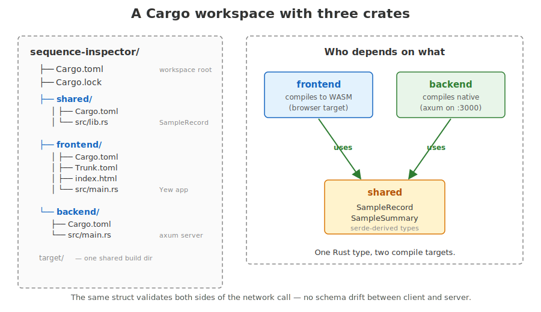{fig-alt="Two-panel diagram. Left panel: directory tree with sequence-inspector/ at the root containing Cargo.toml (workspace root), Cargo.lock, shared/ (Cargo.toml, src/lib.rs — SampleRecord), frontend/ (Cargo.toml, Trunk.toml, index.html, src/main.rs — Yew app), backend/ (Cargo.toml, src/main.rs — axum server), and target/ noted as one shared build dir. Right panel: dependency graph showing frontend (blue, compiles to WASM) and backend (green, compiles native) each with an arrow labelled uses pointing down to shared (yellow), which contains SampleRecord and SampleSummary serde-derived types. Footer: One Rust type, two compile targets. The same struct validates both sides of the network call — no schema drift between client and server."}

::: notes
A workspace is one Cargo project with several member crates. The root `Cargo.toml` lists them, and they share one `target/` directory and one `Cargo.lock`. Today's project has three: `shared` for types that cross the wire, `frontend` for the Yew/wasm app, `backend` for the axum server. You will spend most of your time in `frontend`.
:::

## What the workspace `Cargo.toml` looks like

```toml
# TOML — root Cargo.toml
[workspace]
resolver = "2"
members = ["shared", "frontend", "backend"]

[workspace.dependencies]
shared = { path = "shared" }
serde  = { version = "1", features = ["derive"] }
```

Each member crate references `shared` and `serde` with one line:

```toml
# TOML — member Cargo.toml
shared.workspace = true
serde.workspace  = true
```

::: notes
Workspaces solve two problems: shared dependency versions and a shared build cache. The `[workspace.dependencies]` table is the single source of truth for what version of serde the whole project uses. Each member opts in with one line. The shared `target/` means rebuilding `frontend` does not rebuild `shared` if `shared` did not change.
:::

## The shared-types pattern

```rust
// shared/src/lib.rs
use serde::{Deserialize, Serialize};

#[derive(Debug, Clone, Serialize, Deserialize)]
pub struct SampleRecord {
    pub id: String,
    pub name: String,
    pub sequence: String,
}
```

Both `frontend` and `backend` depend on `shared`. **The same struct** is serialised by the server and deserialised by the client.

::: notes
This is the single most important architectural idea of the day. The struct is defined once, in the shared crate. Both ends derive Serialize and Deserialize from the same definition. There is no separate IDL file, no OpenAPI schema generator, no copy-pasted TypeScript interface to keep in sync. Rename a field — both crates fail to compile until they agree again. Schema drift becomes a compile error.
:::

## Yew — Rust UI framework

[Yew](https://yew.rs/) is modelled on React [the dominant JavaScript UI library — Yew works similarly].

- Components are **functions** that return `Html`
- State lives in **hooks** [reusable functions starting with `use_` that hold per-component state across re-renders] like `use_state`, `use_effect_with`
- The framework re-runs the function on every state change

```rust
// Rust
use yew::prelude::*;

#[function_component(App)]
fn app() -> Html {
    let title = "Sequence inspector";
    let length = 42;
    html! {
        <div>
            <h1>{ title }</h1>
            <p>{ format!("Loaded {} bases", length) }</p>
        </div>
    }
}
```

Yew renders a `<div>` containing an `<h1>` and a `<p>`. Inside `{ ... }` you put any Rust expression.

::: notes
If you have used React, the model is identical. If you have not — a component is a function that returns a description of what the page should look like. The framework figures out how to update the actual DOM. You never call `document.querySelector(...).textContent = ...` yourself. You describe; Yew patches.
:::

## The render loop

Each render Yew builds a **virtual DOM** [an in-memory tree of the HTML you want, cheaper to construct and compare than the real browser DOM], then performs a **diff/patch** [compare the new vDOM to the previous one and apply only the minimal real-DOM changes] step.

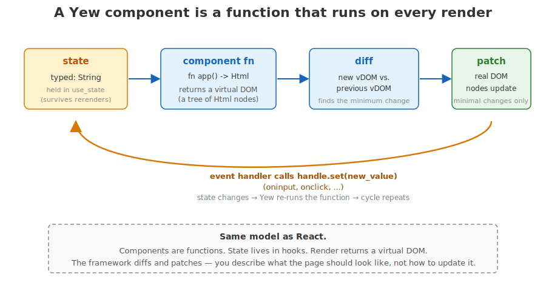{fig-alt="Four-step flow. Yellow state box (typed: String, held in use_state, survives rerenders) arrows into blue component fn box (fn app() -> Html, returns a virtual DOM, a tree of Html nodes) arrows into blue diff box (new vDOM vs previous vDOM, finds minimum change) arrows into green patch box (real DOM nodes update, minimal changes only). An orange curved arrow loops from patch back to state, labelled: event handler calls handle.set(new_value) (oninput, onclick, ...). State changes triggers Yew to re-run the function and the cycle repeats. Footer: Same model as React. Components are functions. State lives in hooks. Render returns a virtual DOM. The framework diffs and patches — you describe what the page should look like, not how to update it."}

::: notes
The function reruns on every render — Yew calls your `app()` again each time state changes. Hooks like `use_state` are what let a value survive that re-invocation. The diff-and-patch step is invisible to you. The mental model is: when state changes, the page rerenders; figure out what new HTML you want; Yew makes it so.
:::

## The `html!` macro

```rust
// Rust — html!{} looks like HTML but is parsed as Rust tokens
html! {
    <div>
        <h1>{ "Sequence inspector" }</h1>
        <p>{ format!("length: {} bp", seq.len()) }</p>
    </div>
}
```

HTML-shaped syntax in Rust source. `{ ... }` slots embed any Rust expression.

Differences from plain HTML:

- Every tag must be closed (`<br/>`, not `<br>`)
- Text goes inside `{ }`: `<p>{ "hi" }</p>`
- Multiple top-level elements: wrap in `<></>`

::: notes
The macro looks like HTML but is actually Rust. Text content has to live inside braces because the macro is parsed by the Rust tokenizer — `Hi` would look like an identifier. Inside braces you can put any expression that produces something Yew knows how to render. The closed-tags rule comes from the XML-style parser; HTML's tolerance for unclosed `<br>` does not apply.
:::

## `#[function_component(App)]`

```rust
// Rust
#[function_component(App)]
fn app() -> Html {
    let sequence = use_state(String::new);
    let dna: &str = &sequence;
    html! { <p>{ dna }</p> }
}

fn main() {
    yew::Renderer::<App>::new().render();
}
```

The attribute turns a plain `fn` into a `Component` named `App`. `main` mounts it.

::: notes
`#[function_component(App)]` is a procedural macro from Yew. It takes a function returning `Html` and generates a `struct App` plus the trait implementations Yew expects. You write your component as a function; Yew turns it into the component type. The `main` function does one thing: hand the root component to Yew's renderer.
:::

## Closures and `move` — 30 seconds

A **closure** [an inline anonymous function that captures variables from its enclosing scope] looks like `|x| x + 1`. `move` [keyword that makes the closure take ownership of its captured variables] is needed when the closure outlives the scope — for example when an event handler runs later, after the surrounding function has returned.

```rust
// Rust
let name = String::from("lambda");
let say_hi = move |_| log::info!("hello, {name}");  // owns `name`
// `say_hi` can now be stored in a Callback and called from an event
```

Event handlers in Yew are stored in the framework and called later — so the closures we hand them are almost always `move` closures.

::: notes
This single rule unblocks 90 percent of the borrow-checker confusion students hit in Yew. The closures are stored by Yew; they outlive the function that built them; therefore they need to own their captures. The clone-before-move dance in the next slides exists for exactly this reason.
:::

## `use_state` — a value that survives re-renders

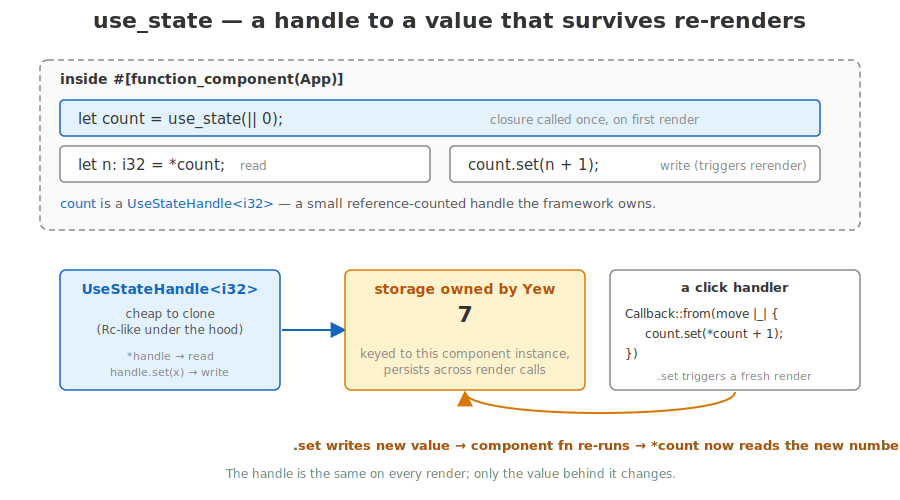{fig-alt="Diagram of use_state. A code panel inside #[function_component(App)] shows let length = use_state(|| 0_usize); (closure called once on first render), let n: usize = *length; (read) and length.set(sequence.len()); (write — triggers rerender). A click handler reads Callback::from(move |_| { length.set(sequence.len()); }). The handle is the same on every render; only the value behind it changes."}

```rust
// Rust
let length = use_state(|| 0_usize);

let on_click = {
    let length = length.clone();
    let sequence = sequence.clone();
    Callback::from(move |_| length.set(sequence.len()))
};
```

`Callback::from(...)` wraps a closure into a Yew **callback** [a closure stored by the framework, invoked when a DOM event (click, input, ...) fires].

::: notes
`use_state(initial)` returns a handle. Dereference it to read the value, call `.set(new)` to write. The handle is cheap to clone — it is internally reference-counted — and you will clone it a lot, because closures that get moved into event handlers each need their own copy.
:::

## Controlled input — input bound to state

A **controlled input** [displayed value reads from state; changes write back] makes the Rust value the single source of truth.

```rust
let typed = use_state(String::new);

let on_input = {
    let typed = typed.clone();
    Callback::from(move |e: InputEvent| {
        let target = e.target_unchecked_into::<web_sys::HtmlInputElement>();
        typed.set(target.value());
    })
};

html! {
    <input type="text" value={(*typed).clone()} oninput={on_input} />
}
```

State **is** the input's value. Keystroke writes; the value attribute reads.

::: notes
The input's content lives in state, not in the DOM. The oninput callback writes the new value back to state, which triggers a rerender, which sets the input's value attribute to the new string. The `let typed = typed.clone()` line before the callback is necessary because the closure needs its own handle to move into. For the exercises you will use `<textarea>` and `HtmlTextAreaElement` in exactly the same shape — same pattern, different element type.
:::

## `use_effect_with` — run something when deps change

```rust
// Rust
use_effect_with((), move |_| {
    // body runs once on mount, because deps = ()
    log::info!("sequence inspector mounted");
    || ()    // cleanup closure; () == "nothing to clean up"
});
```

- `deps = ()` → run once, on first render
- `deps = some_state.clone()` → run again whenever that state changes
- The body returns a **cleanup** closure (for unsubscribing, cancelling timers, etc.)

::: notes
Side effects — fetches, timers, event subscriptions — do not belong in the render function itself. `use_effect_with` is the hook for them. The first argument is a dependency tuple; the body runs whenever the deps change. Passing `()` means "deps never change", which means the body runs exactly once when the component first appears. The closing `|| ()` is the cleanup function — for today it does nothing.
:::

## `spawn_local` — run an async block on the event loop

```rust
// Rust
use wasm_bindgen_futures::spawn_local;

spawn_local(async move {
    let resp = Request::get("/api/samples").send().await.unwrap();
    let data: Vec<SampleSummary> = resp.json().await.unwrap();
    samples.set(data);
});
```

[`spawn_local`](https://docs.rs/wasm-bindgen-futures/latest/wasm_bindgen_futures/fn.spawn_local.html) [the function that schedules an async block on the browser's single-threaded event loop] hands an `async` block to the **browser's** event loop. From there it runs cooperatively, just like a JS promise.

::: notes
A `.wasm` module has no threads. You cannot block on a synchronous fetch — there is nothing for it to "wait on". `spawn_local` is the bridge: it takes an async block and registers it with the browser's event loop, the same loop that drives `setTimeout` and DOM events. The block runs concurrently with rendering; when it hits `.await`, it yields back to the loop.
:::

## Loading samples on mount

```rust
{
    let samples = samples.clone();
    use_effect_with((), move |_| {
        spawn_local(async move {
            if let Ok(resp) = Request::get("/api/samples").send().await {
                if let Ok(data) = resp.json::<Vec<SampleSummary>>().await {
                    samples.set(data);
                }
            }
        });
        || ()
    });
}
```

`use_effect_with((), …)` runs once on mount; `spawn_local` runs the async fetch.

::: notes
The outer scope clones `samples` so the effect closure can own its own handle. `use_effect_with((), ...)` makes the body run once. `spawn_local` runs the async fetch. On success, `samples.set(data)` triggers a rerender that draws the buttons. In a real app you would surface errors in the UI; for the exercise nested `if let Ok` is enough.
:::

## `gloo_net::Request` — fetch from WASM

```rust
// Rust
use gloo_net::http::Request;

let resp = Request::get("/api/samples").send().await?;
let data: Vec<SampleSummary> = resp.json().await?;
```

Two `await`s:

- one for the response headers and status
- one for the body, fully received and decoded by serde

[`gloo_net`](https://docs.rs/gloo-net/) wraps the browser's native `fetch()` API in a typed Rust interface.

::: notes
gloo_net is the WASM-side HTTP client. The shape mirrors JavaScript's fetch: send returns once the headers come back, json() returns once the body is fully read and parsed. The type annotation `<Vec<SampleSummary>>` is what tells serde which struct to deserialise into.
:::

## axum — Rust HTTP server

```rust
use axum::{routing::get, Json, Router};
use shared::SampleSummary;

async fn list_samples() -> Json<Vec<SampleSummary>> {
    Json(vec![/* ... */])
}

#[tokio::main]
async fn main() -> std::io::Result<()> {
    let app = Router::new().route("/api/samples", get(list_samples));
    let listener = tokio::net::TcpListener::bind("127.0.0.1:3000").await?;
    axum::serve(listener, app).await
}
```

A **route** maps URL+method to a **handler** — an `async fn` returning something serialisable. See [`axum`](https://docs.rs/axum/).

::: notes
A `Router` maps URL paths to handler functions. Each handler is async. `Json<T>` is a wrapper that does serde encoding automatically — return `Json(data)` and the client receives a JSON body with the right content-type. The `#[tokio::main]` attribute starts the Tokio async runtime, which is what schedules these futures across the server's thread pool.
:::

## Path parameters and JSON bodies

```rust
// Rust
use axum::extract::Path;

async fn get_sample(Path(id): Path<String>) -> Json<SampleRecord> {
    let record = lookup_sample(&id);   // your code
    Json(record)
}

let app = Router::new()
    .route("/api/samples", get(list_samples))
    .route("/api/samples/{id}", get(get_sample));
```

`Path<T>` is an **extractor** [a typed argument in a handler signature that tells axum what to pull out of the incoming request — the URL path, a query string, a JSON body, headers, ...] — axum parses the URL segment for you and hands you the typed value.

::: notes
Extractors are how axum gets arguments into handlers. `Path<String>` extracts a URL path segment; there are also `Query` for `?key=value` parameters, `Json<T>` for request bodies, and many more. The handler signature itself tells axum what to extract.
:::

## CORS — and why we usually avoid it

An **origin** [scheme + host + port] is the browser's unit of trust. `:8080` and `:3000` are different origins.

The **Same-Origin Policy** blocks `fetch` from one origin to another unless the server opts in with **CORS** [Cross-Origin Resource Sharing headers].

Two ways to handle it:

- **Enable CORS** on axum with `tower_http::cors::CorsLayer::permissive()` (real apps)
- **Proxy through trunk** — trunk forwards `/api/...` to axum, browser sees one origin (today)

::: notes
The Same-Origin Policy is the browser's main defence against malicious cross-site requests. A page served from `:8080` cannot fetch from `:3000` unless `:3000` sends back specific headers saying "this is allowed". You either configure the backend to send those headers — that is what `tower_http::cors::CorsLayer` does — or arrange for the browser to never see two origins in the first place. We go with option two for development.
:::

## The trunk dev proxy

```toml
# TOML — frontend/Trunk.toml
[[proxy]]
rewrite = "/api/"
backend = "http://127.0.0.1:3000/api/"
```

Now `fetch('/api/samples')` from the browser goes to trunk on `:8080`, which forwards it to axum on `:3000`.

The browser sees one origin. CORS never comes up. **Production deploys** still need real CORS (or same-origin hosting).

::: notes
The dev proxy is a workflow shortcut. In production the frontend is usually served from the same origin as the backend — either bundled together, or behind a single reverse proxy — so CORS does not come up there either. The proxy block in Trunk.toml is two lines. You set it once and forget it.
:::

## Putting it together — one click

::: {.incremental}
1. User clicks a sample button
2. `on_pick` runs, calls `spawn_local`
3. `gloo_net::Request::get("/api/samples/lambda").send().await`
4. Trunk forwards to `axum` on `:3000`
5. `axum` extracts the path, returns `Json(record)` — serde encodes
6. Body arrives in the browser, `resp.json().await` — serde decodes (**same struct**)
7. Frontend writes the sequence into `typed` state — Yew rerenders
8. Stats and the SVG plot update for free
:::

::: notes
This is the data flow of exercise 4 read in slow motion. Every step is a piece you have seen on a slide. The single most important thing to notice is step 5 and step 6: the JSON the server emits is decoded into the exact same struct the client expects, because both crates depend on the same shared definition.
:::

## What we deliberately skip

**In scope:** function components, `use_state`, `use_effect_with`, `Callback::from`, one `async fn` pattern, `spawn_local`, `gloo_net::Request`, serde, axum routes + handlers, trunk + dev proxy, inline SVG in `html!`.

**Out of scope:** `Future` internals, pinning, executors; axum state and middleware; full Yew agents/lifecycle/portals; wasm-bindgen deep magic.

The app is structurally identical to a real Rust web app. The "out" items will not stop you shipping.

::: notes
We are picking a narrow, useful slice of each topic and stopping. The slice is enough to build a working, deployable app. The deeper material — executors, Tokio internals, advanced Yew patterns — is real and worth learning eventually, but trying to teach it today would mean nothing got built.
:::

## To the exercises

- [Exercise 1](01-hello-yew.qmd) — get the toolchain alive: trunk serves a Yew page, you make a change, the browser reloads
- [Exercise 2](02-reactive-stats.qmd) — reactive stats: textarea + `use_state` + GC content live on every keystroke
- [Exercise 3](03-fetch-from-backend.qmd) — fetch samples from axum via `gloo_net`
- [Exercise 4 (capstone)](04-sequence-inspector.qmd) — inline SVG plot of GC sliding window

Two terminals open. `cargo run -p backend` in one, `trunk serve` in `frontend/` in the other.

::: notes
Open three things: the concepts page, exercise 1, and two terminals. Start the backend in one terminal, trunk in the other, then walk through the exercises. By the end of the day you have a working Rust full-stack app. See you for day 7.
:::
