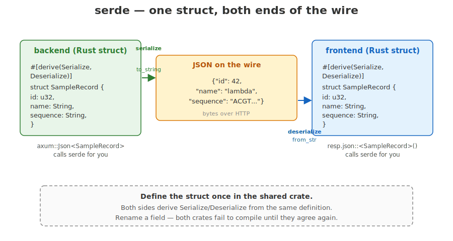

## What today is about

::: {.incremental}
- A web app written **entirely in Rust** — frontend, backend, shared types
- Frontend compiled to **WebAssembly**, runs in the browser
- Backend is `axum` on `127.0.0.1:3000` serving JSON
- We will build a sequence inspector — paste DNA, see stats live, fetch samples
- Written companion: [day 6 — Concepts](00-concepts.qmd)
:::

::: notes
This lecture introduces the pieces of the pure-Rust web stack we use today. The same Rust we have been writing all week now runs in a browser tab. The companion concepts page covers the same material in writing with links to the upstream docs — keep it open.
:::

## The shape of the day

::: {.incremental}
- One workspace with three crates: `shared`, `frontend`, `backend`
- `frontend` builds to `.wasm`, served by **trunk**
- `backend` builds native, serves `/api/samples`
- Both crates depend on `shared` — same Rust types on the wire
- By the afternoon you are clicking a button, fetching a sequence, plotting GC content over a sliding window
:::

::: notes
Today is structurally a "real" full-stack Rust application. The crates layout, the shared types, the dev proxy — these are not toy shortcuts. The same shape scales to a deployable product.
:::

## WebAssembly in one paragraph

WebAssembly (**WASM**) is a compact, sandboxed bytecode format that runs in every modern browser.

It is a **compile target**, not a language — Rust, C, C++, Go can all produce `.wasm`.

The browser loads a `.wasm` blob from a `<script>` tag and runs it in a virtual machine, with near-native performance and no JavaScript runtime cost on the hot path.

::: notes
The key sentence is "compile target". You do not learn a new language to use WebAssembly — you write Rust, you change the build target, you get a `.wasm` file. The browser already knows how to run it. Performance is within a small factor of native; the sandbox is the same one that protects you from any other page's JavaScript.
:::

## The build pipeline

{fig-alt="Pipeline diagram. Left: source box with main.rs, lib.rs, Cargo.toml. Arrow into cargo build --target wasm32-unknown-unknown. Arrow into wasm-bindgen. Arrow into Output box with app.wasm (binary), app.js (loader glue), index.html. A curved arrow drops into a browser window showing a JS VM box (runs app.js, fetches app.wasm, instantiates it) and a WASM VM box (runs app.wasm, sandboxed: no DOM, no filesystem, no network of its own). Two small arrows between the VMs labelled call and return. Footer: The .wasm runs beside the JS VM in the same browser process. JS glue bridges the two."}

::: notes
Three stages: the Rust compiler emits a `.wasm` binary, `wasm-bindgen` writes a small JavaScript shim that knows how to call into the wasm exports, and the browser loads both. The wasm runs in its own virtual machine inside the same browser process as the JavaScript VM — they share memory only through carefully typed bridges.
:::

## `wasm32-unknown-unknown`

```bash
rustup target add wasm32-unknown-unknown
```

Rust target triples are `arch-vendor-os`:

- **`wasm32`** — 32-bit WebAssembly instruction set
- **`unknown`** — no specific vendor
- **`unknown`** — no specific OS (it is just a VM)

`cargo build --target wasm32-unknown-unknown` invokes `rustc` with that target. Output is `target/wasm32-unknown-unknown/debug/your_crate.wasm`.

::: notes
Targets in Rust are named with a triple. `wasm32-unknown-unknown` says "32-bit wasm, no specific vendor, no operating system". You add it once with `rustup`. From then on, `cargo build --target wasm32-unknown-unknown` produces a `.wasm` blob instead of a native binary. You will not type this directly — trunk does it for you — but knowing the name helps when reading error messages.
:::

## `wasm-bindgen` — the JS glue layer

Pure WebAssembly only speaks integers and floats. It cannot return a `String` to JavaScript, and it cannot touch the DOM directly.

[`wasm-bindgen`](https://github.com/rustwasm/wasm-bindgen) generates a tiny JavaScript shim that:

- marshals strings, structs, closures across the JS↔WASM boundary
- exposes browser APIs (DOM, `fetch`, `setTimeout`) to your Rust code
- lets you `#[wasm_bindgen]` a Rust function and call it from JS

You will rarely touch it directly — Yew and `gloo_net` use it under the hood.

::: notes
A raw `.wasm` module can only push and pop numbers on a stack. To send a `String` from JS into a wasm function, something has to copy bytes into the wasm memory and pass a pointer plus a length. `wasm-bindgen` generates that boilerplate. Yew is built on top of it, so for our purposes today wasm-bindgen is "the thing that lets Rust call browser APIs and vice versa".
:::

## Trunk — build tool for Yew apps

[Trunk](https://trunkrs.dev) is `cargo build` for web frontends:

```bash
cargo install trunk      # one-off
trunk serve              # in the frontend/ directory
```

In one command, trunk:

1. compiles your frontend crate to wasm (`cargo build --target wasm32-...`)
2. runs `wasm-bindgen` to generate the JS glue
3. bundles `index.html`, `.wasm`, `.js`, assets into `dist/`
4. serves `dist/` over HTTP on `:8080`
5. watches your source files and rebuilds + reloads the browser on save

::: notes
Without trunk, getting a Yew app to load involves about six manual steps. Trunk hides them. `trunk serve` is what you run in one terminal all day — save a file, watch the browser reload. Trunk has its own config file, `Trunk.toml`, where the dev proxy lives.
:::

## A Cargo workspace — three crates in one tree

{fig-alt="Two-panel diagram. Left panel: directory tree with sequence-inspector/ at the root containing Cargo.toml (workspace root), Cargo.lock, shared/ (Cargo.toml, src/lib.rs — SampleRecord), frontend/ (Cargo.toml, Trunk.toml, index.html, src/main.rs — Yew app), backend/ (Cargo.toml, src/main.rs — axum server), and target/ noted as one shared build dir. Right panel: dependency graph showing frontend (blue, compiles to WASM) and backend (green, compiles native) each with an arrow labelled uses pointing down to shared (yellow), which contains SampleRecord and SampleSummary serde-derived types. Footer: One Rust type, two compile targets. The same struct validates both sides of the network call — no schema drift between client and server."}

::: notes
A workspace is one Cargo project with several member crates. The root `Cargo.toml` lists them, and they share one `target/` directory and one `Cargo.lock`. Today's project has three: `shared` for types that cross the wire, `frontend` for the Yew/wasm app, `backend` for the axum server. You will spend most of your time in `frontend`.
:::

## What the workspace `Cargo.toml` looks like

```toml
[workspace]
resolver = "2"
members = ["shared", "frontend", "backend"]

[workspace.dependencies]
shared = { path = "shared" }
serde  = { version = "1", features = ["derive"] }
```

Each member crate references `shared` and `serde` with one line:

```toml
shared.workspace = true
serde.workspace  = true
```

::: notes
Workspaces solve two problems: shared dependency versions and a shared build cache. The `[workspace.dependencies]` table is the single source of truth for what version of serde the whole project uses. Each member opts in with one line. The shared `target/` means rebuilding `frontend` does not rebuild `shared` if `shared` did not change.
:::

## The shared-types pattern

```rust
// shared/src/lib.rs
use serde::{Deserialize, Serialize};

#[derive(Debug, Clone, Serialize, Deserialize)]
pub struct SampleRecord {
    pub id: String,
    pub name: String,
    pub sequence: String,
}
```

Both `frontend` and `backend` depend on `shared`. **The same struct** is serialised by the server and deserialised by the client.

::: notes
This is the single most important architectural idea of the day. The struct is defined once, in the shared crate. Both ends derive Serialize and Deserialize from the same definition. There is no separate IDL file, no OpenAPI schema generator, no copy-pasted TypeScript interface to keep in sync. Rename a field — both crates fail to compile until they agree again. Schema drift becomes a compile error.
:::

## `serde` — one struct, both ends

{fig-alt="Three-panel diagram. Left: green backend panel with the struct SampleRecord (id: u32, name: String, sequence: String) and a #[derive(Serialize, Deserialize)] attribute. Middle: yellow JSON-on-the-wire panel containing the JSON object {id: 42, name: lambda, sequence: ACGT...}, labelled 'bytes over HTTP'. Right: blue frontend panel with the same struct definition. A green arrow labelled serialize / to_string runs backend to wire. A blue arrow labelled deserialize / from_str runs wire to frontend. Side annotations: axum::Json<SampleRecord> calls serde for you; resp.json::<SampleRecord>() calls serde for you. Footer callout: Define the struct once in the shared crate. Both sides derive Serialize/Deserialize from the same definition. Rename a field — both crates fail to compile until they agree again."}

::: notes
serde is the Rust serialisation framework. `#[derive(Serialize, Deserialize)]` makes the compiler generate the code that turns the struct into JSON and back. axum's `Json<T>` and gloo_net's `resp.json::<T>()` both call serde under the hood — you almost never write the conversion calls yourself.
:::

## Yew — Rust UI framework

[Yew](https://yew.rs/) is modelled on React.

- Components are **functions** that return `Html`
- State lives in **hooks** (`use_state`, `use_effect_with`)
- The framework re-runs the function on every state change
- It diffs the returned virtual DOM against the previous one and patches the real DOM

```rust
use yew::prelude::*;

#[function_component(App)]
fn app() -> Html {
    html! { <h1>{ "Sequence inspector" }</h1> }
}
```

::: notes
If you have used React, the model is identical. If you have not — a component is a function that returns a description of what the page should look like. The framework figures out how to update the actual DOM. You never call `document.querySelector(...).textContent = ...` yourself. You describe; Yew patches.
:::

## The render loop

{fig-alt="Four-step flow. Yellow state box (typed: String, held in use_state, survives rerenders) arrows into blue component fn box (fn app() -> Html, returns a virtual DOM, a tree of Html nodes) arrows into blue diff box (new vDOM vs previous vDOM, finds minimum change) arrows into green patch box (real DOM nodes update, minimal changes only). An orange curved arrow loops from patch back to state, labelled: event handler calls handle.set(new_value) (oninput, onclick, ...). State changes triggers Yew to re-run the function and the cycle repeats. Footer: Same model as React. Components are functions. State lives in hooks. Render returns a virtual DOM. The framework diffs and patches — you describe what the page should look like, not how to update it."}

::: notes
The function reruns on every render — Yew calls your `app()` again each time state changes. Hooks like `use_state` are what let a value survive that re-invocation. The diff-and-patch step is invisible to you. The mental model is: when state changes, the page rerenders; figure out what new HTML you want; Yew makes it so.
:::

## The `html!` macro

```rust
html! {
    <div>
        <h1>{ "Sequence inspector" }</h1>
        <p>{ format!("length: {} bp", seq.len()) }</p>
    </div>
}
```

JSX-like syntax, compiled into Rust at macro-expansion time.

- Every tag must be closed (`<br/>`, not `<br>`)
- Text content goes inside `{ }`: `<p>{ "hi" }</p>` (bare text won't compile)
- Any Rust expression inside `{ }`: `<p>{ 1 + 1 }</p>` renders "2"
- Multiple top-level elements: wrap in `<></>` or a `<div>`

::: notes
The macro looks like HTML but is actually Rust. Text content has to live inside braces because the macro is parsed by the Rust tokenizer — `Hi` would look like an identifier. Inside braces you can put any expression that produces something Yew knows how to render. The closed-tags rule comes from the XML-style parser; HTML's tolerance for unclosed `<br>` does not apply.
:::

## `#[function_component(App)]`

```rust
#[function_component(App)]
fn app() -> Html {
    let sequence = use_state(String::new);
    let dna: &str = &sequence;
    html! { <p>{ dna }</p> }
}

fn main() {
    yew::Renderer::<App>::new().render();
}
```

The attribute turns a plain `fn` into a `Component` named `App`. `main` mounts it.

::: notes
`#[function_component(App)]` is a procedural macro from Yew. It takes a function returning `Html` and generates a `struct App` plus the trait implementations Yew expects. You write your component as a function; Yew turns it into the component type. The `main` function does one thing: hand the root component to Yew's renderer.
:::

## `use_state` — a value that survives re-renders

{fig-alt="Diagram of use_state. A code panel inside #[function_component(App)] shows let length = use_state(|| 0_usize); (closure called once on first render), let n: usize = *length; (read) and length.set(sequence.len()); (write — triggers rerender). A click handler reads Callback::from(move |_| { length.set(sequence.len()); }). The handle is the same on every render; only the value behind it changes."}

```rust
let length = use_state(|| 0_usize);

let on_click = {
    let length = length.clone();
    let sequence = sequence.clone();
    Callback::from(move |_| length.set(sequence.len()))
};
```

::: notes
`use_state(initial)` returns a handle. Dereference it to read the value, call `.set(new)` to write. The handle is cheap to clone — it is internally reference-counted — and you will clone it a lot, because closures that get moved into event handlers each need their own copy.
:::

## Controlled input — textarea bound to state

```rust
let typed = use_state(String::new);

let on_input = {
    let typed = typed.clone();
    Callback::from(move |e: InputEvent| {
        let target = e.target_unchecked_into::<web_sys::HtmlTextAreaElement>();
        typed.set(target.value());
    })
};

html! {
    <textarea value={(*typed).clone()} oninput={on_input} />
}
```

The state **is** the textarea's value. Every keystroke writes; the value attribute reads.

::: notes
This is the textbook controlled-input pattern. The textarea's content lives in state, not in the DOM. The oninput callback writes the new value back to state, which triggers a rerender, which sets the textarea's value attribute to the new string. The "let typed = typed.clone()" line before the callback is necessary because the closure needs its own handle to move into.
:::

## `use_effect_with` — run something when deps change

```rust
use_effect_with((), move |_| {
    // body runs once on mount, because deps = ()
    log::info!("sequence inspector mounted");
    || ()    // cleanup closure; () == "nothing to clean up"
});
```

- `deps = ()` → run once, on first render
- `deps = some_state.clone()` → run again whenever that state changes
- The body returns a **cleanup** closure (for unsubscribing, cancelling timers, etc.)

::: notes
Side effects — fetches, timers, event subscriptions — do not belong in the render function itself. `use_effect_with` is the hook for them. The first argument is a dependency tuple; the body runs whenever the deps change. Passing `()` means "deps never change", which means the body runs exactly once when the component first appears. The closing `|| ()` is the cleanup function — for today it does nothing.
:::

## `async`/`await` — the minimum you need

An `async fn` returns a **`Future`** — a description of work, not the result.

```rust
async fn fetch_one() -> Result<SampleRecord, gloo_net::Error> {
    let resp = Request::get("/api/samples/lambda").send().await?;
    let data = resp.json::<SampleRecord>().await?;
    Ok(data)
}
```

`.await` means: pause this task until the future is ready, let the runtime do other work in the meantime.

We **do not** teach `Future` internals today — treat it as a single pattern.

::: notes
This is the only part of day 6 that introduces a genuinely new language feature. We are deliberately keeping it shallow. You need to know: async functions return futures, `.await` waits for a future, you call `.await` on each step of a fetch. The deep dive — pinning, poll semantics, executors — is real and learnable, but you do not need it to ship today's app.
:::

## What `.await` actually does

{fig-alt="Sequence diagram with two lifelines: your async code (blue) on the left and browser runtime (yellow) on the right. The code is let resp = Request::get(url).send().await?;. Step 1: solid arrow from your code to browser runtime labelled .send() returns a Future, hand it to the runtime. Step 2: a yellow note on the left labelled .await pauses, this task yields. Step 3: the runtime is shown as active for a long span, annotated runtime is free to run other tasks (rendering, other awaits, animations). Step 4: a small self-call on the runtime lifeline labelled network response arrives. Step 5: dashed return arrow from runtime to your code labelled runtime polls the future, sees it is ready, resumes your task. Step 6: a green note labelled resp bound, next statement runs. A time arrow runs top to bottom. Footer: No threads, no blocking — the function pauses at .await and resumes when the work is done."}

::: notes
The picture is: at the `.await`, your function yields control. The browser keeps doing other work — rendering, animations, other concurrent awaits. When the awaited thing is ready, the runtime picks your task back up where it left off. There are no threads involved; this is cooperative concurrency inside a single thread.
:::

## `spawn_local` — run an async block on the event loop

```rust
use wasm_bindgen_futures::spawn_local;

spawn_local(async move {
    let resp = Request::get("/api/samples").send().await.unwrap();
    let data: Vec<SampleSummary> = resp.json().await.unwrap();
    samples.set(data);
});
```

[`spawn_local`](https://docs.rs/wasm-bindgen-futures/latest/wasm_bindgen_futures/fn.spawn_local.html) hands an `async` block to the **browser's** event loop. From there it runs cooperatively, just like a JS promise.

::: notes
A `.wasm` module has no threads. You cannot block on a synchronous fetch — there is nothing for it to "wait on". `spawn_local` is the bridge: it takes an async block and registers it with the browser's event loop, the same loop that drives `setTimeout` and DOM events. The block runs concurrently with rendering; when it hits `.await`, it yields back to the loop.
:::

## Loading samples on mount

```rust
{
    let samples = samples.clone();
    use_effect_with((), move |_| {
        spawn_local(async move {
            if let Ok(resp) = Request::get("/api/samples").send().await {
                if let Ok(data) = resp.json::<Vec<SampleSummary>>().await {
                    samples.set(data);
                }
            }
        });
        || ()
    });
}
```

`use_effect_with` runs once on mount; `spawn_local` does the fetch; nested `if let Ok` swallows errors for the teaching example.

::: notes
This composition shows all the pieces together. The outer scope clones `samples` so the effect closure can own its own handle. `use_effect_with((), ...)` makes the body run once. `spawn_local` runs the async fetch. On success, `samples.set(data)` triggers a rerender that draws the buttons. In a real app you would surface errors in the UI; for the exercise nested `if let Ok` is enough.
:::

## `gloo_net::Request` — fetch from WASM

```rust
use gloo_net::http::Request;

let resp = Request::get("/api/samples").send().await?;
let data: Vec<SampleSummary> = resp.json().await?;
```

Two `await`s:

- one for the response headers and status
- one for the body, fully received and decoded by serde

[`gloo_net`](https://docs.rs/gloo-net/) wraps the browser's native `fetch()` API in a typed Rust interface.

::: notes
gloo_net is the WASM-side HTTP client. The shape mirrors JavaScript's fetch: send returns once the headers come back, json() returns once the body is fully read and parsed. The type annotation `<Vec<SampleSummary>>` is what tells serde which struct to deserialise into.
:::

## axum — Rust HTTP server

```rust
use axum::{routing::get, Json, Router};
use shared::SampleSummary;

async fn list_samples() -> Json<Vec<SampleSummary>> {
    Json(vec![/* ... */])
}

#[tokio::main]
async fn main() -> std::io::Result<()> {
    let app = Router::new().route("/api/samples", get(list_samples));
    let listener = tokio::net::TcpListener::bind("127.0.0.1:3000").await?;
    axum::serve(listener, app).await
}
```

[`axum`](https://docs.rs/axum/) is the standard Rust web framework for JSON APIs.

::: notes
A `Router` maps URL paths to handler functions. Each handler is async. `Json<T>` is a wrapper that does serde encoding automatically — return `Json(data)` and the client receives a JSON body with the right content-type. The `#[tokio::main]` attribute starts the Tokio async runtime, which is what schedules these futures across the server's thread pool.
:::

## Path parameters and JSON bodies

```rust
use axum::extract::Path;

async fn get_sample(Path(id): Path<String>) -> Json<SampleRecord> {
    let record = lookup_sample(&id);   // your code
    Json(record)
}

let app = Router::new()
    .route("/api/samples", get(list_samples))
    .route("/api/samples/{id}", get(get_sample));
```

`Path<T>` is an **extractor** — axum parses the URL segment for you and hands you the typed value.

::: notes
Extractors are how axum gets arguments into handlers. `Path<String>` extracts a URL path segment; there are also `Query` for `?key=value` parameters, `Json<T>` for request bodies, and many more. The handler signature itself tells axum what to extract.
:::

## CORS — and why we usually avoid it

A browser blocks `fetch` calls from one origin (`localhost:8080`, trunk) to another (`localhost:3000`, axum) unless the server explicitly opts in.

Two ways to handle it:

- **Enable CORS** on axum with `tower_http::cors::CorsLayer::permissive()` (real apps do this)
- **Proxy through trunk** — let trunk forward `/api/...` to axum so the browser sees one origin (what we do today)

::: notes
The Same-Origin Policy is the browser's main defence against malicious cross-site requests. A page served from `:8080` cannot fetch from `:3000` unless `:3000` sends back specific headers saying "this is allowed". You either configure the backend to send those headers — that is what `tower_http::cors::CorsLayer` does — or arrange for the browser to never see two origins in the first place. We go with option two for development.
:::

## The trunk dev proxy

```toml
# frontend/Trunk.toml
[[proxy]]
rewrite = "/api/"
backend = "http://127.0.0.1:3000/api/"
```

Now `fetch('/api/samples')` from the browser goes to trunk on `:8080`, which forwards it to axum on `:3000`.

The browser sees one origin. CORS never comes up. **Production deploys** still need real CORS (or same-origin hosting).

::: notes
The dev proxy is a workflow shortcut. In production the frontend is usually served from the same origin as the backend — either bundled together, or behind a single reverse proxy — so CORS does not come up there either. The proxy block in Trunk.toml is two lines. You set it once and forget it.
:::

## Putting it together — one click

::: {.incremental}
1. User clicks a sample button
2. `on_pick` runs, calls `spawn_local`
3. `gloo_net::Request::get("/api/samples/lambda").send().await`
4. Trunk forwards to `axum` on `:3000`
5. `axum` extracts the path, returns `Json(record)` — serde encodes
6. Body arrives in the browser, `resp.json().await` — serde decodes (**same struct**)
7. Frontend writes the sequence into `typed` state — Yew rerenders
8. Stats and the SVG plot update for free
:::

::: notes
This is the data flow of exercise 4 read in slow motion. Every step is a piece you have seen on a slide. The single most important thing to notice is step 5 and step 6: the JSON the server emits is decoded into the exact same struct the client expects, because both crates depend on the same shared definition.
:::

## What we deliberately skip

**In scope today:**
function components, `use_state`, `use_effect_with`, `Callback::from`, one `async fn` pattern, `spawn_local`, `gloo_net::Request`, serde, axum routes + handlers, trunk + dev proxy, inline SVG in `html!`.

**Out of scope today:**
`Future` internals, pinning, executors; axum extractors with state and middleware; the full Yew agents/lifecycle/portals API; wasm-bindgen deep magic.

The app you build today is structurally identical to a real Rust web app. The "out" items are real and useful — they will not stop you shipping.

::: notes
We are picking a narrow, useful slice of each topic and stopping. The slice is enough to build a working, deployable app. The deeper material — executors, Tokio internals, advanced Yew patterns — is real and worth learning eventually, but trying to teach it today would mean nothing got built.
:::

## To the exercises

- [Exercise 1](01-hello-yew.qmd) — get the toolchain alive: trunk serves a Yew page, you make a change, the browser reloads
- [Exercise 2](02-reactive-stats.qmd) — reactive stats: textarea + `use_state` + GC content live on every keystroke
- [Exercise 3](03-fetch-from-backend.qmd) — fetch samples from axum via `gloo_net`
- [Exercise 4 (capstone)](04-sequence-inspector.qmd) — inline SVG plot of GC sliding window

Two terminals open. `cargo run -p backend` in one, `trunk serve` in `frontend/` in the other.

::: notes
Open three things: the concepts page, exercise 1, and two terminals. Start the backend in one terminal, trunk in the other, then walk through the exercises. By the end of the day you have a working Rust full-stack app. See you for day 7.
:::
