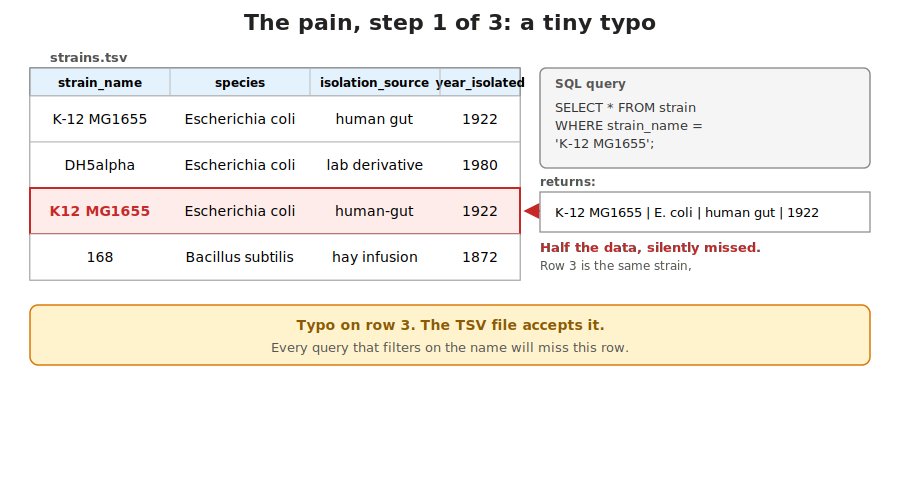
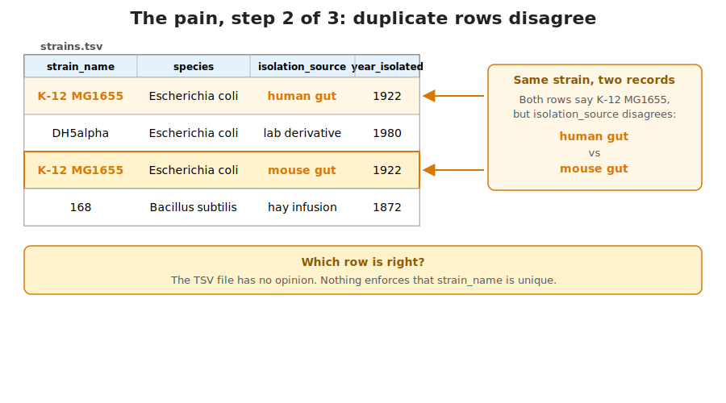
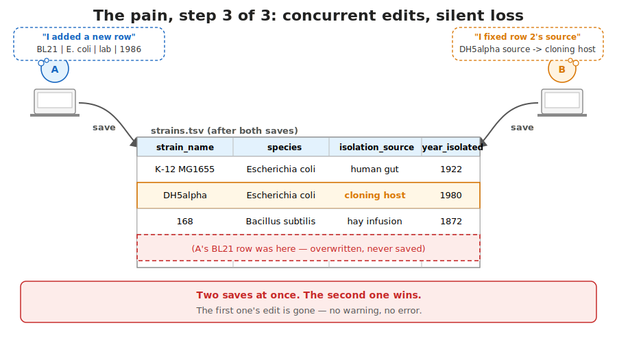
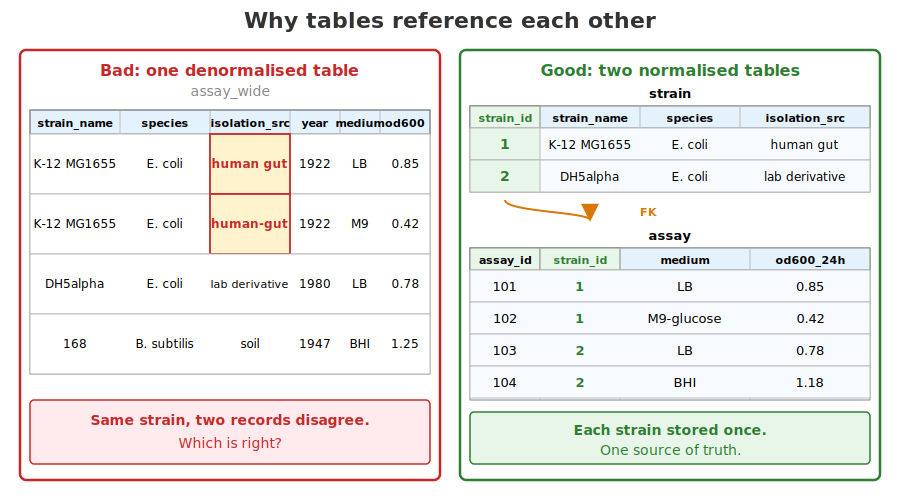
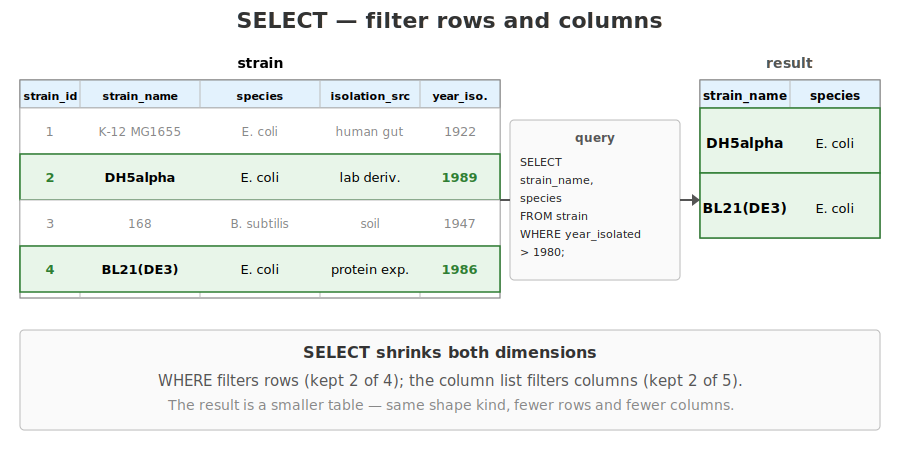
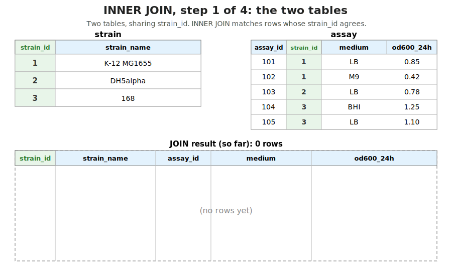
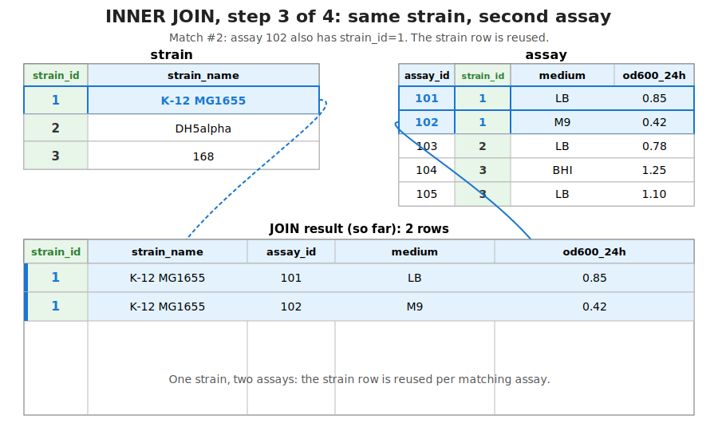
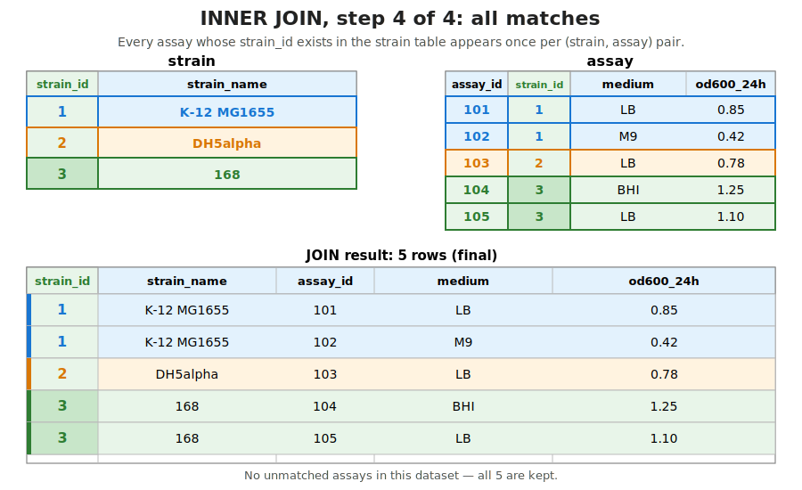
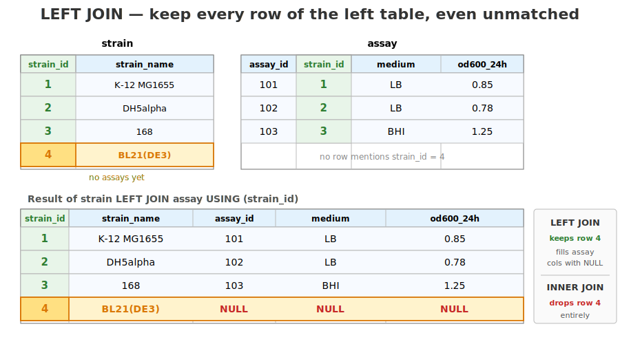

## What this lecture is

::: {.incremental}
- Why "a few TSV files" stops working, and a relational database (data organised as tables that reference each other) starts
- The minimum SQL (Structured Query Language, the standard way to ask a database questions) you will use every working day
- What SQLite is — an embedded database (lives inside your program, not on a server)
- Driving SQLite from Rust with the `rusqlite` crate
:::

::: notes
Today is the half-day shift away from sequence data into structured data — strain collections, assay measurements, sample sheets, anything you would otherwise keep in a spreadsheet. The first half of the lecture is plain SQL with no Rust at all; the second half is `rusqlite`, the thin Rust binding to the SQLite C library. By the end you should be able to read and write a small relational database from a Rust program.
:::

## The pain that motivates today

You're managing a microbial strain collection. The lab uses a shared TSV file.

::: {.fragment}
{width="55%" fig-alt="Two team members typing the same strain's name slightly differently, leaving the TSV with inconsistent entries."}
:::

::: {.fragment}
{width="55%" fig-alt="A duplicated row showing the same strain with two strain_id values and contradictory isolation_source entries."}
:::

::: {.fragment}
{width="55%" fig-alt="Two users opening the same TSV in Excel, with the second save overwriting the first."}
:::

::: notes
A relational database stops every one of these at the moment they happen — not after the paper is published. This is the universal story: a shared TSV grows past the point where ad-hoc edits can be trusted. A relational database is the standard, fifty-year-old answer to every one of these failure modes.
:::

## A relational database in one picture

A **relational database** (data organised as tables that reference each other) stores facts as **rows** in named **tables**. Each row is a **tuple** (a single row's values bundled together).

{fig-alt="The strain table drawn as a grid. Header row in light blue lists the five columns (strain_id, strain_name, species, isolation_source, year_isolated) with their types (INTEGER, TEXT, TEXT, TEXT, INTEGER). Four data rows follow; the first row (K-12 MG1655) is highlighted in yellow to make the 'one row equals one record' point visible. An annotation on the left points at the highlighted row and reads 'one row = one record (a tuple)'. A dashed line from the type sub-row points to a label 'each column has a declared type'. A green PRIMARY KEY badge under the strain_id header is connected by a dashed line up to the column. Below the table, three small fact callouts summarise: rows are an unordered set of records; columns have fixed names and types; the primary key is unique across every row."}

::: notes
This is the mental model. A table is a 2D grid; one row per record; each column has a fixed name and type. The primary key column makes it possible to refer unambiguously to one row. Every SQL idea today builds on this picture.
:::

## Tables, rows, columns, types

A **table** is a named grid.

A **row** is one record — a tuple of column values.

A **column** has a name and a declared type. SQLite's main types:

| Declared type | Used for |
|---|---|
| `INTEGER` | counts, IDs, years |
| `REAL` | floating-point values (OD, fractions) |
| `TEXT` | strings (names, free text) |
| `INTEGER PRIMARY KEY` | auto-incrementing row ID |

::: notes
SQLite has just a handful of declared types — INTEGER, REAL, TEXT, BLOB. The big ecosystem databases (PostgreSQL, MySQL) have richer type systems (timestamps, JSONB, arrays, geographic types). For our work the four above cover everything. We will see in a minute that `INTEGER PRIMARY KEY` is a special spelling that also means "auto-assign the next free integer when I omit it on INSERT".
:::

## Primary keys — one row, one identity

The **primary key** uniquely identifies a row. Two rows may agree on every other column, but never on the primary key.

```sql
CREATE TABLE strain (
    strain_id        INTEGER PRIMARY KEY,
    strain_name      TEXT    NOT NULL,
    species          TEXT    NOT NULL,
    isolation_source TEXT,
    year_isolated    INTEGER
);
```

`INTEGER PRIMARY KEY` auto-assigns the next free integer on INSERT. `NOT NULL` makes the column mandatory.

Reference: [`CREATE TABLE`](https://www.sqlite.org/lang_createtable.html), [`PRIMARY KEY`](https://www.sqlite.org/lang_createtable.html#primkeyconst), [`NOT NULL`](https://www.sqlite.org/lang_createtable.html#notnullconst).

::: notes
The primary key is the database's name for the row. Once a row has a primary key value, other tables can refer to it — that is what makes the data relational. The convention `INTEGER PRIMARY KEY` is unusually convenient in SQLite: you do not have to invent IDs, the engine hands you the next free integer when you INSERT without one. Visual: every row's `strain_id` is unique — that's what makes it a primary key.
:::

## Why tables need to reference each other

If every assay record repeated the full strain metadata:

1. Storage explodes (same strain, hundreds of assays).
2. Updates are unsafe — change one row, forget the other 99, the data quietly disagrees with itself.

**Normalisation**: store each strain once; every assay carries only its `strain_id` and joins against the strain table when needed.

{width="70%" fig-alt="A wide assay table where strain metadata is repeated on every row, with one row's species edited and the others left stale."}

::: notes
Next slide: how the database enforces this with a foreign-key constraint.
:::

## Foreign keys — linking two tables

A second table refers to the first by storing its primary-key value as a **foreign key** (a column whose value must match a primary key in another table).

This gives **referential integrity** (the database refuses to insert an assay whose strain doesn't exist).

{fig-alt="Two tables side by side. Left table (strain) has three rows: strain_id 1 K-12 MG1655 in blue, strain_id 2 DH5alpha in magenta, strain_id 3 168 in orange; the strain_id column is highlighted in green with a small PRIMARY KEY badge. Right table (assay) has three rows: assay_id 101 strain_id 1 in blue, 102 strain_id 3 in orange, 103 strain_id 1 in blue; the strain_id column is highlighted in green with a FOREIGN KEY badge in yellow. A large dashed arrow from the assay.strain_id header to the strain.strain_id header reads 'REFERENCES strain(strain_id)'. Coloured connector lines link each assay row to its matching strain row by colour. Caption at bottom explains: one strain can have many assays; every assay belongs to exactly one strain; the database enforces the relationship."}

::: notes
The schema is straightforward: a second table whose key column references the first. `strain_id INTEGER NOT NULL REFERENCES strain(strain_id)` declares the foreign key, and the database refuses inserts whose strain_id has no matching strain — referential integrity, for free. PostgreSQL enforces this by default; SQLite has it off by default for backward compatibility, and you turn it on with `PRAGMA foreign_keys = ON` (the exercises do that automatically at the top of their seed scripts). The coloured connector lines show the typical one-to-many shape — strain 1 has two assays, strain 3 has one, strain 2 currently has none. This colouring carries forward into the JOIN slides.
:::

## INSERT — add rows

```sql
INSERT INTO strain (strain_name, species, isolation_source, year_isolated)
VALUES ('K-12 MG1655', 'Escherichia coli', 'human gut', 1922);
```

- Strings in **single** quotes; double quotes mean *identifier*.
- We omitted `strain_id` — `INTEGER PRIMARY KEY` assigns the next free integer.

{width="60%" fig-alt="Before/after view of the strain table: three rows, then four after the INSERT, with the new row's strain_id auto-assigned."}

Reference: [`INSERT`](https://www.sqlite.org/lang_insert.html).

::: notes
Single quotes wrap string values; double quotes wrap identifiers like column names. Forgetting this is the single most common newbie SQL footgun: write `WHERE species = "Escherichia coli"` and the engine looks for a column called Escherichia coli. Always single quotes for text. Omitting the primary key column on INSERT is a convenient idiom — let the engine pick the ID for you.
:::

## SELECT — read rows

```sql
SELECT strain_name, species, year_isolated
FROM strain
WHERE species = 'Escherichia coli'
ORDER BY year_isolated DESC
LIMIT 5;
```

- `FROM` picks the table; `WHERE` filters; `ORDER BY` sorts; `LIMIT` cuts.

{width="55%" fig-alt="Output table of the SELECT query, showing only strain_name and species columns for rows where year_isolated exceeds 1980."}

[`SELECT`](https://www.sqlite.org/lang_select.html), [`WHERE`](https://www.sqlite.org/lang_select.html#whereclause), [`ORDER BY`](https://www.sqlite.org/lang_select.html#orderby), [`LIMIT`](https://www.sqlite.org/lang_select.html#limitoffset).

::: notes
A SELECT statement is the bread and butter of SQL — you will write tens of these a day in real work. The four clauses on this slide cover most one-table queries: pick a table, filter rows, sort, cut to a limit. The next slide visualises the pipeline.
:::

## Aggregation — GROUP BY + COUNT / AVG

**Aggregation** collapses many rows into one summary row per group.

```sql
-- How many strains per species?
SELECT species, COUNT(*) AS n
FROM strain
GROUP BY species
ORDER BY n DESC;
```

```sql
-- Mean OD per medium, only media measured >= 3 times
SELECT medium, AVG(od600_24h) AS mean_od, COUNT(*) AS n
FROM assay
GROUP BY medium
HAVING COUNT(*) >= 3;
```

[`GROUP BY`](https://www.sqlite.org/lang_select.html#groupby), [`COUNT`](https://www.sqlite.org/lang_aggfunc.html#count), [`AVG`](https://www.sqlite.org/lang_aggfunc.html#avg).

::: notes
GROUP BY is the SQL spelling of "for each unique value of column X, give me one summary row". COUNT, AVG, SUM, MIN, MAX are the standard aggregate functions. The second query shows HAVING — filtering whole groups after aggregation. AS gives the output column a friendlier name; you can use that name in ORDER BY but not (in most engines) back in WHERE, because of the pipeline order on the next slide.
:::

## Aggregation — visualised

{width="75%" fig-alt="An input assay table with many rows mapped to an output table with one row per medium, showing the AVG(od600_24h) computed per group."}

::: notes
The picture: assay rows on the left get bucketed by medium, and each bucket collapses to one output row with the average.
:::

## SELECT as a pipeline

The clauses don't run in writing order — they run as a pipeline.

::: {.fragment}
{width="55%" fig-alt="Pipeline stage 1: the FROM clause selects the input table(s)."}
:::

::: {.fragment}
{width="55%" fig-alt="Pipeline stage 2: the WHERE clause filters individual rows."}
:::

::: {.fragment}
{width="55%" fig-alt="Pipeline stage 3: the GROUP BY clause buckets rows by a key."}
:::

::: notes
You write the clauses in declarative order — SELECT first, FROM second — but the engine runs them in execution order: pick tables, drop rows, bucket, aggregate, project columns, sort, cut.
:::

## SELECT pipeline (continued)

::: {.fragment}
{width="55%" fig-alt="Pipeline stage 4: the SELECT clause and aggregations compute columns per group."}
:::

::: {.fragment}
{width="55%" fig-alt="Pipeline stage 5: the ORDER BY and LIMIT clauses sort and trim the result."}
:::

`WHERE` filters individual rows before grouping; `HAVING` filters whole groups after aggregation.

::: notes
Understanding pipeline order is what makes the difference between WHERE and HAVING click. You cannot use `COUNT(*) > 1` in WHERE — at WHERE-time the count does not exist yet.
:::

## JOIN — combine two tables

A **join** (stitching two tables together so a single row in the result contains columns from both) is how we follow a foreign key.

```sql
SELECT s.strain_name, s.species, a.medium, a.od600_24h
FROM strain AS s
INNER JOIN assay AS a ON a.strain_id = s.strain_id
WHERE s.species = 'Escherichia coli'
ORDER BY a.date_measured;
```

- `AS s`, `AS a` — table aliases, saves typing
- `ON a.strain_id = s.strain_id` — the join condition
- **`INNER JOIN`** (keep only rows that have a match on both sides) is the default and most common shape

::: notes
JOIN is how relational data earns its name. Match `assay.strain_id` to `strain.strain_id`, and you can ask questions that span both tables — "every E. coli assay, with the strain name attached". Aliases (`s`, `a`) make the column-qualification readable. INNER JOIN is the default and the most common; the next two slides cover NATURAL JOIN and LEFT JOIN.
:::

## INNER JOIN — visualised

::: {.fragment}
{width="55%" fig-alt="The strain and assay tables side by side with no joined output yet."}
:::

::: {.fragment}
{width="55%" fig-alt="An assay row with strain_id 1 joined to strain row 1, producing one combined output row."}
:::

::: notes
The animation builds the join one matched pair at a time. Continued on the next slide.
:::

## INNER JOIN — visualised (continued)

::: {.fragment}
{width="55%" fig-alt="A second assay for strain_id 1 joined to the same strain row, illustrating one strain with many assays."}
:::

::: {.fragment}
{width="55%" fig-alt="The complete inner-join output: every assay matched to its strain, one output row per matching pair."}
:::

::: notes
A strain with zero matching assays would be dropped from the output entirely — that's the defining behaviour of INNER JOIN. Hold that thought; it is exactly what LEFT JOIN exists to fix.
:::

## NATURAL JOIN — the shortcut

**`NATURAL JOIN`** auto-joins on every column the two tables share by name.

```sql
SELECT strain_name, species, medium, od600_24h
FROM strain NATURAL JOIN assay;
```

Equivalent to `JOIN ... ON a.strain_id = s.strain_id` because that is the one shared column.

{width="60%" fig-alt="Two table headers side by side with strain_id highlighted as the only shared column name, the implicit NATURAL JOIN key."}

::: {.fragment}
Convenient on tidy schemas; dangerous when someone later adds a matching-name column. Prefer explicit `JOIN ... ON` in real code.
:::

::: notes
NATURAL JOIN is a syntactic convenience that pays off in tidy schemas — when every foreign-key column is named exactly like the primary key it points at, NATURAL JOIN just works. The danger is silent: add an unrelated `created_at` column to both tables next year, and your queries quietly start joining on it too. Explicit JOIN ... ON is more typing and more robust. We use both today so you recognise NATURAL JOIN in textbooks, but you should write the explicit form.
:::

## NULL is weird — handle with care

**NULL** is "no value here" — *not* zero, *not* empty string. Comparing anything to NULL gives NULL, not true or false.

```sql
-- Tiny table: assay_id 101 od=0.42, 102 od=NULL, 103 od=0.61

SELECT * FROM assay WHERE od600_24h = NULL;   -- 0 rows! (NULL = NULL is NULL)
SELECT * FROM assay WHERE od600_24h IS NULL;  -- 1 row   (the right way)

SELECT COUNT(*)          FROM assay;          -- 3 (every row)
SELECT COUNT(od600_24h)  FROM assay;          -- 2 (skips NULL)
```

- Use `IS NULL` / `IS NOT NULL`, never `= NULL`.
- `COUNT(*)` counts rows; `COUNT(column)` counts non-NULL values.

::: notes
NULL is the source of more SQL surprises than any other feature. The rule that breaks people's intuition: a comparison involving NULL returns NULL, not false. So `WHERE col = NULL` returns zero rows even when there are NULLs in `col` — because the WHERE clause keeps rows where the predicate is *true*, and NULL is not true. Use `IS NULL` and `IS NOT NULL`. The COUNT distinction matters for the next slide: `COUNT(a.assay_id)` is what makes a strain with no assays come out as 0 instead of 1.
:::

## LEFT JOIN — keep the unmatched

```sql
SELECT s.strain_name, COUNT(a.assay_id) AS n
FROM strain AS s
LEFT JOIN assay AS a ON a.strain_id = s.strain_id
GROUP BY s.strain_name
ORDER BY n;
```

**`LEFT JOIN`** keeps every left-table row, filling `NULL` on the right when no match exists. A strain with zero assays shows up with `n = 0`; `INNER JOIN` would drop it silently.

{width="60%" fig-alt="LEFT JOIN output retaining all left-table rows; rows with no match on the right show NULL values in the right-side columns."}

::: notes
This is one of the most common bugs in production SQL: someone reaches for INNER JOIN by reflex, and rows from the left table that have no matching right-side row disappear from the output. The fix is to use LEFT JOIN whenever you want to preserve every left-side row regardless of whether there is a match. Note also `COUNT(a.assay_id)` rather than `COUNT(*)` — count of a column ignores NULLs, which is what makes the no-assay strain come out as 0 instead of 1.
:::

## INNER vs LEFT vs NATURAL — when to use which

| Want | Use |
|---|---|
| Only rows present in both tables | `INNER JOIN ... ON ...` |
| Every row from one table, even unmatched | `LEFT JOIN ... ON ...` |
| Quick prototype on a tidy schema | `NATURAL JOIN` |
| Real, long-lived code | `INNER` or `LEFT` with explicit `ON` |

::: notes
Three joins covers 95% of what you need. INNER for "the matches", LEFT for "everything from this side plus matches", NATURAL for quick exploration. There are also RIGHT and FULL OUTER joins but SQLite historically did not support them and we leave them for self-study. You will reach for INNER and LEFT every working day.
:::

## What is SQLite?

A relational database engine packaged as a **C library**, not a server.

::: {.incremental}
- One **`.db` file** is one entire database (the **schema** — the table definitions, columns, types, keys — plus every row of data)
- No daemon, no port, no user accounts, no configuration
- The most-deployed database in the world — every Android app, every iPhone, every browser, most desktop software, every airliner
:::

::: notes
SQLite is the unusual entry in the database world. Most relational databases — PostgreSQL, MySQL, Oracle, SQL Server — are servers: a long-lived process you connect to over a socket. SQLite skips all of that. It is a C library; you link it into your program; your program reads and writes the .db file directly. No service to install, no daemon, no port. It is genuinely the most-deployed database in existence — every smartphone has hundreds of SQLite databases on it, every web browser uses it, basically every desktop app that needs structured storage uses SQLite.
:::

## SQLite vs. client/server

{fig-alt="Two-panel diagram. Left panel headed 'Client / server (PostgreSQL)' in red: a light-blue box labelled 'Process A — your code, cargo run, Postgres client library opens a socket' and a magenta box labelled 'Process B — postgres, postgres -D /var/lib, listens on port 5432, long-running daemon'. A TCP arrow runs between them in both directions. The server connects down to a grey database-file box labelled '/var/lib/postgresql/ — many files, WAL, locks, managed by the server'. Below: cost of admission list — install + configure server daemon, create user, create database set password, open and authenticate a TCP connection, network latency on every query — and a note 'justified at multi-user web scale'. Right panel headed 'Embedded (SQLite)' in green: one large blue process box labelled 'Process — your code, with SQLite linked in, cargo run', containing a smaller green box labelled 'rusqlite + libsqlite3, function calls inside your process (no network)', which connects down to a grey file box labelled 'strains.db — one file, schema + data, opened directly via fs' with a 'read() / write()' label on the arrow. Below: cost of admission list — cargo add rusqlite that is it, no server to start no user to create, no network no socket no auth, one .db file you can email to a colleague — and a note 'justified at one analyst, one pipeline'. Caption at bottom: SQLite is a library, not a server. The most-deployed database in the world."}

::: notes
The picture says it. On the left, PostgreSQL: two processes, a TCP connection, a directory the server owns. On the right, SQLite: one process, no socket, one file. For a course server with one analyst running one pipeline, the SQLite shape is dramatically simpler. The skills transfer — the SQL you learn today runs almost unchanged on PostgreSQL. The only thing that changes is the operational story.
:::

## Why SQLite fits bioinformatics

::: {.incremental}
- **One file** — fits the "one analysis directory" workflow we already use
- **Embedded** — no extra service to keep alive on a shared cluster
- **Cross-platform** — `.db` files work unchanged on Linux, macOS, Windows
- **Single writer** — fine when one pipeline owns the data
:::

Concretely, where a `.sqlite` file shows up in practice:

| Use case | Why a file works |
|---|---|
| Public annotation dumps (e.g. genome browsers) | One download, no server to install |
| Your lab's strain or sample collection | Email or rsync one `.db` to a collaborator |
| Pipeline metadata / per-sample results | Embedded next to the output directory |
| Test fixtures for analysis code | Open in-memory, seed, throw away |

::: notes
A typical bioinformatics workflow has one pipeline producing data and a handful of downstream analyses reading it. That is exactly SQLite's sweet spot: single-writer, many-reader, on one machine. If you need genuine concurrent writes from multiple processes — a web service, a multi-user lab information system — you move to PostgreSQL. The SQL you learned for SQLite works unchanged. The migration is operational: change the connection string, lose the `bundled` feature, gain a server.
:::

## The sqlite3 CLI

```bash
$ sqlite3 strains.db        # opens (creates if missing)
sqlite> SELECT * FROM strain LIMIT 3;     -- runs SQL
```

Dot-commands are **CLI-only** features (no trailing `;`):

```
.tables              -- list table names
.schema strain       -- show CREATE TABLE
.headers on          -- show column names in SELECT output
.mode column         -- align rows as a table
.read seed.sql       -- run SQL from a file
.import data.csv t   -- load CSV into table t
.quit
```

[`sqlite3` docs](https://www.sqlite.org/cli.html).

::: notes
The CLI is your first stop for any new SQLite database. Type `sqlite3 strains.db` and you get a prompt; type SQL and it runs. Dot-commands are a CLI feature — they are not SQL, they cannot run from a Rust program, they do not end with a semicolon. The four you will use most are `.tables`, `.schema`, `.headers on`, and `.mode column`. Exercise 1 walks you through all of them.
:::

## Talking to SQLite from Rust — rusqlite

```toml
[dependencies]
rusqlite = { version = "0.31", features = ["bundled"] }
```

[`rusqlite`](https://docs.rs/rusqlite/) is a thin wrapper (Rust code that calls SQLite's underlying C functions for you — you write Rust, the C library does the work) around the SQLite C library.

The [`bundled`](https://docs.rs/rusqlite/latest/rusqlite/#features) feature compiles SQLite from source into your binary — no system library required. Costs ~30 s on the first build, then cached.

::: notes
`rusqlite` is one Cargo dependency. The `bundled` feature is the convenience flag: it builds SQLite from source as part of your project, so you have no external dependency on a system libsqlite3. The first build takes about half a minute while the C code compiles; subsequent builds reuse the cached object files. For a course we always use bundled. For a production library you might prefer linking against the system library to save binary size.
:::

## The rusqlite read pipeline

Four lines of Rust, four conceptual stages:

::: {.fragment}
{width="55%" fig-alt="Step 1: Connection::open opens (or creates) the .db file and returns a Connection handle."}
:::

::: {.fragment}
{width="55%" fig-alt="Step 2: conn.prepare compiles the SQL string into a reusable Statement object."}
:::

::: {.fragment}
{width="55%" fig-alt="Step 3: stmt.query_map binds parameters, runs the query, and maps each row to a Rust struct via the closure."}
:::

Step 4: iterate `MappedRows` with a `for` loop.

::: notes
Four steps; the same shape for every SELECT in rusqlite. Open returns a Connection. Prepare compiles the SQL into a Statement that you can reuse. query_map binds the parameters into the placeholders and gives you back an iterator. The for loop materialises each row by invoking your closure. The closure is where column types meet Rust types — row.get(i) returns a Result whose inner type is inferred from the field you assign into.
:::

## Open and execute one statement

```rust
use rusqlite::Connection;

let conn = Connection::open("strains.db")?;

conn.execute(
    "INSERT INTO strain (strain_name, species, year_isolated)
     VALUES (?1, ?2, ?3)",
    rusqlite::params!["K-12 MG1655", "Escherichia coli", 1922],
)?;
```

- [`Connection::open`](https://docs.rs/rusqlite/latest/rusqlite/struct.Connection.html#method.open) opens (creates) the file.
- [`Connection::execute`](https://docs.rs/rusqlite/latest/rusqlite/struct.Connection.html#method.execute) runs one statement that returns no rows.
- `?1`, `?2`, `?3` are parameter placeholders filled by [`params!`](https://docs.rs/rusqlite/latest/rusqlite/macro.params.html).

::: notes
Two method calls and a macro. Open returns a Connection. Execute runs a statement that does not produce a result set — INSERT, UPDATE, DELETE, CREATE TABLE, anything but SELECT. The placeholders `?1` and friends are filled by the `params!` macro, which knows how to encode each Rust value into the right SQL type. Never glue strings together with format! — we will get to why on the SQL-injection slide.
:::

## Read rows back — the row struct

A plain Rust struct holds one row's worth of fields:

```rust
#[derive(Debug)]
struct Strain {
    strain_id:   i64,
    strain_name: String,
    species:     String,
}
```

Each column maps to one field. NOT NULL columns map to `T`; nullable columns map to `Option<T>` (next slide).

::: notes
The struct is the Rust shape of one row. The closure on the next slide turns each query row into one of these structs by calling `row.get(i)` for each column in declaration order.
:::

## Read rows back — prepare and iterate

```rust
let mut stmt = conn.prepare(                            // compile once
    "SELECT strain_id, strain_name, species
     FROM strain
     WHERE species = ?1",
)?;

let rows = stmt.query_map(["Escherichia coli"], |row| { // bind, run, map
    Ok(Strain {
        strain_id:   row.get(0)?,
        strain_name: row.get(1)?,
        species:     row.get(2)?,
    })
})?;

for strain in rows {
    println!("{:?}", strain?);
}
```

[`prepare`](https://docs.rs/rusqlite/latest/rusqlite/struct.Connection.html#method.prepare) → [`query_map`](https://docs.rs/rusqlite/latest/rusqlite/struct.Statement.html#method.query_map) → loop. Same shape every time.

::: notes
This is the read path: prepare the SQL, call query_map with the parameters and a closure that maps each row to your Rust struct, iterate. The closure calls row.get(i) for each column, in declaration order. row.get returns Result, so the `?` short-circuits on a type-mismatch error. The for loop yields Result<Strain> values, so you `?` again to unwrap each one.
:::

## Nullable columns map to Option

```rust
struct Strain {
    strain_id:        i64,
    strain_name:      String,           // NOT NULL  -> T
    species:          String,           // NOT NULL  -> T
    isolation_source: Option<String>,   // nullable  -> Option<T>
    year_isolated:    Option<i64>,      // nullable  -> Option<i64>
}
```

If a column can be `NULL`, the Rust field **must** be `Option<T>`.

Getting it wrong is one of the few `rusqlite` errors that bites at runtime — `InvalidColumnType` on the first NULL.

::: notes
The rule is mechanical: a column declared `NOT NULL` in the schema maps to a plain T; any other column maps to `Option<T>`. row.get reads NULL into None and any other value into Some(...). If you accidentally typed it as plain T and the column does contain a NULL, you get a runtime InvalidColumnType error. The tests on exercise 03 catch exactly that case for you.
:::

## Parameter binding — never format! into SQL

**Parameter binding** sends the SQL template and the values separately, instead of pasting values into the SQL string.

```rust
// NEVER do this:
let species = user_input;
conn.execute(
    &format!("SELECT * FROM strain WHERE species = '{}'", species),
    [],
)?;
```

If `user_input` is `"x'; DROP TABLE strain; --"`, you just deleted the table — a **SQL injection**.

::: notes
SQL injection is fifty years old and still the #1 web vulnerability. The mechanism: if you build SQL by string concatenation, an attacker can sneak SQL syntax inside what looks like a value.
:::

## Parameter binding — the safe form

```rust
// ALWAYS do this:
conn.execute(
    "SELECT * FROM strain WHERE species = ?1",
    rusqlite::params![species],
)?;
```

The `?1` placeholder + [`params!`](https://docs.rs/rusqlite/latest/rusqlite/macro.params.html) macro escape the value safely.

Any value not literally typed by you goes through `?1` / `params!`, never `format!`. **Non-negotiable.**

::: notes
The fix is universal — use the parameter placeholder mechanism the library gives you, which sends the SQL and the values separately to the database. rusqlite's `params!` macro handles every primitive and Option type.
:::

## SQL injection in the wild

The "Bobby Tables" comic is a joke, but the bug is real and expensive:

{width="45%" fig-alt="The XKCD 'Exploits of a Mom' comic strip, showing a school calling a parent about their child named 'Robert'); DROP TABLE Students;--' which deleted all student records due to a SQL injection vulnerability."}

In 2015 the UK ISP **TalkTalk** lost ~157,000 customers' details to SQL injection — total cost ~£77 million.

→ [TalkTalk breach](https://en.wikipedia.org/wiki/TalkTalk_data_breach), [SQL injection incidents](https://en.wikipedia.org/wiki/SQL_injection)

Use parameter binding. Always.

::: notes
A teenager exploited an unpatched legacy page. Even a small lab-internal web app over your strain database is reachable from the campus network — the same rule applies. Bioinformatics rarely runs public web services, but lab databases sometimes back internal web tools — and the lesson generalises: never paste untrusted strings into SQL. rusqlite's `params!` macro makes the safe path the easy one. There is no scenario in which the saved characters of string concatenation are worth £77 million.
:::

## Transactions — atomicity AND performance

A **transaction** (a group of statements treated as one indivisible unit) gives you two things:

- **Atomicity** (all the writes happen together, or none of them do) — if anything fails between BEGIN and COMMIT, the database rolls back to its prior state.
- **Performance** — one **fsync** (force the disk to actually save) at COMMIT, instead of one per row.

{fig-alt="Two timelines stacked vertically on the same horizontal time axis. Top timeline headed in red 'Without a transaction — one fsync per INSERT': six small blue INSERT bars, each followed by a tall magenta fsync bar; under the timeline a red bracket spans the full width labelled 'total: ~6 × disk-sync (each fsync ≈ 5–10 ms on an SSD)'. Bottom timeline headed in green 'With a transaction — one fsync at COMMIT': a green BEGIN box, then six small blue INSERT bars back-to-back, then a green COMMIT box, then a single tall magenta fsync bar at the end; under the timeline a green bracket much shorter than the top one labelled 'total: ~1 × disk-sync'. Bottom caption: for a 10 000-row bulk load this is roughly a 1000× speedup; always wrap bulk writes in BEGIN ... COMMIT. In rusqlite use Connection::transaction with tx.commit, and dropping the transaction without commit rolls back."}

::: notes
Transactions have two reasons to exist. The textbook reason is atomicity — either all of the statements happen or none do, so you cannot leave the database in a half-updated state if something errors. The pragmatic reason is performance. Outside a transaction, every INSERT calls fsync() to flush to disk for durability — that is slow, typically 5 to 10 milliseconds on an SSD. Inside a transaction, fsync only happens at COMMIT. For a 10 000-row bulk load that is roughly a 1000x speedup. Always wrap bulk writes.
:::

## Transactions in rusqlite

```rust
let tx = conn.transaction()?;
{
    let mut stmt = tx.prepare(
        "INSERT INTO strain (strain_name, species, year_isolated)
         VALUES (?1, ?2, ?3)",
    )?;
    for s in strains {
        stmt.execute(rusqlite::params![s.name, s.species, s.year])?;
    }
}
tx.commit()?;
```

- [`Connection::transaction`](https://docs.rs/rusqlite/latest/rusqlite/struct.Connection.html#method.transaction) starts one (needs `&mut Connection`).
- [`Transaction::commit`](https://docs.rs/rusqlite/latest/rusqlite/struct.Transaction.html#method.commit) finalises.
- Drop `tx` without `commit()` and rusqlite **rolls back** — Rust-shaped safety net.

::: notes
Three things to notice. First, transaction() needs `&mut Connection` — only one transaction can be live at a time. Second, the inner braces — the prepared statement borrows from `tx`, and `tx.commit()` consumes `tx`, so the statement has to drop first; the braces make that lifetime obvious. Third, if you forget to call commit, the Drop impl on Transaction rolls back automatically. That is the Rust-shaped version of the rule "if an error happens between BEGIN and COMMIT, undo everything". You get the safety net without typing a manual rollback path.
:::

## In-memory test databases

```rust
#[test]
fn list_strains_returns_all_rows() {
    let conn = Connection::open_in_memory().unwrap();
    conn.execute_batch(SEED_SQL).unwrap();

    let strains = list_strains(&conn).unwrap();

    assert_eq!(strains.len(), 10);
    assert_eq!(strains[0].strain_name, "K-12 MG1655");
}
```

[`Connection::open_in_memory`](https://docs.rs/rusqlite/latest/rusqlite/struct.Connection.html#method.open_in_memory) gives you a throwaway database that lives in RAM and dies with the test.

`#[test]` marks a function `cargo test` will run; `open_in_memory()` gives each test its own fresh database.

::: notes
Database tests have a reputation for being slow and flaky — you need test fixtures, you need to reset state between runs, you might trip over file permissions. SQLite removes all of that. `Connection::open_in_memory()` gives you a fresh, empty database that lives only in RAM. Seed it with a small SQL string, exercise your function, let the test finish — the database is gone. The exercises today all use this pattern. Tests take milliseconds and never touch the filesystem.
:::

## What we deliberately leave out

- `UPDATE`, `DELETE`, `ALTER TABLE` — same parameter pattern as `INSERT`
- **Indexes** — an **index** (a pre-sorted lookup the database builds for one column) turns "scan a million rows" into "jump straight to the matches"; matters once a table gets big
- `EXPLAIN QUERY PLAN` — see which indexes the engine actually used
- Window functions, CTEs (`WITH ...`), recursive queries
- Migrations (`refinery`, `sqlx-cli`) — versioned `ALTER TABLE`
- The async ecosystem ([`sqlx`](https://docs.rs/sqlx/), [`SeaORM`](https://www.sea-ql.org/SeaORM/), [`tokio-postgres`](https://docs.rs/tokio-postgres/))

You will recognise the names. The skills you learn today transfer 1:1 to PostgreSQL, MySQL, and the async stack.

::: notes
A short list of things we do not have time for, in roughly increasing order of "you might actually need this next". UPDATE and DELETE follow the same INSERT pattern with `?1` parameters. Indexes are the single biggest performance lever once a table exceeds a million rows. The async ecosystem matters if you build a web service; the same query_map shape applies, just with `.await?` instead of `?`. None of these change the mental model from today.
:::

## To the exercises

| # | Exercise | What you build |
|---|---|---|
| 01 | [sqlite-cli](01-sqlite-cli.qmd) | `CREATE`, `INSERT`, `SELECT`, `WHERE`, `GROUP BY` |
| 02 | [natural-join](02-natural-join.qmd) | `INNER`/`NATURAL`/`LEFT JOIN` across two tables |
| 03 | [read-from-rust](03-read-from-rust.qmd) | `Connection::open`, `prepare`, `query_map` |
| 04 | [write-from-rust](04-write-from-rust.qmd) | `transaction`, prepared `INSERT`, `Option<T>` |
| 05 | [query-from-rust](05-query-from-rust.qmd) | `LEFT JOIN` + `GROUP BY`, from Rust |

Reference: [day 7 — Concepts](00-concepts.qmd). Start: [Exercise 1](01-sqlite-cli.qmd).

```bash
cd day7/ex-sqlite-strains
sqlite3 strains.db
```

::: notes
Two tabs open: the concepts page in one, the current exercise in another. Plus a terminal in the exercise directory. Exercise 1 is pure SQL at the sqlite3 prompt — no Rust until exercise 3. Exercise 5 is the capstone — it pulls together everything: schema design, JOIN, LEFT JOIN, GROUP BY, the rusqlite read pipeline. Five well-scoped exercises in one half-day; pace yourself. See you in the lab.
:::
