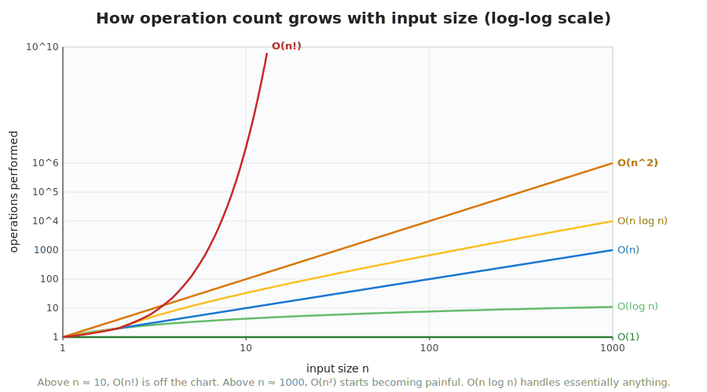
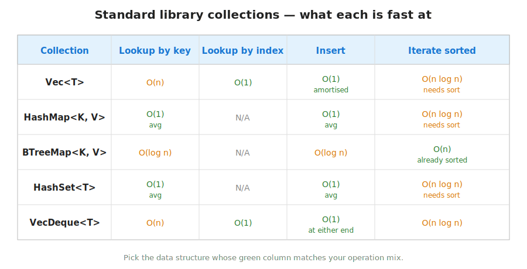

## What this lecture is

This is the lecture that tells you whether your code will finish in seconds, hours, or never.

- A vocabulary — **Big-O notation** — for talking about how fast code is
- A cheat sheet — the time complexity of the four data structures you will use 95% of the time
- A discipline — pick the right structure before you start typing the loop

::: notes
You have written eight days of Rust. You now have working code that loads FASTAs, counts k-mers, joins SQL tables, dispatches through traits. The natural next question is *how fast* is any given piece of this — and how do I know in advance whether the loop I am about to write will finish today, next week, or after the heat death of the sun. That is what Big-O notation gives you, and that is the entire content of this short day.
:::

## Why we waited until Day 9

- Complexity arguments only make sense once you have written real loops
- You have already used `Vec`, `HashMap`, iterators, recursion — every example today references code from earlier days
- Talking about cost without intuition for what is being measured is just notation

::: notes
This material is often taught on day one of an algorithms course. We deliberately put it last. The reason: Big-O notation is just a label until you have written code that actually had a slow loop. You now have written that code. The vocabulary will stick because you have something to attach it to.
:::

## A motivating example — counting k-mers two ways

::: {.columns}
::: {.column width="50%"}
**Naïve — O(n²)**

```rust
let windows: Vec<&[u8]> =
    seq.windows(k).collect();
let mut counts = vec![0u32; windows.len()];
for i in 0..windows.len() {
    for j in 0..windows.len() {
        if windows[i] == windows[j] {
            counts[i] += 1;
        }
    }
}
```
:::

::: {.column width="50%"}
**With `HashMap` — O(n)**

```rust
use std::collections::HashMap;

let mut counts: HashMap<&[u8], u32> =
    HashMap::new();
for window in seq.windows(k) {
    *counts.entry(window).or_insert(0) += 1;
}
```
:::
:::

For a 10 Mb genome at k=21:

- Naïve **O(n²)**: ~10¹⁴ operations — **years**
- HashMap **O(n)**: ~10⁷ operations — **seconds**

::: notes
Same problem, two implementations, factor of ten million in wall-clock. The naïve version compares every window against every other window. The HashMap version makes one pass and lets the hash table do the matching. This is the kind of decision Big-O notation helps you see *before* you hit Enter and wait for hours.
:::

## Big-O — what it means in one sentence

> Big-O describes how the running time of an algorithm **grows** as the input size grows, ignoring constant factors.

The word for this is **asymptotic** [the behaviour as the input gets very large, with constants and lower-order terms dropped].

- `3 · n + 50` is `O(n)`
- `2 · n² + 10 · n + 7` is `O(n²)`
- `log₂(n) + 4` is `O(log n)`

The point is not to predict wall-clock seconds. It is to predict what happens when `n` doubles, or grows by a factor of a thousand.

::: notes
This is the whole definition. Computer scientists like to dress it up; the kernel is what is on this slide. Asymptotic just means "in the limit, for large n." You drop the constants because they depend on your CPU, your compiler, your cache; they do not depend on the algorithm. Big-O is what is left when you strip those away.
:::

## The big-five complexities

| Class | Name | What doubling the input does |
|---|---|---|
| `O(1)` | constant | nothing — fast no matter what `n` is |
| `O(log n)` | logarithmic | adds one step |
| `O(n)` | linear | doubles the time |
| `O(n log n)` | linearithmic | slightly more than doubles the time |
| `O(n²)` | quadratic | quadruples the time |
| `O(n!)` | factorial | intractable for `n > 12` |

::: notes
Six classes, in order of growth. From the top, going down, each class grows faster than the one above. The qualitative picture: `O(1)` and `O(log n)` are essentially free, `O(n)` and `O(n log n)` scale to anything bioinformatics throws at you, `O(n²)` is fine for small inputs and a disaster at scale, and `O(n!)` is reserved for problems we either accept as hard or replace with heuristics.
:::

## A picture — the five curves compared

{fig-alt="Line chart with input size n on the x-axis (log scale) and number of operations on the y-axis (log scale). Six labelled curves: O(1) flat at the bottom; O(log n) almost flat slightly above; O(n) a straight diagonal line; O(n log n) parallel to but slightly above O(n); O(n^2) much steeper; O(n!) shooting off the top of the chart."}

::: notes
This is the canonical picture. The headline takeaway: there is a *qualitative* gap between O(n log n) and O(n²). The first scales to anything; the second blows up. A lot of the cleverness in algorithms is finding ways to turn an O(n²) approach into an O(n log n) or O(n) one.
:::

## A biology example for each

| Class | Concrete example |
|---|---|
| `O(1)` | indexing into a `Vec<u8>` of bases: `seq[1000]` |
| `O(log n)` | binary search for a position in a sorted `&[u32]` |
| `O(n)` | counting GC content across a sequence |
| `O(n log n)` | sorting a list of read positions |
| `O(n²)` | all-vs-all pairwise alignment with naive recursion |
| `O(n!)` | exhaustive enumeration of multiple-sequence alignments |

::: notes
One concrete example per class, drawn from the kind of code you write. The O(1) case is the simplest: a Vec gives you constant-time random access. Binary search halves the range each step, so the number of steps grows like log n. GC content needs every base inspected exactly once. Sorting is the canonical O(n log n) — merge sort, quicksort, the standard slice sort. Pairwise everything-against-everything is the easiest way to land in O(n²). Multiple-sequence alignment by exhaustive enumeration is the kind of thing nobody actually does — we use heuristics like progressive alignment instead.
:::

## What this gets you in absolute numbers

For `n = 1,000,000`:

| Class | Operations | Wall-clock (rough) |
|---|---|---|
| `O(1)` | 1 | under 1 µs |
| `O(log n)` | ~20 | under 1 µs |
| `O(n)` | 1,000,000 | ~1 ms |
| `O(n log n)` | ~2 × 10⁷ | ~20 ms |
| `O(n²)` | 10¹² | ~17 minutes |
| `O(n!)` | more than atoms in the universe | never |

::: notes
Translating Big-O into seconds is approximate — it depends on your CPU, the constant factor inside the operation, cache effects, all of it. But the orders of magnitude on this slide are reliable. For a million inputs, an O(n²) algorithm crosses the 10-minute line. For 10 million inputs, it crosses the 1-day line. For 100 million, it crosses the 1-century line. This is why the choice of complexity class is more important than any micro-optimisation.
:::

## Data structures the standard library gives you

| Type | What it is | Big-O highlights |
|---|---|---|
| [`Vec<T>`](https://doc.rust-lang.org/std/vec/struct.Vec.html) | indexed list | index O(1), push O(1) amortised, search O(n) |
| [`HashMap<K, V>`](https://doc.rust-lang.org/std/collections/struct.HashMap.html) | hash table | lookup/insert O(1) average |
| [`BTreeMap<K, V>`](https://doc.rust-lang.org/std/collections/struct.BTreeMap.html) | balanced tree | lookup/insert O(log n); sorted iteration free |
| [`HashSet<T>`](https://doc.rust-lang.org/std/collections/struct.HashSet.html) | hash set | membership test O(1) average |
| [`VecDeque<T>`](https://doc.rust-lang.org/std/collections/struct.VecDeque.html) | double-ended queue | push/pop at either end O(1) |

::: notes
Five collections, more than you will need most days. Vec is the workhorse — when in doubt, reach for Vec. HashMap and HashSet share the same hashing machinery; HashMap stores values, HashSet stores only the keys. BTreeMap is a balanced binary tree — slower per operation than HashMap, but you get sorted iteration for free. VecDeque is what you want when you need to push and pop at both ends — a sliding window over a sequence, for instance.
:::

## When to pick which

- **"I just want to iterate or look up by index"** — `Vec`
- **"I want to look up by key, order does not matter"** — `HashMap`
- **"I want to look up by key and iterate keys in sorted order"** — `BTreeMap`
- **"I just need to test membership"** — `HashSet`
- **"I need to push and pop at both ends"** — `VecDeque`

::: notes
This is the decision tree, short version. If you cannot decide between HashMap and BTreeMap, the deciding question is: do you ever need to iterate the keys in sorted order, or look up the next-largest key? If yes, BTreeMap. If no, HashMap is faster per operation. If you do not even need values — only "have I seen this thing?" — use HashSet. Cheaper than putting a dummy value into a HashMap.
:::

## A picture — operation costs by data structure

{fig-alt="A coloured cheat-sheet table with four rows (Vec, HashMap, BTreeMap, HashSet) and several columns for the cost of common operations (index, insert, lookup, search, sorted iteration). Cells are colour-coded by complexity class — O(1) green, O(log n) yellow, O(n) red."}

::: notes
A picture is worth a thousand HashMap lookups. Stick this on the wall by your desk; you will end up using it more than you expect. The colour coding lets you see at a glance which combinations are cheap and which are not — for example, BTreeMap's insert is O(log n) yellow rather than O(1) green, the trade-off being that its sorted iteration is free.
:::

## Amortised vs worst-case

`Vec::push` is **amortised O(1)** [the average cost per operation across a long sequence, even when occasional operations are expensive]:

- Most pushes write to a pre-allocated slot — O(1)
- Occasionally the Vec is full — push allocates a bigger backing array and copies the old contents (O(n) for *that one* push)
- The reallocation happens at every doubling, so it averages out to O(1)

```rust
let mut v: Vec<u8> = Vec::new();
for b in seq { v.push(b); }    // O(n) total for n pushes
```

::: notes
Amortised analysis is the answer to the question "why do we say push is O(1) when sometimes it has to reallocate the whole vector?" The answer: the reallocations get rarer as the Vec grows, in exactly the right proportion that the *average* cost per push stays constant. The Vec doubles its backing storage when it fills, so after n pushes you have done at most n + n/2 + n/4 + ... < 2n total work — still O(n) total, still O(1) per push on average. This is the same trick that makes `String::push` and `HashMap::insert` work.
:::

## When Big-O lies

- For small `n`, **constants** matter more than asymptotic class
- A *cache-friendly* [accessing nearby memory addresses so the CPU can pre-fetch them] O(n²) over a small `Vec` can beat an O(n log n) over a pointer-chasing tree
- Big-O ignores: instruction count per operation, cache misses, branch prediction, SIMD, allocator pressure

```rust
// For n < ~50, this O(n²) often beats any tree-based O(n log n) sort:
arr.sort_unstable();      // standard library already does this — small-n shortcut
```

Big-O is the starting point, not the last word. **Measure.**

::: notes
The Big-O hierarchy is a guide, not a law. Two things break it. First, constants — an O(n^2) algorithm with a tight inner loop and good cache behaviour can outrun an O(n log n) algorithm that chases pointers. The standard library's sort actually switches to an insertion sort (O(n^2)) for very small subarrays for exactly this reason. Second, n is sometimes just small — if you are sorting twenty-two autosomes, the asymptotic class is irrelevant. The discipline: Big-O picks the algorithm; profilers verify the choice.
:::

## Iterator combinator complexities

| Combinator | Cost |
|---|---|
| [`.iter().count()`](https://doc.rust-lang.org/std/iter/trait.Iterator.html#method.count) | O(n) |
| [`.iter().find(...)`](https://doc.rust-lang.org/std/iter/trait.Iterator.html#method.find) | O(n) worst case |
| [`.iter().min()`](https://doc.rust-lang.org/std/iter/trait.Iterator.html#method.min) / [`.max()`](https://doc.rust-lang.org/std/iter/trait.Iterator.html#method.max) | O(n) |
| [`.iter().sum()`](https://doc.rust-lang.org/std/iter/trait.Iterator.html#method.sum) | O(n) |
| [`.sort()`](https://doc.rust-lang.org/std/primitive.slice.html#method.sort) on a slice | O(n log n) |
| [`.dedup()`](https://doc.rust-lang.org/std/primitive.slice.html#method.dedup) on a slice | O(n), needs sorted input |

A chain like `seq.iter().filter(|b| is_gc(b)).count()` is **O(n) overall** — one pass, constant work per element.

::: notes
Iterators are deceptive — a long chain of combinators looks like a lot of work, but most chains walk the data exactly once. The cost of a chain is the cost of one pass, times the work per element. Adapter methods that do not consume the iterator (`.filter`, `.map`, `.take_while`) are O(1) per element; consuming methods that walk the whole thing (`.count`, `.sum`, `.collect`) are O(n) total. The one to watch for is `.sort()`, which is O(n log n) and which you call on a slice, not on an iterator.
:::

## A real bioinformatics complexity story — BLAST

A naïve all-vs-all alignment of a query against a database:

- query of length `q`, database of length `d`, alignment cost `O(q · d)` per pair
- intractable for any real database

**BLAST**'s trick:

- Pre-build a *k-mer index* of the database — a `HashMap<kmer, positions>`
- For each k-mer in the query, look up positions in the index — **O(1) average**
- Only run the expensive alignment around the hits

The hash-table lookup turns most of the search from O(database) into O(1) — and made large-scale sequence search practical.

::: notes
BLAST is the canonical example of a complexity rescue. The honest pairwise dynamic programming algorithm — Smith-Waterman — is O(q*d) per query-database pair, and you have to multiply by the number of database sequences. For modern protein databases, that is millions of sequences times thousands of bases each: completely infeasible. BLAST's insight was that real homologous sequences share short exact-match k-mers, so you can index the database by k-mer and use the index to skip almost all of the candidates. The alignment work then only runs in the small neighbourhoods where there was a k-mer hit. This is a hashing trick — and it is why BLAST is the most-cited paper in biology.
:::

## The other axis — space complexity

Same notation, different resource.

- A `Vec<u8>` of `n` bases — **O(n)** bytes
- A `HashMap` counting all 21-mers in a 10 Mb genome — **O(n)** entries
- An all-vs-all alignment matrix for two sequences of length `n` — **O(n²)** cells

Sometimes **memory** is the binding constraint, not CPU.

```rust
// O(n^2) memory — a 10 kb x 10 kb scoring matrix is 100 million cells.
let mut score = vec![vec![0i32; n + 1]; n + 1];
```

::: notes
Time complexity is the famous half of the story; space complexity is the other half, with the same notation. A 21-mer hash for a 10 Mb genome is fine — at most ten million distinct k-mers, each entry a few tens of bytes, so hundreds of megabytes. A 21-mer hash for a 100 Gb pangenome is suddenly a terabyte. And Smith-Waterman's O(n^2) scoring matrix is exactly why pairwise alignment is normally done with banded variants — you do not have the RAM for the full matrix at scale.
:::

## When you don't have to think about it

- For most bioinformatics scripts working on under ~1 GB of input, **default to `Vec` + `HashMap`** and do not optimise
- Premature optimisation costs you readability and debugging time you will not get back
- **Profile first** — measure where the time is going *before* you change anything

```rust
// Default: write the obvious thing.
let mut counts: HashMap<&[u8], u32> = HashMap::new();
for window in seq.windows(k) {
    *counts.entry(window).or_insert(0) += 1;
}
```

::: notes
The point of this lecture is not to make you obsess about Big-O. It is to give you a quick mental check: am I about to write an O(n^2) loop on a million-element input? If yes, reach for a HashMap or a sort. If no, write the simple version and move on. Most scripts spend most of their time in I/O, not in your inner loop; profiling will tell you.
:::

## Recap

- **Big-O** describes how running time grows with the input size
- Pick a data structure whose complexity matches your access pattern: `Vec` for indexing, `HashMap` for keyed lookup, `BTreeMap` for sorted lookup, `HashSet` for membership
- **Measure** before optimising — Big-O is a guide, profilers tell you the truth

::: notes
Three things to remember out of this lecture: Big-O is the vocabulary for growth, the standard library has four collections that cover almost every case, and you should always measure before you assume anything about where your code is slow. Tomorrow you can write the same loops you wrote yesterday — but now with a vocabulary for arguing about them.
:::

## Where to read more

- [Wikipedia: Big O notation](https://en.wikipedia.org/wiki/Big_O_notation) — the formal definitions
- [`std::collections` — when to use which](https://doc.rust-lang.org/std/collections/index.html#when-should-you-use-which-collection) — official decision tree
- [`Vec` complexity table](https://doc.rust-lang.org/std/vec/struct.Vec.html#guarantees) — and one per collection
- *Introduction to Algorithms* (Cormen, Leiserson, Rivest, Stein — "CLRS") — the canonical algorithms textbook

::: notes
For going deeper: CLRS is the standard textbook on algorithms and is the place to read if you want the rigorous version of everything in this lecture. The Rust standard library docs are remarkably good — every collection has a complexity table at the top of its module page, and the std::collections overview has a short decision tree for picking between them. Wikipedia's Big-O article has the formal definitions if you want to be precise about the difference between O, Ω, and Θ.
:::
