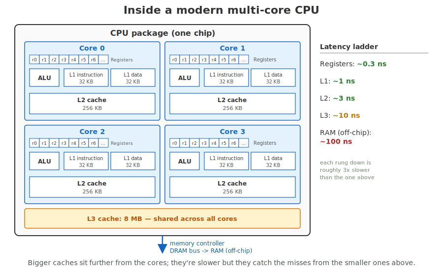
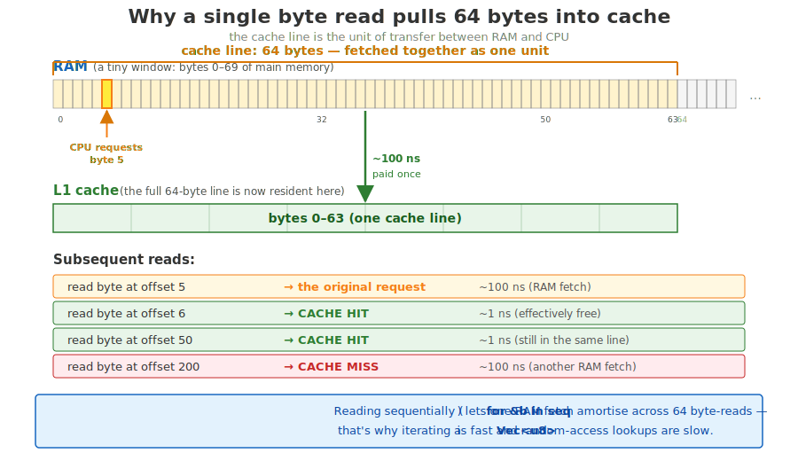
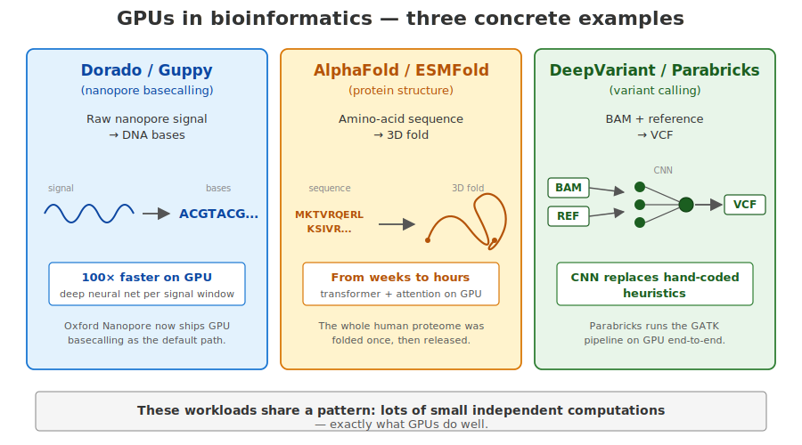
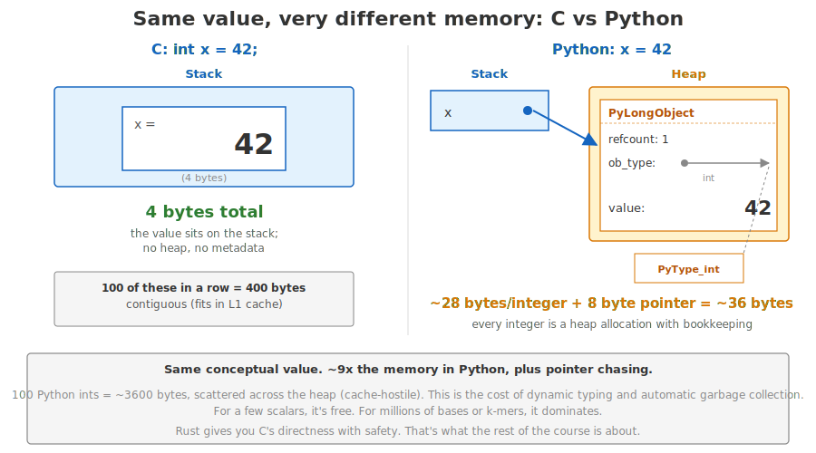

## What this lecture is

::: {.incremental}
- A ground-up tour of **what is inside the machine** that runs your scripts
- Aimed at biologists who have written a Python loop and want to understand why some loops are fast and others are slow
- **No prior CS background assumed** — no compilers, no assembly, no jargon you haven't met
- We will meet the **CPU, RAM, cache, disk, network, and the OS** — and how a program lives inside them
:::

::: notes
This is the very first lecture of the course. We have not started Rust yet. The goal of the next forty-five minutes is to give you a mental picture of what a computer actually does when you press run. Almost every design decision in Rust is a response to one of the facts in this lecture, so it pays to have the picture first. If you already know what a cache line is, you can sit back; if you do not, this is for you.
:::

## The big picture — a computer is gears that move bits

A computer is a small box of components, all wired to a central chip that does arithmetic very fast, with several layers of memory and a few peripherals.

{#fig-overview fig-alt="A motherboard rectangle containing labelled components: a CPU box with caches at upper centre, two narrow DDR4 RAM modules to its right, an NVMe SSD and a network card on the far right, a long GPU board across the lower half, and a power supply on the left. Thick and thin lines connect components, labelled memory bus 100 ns, PCIe 10 microseconds, and PCIe NIC varies. Schematic of a typical desktop or laptop: motherboard with CPU socket, RAM DIMM slots, NVMe storage, GPU, network card, and PSU, connected by buses of varying speed."}

::: notes
Forget desktop computers for a moment. Phones, laptops, HPC nodes — they are all the same recipe. One chip that does the work. Some fast memory it can read from quickly. Some slower memory that survives a power-off. A way to talk to the outside world. Everything else is detail. We are going to walk through each box on this diagram in turn.
:::

## The CPU — arithmetic + decisions, billions per second

The central processing unit is the one component that actually *runs* code. Everything else just feeds it or stores its results.

{#fig-cpu fig-alt="A schematic showing the inside of a single CPU core, with labelled blocks for instruction fetch, decode, the arithmetic logic unit, a small bank of registers, and tiered caches L1, L2, L3 to the side."}

::: notes
A modern CPU core does on the order of a few billion simple operations per second. Add two numbers, compare them, branch — that is what an operation is. The hardware tricks that make this possible (pipelining, out-of-order execution, branch prediction, superscalar issue) are fascinating but out of scope; for our purposes, the CPU is a very fast arithmetic-and-decisions box. Modern laptops have 4 to 16 of these cores running in parallel.
:::

## Registers — the CPU's hands

Registers are the tiny storage slots **inside** the CPU. The CPU can only do arithmetic on values that are sitting in registers — everything else has to be loaded in first.

| Slot name | Width | How many |
|---|---|---|
| general-purpose (e.g. `rax`, `rbx`) | 64 bits | ~16 |
| floating-point / SIMD (e.g. `xmm0`) | 128–512 bits | ~16 |
| program counter (`rip`) | 64 bits | 1 |
| stack pointer (`rsp`) | 64 bits | 1 |

::: notes
A register access is the fastest thing a CPU can do — under a nanosecond. But there are very few of them: about a dozen general-purpose ones on an x86-64 chip. Everything else lives further away in memory and takes longer to reach. This scarcity is why compilers work so hard to keep the most-used variables in registers; we will see in a couple of slides why that matters.
:::

## RAM — where the program lives while it runs

When you launch a program, the operating system loads its code and data into RAM (random access memory). RAM is fast electronic storage that **loses its contents when you power off** — that is why you save files to disk, not to RAM.

A typical laptop in 2026 has **16 to 64 GB** of RAM. Servers can have a terabyte. When people say "memory" without qualification, they almost always mean RAM.

*Working sizes in bioinformatics: the human reference genome + BWA index is ~8 GB in RAM; a single-cell expression matrix can be 30+ GB; a pangenome graph index for population-scale variation is 100+ GB.*

::: notes
RAM is the workbench. It is large enough to hold a running program and its working data — your variables, your loaded FASTA file, your matrix — but small enough that it is much faster than disk. The word "random" in random access memory means the CPU can read any byte at any address in roughly the same time, unlike a tape drive where you would have to spool to the right position.
:::

## The memory hierarchy — fast & small, or big & slow

You cannot have memory that is *both* huge *and* fast. Real machines stack several layers, fastest-and-smallest at the top.

{#fig-hierarchy fig-alt="A pyramid divided into horizontal bands. From top (smallest, fastest): registers, then L1 cache, L2 cache, L3 cache, then RAM, then SSD, then HDD, then network storage at the wide base. Each band labelled with typical capacity."}

::: notes
This pyramid is the single most important picture in this lecture. Higher up: less capacity, more cost per byte, lower latency. Lower down: more capacity, less cost per byte, more latency. Every performance trick at every level — from cache lines to memory-mapped files — is about moving the data you need next as far up this pyramid as you can. Keep this picture in your head.
:::

## How fast is each level, in nanoseconds

The pyramid hides just how big the gaps between layers are. Here it is on a log scale.

{#fig-latency fig-alt="A horizontal bar chart with bars from 0.3 nanoseconds to 100 milliseconds on a logarithmic x-axis. Bars top to bottom: overseas ping 100 ms, local LAN 0.5 ms, HDD seek 10 ms, SSD read 0.1 ms, RAM 100 ns, L3 cache 10 ns, L2 cache 3 ns, L1 cache 1 ns, CPU register 0.3 ns. Annotation: 8 orders of magnitude between top and bottom."}

*A 10 GB FASTQ file from SSD = ~3 minutes to read sequentially; from a slow HDD = 30+ minutes. From cloud storage over a fast link = ~15 minutes.*

::: notes
The chart is on a log axis because no linear axis could fit it. A register access is about 0.3 nanoseconds; an overseas network round-trip is about 100 milliseconds. That is a factor of roughly 300 million. If a register access took one heartbeat, an overseas ping would take about ten years. When you write a loop that "just reads a file" or "just hits the database", you are reaching far down this list. Programs feel slow when they spend their time in the lower half of this chart.
:::

## The memory wall — CPUs got fast, RAM didn't

CPU clock speeds rose roughly a thousand-fold from 1980 to 2005. RAM latency improved by less than a factor of ten in the same period. So the *gap* between CPU and RAM has grown to hundreds of cycles.

{#fig-wall fig-alt="A line chart, x-axis years 1980 to 2025, y-axis on log scale. One line climbs steeply for CPU clock speed; a second nearly-flat line for DRAM latency. The growing gap between them is shaded and labelled the memory wall."}

::: notes
This is the deep reason caches exist, and why memory layout matters so much for performance. The CPU finishes a multiplication in a third of a nanosecond. Fetching the next value from RAM takes a hundred nanoseconds. If you do not arrange your data so the CPU can predict what to fetch next, the CPU spends most of its time waiting. We will see in day 2 that Python's data layout makes this nearly impossible to optimise — and that is one of the reasons Rust is fast.
:::

## Cache — bridging the gap

A **cache** is a small block of fast memory inside the CPU that automatically holds copies of recently-used (and likely-soon-to-be-used) bytes from RAM. You never ask for it explicitly; the hardware just does it.

::: {.incremental}
- **L1 cache** — ~32 KB per core, ~1 ns access
- **L2 cache** — ~256 KB to 1 MB per core, ~3 ns
- **L3 cache** — ~8 to 64 MB shared across cores, ~10 ns
- All three together are still **thousands of times smaller** than RAM
:::

::: notes
Caches are completely invisible to your program. You never write code that says "put this in L1". The CPU decides what to keep based on what you have touched recently. The implication is huge: the order in which you visit memory determines whether you hit cache (1 ns) or miss and go to RAM (100 ns). Sequential access patterns win; jumping all over memory loses. We will use this fact on day 2.
:::

## A cache line — 64 bytes at a time

When the CPU misses cache and fetches from RAM, it does not fetch one byte — it fetches a whole **64-byte block** called a cache line, on the assumption that you will want neighbouring bytes too.

{#fig-line fig-alt="A horizontal strip of 64 small square cells representing one cache line. One cell, near the middle, is highlighted as the byte the program requested. An arrow shows the whole strip being fetched from RAM in one go."}

::: notes
This is why iterating over an array in order is so much faster than jumping around: each cache line fetch costs about a hundred nanoseconds, but it gives you 64 bytes' worth of data essentially for free if you use them in sequence. A Python list of integers does the opposite — each integer is a separate heap allocation, so each one is a fresh cache line miss. A Rust `Vec<i32>` is one contiguous block, four bytes per integer, sixteen integers per cache line. Same algorithm, very different speed.
:::

## Storage — SSD vs HDD vs RAM

| Medium | Latency | Bandwidth | Persistent? | Capacity (laptop, 2026) |
|---|---|---|---|---|
| RAM (DDR4/5) | ~100 ns | ~30 GB/s | no | 16–64 GB |
| NVMe SSD | ~100 µs | ~3–7 GB/s | yes | 0.5–4 TB |
| SATA SSD | ~200 µs | ~0.5 GB/s | yes | up to 8 TB |
| HDD (spinning) | ~10 ms | ~0.15 GB/s | yes | up to 20 TB |

{fig-alt="Bar chart of common bioinformatics file sizes on a log scale, with horizontal markers for L3 cache, RAM, SSD."}

::: notes
SSDs replaced HDDs in laptops because they are about a hundred times faster for the small, random reads that modern software does — opening files, launching apps, paging memory. HDDs are still cheaper per terabyte for cold storage. For bioinformatics: your raw sequencing data probably lives on HDD or networked storage; your working dataset gets copied to local SSD or RAM. When a tool feels slow, the first question is almost always "where is the data sitting right now?"

*A whole-genome BAM is ~60 GB. A single Illumina NovaSeq S4 run produces ~6 TB of FASTQ. A cohort like UK Biobank is ~1 PB. None of this fits in RAM — streaming matters.*
:::

## GPU — thousands of small workers (briefly)

A GPU is **thousands of small, simple cores** versus a CPU's small number of large, complex ones. It shines when the same operation runs on millions of independent values — matrix multiply, image filters, neural nets — and is poor at branching code with lots of decisions, which is a CPU's job.

In bioinformatics, nanopore basecalling (Dorado) runs roughly 100x faster on GPU than CPU; AlphaFold and ESMFold predict protein structure in hours instead of weeks; and DeepVariant uses a CNN for variant calling.

{fig-alt="Three GPU-accelerated bioinformatics tools: nanopore basecalling (Dorado), protein structure prediction (AlphaFold/ESMFold), and variant calling (DeepVariant)."}

::: notes
GPUs entered general computing through deep learning, but they have been used in bioinformatics for sequence alignment and variant calling too. The programming model is very different from CPU code — you write a small kernel and the runtime fans it out across thousands of threads. For this course we stay on the CPU; just be aware that the GPU exists and that it is sometimes the right tool when you have a very regular, data-parallel inner loop.
:::

## Network card — packets in and out (briefly)

::: {.incremental}
- The **NIC** moves bytes between this machine and other machines, in fixed-size packets
- Within a data centre: tens of microseconds round-trip — slower than RAM, faster than disk
- Across the internet: tens to hundreds of milliseconds — the slowest thing on the latency chart
- *Downloading the human reference genome (~3 GB) from Ensembl. Fetching an SRA dataset (50–500 GB per study). GISAID syncing millions of SARS-CoV-2 sequences for surveillance. Distributed alignment across an HPC cluster (low-latency MPI).*
:::

::: notes
You meet the network whenever you download a FASTQ from SRA, hit a REST API, or read a file from a shared filesystem on a cluster — even an "NFS file open" is really a network round-trip. The orders-of-magnitude latency gap between local SSD and cross-continent ping is why "cache it locally if you will use it twice" is universally good advice.
:::

## A running program in memory

When the OS launches your program, it sets up several distinct regions of memory for it. Each has a different lifetime and access pattern.

{#fig-layout fig-alt="A tall rectangle representing one process's virtual address space, divided into horizontal bands: at the bottom 'text (machine code)', then 'static data', then a 'heap' band with an upward arrow, then a big empty middle, then mapped libraries, then 'stack' at the top with a downward arrow."}

::: notes
Every running program sees this layout, regardless of language. The OS gives each process its own virtual address space — a private playground that looks the same shape every time. Code and constants at the bottom, the heap growing up, the stack growing down. The middle is empty and unmapped — touching it is what causes a segmentation fault. The next two slides zoom in on the two regions you, as a programmer, actually interact with: the stack and the heap.
:::

## Stack — fast, structured, automatic

The **stack** is a fast, last-in-first-out region used for function calls. Every time you call a function, a fresh frame is pushed on top; when it returns, the frame is popped. Everything on the stack has a fixed size known at compile time.

```text
push  frame for main()
push  frame for count_kmers()
push  frame for inner loop
                              <-- top of stack
```

Allocating on the stack is essentially free — the CPU just moves a pointer. There is no bookkeeping.

::: notes
The stack is small — typically one to eight megabytes total — but extremely fast and managed for you. Local variables live on the stack. Function arguments live on the stack. When a function returns, all its locals are gone instantly. You never have to ask. The price: stack values must have a size the compiler knows up-front. A 5-element array, yes. A string of unknown length read from a file, no — that one has to live on the heap.

*Streaming a 10 GB BAM file with samtools uses only ~100 MB RAM — the records flow through the stack, processed and dropped. Slurping it into a Python list of dicts would need 10–30 GB of heap.*
:::

## Heap — flexible, slower, you manage the lifetime

The **heap** is a large region for data whose size or lifetime isn't known at compile time. To use it, your program asks the allocator for `n` bytes, gets back a pointer, and is responsible for telling the allocator when it's done.

Heap allocations are **slower** than stack pushes (the allocator has to find a free chunk of the right size) but **much more flexible**. A string of unknown length, a vector that grows over time, a graph of nodes — all heap.

::: notes
Different languages manage the heap differently. C asks you to call malloc and free by hand. Python and Java use a garbage collector that figures out when something is unreachable and frees it for you. Rust uses ownership — the compiler proves at build time when each value can be freed, with no runtime garbage collector. We will see all of this on day 2. For now, just know that "on the heap" means "your program asked for it" and "on the stack" means "the compiler decided".
:::

## C: values are stored directly

In C, a small value like an integer lives **directly** in the variable's slot — usually on the stack.

```c
int x = 42;     // 4 bytes on the stack, holds the literal value 42
```

That's all of it. Four bytes. No header, no type tag, no reference count. When `x` goes out of scope, the four bytes are reclaimed by popping the stack frame — free.

::: notes
C is the bare-metal baseline. An int is four bytes and nothing more. No boxing, no indirection. This is why C is fast: the machine touches exactly the bytes that represent the value, with no extra hops. The cost is that you, the programmer, are responsible for everything — if you ever need a string that grows, you call malloc and you remember to free it. Rust gives you the same direct layout while taking the freeing-it responsibility off your hands.

*This is why `samtools` (written in C) processes 10 million BAM reads in seconds while the same loop in pure Python takes hours. The Python rewrite isn't slow because Python is poorly implemented — it's slow because every base is wrapped in a heap object.*
:::

## Python: every value is wrapped (boxed)

In Python, the variable is a pointer; the value lives in a small object on the heap, with a header for type info and reference count.

{#fig-cpython fig-alt="Two columns. Left: 'C: int x = 42;' shows a single 4-byte box on the stack containing 42. Right: 'Python: x = 42' shows a small pointer box on the stack with an arrow pointing into the heap, where a larger 28-byte PyLongObject box contains a refcount, a type pointer, and the value 42."}

::: notes
This is the price of Python's convenience. Because Python lets you write x = 42 today and x = "hello" tomorrow and the runtime has to handle either, every value carries a type tag and a refcount. The smallest integer in Python is about 28 bytes — seven times the size of a C int. A million-integer list is roughly 60 megabytes in Python versus 4 megabytes in C or Rust. Multiply by the number of vectors in a genomics pipeline; this is where Python loses an order of magnitude.
:::

## R: bulk-boxed — header per vector, not per element

R takes a middle path. **Each value is still wrapped**, but R is built around vectors, so the wrapper (the SEXP header) is paid **once per vector**, not once per element.

A million-element R numeric vector is roughly: 32-byte header + 1 000 000 × 8 bytes = ~8 MB. The header overhead is negligible. This is why R is competitive on vectorised code and slow on scalar loops — exactly what you'd predict.

::: notes
The R rule of thumb you have heard — vectorise everything, never write a for-loop over individual elements — comes directly from this layout. Each scalar still gets the full SEXP treatment if you treat it as one; but a numeric vector is essentially a C array with a small header out front. NumPy in Python plays the same trick. The lesson generalises: you want your data in big contiguous arrays of plain values, not in millions of little boxed objects.
:::

## The operating system — referee and gatekeeper

Your program is not alone on the machine. The OS decides which process gets the CPU when, hands out memory, and is the only thing allowed to touch hardware directly.

{#fig-os fig-alt="Three stacked bands: top labelled User space containing three process boxes firefox, vim, your_program; middle band Kernel space labelled Linux/macOS/Windows kernel containing process scheduler, file system, memory manager, network stack; bottom band Hardware containing CPU, RAM, disk, network. Downward arrows from each user-space process into the kernel labelled with example syscalls open data fa, mmap 8 MiB, send packet, then thick arrows from kernel to each hardware box."}

::: notes
This is the model that every modern OS — Linux, macOS, Windows — implements. The kernel runs in privileged mode and can touch hardware. Your program runs in unprivileged user mode and cannot. Every interaction with the outside world — opening a file, allocating a large buffer, sending a network packet — goes through a syscall, a controlled doorway into the kernel. This is what stops your buggy Python script from crashing the whole machine.
:::

## OS vs software — syscalls are the doorway

When your Rust code does:

```rust
let f = File::open("data.fa")?;
```

what actually happens is: the Rust standard library makes a syscall — `open("data.fa", O_RDONLY)` — which is a controlled jump from user mode into the kernel. The kernel checks permissions, locates the file, returns a file descriptor. Then control comes back to your code.

::: notes
Every interesting thing a program does crosses this boundary. Opening a file. Allocating heap memory (eventually). Reading from the network. Even printing to the screen. The syscall is the only legal way down. Crossing the boundary costs about a microsecond — much more than a function call within your program, much less than a disk read. This is why "do one big syscall not a million small ones" is universally good advice. Buffer your reads.
:::

## Putting it together — what happens when you run a program

1. You type `./my_tool data.fa` in a shell
2. The shell asks the kernel to **create a new process** (`fork` + `exec`)
3. The kernel loads your binary from disk into a fresh chunk of RAM
4. It sets up the program's memory layout: code, static data, an empty heap, an empty stack
5. It places one register (`rip`) at the start of `main` and **schedules the CPU to run you**
6. Your code runs, calling functions (stack), allocating data (heap), making syscalls (kernel)
7. `main` returns; the kernel reclaims your memory and tells the shell you're done

::: notes
That whole sequence happens in a few milliseconds. It involves the disk, the OS, the CPU, RAM, the scheduler, and the C runtime — everything we have talked about in this lecture. Once you can picture each step, you have most of the mental model you need for the rest of the course. Anything else we hit later is a refinement of one of these steps.
:::

## Why this matters for bioinformatics

::: {.incremental}
- Our inputs are **huge**: $10^8$ to $10^{12}$ bytes per dataset
- Our inner loops are **tight**: a few simple operations repeated billions of times
- **Memory layout** decides whether a loop runs at cache speed (~1 ns) or RAM speed (~100 ns) — a 100x gap
- The **deployment story** matters: scripts that need a perfectly-configured Python environment do not survive contact with HPC and cluster reality
- These pressures are exactly what Rust is built to handle
:::

{fig-alt="A horizontal flow from sample to VCF. Each stage labeled with its resource bottleneck: alignment is CPU+RAM bound; basecalling can use GPU; sort/dedup is I/O bound; variant calling can use GPU."}

**Research bioinformatics**: large indexes, tight inner loops — Rust + C win.

**Clinical diagnostics**: variant calling pipelines that must return a result in hours (rare disease, cancer panel turnaround) — language choice affects whether a patient waits days or hours.

**Environmental / metagenomics**: soil and ocean microbiome sequencing produces TB-scale datasets — streaming and parallelism are non-negotiable.

**Public health surveillance**: SARS-CoV-2 sequencing scaled to thousands of samples per week; pipelines designed for cache-friendly streaming.

::: notes
This is the pitch for the course in one slide. Bioinformatics workloads sit precisely where the architectural facts of this lecture bite hardest: lots of data, simple per-item operations, run on shared compute where reproducibility matters. A language that lets you write code with the cache in mind, that produces a single static binary, and that catches concurrency bugs at compile time, is going to pay back the time you spend learning it.
:::

## What's next

- **Setup**: [`intro/install.qmd`](install.qmd) — Rust, `cargo`, VS Code
- **Day 1, lecture 1**: [`day1/lec1-why-rust.qmd`](../day1/lec1-why-rust.qmd) — *Why Rust for bioinformatics*
- **Day 1, exercises**: GC content, base counts, complement, Phred score, Hamming distance

::: notes
The next stop is to actually install Rust and write your first program. After that, the day 1 lecture re-tells some of the story you just heard, but now from the language's point of view: why this particular language design responds well to the constraints we just laid out. See you on day 1.
:::
